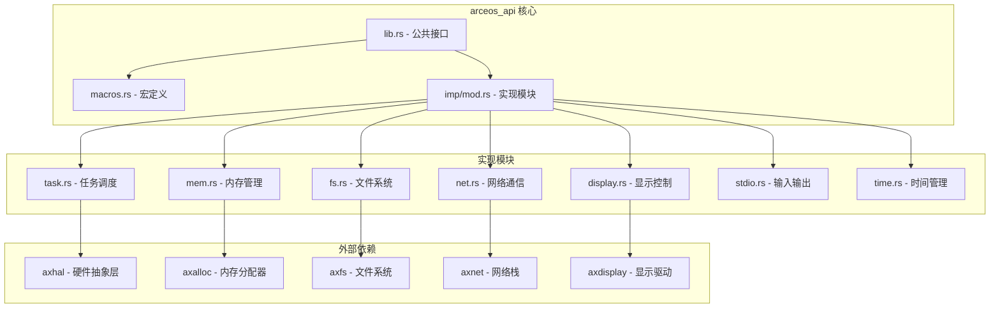
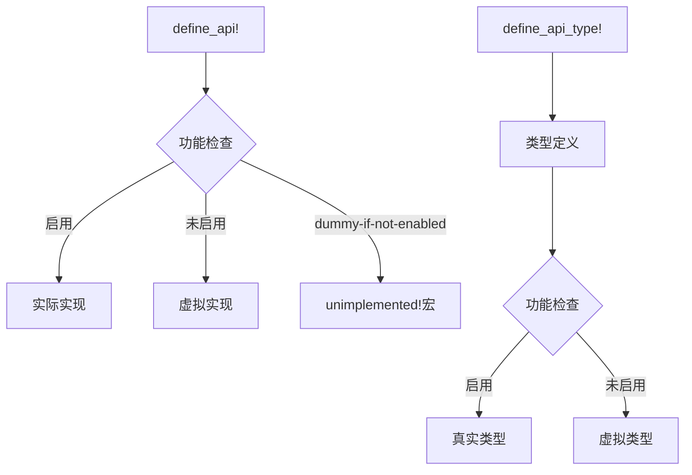
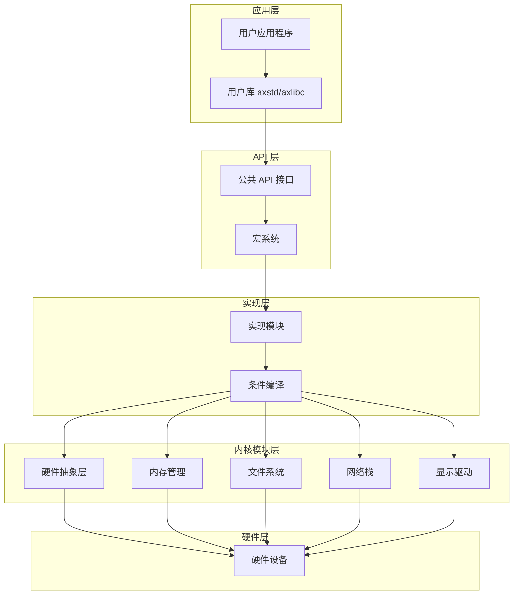
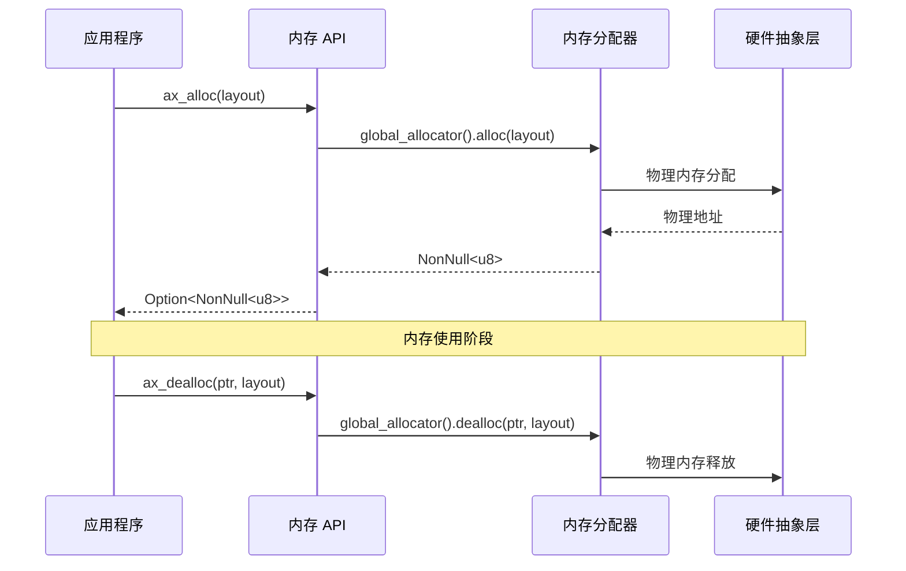
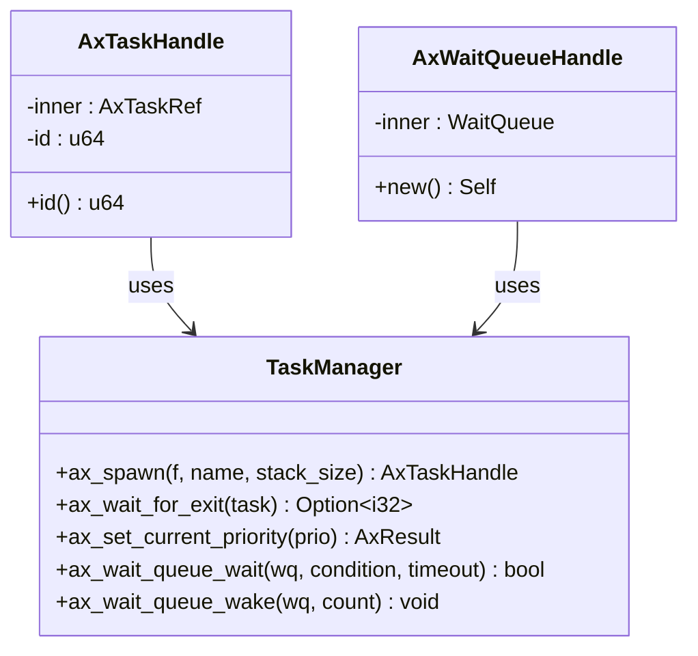
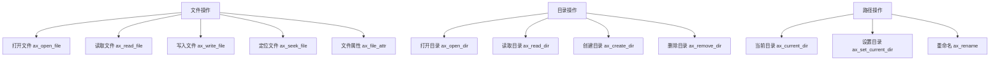
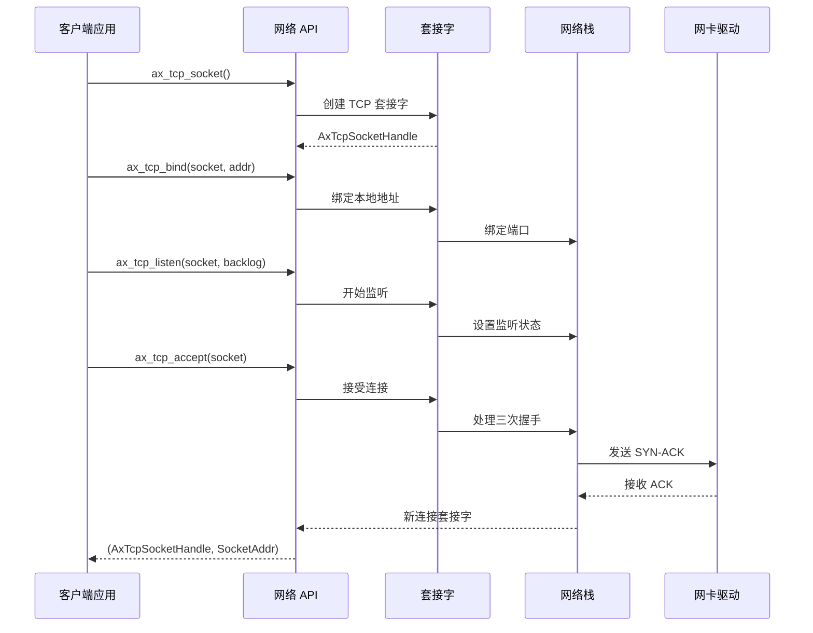
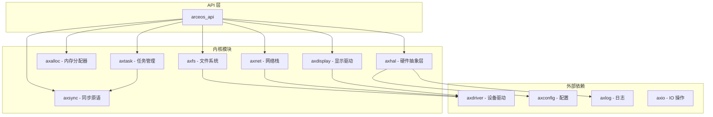

# ArceOS 原生 API 详细参考文档

<cite>
**本文档中引用的文件**
- [lib.rs](file://arceos/api/arceos_api/src/lib.rs)
- [macros.rs](file://arceos/api/arceos_api/src/macros.rs)
- [imp/mod.rs](file://arceos/api/arceos_api/src/imp/mod.rs)
- [imp/mem.rs](file://arceos/api/arceos_api/src/imp/mem.rs)
- [imp/task.rs](file://arceos/api/arceos_api/src/imp/task.rs)
- [imp/fs.rs](file://arceos/api/arceos_api/src/imp/fs.rs)
- [imp/net.rs](file://arceos/api/arceos_api/src/imp/net.rs)
- [imp/display.rs](file://arceos/api/arceos_api/src/imp/display.rs)
- [Cargo.toml](file://arceos/api/arceos_api/Cargo.toml)
</cite>

## 目录
1. [简介](#简介)
2. [项目结构](#项目结构)
3. [核心组件](#核心组件)
4. [架构概览](#架构概览)
5. [详细组件分析](#详细组件分析)
6. [依赖关系分析](#依赖关系分析)
7. [性能考虑](#性能考虑)
8. [故障排除指南](#故障排除指南)
9. [结论](#结论)

## 简介

ArceOS 原生 API (`arceos_api`) 是 ArceOS 操作系统的核心内部服务接口，为操作系统模块提供统一的编程接口。该 API 设计用于在无标准库环境下运行，通过宏系统和条件编译实现功能的灵活启用和禁用。

该 API 的主要设计目标包括：
- 提供统一的操作系统服务接口
- 支持模块化功能启用/禁用
- 实现跨平台兼容性
- 提供安全的内存管理和任务调度
- 支持文件系统、网络通信和图形显示等核心功能

## 项目结构

ArceOS 原生 API 采用模块化设计，主要包含以下组件：

**图表来源**
- [lib.rs](file://arceos/api/arceos_api/src/lib.rs#L1-L406)
- [macros.rs](file://arceos/api/arceos_api/src/macros.rs#L1-L111)
- [imp/mod.rs](file://arceos/api/arceos_api/src/imp/mod.rs#L1-L49)

**章节来源**
- [lib.rs](file://arceos/api/arceos_api/src/lib.rs#L1-L406)
- [Cargo.toml](file://arceos/api/arceos_api/Cargo.toml#L1-L48)

## 核心组件

### 公共接口层 (lib.rs)

公共接口层定义了所有可用的 API 函数和类型，通过 `define_api!` 和 `define_api_type!` 宏实现接口的声明和实现分离。

主要模块包括：
- **系统操作** (`sys`): 系统终止功能
- **时间管理** (`time`): 单调时间和墙钟时间
- **内存管理** (`mem`): 动态内存分配和 DMA 内存管理
- **输入输出** (`stdio`): 控制台输入输出
- **任务管理** (`task`): 多任务调度和等待队列
- **文件系统** (`fs`): 文件和目录操作
- **网络通信** (`net`): TCP/UDP 套接字操作
- **显示控制** (`display`): 图形帧缓冲区管理

### 宏系统 (macros.rs)

宏系统提供了强大的接口定义和条件编译能力：

**图表来源**
- [macros.rs](file://arceos/api/arceos_api/src/macros.rs#L22-L76)

**章节来源**
- [lib.rs](file://arceos/api/arceos_api/src/lib.rs#L1-L406)
- [macros.rs](file://arceos/api/arceos_api/src/macros.rs#L1-L111)

## 架构概览

ArceOS 原生 API 采用分层架构设计，实现了清晰的职责分离：

**图表来源**
- [lib.rs](file://arceos/api/arceos_api/src/lib.rs#L1-L406)
- [imp/mod.rs](file://arceos/api/arceos_api/src/imp/mod.rs#L1-L49)

## 详细组件分析

### 内存管理模块 (mem)

内存管理模块提供了动态内存分配和 DMA 内存管理功能：

#### 核心功能
- **基础内存分配**: `ax_alloc` 和 `ax_dealloc` 函数
- **DMA 内存管理**: `ax_alloc_coherent` 和 `ax_dealloc_coherent` 函数
- **安全保证**: 所有函数均为不安全函数，要求调用者手动管理生命周期

#### 实现架构

**图表来源**
- [imp/mem.rs](file://arceos/api/arceos_api/src/imp/mem.rs#L1-L26)

**章节来源**
- [lib.rs](file://arceos/api/arceos_api/src/lib.rs#L52-L103)
- [imp/mem.rs](file://arceos/api/arceos_api/src/imp/mem.rs#L1-L26)

### 任务调度模块 (task)

任务调度模块实现了多任务环境下的任务管理和同步原语：

#### 核心功能
- **任务创建**: `ax_spawn` 函数创建新任务
- **任务同步**: 等待队列和条件变量
- **任务控制**: 优先级设置和任务退出
- **时间管理**: 睡眠和让出 CPU 功能

#### 数据结构

**图表来源**
- [imp/task.rs](file://arceos/api/arceos_api/src/imp/task.rs#L29-L47)

**章节来源**
- [lib.rs](file://arceos/api/arceos_api/src/lib.rs#L118-L173)
- [imp/task.rs](file://arceos/api/arceos_api/src/imp/task.rs#L1-L112)

### 文件系统模块 (fs)

文件系统模块提供了完整的文件和目录操作接口：

#### 核心功能
- **文件操作**: 读写、截断、属性查询
- **目录操作**: 创建、删除、遍历
- **路径管理**: 当前工作目录操作
- **高级功能**: 文件重命名和移动

#### 接口设计

**图表来源**
- [imp/fs.rs](file://arceos/api/arceos_api/src/imp/fs.rs#L16-L88)

**章节来源**
- [lib.rs](file://arceos/api/arceos_api/src/lib.rs#L175-L258)
- [imp/fs.rs](file://arceos/api/arceos_api/src/imp/fs.rs#L1-L88)

### 网络通信模块 (net)

网络通信模块实现了 TCP/UDP 套接字操作和 DNS 查询功能：

#### 核心功能
- **TCP 套接字**: 连接建立、数据传输、连接管理
- **UDP 套接字**: 数据报传输、广播和组播
- **网络管理**: 接口轮询和 DNS 解析

#### 协议栈架构

**图表来源**
- [imp/net.rs](file://arceos/api/arceos_api/src/imp/net.rs#L16-L49)

**章节来源**
- [lib.rs](file://arceos/api/arceos_api/src/lib.rs#L260-L353)
- [imp/net.rs](file://arceos/api/arceos_api/src/imp/net.rs#L1-L132)

### 显示控制模块 (display)

显示控制模块管理图形帧缓冲区和显示输出：

#### 核心功能
- **帧缓冲区信息**: 获取显示器参数
- **显示刷新**: 刷新屏幕内容

**章节来源**
- [lib.rs](file://arceos/api/arceos_api/src/lib.rs#L355-L369)
- [imp/display.rs](file://arceos/api/arceos_api/src/imp/display.rs#L1-L12)

## 依赖关系分析

ArceOS 原生 API 与内核模块之间存在复杂的依赖关系：

**图表来源**
- [Cargo.toml](file://arceos/api/arceos_api/Cargo.toml#L30-L47)

### 特性依赖矩阵

| 功能模块 | 必需特性 | 可选特性 | 依赖模块 |
|---------|---------|---------|---------|
| 内存管理 | alloc | alt_alloc | axalloc/alt_axalloc |
| DMA 支持 | dma | - | axdma |
| 文件系统 | fs | myfs | axfs/axdriver |
| 网络通信 | net | - | axnet/axdriver |
| 显示控制 | display | - | axdisplay/axdriver |
| 多任务 | multitask | - | axtask/axsync |

**章节来源**
- [Cargo.toml](file://arceos/api/arceos_api/Cargo.toml#L12-L28)

## 性能考虑

### 内存管理优化

1. **零拷贝设计**: API 设计避免不必要的内存复制
2. **批量操作**: 支持批量文件读写操作
3. **缓存友好**: 优化数据结构布局以提高缓存命中率

### 并发性能

1. **无锁设计**: 在可能的情况下使用无锁算法
2. **细粒度锁**: 使用细粒度锁减少竞争
3. **异步操作**: 支持非阻塞 I/O 操作

### 系统调用优化

1. **批量系统调用**: 支持批量执行相关系统调用
2. **延迟提交**: 对于文件系统操作支持延迟提交
3. **预分配**: 内存和资源的预分配策略

## 故障排除指南

### 常见错误类型

#### 内存相关错误
- **内存泄漏**: 检查 `ax_alloc` 和 `ax_dealloc` 的配对使用
- **双重释放**: 确保每个分配只释放一次
- **越界访问**: 验证缓冲区边界检查

#### 文件系统错误
- **权限不足**: 检查文件权限设置
- **路径不存在**: 验证路径有效性
- **磁盘空间不足**: 监控可用存储空间

#### 网络相关错误
- **连接超时**: 检查网络连接状态
- **端口冲突**: 验证端口可用性
- **DNS 解析失败**: 检查 DNS 配置

### 调试技巧

1. **启用详细日志**: 使用 `axlog` 模块获取详细调试信息
2. **错误码检查**: 仔细检查所有 `AxResult` 返回值
3. **断言验证**: 在开发阶段使用断言验证假设

**章节来源**
- [lib.rs](file://arceos/api/arceos_api/src/lib.rs#L23-L23)

## 结论

ArceOS 原生 API 是一个设计精良的操作系统接口层，具有以下特点：

### 主要优势
1. **模块化设计**: 功能按模块组织，支持按需启用
2. **跨平台兼容**: 通过硬件抽象层实现平台无关性
3. **安全性**: 提供安全的内存管理和严格的类型检查
4. **高性能**: 优化的系统调用和内存管理机制

### 设计亮点
- **宏系统**: 强大的条件编译和接口定义能力
- **错误处理**: 统一的错误处理机制和结果类型
- **扩展性**: 易于添加新功能和适配新平台

### 最佳实践建议
1. **合理启用功能**: 根据需求选择合适的特性组合
2. **正确处理错误**: 妥善处理所有可能的错误情况
3. **性能监控**: 关注系统调用开销和内存使用情况
4. **测试覆盖**: 充分测试各种边界条件和错误场景

ArceOS 原生 API 为构建高效、可靠的嵌入式操作系统提供了坚实的基础，其设计理念和实现方式值得在类似项目中借鉴和学习。