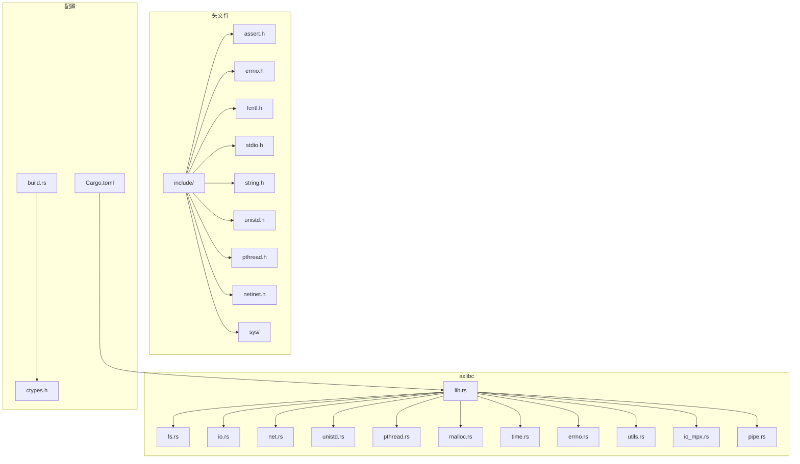
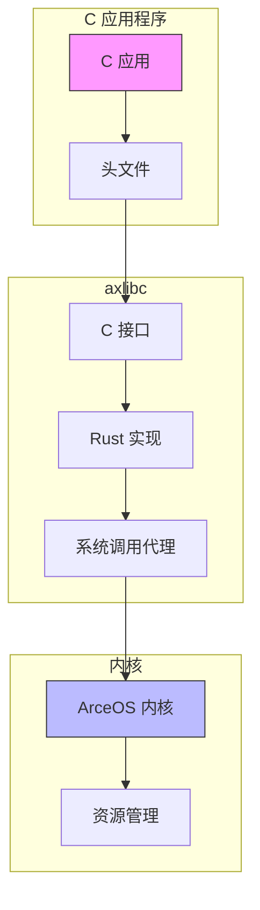
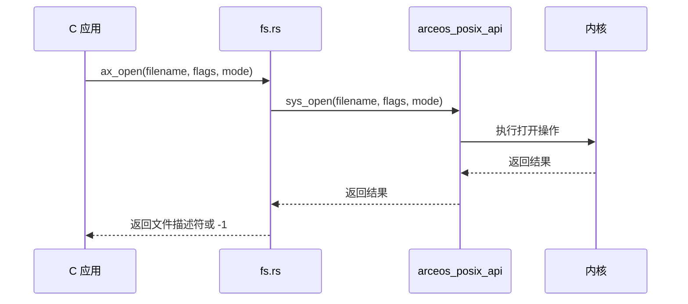
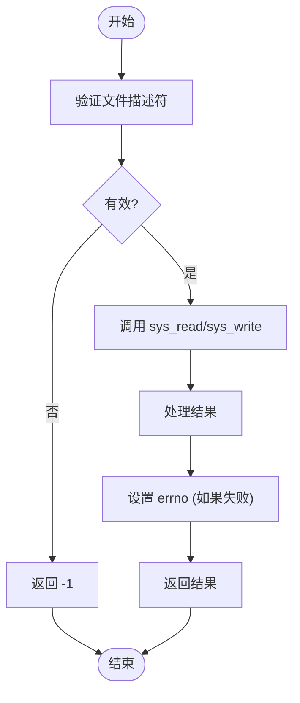
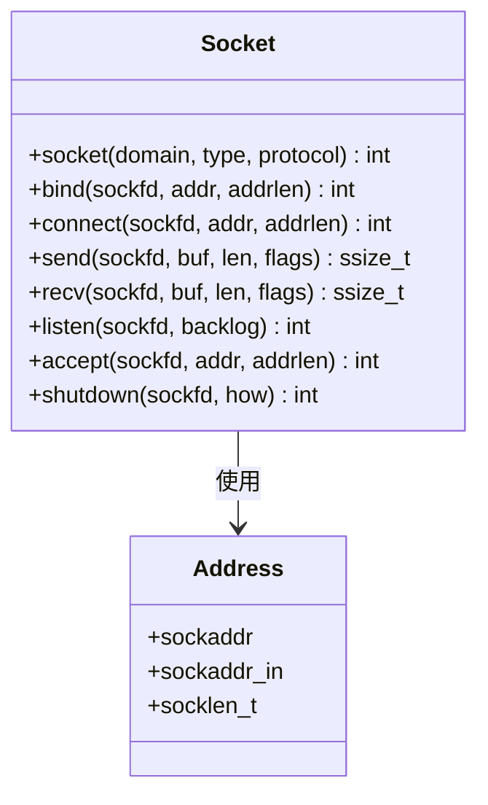
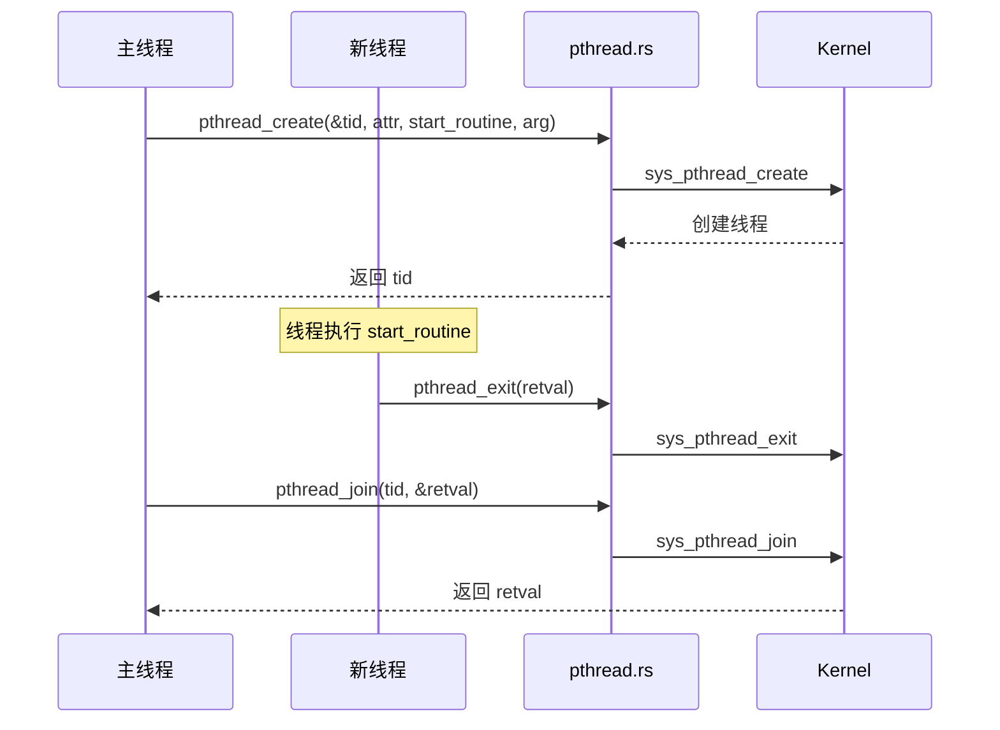
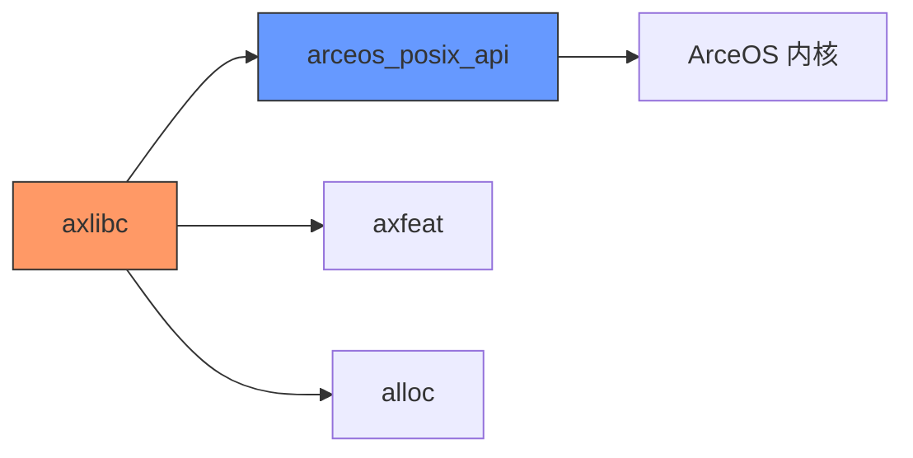

# C 用户库 (axlibc)

<cite>
**本文档中引用的文件**   
- [lib.rs](file://arceos/ulib/axlibc/src/lib.rs)
- [fs.rs](file://arceos/ulib/axlibc/src/fs.rs)
- [io.rs](file://arceos/ulib/axlibc/src/io.rs)
- [net.rs](file://arceos/ulib/axlibc/src/net.rs)
- [unistd.rs](file://arceos/ulib/axlibc/src/unistd.rs)
- [pthread.rs](file://arceos/ulib/axlibc/src/pthread.rs)
- [malloc.rs](file://arceos/ulib/axlibc/src/malloc.rs)
- [time.rs](file://arceos/ulib/axlibc/src/time.rs)
- [errno.rs](file://arceos/ulib/axlibc/src/errno.rs)
- [utils.rs](file://arceos/ulib/axlibc/src/utils.rs)
- [main.c](file://arceos/examples/helloworld-c/main.c)
- [Cargo.toml](file://arceos/ulib/axlibc/Cargo.toml)
- [ctypes.h](file://arceos/api/arceos_posix_api/ctypes.h)
- [io_mpx.rs](file://arceos/ulib/axlibc/src/io_mpx.rs)
- [pipe.rs](file://arceos/ulib/axlibc/src/pipe.rs)
</cite>

## 目录
1. [简介](#简介)
2. [项目结构](#项目结构)
3. [核心组件](#核心组件)
4. [架构概述](#架构概述)
5. [详细组件分析](#详细组件分析)
6. [依赖分析](#依赖分析)
7. [性能考虑](#性能考虑)
8. [故障排除指南](#故障排除指南)
9. [结论](#结论)

## 简介
`axlibc` 是 ArceOS 操作系统中的一个用户程序库，专为 C 应用程序设计。它提供了一个类 libc 的接口，使开发者能够使用熟悉的 C 标准库函数来开发应用程序。该库通过 `arceos_posix_api` 与内核通信，为 C 应用程序提供文件操作、I/O 函数、网络套接字、基本系统调用、线程、内存分配、时间函数和错误码等 POSIX 兼容的功能。本文档详细记录了 `axlibc` 的关键源文件和功能，包括 `fs.rs`（文件操作）、`io.rs`（I/O 函数）、`net.rs`（网络套接字）、`unistd.rs`（基本系统调用）、`pthread.rs`（线程）、`malloc.rs`（内存分配）、`time.rs`（时间函数）和 `errno.rs`（错误码），并说明了 `lib.rs` 的整体结构和 `utils.rs` 中的实用工具。

## 项目结构
`axlibc` 库位于 `arceos/ulib/axlibc` 目录下，其主要结构包括源代码、头文件和构建配置。源代码位于 `src/` 目录中，包含实现各种 libc 功能的 Rust 模块。头文件位于 `include/` 目录中，为 C 程序提供函数原型和类型定义。`Cargo.toml` 文件定义了库的元数据、依赖项和功能特性。



**图示来源**
- [lib.rs](file://arceos/ulib/axlibc/src/lib.rs)
- [Cargo.toml](file://arceos/ulib/axlibc/Cargo.toml)

**章节来源**
- [lib.rs](file://arceos/ulib/axlibc/src/lib.rs)
- [Cargo.toml](file://arceos/ulib/axlibc/Cargo.toml)

## 核心组件
`axlibc` 的核心组件包括文件系统操作、I/O 函数、网络功能、基本系统调用、线程管理、内存分配、时间处理和错误处理。这些组件通过 `lib.rs` 文件中的模块组织和公开，为 C 应用程序提供完整的 libc 接口。每个组件都通过 `arceos_posix_api` 与内核进行通信，实现相应的系统功能。

**章节来源**
- [lib.rs](file://arceos/ulib/axlibc/src/lib.rs)
- [fs.rs](file://arceos/ulib/axlibc/src/fs.rs)
- [io.rs](file://arceos/ulib/axlibc/src/io.rs)
- [net.rs](file://arceos/ulib/axlibc/src/net.rs)
- [unistd.rs](file://arceos/ulib/axlibc/src/unistd.rs)
- [pthread.rs](file://arceos/ulib/axlibc/src/pthread.rs)
- [malloc.rs](file://arceos/ulib/axlibc/src/malloc.rs)
- [time.rs](file://arceos/ulib/axlibc/src/time.rs)
- [errno.rs](file://arceos/ulib/axlibc/src/errno.rs)

## 架构概述
`axlibc` 的架构基于 Rust 编写的系统调用接口，为 C 应用程序提供 POSIX 兼容的 libc 功能。其核心架构包括以下几个层次：C 接口层、Rust 实现层、系统调用代理层和内核层。C 接口层由头文件（如 `stdio.h`、`unistd.h`）定义，提供标准的 C 函数原型。Rust 实现层在 `src/` 目录下的各个 `.rs` 文件中，使用 `#[no_mangle]` 和 `extern "C"` 将函数暴露给 C 代码。系统调用代理层通过 `arceos_posix_api` crate 与内核通信，执行实际的系统操作。内核层负责最终的资源管理和硬件交互。



**图示来源**
- [lib.rs](file://arceos/ulib/axlibc/src/lib.rs)
- [arceos_posix_api/lib.rs](file://arceos/api/arceos_posix_api/src/lib.rs)

## 详细组件分析

### 文件系统操作 (fs.rs)
`fs.rs` 模块实现了文件系统相关的 C 标准库函数，如 `ax_open`、`lseek`、`stat`、`fstat`、`lstat`、`getcwd` 和 `rename`。这些函数通过调用 `arceos_posix_api` 中的 `sys_open`、`sys_lseek`、`sys_stat` 等系统调用来与内核交互。例如，`ax_open` 函数接受文件名、标志和模式作为参数，调用 `sys_open` 并返回文件描述符。



**图示来源**
- [fs.rs](file://arceos/ulib/axlibc/src/fs.rs)
- [arceos_posix_api/fs.rs](file://arceos/api/arceos_posix_api/src/imp/fs.rs)

**章节来源**
- [fs.rs](file://arceos/ulib/axlibc/src/fs.rs)

### I/O 函数 (io.rs)
`io.rs` 模块提供了基本的 I/O 操作函数，包括 `read`、`write` 和 `writev`。这些函数直接映射到内核的读写系统调用。`read` 函数从指定的文件描述符读取数据到缓冲区，返回读取的字节数；`write` 函数将数据从缓冲区写入指定的文件描述符，返回写入的字节数。



**图示来源**
- [io.rs](file://arceos/ulib/axlibc/src/io.rs)
- [arceos_posix_api/io.rs](file://arceos/api/arceos_posix_api/src/imp/io.rs)

**章节来源**
- [io.rs](file://arceos/ulib/axlibc/src/io.rs)

### 网络套接字 (net.rs)
`net.rs` 模块实现了网络编程所需的套接字 API，包括 `socket`、`bind`、`connect`、`send`、`recv`、`listen`、`accept` 和 `shutdown`。这些函数为 C 应用程序提供了完整的 TCP/IP 网络通信能力。例如，`socket` 函数创建一个新的套接字，返回其文件描述符；`connect` 函数将套接字连接到指定的地址。



**图示来源**
- [net.rs](file://arceos/ulib/axlibc/src/net.rs)
- [arceos_posix_api/net.rs](file://arceos/api/arceos_posix_api/src/imp/net.rs)

**章节来源**
- [net.rs](file://arceos/ulib/axlibc/src/net.rs)

### 基本系统调用 (unistd.rs)
`unistd.rs` 模块提供了进程控制相关的函数，如 `getpid`、`exit` 和 `abort`。`getpid` 函数返回当前进程的 ID；`exit` 函数终止当前进程并返回指定的退出码；`abort` 函数导致程序异常终止。

**章节来源**
- [unistd.rs](file://arceos/ulib/axlibc/src/unistd.rs)

### 线程管理 (pthread.rs)
`pthread.rs` 模块实现了 POSIX 线程 (pthread) API，支持多线程编程。它提供了 `pthread_create`、`pthread_exit`、`pthread_join`、`pthread_self` 以及互斥锁相关的 `pthread_mutex_init`、`pthread_mutex_lock` 和 `pthread_mutex_unlock` 函数。



**图示来源**
- [pthread.rs](file://arceos/ulib/axlibc/src/pthread.rs)
- [arceos_posix_api/pthread/mod.rs](file://arceos/api/arceos_posix_api/src/imp/pthread/mod.rs)

**章节来源**
- [pthread.rs](file://arceos/ulib/axlibc/src/pthread.rs)

### 内存分配 (malloc.rs)
`malloc.rs` 模块实现了 `malloc` 和 `free` 函数，为 C 程序提供动态内存分配。与传统 libc 不同，`axlibc` 的 `malloc` 不使用 `sys_brk` 系统调用，而是直接使用内核的堆内存，因为 ArceOS 是一个单体内核 (unikernel)，用户程序与内核共享堆。

```mermaid
flowchart LR
A[调用 malloc(size)] --> B[计算实际大小 = size + 控制块大小]
B --> C[使用 Layout::from_size_align 分配内存]
C --> D[写入控制块 (包含实际大小)]
D --> E[返回用户可用内存的指针]
F[调用 free(ptr)] --> G[检查指针是否为空]
G --> H[从 ptr 向前移动到控制块]
H --> I[读取实际大小]
I --> J[使用 dealloc 释放内存]
```

**图示来源**
- [malloc.rs](file://arceos/ulib/axlibc/src/malloc.rs)

**章节来源**
- [malloc.rs](file://arceos/ulib/axlibc/src/malloc.rs)

### 时间函数 (time.rs)
`time.rs` 模块提供了 `clock_gettime` 和 `nanosleep` 函数，用于获取高精度时间戳和进行纳秒级睡眠。

**章节来源**
- [time.rs](file://arceos/ulib/axlibc/src/time.rs)

### 错误处理 (errno.rs)
`errno.rs` 模块实现了全局的 `errno` 变量和 `strerror` 函数。`errno` 是一个线程局部存储 (TLS) 变量，用于存储最近一次系统调用的错误码。`strerror` 函数将错误码转换为可读的字符串描述。

**章节来源**
- [errno.rs](file://arceos/ulib/axlibc/src/errno.rs)

### 实用工具 (utils.rs)
`utils.rs` 模块包含一个关键的辅助函数 `e`，它封装了系统调用的错误处理逻辑。该函数检查系统调用的返回值，如果为负数，则将其绝对值设置为 `errno` 并返回 -1，否则返回原始值。

**章节来源**
- [utils.rs](file://arceos/ulib/axlibc/src/utils.rs)

## 依赖分析
`axlibc` 的主要依赖是 `arceos_posix_api` crate，它提供了与 ArceOS 内核通信的系统调用接口。此外，它还依赖于 `axfeat` 来管理功能特性，并在需要时使用 `alloc` crate 进行动态内存分配。`axlibc` 本身被编译为静态库 (`staticlib`)，供 C 应用程序链接。



**图示来源**
- [Cargo.toml](file://arceos/ulib/axlibc/Cargo.toml)
- [lib.rs](file://arceos/ulib/axlibc/src/lib.rs)

**章节来源**
- [Cargo.toml](file://arceos/ulib/axlibc/Cargo.toml)

## 性能考虑
由于 `axlibc` 运行在单体内核环境中，其性能特点与传统操作系统不同。内存分配 (`malloc`/`free`) 非常高效，因为它避免了 `sys_brk` 系统调用的开销，直接在共享堆上操作。然而，所有系统调用仍然需要通过 `arceos_posix_api` 进行，这涉及到用户态到内核态的转换，尽管在单体内核中这种转换的开销可能比传统系统小。对于 I/O 和网络操作，性能主要取决于底层硬件驱动和网络栈的实现。

## 故障排除指南
当使用 `axlibc` 开发 C 应用时，如果遇到问题，可以按照以下步骤进行排查：
1.  **检查返回值**：所有系统调用都可能失败，务必检查返回值。
2.  **检查 errno**：如果函数返回 -1，使用 `strerror(errno)` 或直接检查 `errno` 变量来获取错误原因。
3.  **确认功能特性**：确保在 `Cargo.toml` 中启用了所需的功能特性（如 `fs`、`net`、`multitask`）。
4.  **检查头文件包含**：确保 C 代码包含了正确的头文件（如 `stdio.h`、`unistd.h`）。
5.  **查看示例代码**：参考 `examples/helloworld-c/main.c` 等示例，确保链接和编译设置正确。

**章节来源**
- [errno.rs](file://arceos/ulib/axlibc/src/errno.rs)
- [examples/helloworld-c/main.c](file://arceos/examples/helloworld-c/main.c)

## 结论
`axlibc` 为在 ArceOS 上开发 C 应用程序提供了一个功能完整且高效的类 libc 接口。它通过精心设计的 Rust 模块和 `arceos_posix_api` 与内核紧密集成，使开发者能够利用熟悉的 C 标准库函数进行开发。其架构清晰，组件职责分明，为构建高性能的单体内核应用奠定了坚实的基础。