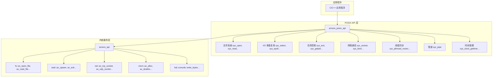
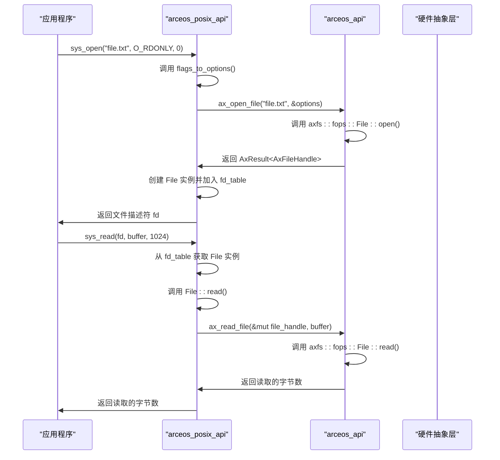

# POSIX 兼容 API

<cite>
**本文档中引用的文件**   
- [lib.rs](file://arceos/api/arceos_posix_api/src/lib.rs)
- [utils.rs](file://arceos/api/arceos_posix_api/src/utils.rs)
- [ctypes.h](file://arceos/api/arceos_posix_api/ctypes.h)
- [fs.rs](file://arceos/api/arceos_posix_api/src/imp/fs.rs)
- [fd_ops.rs](file://arceos/api/arceos_posix_api/src/imp/fd_ops.rs)
- [io.rs](file://arceos/api/arceos_posix_api/src/imp/io.rs)
- [sys.rs](file://arceos/api/arceos_posix_api/src/imp/sys.rs)
- [task.rs](file://arceos/api/arceos_posix_api/src/imp/task.rs)
- [net.rs](file://arceos/api/arceos_posix_api/src/imp/net.rs)
- [pipe.rs](file://arceos/api/arceos_posix_api/src/imp/pipe.rs)
- [time.rs](file://arceos/api/arceos_posix_api/src/imp/time.rs)
- [epoll.rs](file://arceos/api/arceos_posix_api/src/imp/io_mpx/epoll.rs)
- [select.rs](file://arceos/api/arceos_posix_api/src/imp/io_mpx/select.rs)
- [mutex.rs](file://arceos/api/arceos_posix_api/src/imp/pthread/mutex.rs)
- [resources.rs](file://arceos/api/arceos_posix_api/src/imp/resources.rs)
- [stdio.rs](file://arceos/api/arceos_posix_api/src/imp/stdio.rs)
- [arceos_api/lib.rs](file://arceos/api/arceos_api/src/lib.rs)
</cite>

## 目录
1. [简介](#简介)
2. [API 架构概览](#api-架构概览)
3. [文件操作 API](#文件操作-api)
4. [I/O 多路复用 API](#i/o-多路复用-api)
5. [进程与任务控制 API](#进程与任务控制-api)
6. [网络通信 API](#网络通信-api)
7. [线程与同步 API](#线程与同步-api)
8. [管道 API](#管道-api)
9. [时间管理 API](#时间管理-api)
10. [辅助函数与工具](#辅助函数与工具)
11. [与内核服务的交互](#与内核服务的交互)

## 简介
本文档详细描述了 ArceOS 操作系统提供的 POSIX 兼容 API。该 API 实现了标准的系统调用接口，允许应用程序以标准方式与操作系统内核进行交互。API 通过 `arceos_posix_api` crate 提供，它封装了底层的 `arceos_api` 内核服务，为应用程序提供了文件操作、I/O 多路复用、进程控制、网络通信、线程同步等核心功能。

该实现旨在与标准 POSIX 规范保持兼容，同时适应 ArceOS 作为微内核/库操作系统的设计。系统调用通过 C 语言函数原型暴露，返回值遵循 POSIX 约定（成功返回非负值，失败返回 -1 并设置 `errno`）。所有 API 都通过 `ctypes.h` 头文件定义了标准的 C 类型，确保了与 C 语言代码的互操作性。

**Section sources**
- [lib.rs](file://arceos/api/arceos_posix_api/src/lib.rs#L1-L61)
- [ctypes.h](file://arceos/api/arceos_posix_api/ctypes.h#L1-L16)

## API 架构概览
ArceOS 的 POSIX API 采用分层架构。顶层是 `arceos_posix_api` crate，它提供了标准的 C 风格系统调用接口。这些系统调用在内部通过 `imp` 模块的实现，调用底层 `arceos_api` crate 提供的内核服务。



**Diagram sources**
- [lib.rs](file://arceos/api/arceos_posix_api/src/lib.rs#L1-L61)
- [arceos_api/lib.rs](file://arceos/api/arceos_api/src/lib.rs#L1-L406)

## 文件操作 API
文件操作 API 提供了对文件系统的基本访问功能，包括打开、读写、定位和获取文件属性等操作。所有文件操作都通过文件描述符（file descriptor）进行，文件描述符是一个非负整数，代表了进程打开的文件。

### sys_open
打开或创建一个文件。

**函数原型**
```c
int sys_open(const char *pathname, int flags, mode_t mode);
```

**参数说明**
- `pathname`: 要打开的文件路径。
- `flags`: 打开标志，如 `O_RDONLY`, `O_WRONLY`, `O_CREAT`, `O_TRUNC` 等。
- `mode`: 文件权限模式（当使用 `O_CREAT` 时）。

**返回值**
- 成功：返回非负的文件描述符。
- 失败：返回 -1，并设置 `errno`。

**可能的 errno 错误码**
- `EFAULT`: `pathname` 指针无效。
- `EINVAL`: `flags` 参数无效。
- `ENOENT`: 文件不存在且未指定 `O_CREAT`。
- `EMFILE`: 进程已达到打开文件数上限。

**与 POSIX 的差异**
- 文件权限模式 `mode` 在当前实现中被忽略。
- 不支持符号链接的特殊处理。

**Section sources**
- [fs.rs](file://arceos/api/arceos_posix_api/src/imp/fs.rs#L109-L117)

### sys_read
从文件描述符读取数据。

**函数原型**
```c
ssize_t sys_read(int fd, void *buf, size_t count);
```

**参数说明**
- `fd`: 文件描述符。
- `buf`: 指向读取数据缓冲区的指针。
- `count`: 要读取的字节数。

**返回值**
- 成功：返回实际读取的字节数（可能小于 `count`）。
- 失败：返回 -1，并设置 `errno`。

**可能的 errno 错误码**
- `EBADF`: `fd` 不是有效的文件描述符。
- `EFAULT`: `buf` 指针无效。
- `EINVAL`: `fd` 不支持读取操作。

**Section sources**
- [io.rs](file://arceos/api/arceos_posix_api/src/imp/io.rs#L13-L31)

### sys_write
向文件描述符写入数据。

**函数原型**
```c
ssize_t sys_write(int fd, const void *buf, size_t count);
```

**参数说明**
- `fd`: 文件描述符。
- `buf`: 指向要写入数据的缓冲区的指针。
- `count`: 要写入的字节数。

**返回值**
- 成功：返回实际写入的字节数。
- 失败：返回 -1，并设置 `errno`。

**可能的 errno 错误码**
- `EBADF`: `fd` 不是有效的文件描述符。
- `EFAULT`: `buf` 指针无效。
- `EINVAL`: `fd` 不支持写入操作。
- `EPERM`: 尝试向只读文件（如 stdin）写入。

**Section sources**
- [io.rs](file://arceos/api/arceos_posix_api/src/imp/io.rs#L36-L54)

### sys_lseek
设置文件描述符的读写位置。

**函数原型**
```c
off_t sys_lseek(int fd, off_t offset, int whence);
```

**参数说明**
- `fd`: 文件描述符。
- `offset`: 偏移量。
- `whence`: 基准位置，可以是 `SEEK_SET`（文件开头）、`SEEK_CUR`（当前位置）或 `SEEK_END`（文件末尾）。

**返回值**
- 成功：返回新的文件偏移量。
- 失败：返回 -1，并设置 `errno`。

**可能的 errno 错误码**
- `EBADF`: `fd` 不是有效的文件描述符。
- `EINVAL`: `whence` 参数无效。

**Section sources**
- [fs.rs](file://arceos/api/arceos_posix_api/src/imp/fs.rs#L122-L133)

### sys_stat, sys_fstat, sys_lstat
获取文件状态信息。

**函数原型**
```c
int sys_stat(const char *pathname, struct stat *buf);
int sys_fstat(int fd, struct stat *buf);
int sys_lstat(const char *pathname, struct stat *buf);
```

**参数说明**
- `pathname`: 文件路径。
- `fd`: 文件描述符。
- `buf`: 指向 `struct stat` 结构体的指针，用于存储文件信息。

**返回值**
- 成功：返回 0。
- 失败：返回 -1，并设置 `errno`。

**可能的 errno 错误码**
- `EFAULT`: `buf` 指针无效。
- `ENOENT`: 文件不存在。
- `EINVAL`: `fd` 无效。

**与 POSIX 的差异**
- `sys_lstat` 未完全实现，对符号链接的处理与标准 POSIX 不同。
- 返回的 `struct stat` 中部分字段（如 `st_ino`, `st_nlink`）是硬编码的。

**Section sources**
- [fs.rs](file://arceos/api/arceos_posix_api/src/imp/fs.rs#L139-L168)

### sys_getcwd
获取当前工作目录。

**函数原型**
```c
char *sys_getcwd(char *buf, size_t size);
```

**参数说明**
- `buf`: 指向存储路径的缓冲区。
- `size`: 缓冲区大小。

**返回值**
- 成功：返回指向 `buf` 的指针。
- 失败：返回 `NULL`，并设置 `errno`。

**可能的 errno 错误码**
- `EFAULT`: `buf` 指针无效。
- `ERANGE`: 缓冲区大小不足以容纳路径。

**Section sources**
- [fs.rs](file://arceos/api/arceos_posix_api/src/imp/fs.rs#L186-L203)

### sys_rename
重命名文件或目录。

**函数原型**
```c
int sys_rename(const char *oldpath, const char *newpath);
```

**参数说明**
- `oldpath`: 原文件/目录路径。
- `newpath`: 新文件/目录路径。

**返回值**
- 成功：返回 0。
- 失败：返回 -1，并设置 `errno`。

**可能的 errno 错误码**
- `EFAULT`: 路径指针无效。
- `ENOENT`: 原文件不存在。

**Section sources**
- [fs.rs](file://arceos/api/arceos_posix_api/src/imp/fs.rs#L209-L216)

## I/O 多路复用 API
I/O 多路复用 API 允许单个线程同时监视多个文件描述符，等待它们中的任何一个变为可读或可写。

### sys_select
监视多个文件描述符的 I/O 就绪状态。

**函数原型**
```c
int sys_select(int nfds, fd_set *readfds, fd_set *writefds, fd_set *exceptfds, struct timeval *timeout);
```

**参数说明**
- `nfds`: 最大的文件描述符加 1。
- `readfds`: 监视可读性的文件描述符集合。
- `writefds`: 监视可写性的文件描述符集合。
- `exceptfds`: 监视异常条件的文件描述符集合。
- `timeout`: 超时时间。

**返回值**
- 成功：返回就绪的文件描述符数量。
- 失败：返回 -1，并设置 `errno`。

**可能的 errno 错误码**
- `EINVAL`: `nfds` 为负数。
- `EFAULT`: 指针参数无效。

**与 POSIX 的差异**
- `exceptfds` 的处理可能不完全符合标准。
- 内部使用忙等待（busy-wait）而非中断驱动。

**Section sources**
- [select.rs](file://arceos/api/arceos_posix_api/src/imp/io_mpx/select.rs#L111-L150)

### sys_epoll_create, sys_epoll_ctl, sys_epoll_wait
epoll 系列系统调用提供了一种更高效的 I/O 多路复用机制。

**函数原型**
```c
int sys_epoll_create(int size);
int sys_epoll_ctl(int epfd, int op, int fd, struct epoll_event *event);
int sys_epoll_wait(int epfd, struct epoll_event *events, int maxevents, int timeout);
```

**参数说明**
- `epfd`: epoll 实例的文件描述符。
- `op`: 操作类型（`EPOLL_CTL_ADD`, `EPOLL_CTL_MOD`, `EPOLL_CTL_DEL`）。
- `fd`: 要监视的文件描述符。
- `event`: 指定要监视的事件。
- `maxevents`: 一次最多返回的事件数。
- `timeout`: 超时时间（毫秒）。

**返回值**
- `sys_epoll_create`: 成功返回 epoll 实例的文件描述符，失败返回 -1。
- `sys_epoll_ctl`: 成功返回 0，失败返回 -1。
- `sys_epoll_wait`: 成功返回就绪事件的数量，失败返回 -1。

**可能的 errno 错误码**
- `EINVAL`: 参数无效。
- `EBADF`: 文件描述符无效。
- `EEXIST`: 尝试添加已存在的文件描述符。
- `ENOENT`: 尝试修改或删除不存在的文件描述符。

**与 POSIX 的差异**
- 不支持 `EPOLLET`（边缘触发）模式，仅支持水平触发（LT）。
- `size` 参数在 `sys_epoll_create` 中被忽略。

**Section sources**
- [epoll.rs](file://arceos/api/arceos_posix_api/src/imp/io_mpx/epoll.rs#L140-L205)

## 进程与任务控制 API
这些 API 用于控制当前任务（进程）的执行。

### sys_exit
终止当前任务。

**函数原型**
```c
void sys_exit(int status);
```

**参数说明**
- `status`: 退出状态码。

**返回值**
- 该函数不返回。

**与 POSIX 的差异**
- 在单线程配置下，会调用 `axhal::misc::terminate()` 终止整个系统。

**Section sources**
- [task.rs](file://arceos/api/arceos_posix_api/src/imp/task.rs#L34-L40)

### sys_getpid
获取当前任务的 ID。

**函数原型**
```c
pid_t sys_getpid(void);
```

**返回值**
- 返回当前任务的 ID。

**与 POSIX 的差异**
- 在单线程配置下，返回硬编码的值 2。

**Section sources**
- [task.rs](file://arceos/api/arceos_posix_api/src/imp/task.rs#L20-L30)

### sys_sched_yield
主动放弃 CPU 时间片。

**函数原型**
```c
int sys_sched_yield(void);
```

**返回值**
- 总是返回 0。

**与 POSIX 的差异**
- 在单线程配置下，不会进行任务切换，而是调用 `axhal::arch::wait_for_irqs()` 或 `core::hint::spin_loop()`。

**Section sources**
- [task.rs](file://arceos/api/arceos_posix_api/src/imp/task.rs#L7-L16)

### sys_sysconf
获取系统配置信息。

**函数原型**
```c
long sys_sysconf(int name);
```

**参数说明**
- `name`: 配置项名称，如 `_SC_PAGE_SIZE`, `_SC_NPROCESSORS_ONLN`。

**返回值**
- 成功：返回配置值。
- 失败：返回 0。

**支持的配置项**
- `_SC_PAGE_SIZE`: 页面大小（4096 字节）。
- `_SC_PHYS_PAGES`: 物理内存总页数。
- `_SC_NPROCESSORS_ONLN`: 在线处理器数量。
- `_SC_AVPHYS_PAGES`: 可用物理页数（需启用 `alloc` 特性）。
- `_SC_OPEN_MAX`: 每个进程的最大文件描述符数（需启用 `fd` 特性）。

**Section sources**
- [sys.rs](file://arceos/api/arceos_posix_api/src/imp/sys.rs#L10-L28)

## 网络通信 API
网络通信 API 提供了 TCP/UDP 套接字的创建、连接、数据传输等功能。

### sys_socket
创建一个套接字。

**函数原型**
```c
int sys_socket(int domain, int type, int protocol);
```

**参数说明**
- `domain`: 协议族，目前仅支持 `AF_INET`。
- `type`: 套接字类型，支持 `SOCK_STREAM` (TCP) 和 `SOCK_DGRAM` (UDP)。
- `protocol`: 协议，支持 `IPPROTO_TCP` 和 `IPPROTO_UDP`，或 0。

**返回值**
- 成功：返回套接字的文件描述符。
- 失败：返回 -1，并设置 `errno`。

**可能的 errno 错误码**
- `EINVAL`: 参数组合无效。
- `EMFILE`: 文件描述符表已满。

**Section sources**
- [net.rs](file://arceos/api/arceos_posix_api/src/imp/net.rs#L232-L247)

### sys_bind, sys_connect, sys_listen, sys_accept
用于建立网络连接。

**函数原型**
```c
int sys_bind(int sockfd, const struct sockaddr *addr, socklen_t addrlen);
int sys_connect(int sockfd, const struct sockaddr *addr, socklen_t addrlen);
int sys_listen(int sockfd, int backlog);
int sys_accept(int sockfd, struct sockaddr *addr, socklen_t *addrlen);
```

**参数说明**
- `sockfd`: 套接字文件描述符。
- `addr`: 指向 `sockaddr` 结构体的指针，包含 IP 地址和端口。
- `addrlen`: `addr` 结构体的长度。
- `backlog`: 监听队列的最大长度。

**返回值**
- `sys_bind`, `sys_connect`, `sys_listen`: 成功返回 0，失败返回 -1。
- `sys_accept`: 成功返回已连接套接字的文件描述符，失败返回 -1。

**与 POSIX 的差异**
- 仅支持 IPv4 (`AF_INET`)，不支持 IPv6。
- `backlog` 参数在 `sys_listen` 中被忽略。

**Section sources**
- [net.rs](file://arceos/api/arceos_posix_api/src/imp/net.rs#L253-L428)

### sys_send, sys_sendto, sys_recv, sys_recvfrom
用于在套接字上发送和接收数据。

**函数原型**
```c
ssize_t sys_send(int sockfd, const void *buf, size_t len, int flags);
ssize_t sys_sendto(int sockfd, const void *buf, size_t len, int flags, const struct sockaddr *dest_addr, socklen_t addrlen);
ssize_t sys_recv(int sockfd, void *buf, size_t len, int flags);
ssize_t sys_recvfrom(int sockfd, void *buf, size_t len, int flags, struct sockaddr *src_addr, socklen_t *addrlen);
```

**参数说明**
- `sockfd`: 套接字文件描述符。
- `buf`: 数据缓冲区。
- `len`: 数据长度。
- `flags`: 标志位（当前未使用）。
- `dest_addr`: 目标地址（用于 `sendto`）。
- `src_addr`: 源地址（用于 `recvfrom`）。

**返回值**
- 成功：返回传输的字节数。
- 失败：返回 -1，并设置 `errno`。

**与 POSIX 的差异**
- `flags` 参数被忽略。
- `sys_sendto` 要求套接字必须先绑定。

**Section sources**
- [net.rs](file://arceos/api/arceos_posix_api/src/imp/net.rs#L288-L387)

### sys_shutdown
关闭套接字的全双工连接。

**函数原型**
```c
int sys_shutdown(int sockfd, int how);
```

**参数说明**
- `sockfd`: 套接字文件描述符。
- `how`: 关闭方式（`SHUT_RD`, `SHUT_WR`, `SHUT_RDWR`），当前被忽略。

**返回值**
- 成功：返回 0。
- 失败：返回 -1。

**Section sources**
- [net.rs](file://arceos/api/arceos_posix_api/src/imp/net.rs#L433-L442)

### sys_getsockname, sys_getpeername
获取套接字的本地和对等地址。

**函数原型**
```c
int sys_getsockname(int sockfd, struct sockaddr *addr, socklen_t *addrlen);
int sys_getpeername(int sockfd, struct sockaddr *addr, socklen_t *addrlen);
```

**参数说明**
- `sockfd`: 套接字文件描述符。
- `addr`: 用于存储地址的缓冲区。
- `addrlen`: 缓冲区长度。

**返回值**
- 成功：返回 0。
- 失败：返回 -1。

**Section sources**
- [net.rs](file://arceos/api/arceos_posix_api/src/imp/net.rs#L535-L581)

### sys_getaddrinfo, sys_freeaddrinfo
解析主机名和地址。

**函数原型**
```c
int sys_getaddrinfo(const char *nodename, const char *servname, const struct addrinfo *hints, struct addrinfo **res);
void sys_freeaddrinfo(struct addrinfo *res);
```

**参数说明**
- `nodename`: 主机名或 IP 地址字符串。
- `servname`: 服务名或端口号字符串。
- `hints`: 提示信息（当前被忽略）。
- `res`: 指向结果链表的指针。

**返回值**
- `sys_getaddrinfo`: 成功返回结果数量，失败返回错误码。
- `sys_freeaddrinfo`: 无返回值。

**与 POSIX 的差异**
- 仅支持 IPv4。
- `hints` 参数被忽略。
- 结果中的 `ai_flags` 和 `ai_canonname` 为 0 或 `NULL`。

**Section sources**
- [net.rs](file://arceos/api/arceos_posix_api/src/imp/net.rs#L444-L533)

## 线程与同步 API
这些 API 提供了基本的线程和互斥锁功能。

### sys_pthread_create, sys_pthread_join, sys_pthread_exit, sys_pthread_self
线程管理函数。

**函数原型**
```c
int sys_pthread_create(pthread_t *thread, const pthread_attr_t *attr, void *(*start_routine)(void *), void *arg);
int sys_pthread_join(pthread_t thread, void **retval);
void sys_pthread_exit(void *retval);
pthread_t sys_pthread_self(void);
```

**参数说明**
- `thread`: 指向线程 ID 的指针。
- `attr`: 线程属性（当前被忽略）。
- `start_routine`: 线程入口函数。
- `arg`: 传递给入口函数的参数。
- `retval`: 用于接收线程返回值。

**返回值**
- `sys_pthread_create`: 成功返回 0。
- `sys_pthread_join`: 成功返回 0。
- `sys_pthread_exit`: 不返回。
- `sys_pthread_self`: 返回当前线程 ID。

**与 POSIX 的差异**
- `attr` 参数被忽略。
- 线程 ID 的实现细节可能与标准 POSIX 不同。

**Section sources**
- [lib.rs](file://arceos/api/arceos_posix_api/src/lib.rs#L59-L60)

### sys_pthread_mutex_init, sys_pthread_mutex_lock, sys_pthread_mutex_unlock
互斥锁操作。

**函数原型**
```c
int sys_pthread_mutex_init(pthread_mutex_t *mutex, const pthread_mutexattr_t *attr);
int sys_pthread_mutex_lock(pthread_mutex_t *mutex);
int sys_pthread_mutex_unlock(pthread_mutex_t *mutex);
```

**参数说明**
- `mutex`: 指向互斥锁的指针。
- `attr`: 互斥锁属性（当前被忽略）。

**返回值**
- 成功：返回 0。
- 失败：返回 -1。

**可能的 errno 错误码**
- `EFAULT`: `mutex` 指针无效。

**与 POSIX 的差异**
- 互斥锁类型和属性被忽略，仅提供基本的锁定/解锁功能。
- 不支持递归锁或错误检查锁。

**Section sources**
- [mutex.rs](file://arceos/api/arceos_posix_api/src/imp/pthread/mutex.rs#L34-L71)

## 管道 API
管道 API 用于创建进程间通信的管道。

### sys_pipe
创建一个管道。

**函数原型**
```c
int sys_pipe(int pipefd[2]);
```

**参数说明**
- `pipefd`: 一个包含两个元素的数组，用于存储读端和写端的文件描述符。

**返回值**
- 成功：返回 0。
- 失败：返回 -1。

**可能的 errno 错误码**
- `EFAULT`: `pipefd` 指针无效。

**与 POSIX 的差异**
- 管道的缓冲区大小固定为 256 字节。
- 内部使用忙等待（`sys_sched_yield`）进行同步，而非更高效的同步原语。

**Section sources**
- [pipe.rs](file://arceos/api/arceos_posix_api/src/imp/pipe.rs#L196-L213)

## 时间管理 API
提供获取时间和睡眠功能。

### sys_clock_gettime
获取指定时钟的时间。

**函数原型**
```c
int sys_clock_gettime(clockid_t clk_id, struct timespec *tp);
```

**参数说明**
- `clk_id`: 时钟 ID，支持 `CLOCK_REALTIME` 和 `CLOCK_MONOTONIC`。
- `tp`: 指向 `timespec` 结构体的指针，用于存储时间。

**返回值**
- 成功：返回 0。
- 失败：返回 -1。

**可能的 errno 错误码**
- `EFAULT`: `tp` 指针无效。
- `EINVAL`: `clk_id` 无效。

**Section sources**
- [time.rs](file://arceos/api/arceos_posix_api/src/imp/time.rs#L38-L55)

### sys_nanosleep
使调用线程睡眠指定的时间。

**函数原型**
```c
int sys_nanosleep(const struct timespec *req, struct timespec *rem);
```

**参数说明**
- `req`: 请求睡眠的时间。
- `rem`: 如果睡眠被中断，剩余时间将存储在此处。

**返回值**
- 成功：返回 0。
- 失败：返回 -1。

**可能的 errno 错误码**
- `EFAULT`: `req` 指针无效。
- `EINVAL`: `req` 中的时间值无效。
- `EINTR`: 睡眠被中断（当前未实现信号机制）。

**与 POSIX 的差异**
- 不支持通过信号中断睡眠。
- `rem` 参数的功能不完整。

**Section sources**
- [time.rs](file://arceos/api/arceos_posix_api/src/imp/time.rs#L61-L92)

## 辅助函数与工具
`utils.rs` 文件提供了在系统调用实现中使用的辅助宏和函数。

### char_ptr_to_str
将 C 风格的字符串指针转换为 Rust 的 `&str`。

**函数原型**
```rust
pub fn char_ptr_to_str<'a>(str: *const c_char) -> LinuxResult<&'a str>
```

**功能**
- 检查指针是否为空。
- 使用 `CStr::from_ptr` 安全地转换。
- 验证字符串的 UTF-8 编码。

**Section sources**
- [utils.rs](file://arceos/api/arceos_posix_api/src/utils.rs#L7-L14)

### check_null_ptr, check_null_mut_ptr
检查指针是否为空。

**函数原型**
```rust
pub fn check_null_ptr<T>(ptr: *const T) -> LinuxResult;
pub fn check_null_mut_ptr<T>(ptr: *mut T) -> LinuxResult;
```

**功能**
- 如果指针为空，返回 `LinuxError::EFAULT`。
- 否则返回 `Ok(())`。

**Section sources**
- [utils.rs](file://arceos/api/arceos_posix_api/src/utils.rs#L17-L31)

### syscall_body, syscall_body_no_debug
系统调用的通用执行体宏。

**功能**
- 将系统调用的实现包装在一个闭包中，捕获 `LinuxResult`。
- 将 `LinuxResult` 转换为 POSIX 风格的返回值（成功返回值，失败返回负的错误码）。
- 提供调试日志（`syscall_body`）或不提供（`syscall_body_no_debug`）。

**Section sources**
- [utils.rs](file://arceos/api/arceos_posix_api/src/utils.rs#L33-L61)

## 与内核服务的交互
POSIX API 通过 `arceos_api` crate 与 ArceOS 内核服务进行交互。每个系统调用最终都会调用 `arceos_api` 中定义的内核 API。



**Diagram sources**
- [lib.rs](file://arceos/api/arceos_posix_api/src/lib.rs#L1-L61)
- [arceos_api/lib.rs](file://arceos/api/arceos_api/src/lib.rs#L1-L406)
- [fs.rs](file://arceos/api/arceos_posix_api/src/imp/fs.rs#L1-L218)

**Section sources**
- [lib.rs](file://arceos/api/arceos_posix_api/src/lib.rs#L1-L61)
- [arceos_api/lib.rs](file://arceos/api/arceos_api/src/lib.rs#L1-L406)