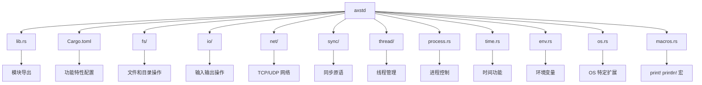
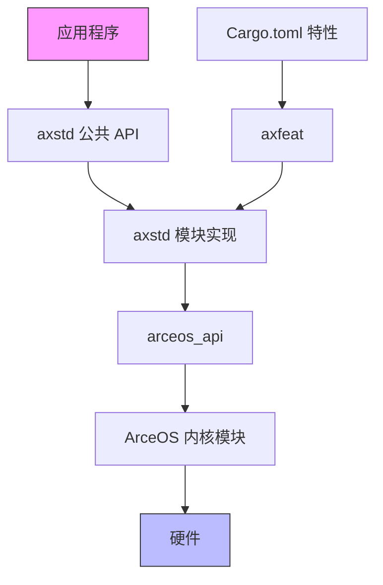
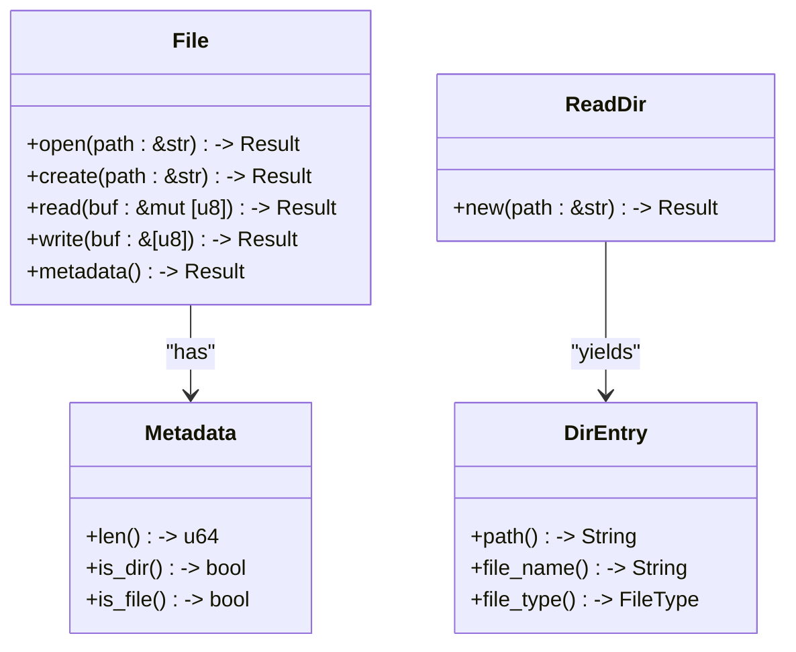
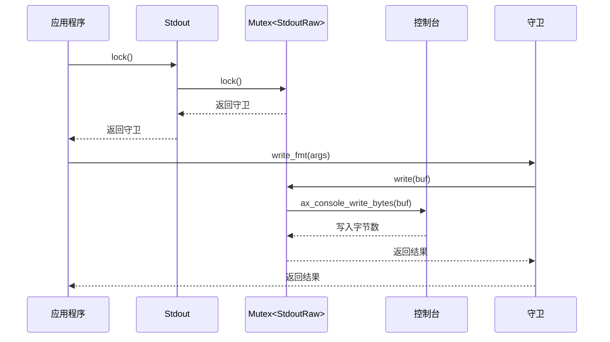
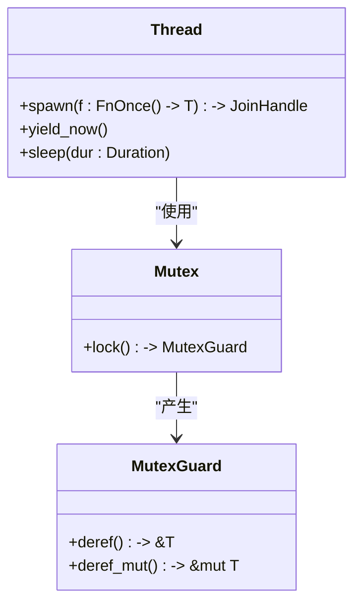
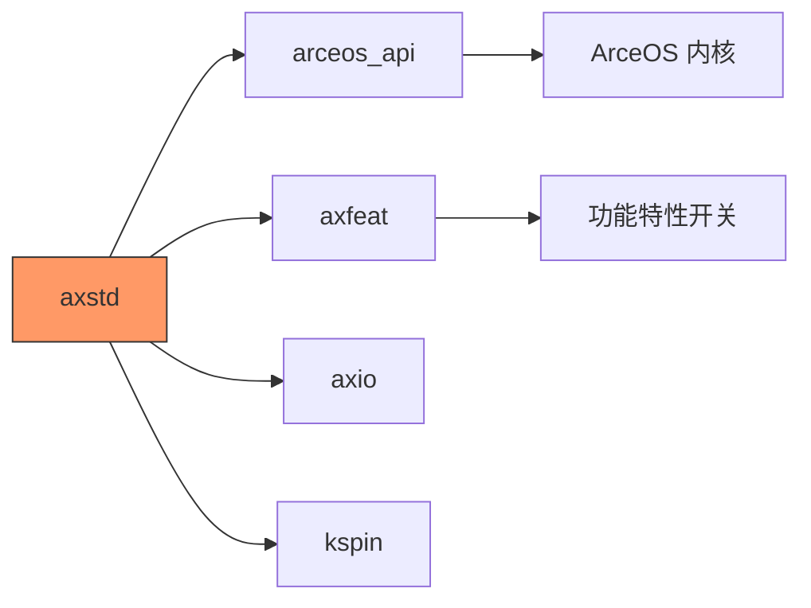

# Rust 用户库 (axstd)

<cite>
**本文档中引用的文件**
- [lib.rs](file://arceos/ulib/axstd/src/lib.rs)
- [os.rs](file://arceos/ulib/axstd/src/os.rs)
- [fs/mod.rs](file://arceos/ulib/axstd/src/fs/mod.rs)
- [io/mod.rs](file://arceos/ulib/axstd/src/io/mod.rs)
- [io/stdio.rs](file://arceos/ulib/axstd/src/io/stdio.rs)
- [net/mod.rs](file://arceos/ulib/axstd/src/net/mod.rs)
- [sync/mod.rs](file://arceos/ulib/axstd/src/sync/mod.rs)
- [thread/mod.rs](file://arceos/ulib/axstd/src/thread/mod.rs)
- [process.rs](file://arceos/ulib/axstd/src/process.rs)
- [time.rs](file://arceos/ulib/axstd/src/time.rs)
- [env.rs](file://arceos/ulib/axstd/src/env.rs)
- [macros.rs](file://arceos/ulib/axstd/src/macros.rs)
- [Cargo.toml](file://arceos/ulib/axstd/Cargo.toml)
- [helloworld/src/main.rs](file://arceos/examples/helloworld/src/main.rs)
- [httpclient/src/main.rs](file://arceos/examples/httpclient/src/main.rs)
- [httpserver/src/main.rs](file://arceos/examples/httpserver/src/main.rs)
</cite>

## 目录
1. [简介](#简介)
2. [项目结构](#项目结构)
3. [核心模块](#核心模块)
4. [架构概述](#架构概述)
5. [详细组件分析](#详细组件分析)
6. [依赖分析](#依赖分析)
7. [性能考虑](#性能考虑)
8. [故障排除指南](#故障排除指南)
9. [结论](#结论)

## 简介
`axstd` 是 ArceOS 操作系统中的一个用户库，旨在为 `no_std` 环境提供类似 Rust 标准库（`std`）的接口。与传统的 `std` 库不同，`axstd` 不依赖于 libc 和系统调用，而是直接调用 ArceOS 内核模块中的功能。这使得 `axstd` 特别适用于构建运行在单内核（unikernel）环境中的 Rust 应用程序，如在 oscamp 平台上开发的应用。

该库通过模块化设计提供了文件系统、输入输出、网络、同步、线程、进程控制和时间操作等核心功能。每个模块都针对嵌入式和操作系统开发场景进行了优化，确保在资源受限的环境中也能高效运行。`axstd` 的设计目标是为开发者提供一个熟悉且功能丰富的 API，同时保持与底层 ArceOS 内核的紧密集成。

## 项目结构
`axstd` 库位于 ArceOS 项目的 `ulib`（用户库）目录下，是整个用户空间生态系统的核心组成部分。其结构遵循 Rust 的模块化惯例，源代码位于 `src` 目录中，主要模块包括 `fs`、`io`、`net`、`sync`、`thread`、`process` 和 `time`。库的入口点是 `lib.rs`，它负责导出所有公共模块和宏。

该库通过 `Cargo.toml` 文件进行配置，定义了丰富的功能特性（features），允许开发者根据目标平台和应用需求进行精细的编译时配置。例如，`fs` 特性用于启用文件系统支持，`net` 特性用于启用网络功能，而 `multitask` 特性则用于启用多线程支持。这种基于特性的设计使得 `axstd` 可以灵活地适应从简单的单线程应用到复杂的多线核服务等各种场景。



**图示来源**
- [lib.rs](file://arceos/ulib/axstd/src/lib.rs)
- [Cargo.toml](file://arceos/ulib/axstd/Cargo.toml)

**本节来源**
- [lib.rs](file://arceos/ulib/axstd/src/lib.rs)
- [Cargo.toml](file://arceos/ulib/axstd/Cargo.toml)

## 核心模块
`axstd` 的核心模块构成了其功能的基石。`fs` 模块提供了对文件和目录的全面操作，包括创建、读取、写入、删除和遍历目录。`io` 模块定义了输入输出的核心 trait，如 `Read`、`Write` 和 `BufRead`，并实现了标准输入输出（`stdin` 和 `stdout`）的支持。`net` 模块为 TCP 和 UDP 网络编程提供了高级抽象，包括 `TcpStream`、`TcpListener` 和 `UdpSocket`。

`sync` 模块提供了关键的同步原语，最核心的是 `Mutex`，用于在多线程环境下保护共享数据。`thread` 模块支持多线程编程，提供了 `spawn` 函数来创建新线程，以及 `yield_now` 和 `sleep` 等线程控制函数。`process` 模块虽然在单内核环境中概念上有所不同，但它提供了 `exit` 这样的函数来终止整个系统。`time` 模块则提供了 `Duration` 和 `Instant` 等类型，用于处理时间间隔和测量。

这些模块共同作用，为开发者提供了一个完整的、可在 `no_std` 环境下运行的应用程序开发框架。它们的设计紧密依赖于 ArceOS 内核提供的 `arceos_api`，确保了高效和直接的硬件访问。

**本节来源**
- [lib.rs](file://arceos/ulib/axstd/src/lib.rs)
- [fs/mod.rs](file://arceos/ulib/axstd/src/fs/mod.rs)
- [io/mod.rs](file://arceos/ulib/axstd/src/io/mod.rs)
- [net/mod.rs](file://arceos/ulib/axstd/src/net/mod.rs)
- [sync/mod.rs](file://arceos/ulib/axstd/src/sync/mod.rs)
- [thread/mod.rs](file://arceos/ulib/axstd/src/thread/mod.rs)
- [process.rs](file://arceos/ulib/axstd/src/process.rs)
- [time.rs](file://arceos/ulib/axstd/src/time.rs)

## 架构概述
`axstd` 的架构是一个典型的分层设计。最上层是用户可见的公共 API，由 `lib.rs` 中导出的模块和宏组成。这一层为开发者提供了与标准 `std` 库相似的编程体验。中间层是 `axstd` 自身的实现逻辑，它将高层 API 调用转换为对底层内核接口的调用。

底层是 `arceos_api` crate，它作为 `axstd` 与 ArceOS 内核之间的桥梁。`axstd` 中的许多函数，例如 `fs::read` 或 `net::TcpStream::connect`，其内部实现都是通过调用 `arceos_api` 中对应的函数（如 `arceos_api::fs::ax_open` 或 `arceos_api::net::ax_tcp_connect`）来完成的。这种设计将平台无关的 API 定义与平台相关的具体实现分离开来，提高了代码的可维护性和可移植性。

此外，`axstd` 通过 `axfeat` crate 来管理功能特性。`Cargo.toml` 中定义的每个特性（如 `fs`、`net`）都与 `axfeat` 中的相应特性相链接，这使得功能的启用和禁用可以在整个 ArceOS 生态系统中保持一致。



**图示来源**
- [lib.rs](file://arceos/ulib/axstd/src/lib.rs)
- [Cargo.toml](file://arceos/ulib/axstd/Cargo.toml)

## 详细组件分析

### 文件系统 (fs) 分析
`fs` 模块是 `axstd` 中用于文件和目录操作的核心。它提供了 `File` 结构体来表示打开的文件，支持 `open`、`create` 等操作。`DirEntry` 和 `ReadDir` 则用于遍历目录内容。模块还提供了一系列便捷函数，如 `read`、`read_to_string` 和 `write`，可以方便地一次性读写整个文件。

该模块的实现严重依赖于 `arceos_api::fs` 提供的底层文件系统功能。例如，`fs::remove_dir` 函数直接调用了 `arceos_api::fs::ax_remove_dir`。值得注意的是，`fs` 模块的许多功能（如 `read` 和 `write`）需要启用 `alloc` 特性，因为它们使用了 `Vec<u8>` 和 `String` 等动态分配的数据结构。



**图示来源**
- [fs/mod.rs](file://arceos/ulib/axstd/src/fs/mod.rs)

**本节来源**
- [fs/mod.rs](file://arceos/ulib/axstd/src/fs/mod.rs)

### 输入输出 (io) 分析
`io` 模块是 `axstd` 中处理输入输出的核心。它重新导出了 `axio` crate 中的 `Read`、`Write`、`BufRead` 等核心 trait，为所有 I/O 操作提供了统一的接口。该模块最关键的实现是标准输入输出流。

`stdin` 和 `stdout` 函数分别返回对标准输入和标准输出的句柄。这些句柄内部使用了 `Mutex` 来保证线程安全。`Stdin` 和 `Stdout` 结构体通过 `lock` 方法返回一个守卫（`StdinLock`/`StdoutLock`），该守卫在作用域内持有锁，确保了 I/O 操作的原子性。`__print_impl` 宏是 `print!` 和 `println!` 宏的底层实现，它负责将格式化后的文本输出到控制台。



**图示来源**
- [io/mod.rs](file://arceos/ulib/axstd/src/io/mod.rs)
- [io/stdio.rs](file://arceos/ulib/axstd/src/io/stdio.rs)

**本节来源**
- [io/mod.rs](file://arceos/ulib/axstd/src/io/mod.rs)
- [io/stdio.rs](file://arceos/ulib/axstd/src/io/stdio.rs)

### 网络 (net) 分析
`net` 模块为 TCP 和 UDP 网络通信提供了高级抽象。`TcpStream` 代表一个 TCP 连接，`TcpListener` 用于监听传入的 TCP 连接，而 `UdpSocket` 则用于无连接的 UDP 通信。`SocketAddr` 等类型用于表示网络地址。

该模块的实现同样依赖于 `arceos_api::net`。`each_addr` 辅助函数展示了如何处理地址解析，它会尝试解析给定的地址，并对每个解析出的地址尝试建立连接，直到成功或全部失败。这种设计模式确保了网络操作的健壮性。

```mermaid
flowchart TD
A[TcpStream::connect(addr)] --> B{addr 是 SocketAddr 吗?}
B --> |是| C[直接连接]
B --> |否| D[调用 to_socket_addrs()]
D --> E[获取地址迭代器]
E --> F{有更多地址?}
F --> |是| G[尝试连接当前地址]
G --> H{连接成功?}
H --> |是| I[返回 TcpStream]
H --> |否| J[记录错误，尝试下一个]
J --> F
F --> |否| K[返回最后一个错误]
```

**图示来源**
- [net/mod.rs](file://arceos/ulib/axstd/src/net/mod.rs)

**本节来源**
- [net/mod.rs](file://arceos/ulib/axstd/src/net/mod.rs)

### 同步 (sync) 和线程 (thread) 分析
`sync` 和 `thread` 模块共同支持多线程编程。`sync` 模块的核心是 `Mutex`，其实现根据是否启用了 `multitask` 特性而有所不同。如果启用了 `multitask`，则使用 `axsync::Mutex`，这是一个可以阻塞的互斥锁；如果没有启用，则使用 `kspin::SpinRaw`，这是一个自旋锁，适用于单线程或中断上下文。

`thread` 模块提供了 `spawn` 函数来创建新线程，`yield_now` 让出 CPU，以及 `sleep` 进行休眠。这些函数的底层实现都调用了 `arceos_api::task` 中的对应函数。值得注意的是，`sleep` 函数的行为取决于 `multitask` 和 `irq` 特性：如果两者都未启用，则会退化为忙等待。



**图示来源**
- [sync/mod.rs](file://arceos/ulib/axstd/src/sync/mod.rs)
- [thread/mod.rs](file://arceos/ulib/axstd/src/thread/mod.rs)

**本节来源**
- [sync/mod.rs](file://arceos/ulib/axstd/src/sync/mod.rs)
- [thread/mod.rs](file://arceos/ulib/axstd/src/thread/mod.rs)

### 进程 (process) 和时间 (time) 分析
`process` 模块在 ArceOS 的单内核环境中具有特殊含义。由于没有传统意义上的进程隔离，`process::exit` 函数实际上会调用 `arceos_api::sys::ax_terminate()` 来终止整个系统。这与标准库中终止单个进程的行为有本质区别。

`time` 模块提供了 `Duration` 和 `Instant` 类型。`Duration` 来自 `core::time`，用于表示时间间隔。`Instant` 则是一个包装了 `arceos_api::time::AxTimeValue` 的结构体，代表一个单调递增的时钟点。`Instant::now()` 通过调用 `arceos_api::time::ax_wall_time()` 获取当前时间。

**本节来源**
- [process.rs](file://arceos/ulib/axstd/src/process.rs)
- [time.rs](file://arceos/ulib/axstd/src/time.rs)

## 依赖分析
`axstd` 的依赖关系清晰地反映了其在 ArceOS 生态系统中的位置。其最主要的依赖是 `arceos_api`，这是它与内核通信的唯一通道。几乎所有 `axstd` 中的功能，从文件操作到网络通信，最终都通过调用 `arceos_api` 中的函数来实现。

另一个关键依赖是 `axfeat`，它是一个功能特性定义库。`axstd` 的 `Cargo.toml` 中的特性（如 `fs`、`net`）都直接链接到 `axfeat` 中的同名特性。这确保了当用户在应用程序中启用 `axstd/fs` 特性时，`axfeat` 中的 `fs` 特性也会被启用，从而激活内核中相应的文件系统模块。

此外，`axstd` 还依赖于 `axio` 来提供 I/O trait，以及 `kspin` 在单线程模式下提供自旋锁。这些依赖共同构成了一个高效、模块化的用户库。



**图示来源**
- [Cargo.toml](file://arceos/ulib/axstd/Cargo.toml)

**本节来源**
- [Cargo.toml](file://arceos/ulib/axstd/Cargo.toml)

## 性能考虑
在使用 `axstd` 时，有几个关键的性能考虑因素。首先，内存分配：`fs` 模块中的 `read` 和 `read_to_string` 等函数需要 `alloc` 特性，这意味着它们会进行堆分配。在性能敏感的场景中，应考虑使用 `File` 的 `read` 方法配合预分配的缓冲区，以避免不必要的分配开销。

其次，同步开销：在多线程模式下，`Mutex` 的实现是基于 `axsync` 的，它可能涉及线程阻塞和调度，开销相对较大。在单线程模式下，`Mutex` 退化为 `kspin::SpinRaw`，这是一个自旋锁，虽然不会阻塞，但在等待时会消耗 CPU 周期。开发者应根据应用场景选择合适的同步策略。

最后，I/O 模式：`io::stdin().read()` 在单线程模式下是阻塞的，它会不断调用 `yield_now()` 直到有数据可读。这在某些场景下可能导致 CPU 资源的浪费。对于高吞吐量的网络服务，应确保启用了 `multitask` 特性，以便线程在等待 I/O 时能够被正确地挂起。

## 故障排除指南
在使用 `axstd` 开发时，可能会遇到一些常见问题。如果程序无法编译，首先检查 `Cargo.toml` 中是否正确启用了所需的功能特性。例如，使用 `fs::read` 需要同时启用 `axstd` 的 `fs` 和 `alloc` 特性。

如果网络连接失败，检查 `DEST` 地址是否正确，并确认 `net` 特性已启用。在没有 DNS 支持的情况下，应使用 IP 地址而非域名。如果遇到 `Mutex` 相关的死锁，检查是否存在循环等待或忘记释放锁的情况。

对于文件操作，确保目标文件系统已正确挂载，并且路径是有效的。使用 `fs::metadata` 可以检查文件是否存在。如果 `println!` 没有输出，检查是否正确链接了 `axlog` 或其他日志后端，特别是在启用 `smp` 特性时。

## 结论
`axstd` 是一个功能强大且设计精良的 Rust 用户库，为在 ArceOS 单内核环境中开发应用程序提供了类似标准库的体验。它通过清晰的模块划分和对 `arceos_api` 的封装，成功地将复杂的内核功能抽象为易于使用的高级 API。

该库的模块化设计和基于特性的配置使其非常灵活，能够适应从简单嵌入式应用到复杂网络服务的各种需求。通过对 `fs`、`io`、`net`、`sync`、`thread` 等核心模块的深入分析，我们可以看到 `axstd` 不仅提供了丰富的功能，还充分考虑了在资源受限环境下的性能和可靠性。

对于在 oscamp 平台上开发 Rust 应用的开发者来说，`axstd` 是不可或缺的工具。它极大地简化了系统编程的复杂性，让开发者能够专注于业务逻辑的实现，而不是底层的系统调用细节。