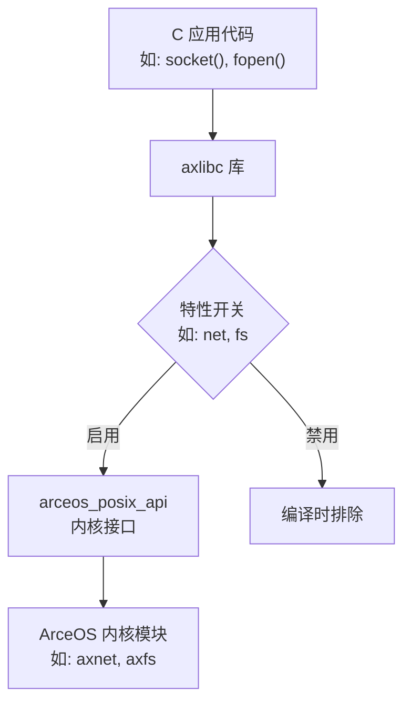
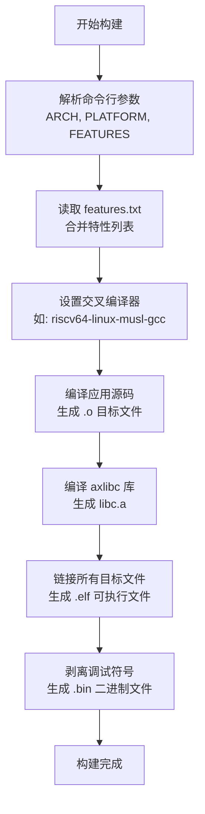

# C 应用开发指南

<cite>
**本文档中引用的文件**  
- [axlibc/Cargo.toml](file://arceos/ulib/axlibc/Cargo.toml)
- [axlibc/src/lib.rs](file://arceos/ulib/axlibc/src/lib.rs)
- [axlibc/build.rs](file://arceos/ulib/axlibc/build.rs)
- [examples/helloworld-c/main.c](file://arceos/examples/helloworld-c/main.c)
- [payload/hello_c/hello.c](file://arceos/payload/hello_c/hello.c)
- [payload/hello_c/Makefile](file://arceos/payload/hello_c/Makefile)
- [payload/fileops_c/Makefile](file://arceos/payload/fileops_c/Makefile)
- [Makefile](file://arceos/Makefile)
- [scripts/make/build_c.mk](file://arceos/scripts/make/build_c.mk)
- [scripts/make/features.mk](file://arceos/scripts/make/features.mk)
- [examples/httpclient-c/features.txt](file://arceos/examples/httpclient-c/features.txt)
- [examples/httpclient-c/httpclient.c](file://arceos/examples/httpclient-c/httpclient.c)
- [examples/httpserver-c/httpserver.c](file://arceos/examples/httpserver-c/httpserver.c)
- [examples/httpclient-c/axbuild.mk](file://arceos/examples/httpclient-c/axbuild.mk)
- [examples/httpserver-c/axbuild.mk](file://arceos/examples/httpserver-c/axbuild.mk)
</cite>

## 目录
1. [引言](#引言)
2. [axlibc 库与 arceos_posix_api 的关系](#axlibc-库与-arceos_posix_api-的关系)
3. [特性声明与配置文件](#特性声明与配置文件)
4. [C 应用开发示例](#c-应用开发示例)
5. [构建流程详解](#构建流程详解)
6. [二进制集成与运行](#二进制集成与运行)
7. [常见问题与解决方案](#常见问题与解决方案)
8. [结论](#结论)

## 引言

本指南旨在为开发者提供在 oscamp 平台上编写和构建 C 语言应用程序的完整流程。我们将深入探讨 `axlibc` 库的核心作用、如何声明所需内核特性、编写标准 C 代码、使用交叉编译工具链进行构建，并最终将生成的二进制文件集成到 ArceOS 镜像中运行。

**文档来源**
- [Makefile](file://arceos/Makefile#L1-L239)
- [scripts/make/build_c.mk](file://arceos/scripts/make/build_c.mk#L1-L76)

## axlibc 库与 arceos_posix_api 的关系

`axlibc` 是 ArceOS 为 C 应用程序提供的用户程序库，它实现了 POSIX 兼容的 C 标准库功能，并通过 `arceos_posix_api` 与内核功能进行交互。

### axlibc 的核心作用

`axlibc` 提供了标准 C 库函数的实现，如 `printf`、`malloc`、`socket` 等，使开发者能够使用熟悉的 C 语言接口进行开发。其核心功能是将这些标准库调用转换为对 ArceOS 内核服务的请求。

### 特性映射机制

`axlibc/Cargo.toml` 中定义的特性（features）直接映射到内核功能。这些特性通过条件编译控制代码的包含，确保只有启用的功能才会被编译进最终的二进制文件。



**图示来源**
- [axlibc/Cargo.toml](file://arceos/ulib/axlibc/Cargo.toml#L22-L52)
- [axlibc/src/lib.rs](file://arceos/ulib/axlibc/src/lib.rs#L1-L126)

### 关键特性映射表

| `axlibc` 特性 | 依赖的 `arceos_posix_api` 特性 | 映射的内核功能 | 说明 |
|---------------|-------------------------------|----------------|------|
| `net` | `arceos_posix_api/net` | 网络协议栈 | 启用 TCP/IP、UDP 等网络功能 |
| `fs` | `arceos_posix_api/fs` | 文件系统 | 启用文件操作如 open, read, write |
| `multitask` | `arceos_posix_api/multitask` | 多任务调度 | 启用 pthread 等线程功能 |
| `alloc` | `arceos_posix_api/alloc` | 动态内存分配 | 启用 malloc, free 等内存管理 |
| `fd` | - | 文件描述符表 | 基础文件描述符支持 |
| `pipe` | `arceos_posix_api/pipe` | 管道通信 | 启用进程间通信管道 |
| `select` | `arceos_posix_api/select` | I/O 多路复用 | 启用 select 系统调用 |
| `epoll` | `arceos_posix_api/epoll` | 事件轮询 | 启用 epoll 高效事件处理 |
| `smp` | `arceos_posix_api/smp` | 对称多处理 | 启用多核支持 |
| `irq` | `arceos_posix_api/irq` 和 `axfeat/irq` | 中断处理 | 启用中断服务 |
| `fp_simd` | `axfeat/fp_simd` | 浮点与 SIMD | 启用浮点运算和向量指令 |

**表来源**
- [axlibc/Cargo.toml](file://arceos/ulib/axlibc/Cargo.toml#L22-L52)
- [axlibc/src/lib.rs](file://arceos/ulib/axlibc/src/lib.rs#L5-L26)

## 特性声明与配置文件

为了正确构建 C 应用，必须通过配置文件明确声明所需的功能特性。

### features.txt 文件

`features.txt` 是一个纯文本文件，用于列出应用所需的所有内核特性。每一行代表一个特性。

**创建示例：**
```bash
echo net > features.txt
echo fs >> features.txt
echo multitask >> features.txt
```

该文件会被顶层 Makefile 读取，并自动合并到构建命令中。

### axbuild.mk 文件

`axbuild.mk` 是一个可选的 Makefile 片段，允许开发者覆盖默认的构建行为，例如指定额外的源文件或编译标志。

**示例内容：**
```makefile
app-objs := main.c helper.c network.c
APP_CFLAGS := -DDEBUG_MODE -O2
```

此文件通过 `-include $(APP)/axbuild.mk` 被主构建脚本包含，实现构建配置的灵活定制。

**配置文件来源**
- [scripts/make/features.mk](file://arceos/scripts/make/features.mk#L1-L61)
- [scripts/make/build_c.mk](file://arceos/scripts/make/build_c.mk#L62-L64)

## C 应用开发示例

本节通过 `payload/hello_c/hello.c` 示例展示标准 C 代码的编写方法。

### 示例代码分析

```c
#include <stdio.h>

int main()
{
    puts("Hello, UserApp!\n");
    return 0;
}
```

此代码展示了最基本的 C 程序结构：
- 包含标准 I/O 头文件 `<stdio.h>`
- 定义 `main` 函数作为程序入口
- 使用 `puts` 函数输出字符串
- 返回 0 表示成功退出

### 复杂应用示例

以 `examples/httpclient-c/httpclient.c` 为例，它展示了如何使用网络特性：

```c
#include <arpa/inet.h>
#include <netdb.h>
#include <sys/socket.h>

int main()
{
    int sock = socket(AF_INET, SOCK_STREAM, IPPROTO_TCP);
    struct addrinfo *res;
    getaddrinfo("ident.me", NULL, NULL, &res);
    connect(sock, res->ai_addr, sizeof(*(res->ai_addr)));
    // ... 发送 HTTP 请求并接收响应
}
```

此代码需要在 `features.txt` 中声明 `net` 特性才能成功编译和链接。

**代码示例来源**
- [payload/hello_c/hello.c](file://arceos/payload/hello_c/hello.c#L1-L8)
- [examples/httpclient-c/httpclient.c](file://arceos/examples/httpclient-c/httpclient.c#L1-L57)
- [examples/httpserver-c/httpserver.c](file://arceos/examples/httpserver-c/httpserver.c#L1-L91)

## 构建流程详解

C 应用的构建流程由顶层 Makefile 驱动，涉及交叉编译、静态链接和符号剥离。

### 构建流程图



**图示来源**
- [Makefile](file://arceos/Makefile#L1-L239)
- [scripts/make/build_c.mk](file://arceos/scripts/make/build_c.mk#L1-L76)

### 交叉编译器配置

顶层 Makefile 根据 `ARCH` 变量自动配置交叉编译器：

```makefile
CROSS_COMPILE ?= $(ARCH)-linux-musl-
CC := $(CROSS_COMPILE)gcc
```

支持的架构包括 `riscv64`、`aarch64` 和 `x86_64`，对应的编译器前缀分别为 `riscv64-linux-musl-`、`aarch64-linux-musl-` 和 `x86_64-linux-musl-`。

### 编译与链接标志

关键的编译和链接标志确保了与 ArceOS 内核的兼容性：

- **编译标志 (CFLAGS):**
  - `-nostdinc`: 不使用标准系统头文件
  - `-fno-builtin`: 禁用内置函数
  - `-ffreestanding`: 生成独立环境代码
  - `-Wall`: 启用所有警告
  - `-I$(inc_dir)`: 指定 `axlibc` 头文件路径

- **链接标志 (LDFLAGS):**
  - `-nostdlib`: 不链接标准库
  - `-static`: 静态链接
  - `-no-pie`: 不生成位置无关可执行文件
  - `-T$(LD_SCRIPT)`: 使用指定的链接脚本

**构建流程来源**
- [Makefile](file://arceos/Makefile#L139-L146)
- [scripts/make/build_c.mk](file://arceos/scripts/make/build_c.mk#L20-L22)

## 二进制集成与运行

构建生成的二进制文件可以被集成到 ArceOS 镜像中并运行。

### 构建命令示例

```bash
cd arceos
make APP=payload/hello_c FEATURES="net fs" ARCH=riscv64
```

此命令将：
1. 设置应用路径为 `payload/hello_c`
2. 启用 `net` 和 `fs` 内核特性
3. 针对 `riscv64` 架构进行构建
4. 生成 `payload/hello_c/hello_c_riscv64-qemu-virt.elf` 和 `.bin` 文件

### 运行应用

构建完成后，可以使用以下命令运行：
```bash
make run
```

这将启动 QEMU 模拟器并加载生成的内核镜像，其中包含了编译好的 C 应用。

**集成与运行来源**
- [Makefile](file://arceos/Makefile#L169-L177)

## 常见问题与解决方案

### 符号未定义错误

**问题：** `undefined reference to 'socket'`

**原因：** 未启用 `net` 特性，导致 `axlibc` 中的 `socket` 函数未被编译。

**解决方案：** 在 `features.txt` 中添加 `net`，或在构建命令中指定 `FEATURES="net"`。

### 特性未启用导致的链接失败

**问题：** `undefined reference to 'pthread_create'`

**原因：** 多线程功能需要 `multitask` 特性支持。

**解决方案：** 确保在 `features.txt` 或 `FEATURES` 变量中包含 `multitask`。

### 编译器找不到头文件

**问题：** `fatal error: stdio.h: No such file or directory`

**原因：** `axlibc` 的头文件路径未正确包含。

**解决方案：** 确认 `axlibc/include` 目录存在，并检查 `CFLAGS` 中是否包含 `-I$(inc_dir)`。

### 架构不匹配

**问题：** `cannot find -laxlibc`

**原因：** 为错误的架构构建了 `axlibc` 库。

**解决方案：** 确保 `ARCH` 变量与目标平台一致，并清理后重新构建。

**问题解决方案来源**
- [scripts/make/features.mk](file://arceos/scripts/make/features.mk#L28-L34)
- [scripts/make/build_c.mk](file://arceos/scripts/make/build_c.mk#L7-L8)

## 结论

本指南详细阐述了在 oscamp 平台上开发 C 应用的完整流程。通过理解 `axlibc` 库与 `arceos_posix_api` 的关系，正确配置 `features.txt` 和 `axbuild.mk` 文件，编写标准 C 代码，并利用顶层 Makefile 的构建系统，开发者可以高效地创建和集成 C 应用到 ArceOS 操作系统中。遵循本文档的指导，可以有效避免常见的构建和链接错误，确保应用的顺利开发和运行。