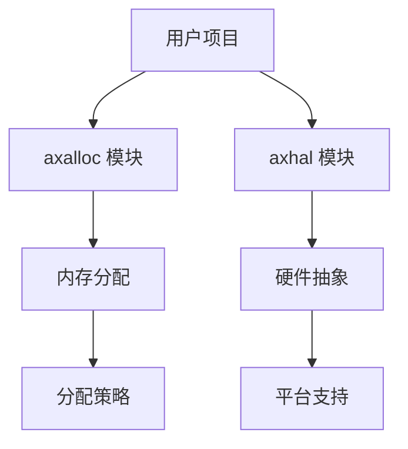

# 开发指南

<cite>
**本文档中引用的文件**  
- [main.rs](file://arceos/examples/helloworld/src/main.rs)
- [Cargo.toml](file://arceos/examples/helloworld/Cargo.toml)
- [main.c](file://arceos/examples/helloworld-c/main.c)
- [httpclient.c](file://arceos/examples/httpclient-c/httpclient.c)
- [features.txt](file://arceos/examples/httpclient-c/features.txt)
- [httpserver.c](file://arceos/examples/httpserver-c/httpserver.c)
- [features.txt](file://arceos/examples/httpserver-c/features.txt)
- [lib.rs](file://arceos/modules/axalloc/src/lib.rs)
- [lib.rs](file://arceos/modules/axhal/src/lib.rs)
- [Cargo.toml](file://arceos/modules/axhal/Cargo.toml)
- [Cargo.toml](file://arceos/modules/axalloc/Cargo.toml)
</cite>

## 目录
1. [简介](#简介)
2. [Rust 应用开发指南](#rust-应用开发指南)
3. [C 应用开发指南](#c-应用开发指南)
4. [模块扩展指南](#模块扩展指南)
5. [结论](#结论)

## 简介
本指南旨在为在 oscamp 平台上开发应用程序的开发者提供全面的实用指导。内容涵盖使用 Rust 和 C 语言开发应用程序的完整流程，以及如何将 ArceOS 的独立模块集成到用户项目中。通过本指南，开发者将掌握从项目创建到功能实现的各个环节。

## Rust 应用开发指南

在 oscamp 平台上开发 Rust 应用程序需要遵循特定的步骤和配置。首先，开发者需要创建一个 `no_std` 项目，这是 ArceOS 环境下的标准做法。`no_std` 项目不依赖于标准库，而是使用 ArceOS 提供的 axstd 库来实现系统功能。

在 `Cargo.toml` 文件中，需要正确配置对 axstd 库的依赖。这通常通过将 axstd 设置为可选依赖项来实现，以便在不同环境下灵活启用或禁用。入口函数需要使用 `#[no_mangle]` 属性标记，以确保函数名不会被编译器修改，从而能够被操作系统正确调用。

axstd 库提供了丰富的功能，包括文件操作、网络通信和线程管理。开发者可以利用这些功能来构建复杂的应用程序。例如，在 HTTP 客户端示例中，开发者可以使用 `TcpStream` 进行网络连接，并通过 `println!` 宏输出调试信息。

**本节来源**
- [main.rs](file://arceos/examples/helloworld/src/main.rs#L1-L11)
- [Cargo.toml](file://arceos/examples/helloworld/Cargo.toml#L1-L11)
- [main.rs](file://arceos/examples/httpclient/src/main.rs#L1-L41)

## C 应用开发指南

开发 C 应用程序需要创建 `axbuild.mk` 和 `features.txt` 文件。`axbuild.mk` 文件用于定义编译规则和链接选项，而 `features.txt` 文件则用于指定需要启用的内核功能。

编写 C 代码时，需要包含相应的头文件并链接到 axlibc 库。axlibc 提供了 POSIX 兼容的 API，使得开发者可以使用熟悉的系统调用进行开发。例如，在 HTTP 服务器示例中，开发者可以使用 `socket`、`bind`、`listen` 等函数来实现网络服务。

通过 `features.txt` 文件，开发者可以启用特定的内核功能，如内存分配、分页和网络支持。这些功能的启用确保了应用程序能够访问底层硬件资源并执行复杂的操作。

**本节来源**
- [main.c](file://arceos/examples/helloworld-c/main.c#L1-L8)
- [httpclient.c](file://arceos/examples/httpclient-c/httpclient.c#L1-L57)
- [features.txt](file://arceos/examples/httpclient-c/features.txt#L1-L4)
- [httpserver.c](file://arceos/examples/httpserver-c/httpserver.c#L1-L91)
- [features.txt](file://arceos/examples/httpserver-c/features.txt#L1-L4)

## 模块扩展指南

将 ArceOS 的独立模块集成到用户项目中是扩展功能的重要方式。例如，`axalloc` 模块提供了全局内存分配器，开发者可以通过启用相应的功能来使用不同的分配策略，如 TLSF、slab 或 buddy 分配器。

`axhal` 模块提供了硬件抽象层，支持多种平台和架构。通过配置 `Cargo.toml` 文件中的功能标志，开发者可以启用 SMP、浮点运算、SIMD、分页和中断处理等高级功能。这些功能的组合使得开发者能够针对特定硬件平台进行优化。

集成模块时，需要在 `Cargo.toml` 文件中添加对目标模块的依赖，并在代码中引入相应的模块。例如，要使用 `axalloc` 模块，需要在 `Cargo.toml` 中添加 `axalloc` 依赖，并在代码中使用 `global_allocator()` 函数来初始化分配器。

**图表来源**
- [lib.rs](file://arceos/modules/axalloc/src/lib.rs#L1-L234)
- [lib.rs](file://arceos/modules/axhal/src/lib.rs#L1-L86)
- [Cargo.toml](file://arceos/modules/axhal/Cargo.toml#L1-L65)
- [Cargo.toml](file://arceos/modules/axalloc/Cargo.toml#L1-L25)

**本节来源**
- [lib.rs](file://arceos/modules/axalloc/src/lib.rs#L1-L234)
- [lib.rs](file://arceos/modules/axhal/src/lib.rs#L1-L86)
- [Cargo.toml](file://arceos/modules/axhal/Cargo.toml#L1-L65)
- [Cargo.toml](file://arceos/modules/axalloc/Cargo.toml#L1-L25)

## 结论
本指南详细介绍了在 oscamp 平台上开发应用程序的完整流程，涵盖了 Rust 和 C 语言的开发方法以及模块扩展的技术细节。通过遵循本指南，开发者可以高效地构建和部署应用程序，充分利用 ArceOS 提供的强大功能。未来的工作可以进一步探索更多模块的集成和优化，以提升应用程序的性能和可靠性。