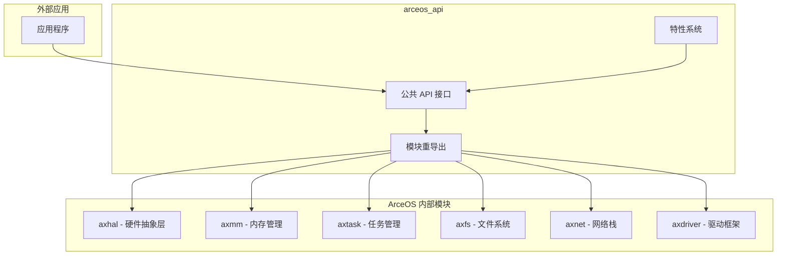
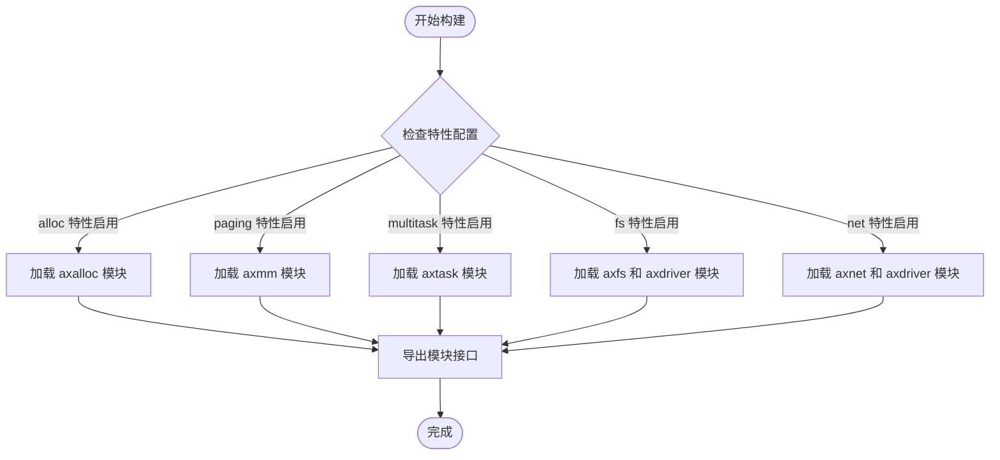
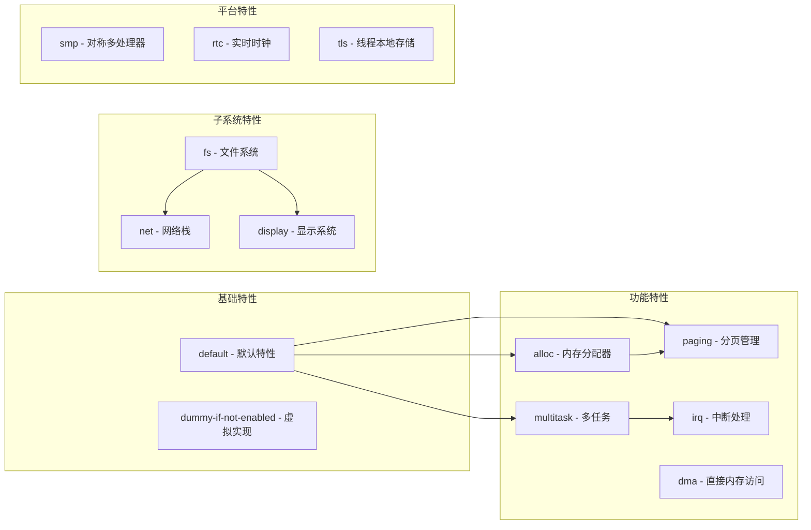
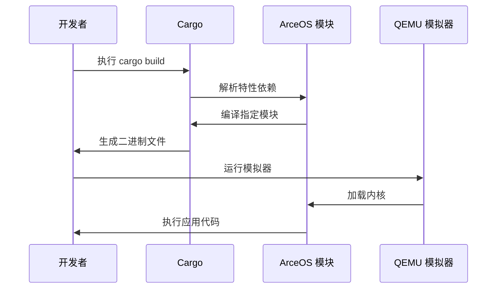
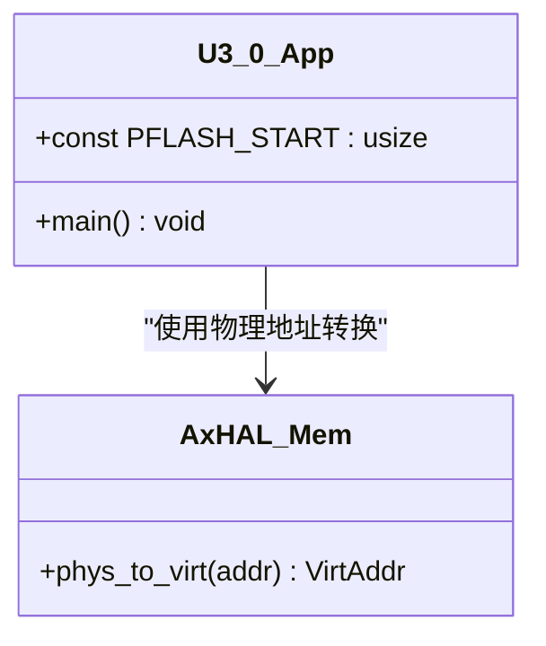
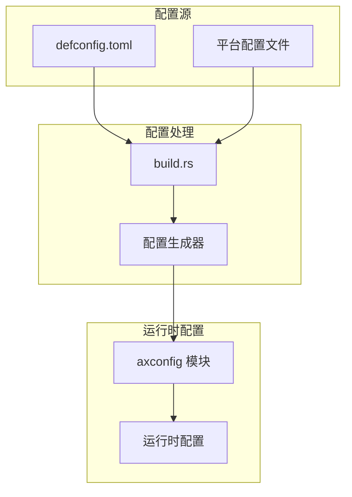
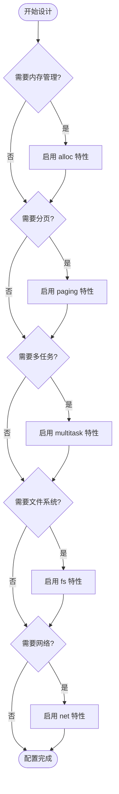
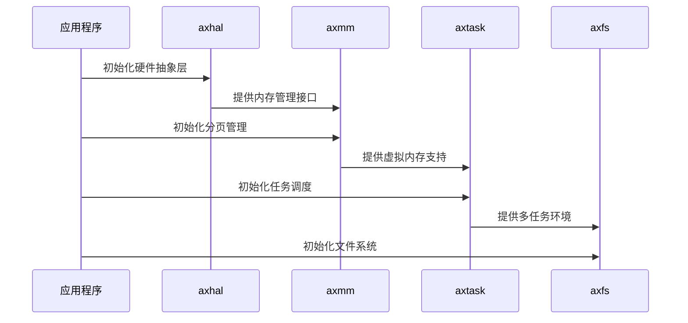

# 模块集成与扩展指南

<cite>
**本文档中引用的文件**
- [arceos_api/Cargo.toml](file://arceos/api/arceos_api/Cargo.toml)
- [arceos_api/src/lib.rs](file://arceos/api/arceos_api/src/lib.rs)
- [axhal/Cargo.toml](file://arceos/modules/axhal/Cargo.toml)
- [axmm/Cargo.toml](file://arceos/modules/axmm/Cargo.toml)
- [axconfig/Cargo.toml](file://arceos/modules/axconfig/Cargo.toml)
- [axconfig/src/lib.rs](file://arceos/modules/axconfig/src/lib.rs)
- [axconfig/defconfig.toml](file://arceos/modules/axconfig/defconfig.toml)
- [build.md](file://arceos/doc/build.md)
- [u_3_0/Cargo.toml](file://arceos/tour/u_3_0/Cargo.toml)
- [u_3_0/src/main.rs](file://arceos/tour/u_3_0/src/main.rs)
- [helloworld/Cargo.toml](file://arceos/examples/helloworld/Cargo.toml)
- [httpserver/Cargo.toml](file://arceos/examples/httpserver/Cargo.toml)
</cite>

## 目录
1. [简介](#简介)
2. [arceos_api crate 架构](#arceos_api-crate-架构)
3. [模块重导出机制](#模块重导出机制)
4. [特性系统与条件编译](#特性系统与条件编译)
5. [外部项目集成](#外部项目集成)
6. [实际应用示例](#实际应用示例)
7. [平台配置管理](#平台配置管理)
8. [最佳实践](#最佳实践)
9. [故障排除](#故障排除)
10. [总结](#总结)

## 简介

ArceOS 是一个现代化的系统操作系统框架，采用模块化设计，提供了灵活的 API 接口和强大的扩展能力。本指南旨在帮助开发者理解如何将 ArceOS 的独立模块（如 `axhal`、`axmm` 等）集成到外部项目中，并充分利用其提供的功能。

ArceOS 的核心设计理念是通过 `arceos_api` crate 提供统一的公共 API 接口，同时保持底层模块的独立性和可插拔性。这种设计使得开发者可以在不同的应用场景中灵活选择所需的模块组合。

## arceos_api crate 架构

### 核心定位

`arceos_api` crate 是 ArceOS 生态系统中的关键组件，它作为所有 ArceOS 模块的公共 API 层，为上层应用提供统一的接口抽象。该 crate 不仅包含各种功能模块的 API 定义，还负责模块间的协调和依赖管理。



**图表来源**
- [arceos_api/src/lib.rs](file://arceos/api/arceos_api/src/lib.rs#L382-L405)
- [arceos_api/Cargo.toml](file://arceos/api/arceos_api/Cargo.toml#L30-L47)

### 功能模块划分

`arceos_api` crate 将功能划分为多个独立的模块，每个模块对应特定的功能领域：

| 模块名称 | 功能描述 | 主要接口 |
|---------|----------|----------|
| `sys` | 系统级操作 | `ax_terminate()` |
| `time` | 时间管理 | `ax_monotonic_time()`, `ax_wall_time()` |
| `mem` | 内存管理 | `ax_alloc()`, `ax_dealloc()` |
| `stdio` | 输入输出 | `ax_console_read_byte()`, `ax_console_write_bytes()` |
| `task` | 多任务管理 | `ax_spawn()`, `ax_wait_for_exit()` |
| `fs` | 文件系统 | `ax_open_file()`, `ax_read_file()`, `ax_write_file()` |
| `net` | 网络通信 | `ax_tcp_socket()`, `ax_udp_socket()` |
| `display` | 图形显示 | `ax_framebuffer_info()`, `ax_framebuffer_flush()` |

**章节来源**
- [arceos_api/src/lib.rs](file://arceos/api/arceos_api/src/lib.rs#L30-L370)

## 模块重导出机制

### 条件编译原理

`arceos_api` crate 通过条件编译机制实现模块的按需加载和重导出。这种设计允许外部项目只包含它们真正需要的模块，从而减少编译产物的大小和运行时开销。



**图表来源**
- [arceos_api/Cargo.toml](file://arceos/api/arceos_api/Cargo.toml#L15-L26)
- [arceos_api/src/lib.rs](file://arceos/api/arceos_api/src/lib.rs#L382-L405)

### 重导出实现

在 `arceos_api` 的 `modules` 模块中，通过条件编译语句实现了模块的动态重导出：

```rust
// 条件编译示例结构
#[cfg(feature = "alloc")]
pub use axalloc;

#[cfg(feature = "paging")]
pub use axmm;

#[cfg(feature = "multitask")]
pub use axtask;

#[cfg(any(feature = "fs", feature = "net", feature = "display"))]
pub use axdriver;
```

这种实现方式确保了只有当相应的特性被启用时，对应的模块才会被编译和导出。

**章节来源**
- [arceos_api/src/lib.rs](file://arceos/api/arceos_api/src/lib.rs#L382-L405)

## 特性系统与条件编译

### 特性定义体系

ArceOS 的特性系统基于 Cargo 的特性机制，提供了细粒度的功能控制：



**图表来源**
- [arceos_api/Cargo.toml](file://arceos/api/arceos_api/Cargo.toml#L12-L28)
- [axhal/Cargo.toml](file://arceos/modules/axhal/Cargo.toml#L12-L22)

### 特性依赖关系

不同特性之间存在复杂的依赖关系，这些关系在 `arceos_api/Cargo.toml` 中明确定义：

| 特性 | 依赖特性 | 说明 |
|------|----------|------|
| `alloc` | `axfeat/alloc` | 启用内存分配功能 |
| `paging` | `axfeat/paging`, `axmm` | 分页管理需要内存模块 |
| `multitask` | `axtask/multitask`, `axsync/multitask` | 多任务需要同步原语 |
| `fs` | `axfeat/fs`, `axfs`, `axdriver` | 文件系统需要驱动支持 |
| `net` | `axfeat/net`, `axnet`, `axdriver` | 网络功能需要驱动支持 |

**章节来源**
- [arceos_api/Cargo.toml](file://arceos/api/arceos_api/Cargo.toml#L15-L26)

## 外部项目集成

### 基本集成步骤

#### 1. 添加 arceos_api 依赖

在项目的 `Cargo.toml` 文件中添加 `arceos_api` 依赖：

```toml
[dependencies]
arceos_api = { git = "https://github.com/arceos-org/arceos.git", branch = "main" }
```

#### 2. 启用所需特性

根据应用需求启用相应的特性：

```toml
[dependencies.arceos_api]
git = "https://github.com/arceos-org/arceos.git"
branch = "main"
features = ["paging", "multitask", "fs", "net"]
```

#### 3. 平台配置

对于特定平台，需要配置相应的平台参数：

```toml
[build-dependencies]
axconfig = { git = "https://github.com/arceos-org/arceos.git", branch = "main" }
```

### 构建流程集成

基于 `build.md` 中描述的构建流程，外部项目需要遵循以下步骤：



**图表来源**
- [build.md](file://arceos/doc/build.md#L18-L35)

**章节来源**
- [build.md](file://arceos/doc/build.md#L1-L92)

## 实际应用示例

### tour/u_3_0 示例分析

`tour/u_3_0` 示例展示了如何直接调用底层硬件抽象接口：

#### 应用程序结构



**图表来源**
- [u_3_0/src/main.rs](file://arceos/tour/u_3_0/src/main.rs#L8-L24)

#### 关键代码模式

应用程序通过以下方式访问底层硬件：

1. **模块导入**：使用 `std::os::arceos::modules::axhal::mem::phys_to_virt`
2. **物理地址转换**：将物理地址转换为虚拟地址
3. **设备访问**：通过转换后的虚拟地址访问硬件设备

**章节来源**
- [u_3_0/src/main.rs](file://arceos/tour/u_3_0/src/main.rs#L1-L25)
- [u_3_0/Cargo.toml](file://arceos/tour/u_3_0/Cargo.toml#L1-L8)

### 其他示例对比

不同复杂度的应用展示了不同的集成模式：

| 示例 | 特性配置 | 主要功能 |
|------|----------|----------|
| helloworld | 无特殊特性 | 基础控制台输出 |
| httpserver | `alloc`, `multitask`, `net` | 网络服务器 |
| u_3_0 | `paging` | 底层硬件访问 |

**章节来源**
- [helloworld/Cargo.toml](file://arceos/examples/helloworld/Cargo.toml#L1-L11)
- [httpserver/Cargo.toml](file://arceos/examples/httpserver/Cargo.toml#L1-L11)

## 平台配置管理

### axconfig 模块架构

`axconfig` 模块负责管理平台特定的配置参数，为整个 ArceOS 系统提供统一的配置接口。



**图表来源**
- [axconfig/Cargo.toml](file://arceos/modules/axconfig/Cargo.toml#L1-L15)
- [axconfig/src/lib.rs](file://arceos/modules/axconfig/src/lib.rs#L1-L20)

### 配置参数类型

平台配置包含多种类型的参数：

| 参数类别 | 示例参数 | 用途 |
|----------|----------|------|
| 内存参数 | `phys-memory-base`, `phys-memory-size` | 物理内存布局 |
| 地址映射 | `phys-virt-offset`, `kernel-base-vaddr` | 地址空间规划 |
| 设备参数 | `mmio-regions`, `pci-ranges` | 硬件资源配置 |
| 系统参数 | `timer-frequency`, `ticks-per-sec` | 系统时钟配置 |
| 任务参数 | `task-stack-size`, `smp` | 多任务配置 |

**章节来源**
- [axconfig/defconfig.toml](file://arceos/modules/axconfig/defconfig.toml#L1-L49)

## 最佳实践

### 模块依赖管理

#### 1. 最小化依赖原则

在集成 ArceOS 模块时，应遵循最小化依赖原则：

```toml
# 推荐：只启用必需的特性
[dependencies.arceos_api]
git = "https://github.com/arceos-org/arceos.git"
features = ["paging", "multitask"]  # 只启用必要的功能

# 避免：不必要的特性
# features = ["fs", "net", "display"]  # 如果不需要这些功能
```

#### 2. 特性组合策略

合理组合特性以避免冲突和冗余：



### 初始化顺序管理

#### 1. 模块初始化优先级

不同模块的初始化存在依赖关系，需要按照正确的顺序进行：



#### 2. 避免重复初始化

通过特性系统避免模块的重复初始化：

```rust
// 正确的做法：检查特性后再初始化
#[cfg(feature = "paging")]
{
    // 分页模块初始化逻辑
}

// 错误的做法：重复初始化
// if cfg!(feature = "paging") {
//     // 分页模块初始化逻辑
//     // 可能导致重复初始化
// }
```

### 错误处理策略

#### 1. 特性缺失处理

当某些特性未启用时的优雅降级：

```rust
// 使用条件编译处理特性缺失
#[cfg(not(feature = "multitask"))]
{
    // 单线程环境下的替代实现
    println!("单线程模式运行");
}

#[cfg(feature = "multitask")]
{
    // 多任务环境下的正常实现
    spawn_task(|| {
        // 任务逻辑
    });
}
```

#### 2. 模块可用性检查

在运行时检查模块的可用性：

```rust
// 检查内存分配器是否可用
#[cfg(feature = "alloc")]
unsafe {
    if let Some(ptr) = arceos_api::mem::ax_alloc(layout) {
        // 使用分配的内存
        arceos_api::mem::ax_dealloc(ptr, layout);
    } else {
        // 处理分配失败
        eprintln!("内存分配失败");
    }
}
```

## 故障排除

### 常见问题及解决方案

#### 1. 特性冲突问题

**问题描述**：不同特性之间存在冲突或不兼容

**解决方案**：
- 检查特性依赖关系图
- 使用 `cargo tree` 查看特性传递
- 调整特性组合顺序

#### 2. 模块未找到错误

**问题描述**：编译时提示找不到模块

**解决方案**：
```toml
# 确保启用了正确的特性
[dependencies.arceos_api]
git = "https://github.com/arceos-org/arceos.git"
features = ["paging", "multitask"]  # 包含 axmm 依赖

# 或者显式启用子模块
[dependencies.axmm]
git = "https://github.com/arceos-org/arceos.git"
optional = false
```

#### 3. 平台配置错误

**问题描述**：运行时出现平台配置相关错误

**解决方案**：
- 检查 `axconfig` 配置文件
- 确认目标平台设置
- 验证内存布局参数

### 调试技巧

#### 1. 特性调试

使用以下命令检查特性状态：

```bash
# 查看特性依赖树
cargo tree --features "paging multitask"

# 检查特定包的特性
cargo metadata --format-version 1 | jq '.packages[] | select(.name == "arceos_api")'
```

#### 2. 模块调试

验证模块是否正确加载：

```rust
// 在代码中检查模块可用性
#[cfg(feature = "paging")]
{
    println!("分页模块已启用");
    // 使用分页功能
}

#[cfg(not(feature = "paging"))]
{
    println!("分页模块未启用");
}
```

## 总结

ArceOS 的模块集成与扩展机制提供了强大而灵活的系统开发框架。通过 `arceos_api` crate 的统一接口，开发者可以：

1. **灵活选择功能模块**：通过特性系统按需启用功能
2. **保持模块独立性**：各模块可以独立开发和测试
3. **简化集成过程**：统一的 API 接口降低了集成复杂度
4. **支持平台定制**：通过配置系统适应不同硬件平台

掌握这些集成技术，开发者可以：
- 快速构建符合需求的系统应用
- 有效管理模块间的依赖关系
- 实现高效的系统性能优化
- 维护良好的代码可维护性

随着 ArceOS 生态系统的不断发展，这些集成模式将继续演进，为开发者提供更加强大和易用的系统开发工具链。