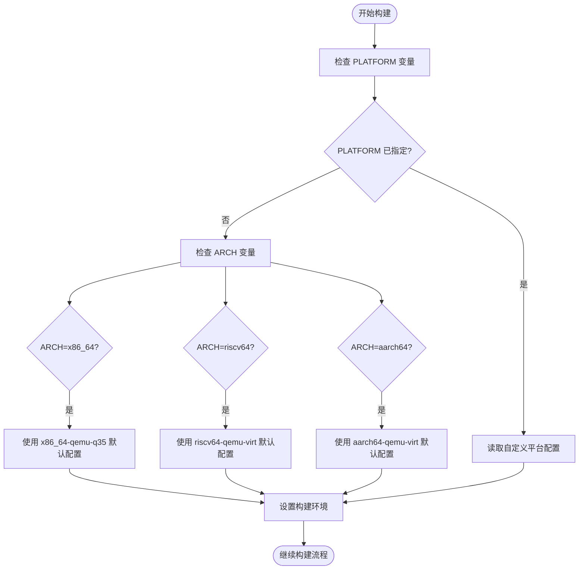
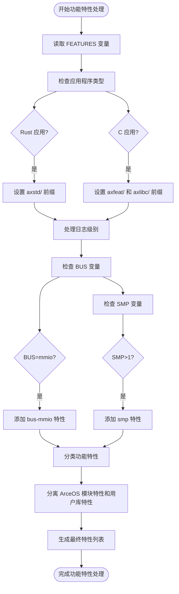
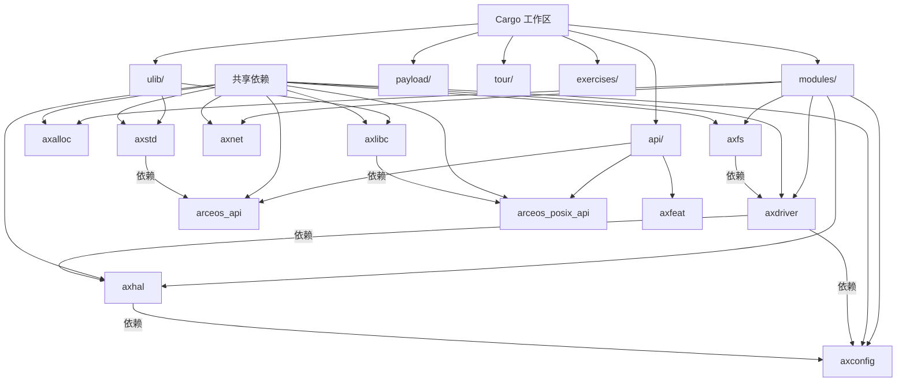

# 构建系统

<cite>
**本文档中引用的文件**  
- [Makefile](file://arceos/Makefile)
- [Cargo.toml](file://arceos/Cargo.toml)
- [features.mk](file://arceos/scripts/make/features.mk)
- [build.mk](file://arceos/scripts/make/build.mk)
- [axdriver/Cargo.toml](file://arceos/modules/axdriver/Cargo.toml)
- [axhal/Cargo.toml](file://arceos/modules/axhal/Cargo.toml)
- [axfs/Cargo.toml](file://arceos/modules/axfs/Cargo.toml)
- [axlibc/Cargo.toml](file://arceos/ulib/axlibc/Cargo.toml)
- [axstd/Cargo.toml](file://arceos/ulib/axstd/Cargo.toml)
- [aarch64-qemu-virt.toml](file://arceos/platforms/aarch64-qemu-virt.toml)
- [riscv64-qemu-virt.toml](file://arceos/platforms/riscv64-qemu-virt.toml)
- [ulib/axlibc/Cargo.toml](file://arceos/ulib/axlibc/Cargo.toml)
- [ulib/axstd/Cargo.toml](file://arceos/ulib/axstd/Cargo.toml)
</cite>

## 目录
1. [构建系统概述](#构建系统概述)
2. [Makefile 参数详解](#makefile-参数详解)
3. [硬件平台选择](#硬件平台选择)
4. [功能模块配置](#功能模块配置)
5. [Cargo 工作区管理](#cargo-工作区管理)
6. [Rust 和 C 应用程序构建](#rust-和-c-应用程序构建)
7. [链接脚本生成与使用](#链接脚本生成与使用)
8. [外部项目使用 axstd 和 axlibc](#外部项目使用-axstd-和-axlibc)

## 构建系统概述

oscamp 构建系统基于 Makefile 和 Cargo 工作区的组合，为 ArceOS 操作系统提供了一个灵活且强大的构建框架。该系统支持多种架构和硬件平台，允许开发者通过简单的参数配置来构建针对不同目标环境的操作系统镜像。

构建系统的核心是位于 `arceos/` 目录下的 Makefile，它定义了所有可用的构建参数和流程。通过这个 Makefile，用户可以指定目标架构、硬件平台、CPU 核心数、日志级别等通用选项，以及应用程序路径、功能特性等应用特定选项。

**Section sources**
- [Makefile](file://arceos/Makefile#L1-L239)

## Makefile 参数详解

oscamp 的 Makefile 提供了丰富的构建参数，分为通用选项、应用程序选项、QEMU 选项和网络选项四大类。

### 通用选项
- **ARCH**: 目标架构，支持 x86_64、riscv64 和 aarch64 三种架构
- **PLATFORM**: 目标硬件平台，对应 `platforms` 目录下的配置文件
- **SMP**: CPU 核心数量，用于配置多核支持
- **MODE**: 构建模式，可选择 release 或 debug
- **LOG**: 日志级别，支持 warn、error、info、debug、trace
- **V**: 详细输出级别，可为空、1 或 2

### 应用程序选项
- **A 或 APP**: 应用程序路径，指定要构建的应用程序位置
- **FEATURES**: ArceOS 模块要启用的功能特性
- **APP_FEATURES**: Rust 应用程序要启用的功能特性

### QEMU 选项
- **BLK**: 是否启用存储设备（virtio-blk）
- **NET**: 是否启用网络设备（virtio-net）
- **GRAPHIC**: 是否启用显示设备和图形输出（virtio-gpu）
- **BUS**: 设备总线类型，支持 mmio 和 pci
- **DISK_IMG**: 虚拟磁盘镜像路径
- **ACCEL**: 是否启用硬件加速（Linux 上的 KVM）
- **QEMU_LOG**: 是否启用 QEMU 日志记录
- **NET_DUMP**: 是否启用网络数据包转储
- **NET_DEV**: QEMU 网络后端类型，支持 user、tap、bridge
- **VFIO_PCI**: 用于直通的 PCI 设备地址
- **VHOST**: 是否为 tap 后端启用 vhost-net

### 网络选项
- **IP**: ArceOS IPv4 地址
- **GW**: 网关 IPv4 地址

这些参数通过 Makefile 的变量定义和条件判断机制进行处理，最终影响构建过程和生成的镜像。

**Section sources**
- [Makefile](file://arceos/Makefile#L1-L62)

## 硬件平台选择

oscamp 构建系统通过 `PLATFORM` 变量来选择不同的硬件平台。平台配置文件位于 `platforms` 目录下，每个文件以 `.toml` 为扩展名，定义了特定硬件平台的详细参数。

### 平台配置文件结构

平台配置文件采用 TOML 格式，包含以下关键字段：
- **arch**: 架构标识符
- **platform**: 平台标识符
- **family**: 平台家族
- **phys-memory-base**: 物理内存基地址
- **phys-memory-size**: 物理内存大小
- **kernel-base-paddr**: 内核镜像的物理基地址
- **kernel-base-vaddr**: 内核镜像的虚拟基地址
- **phys-virt-offset**: 物理地址和虚拟地址之间的线性映射偏移
- **mmio-regions**: MMIO 区域列表
- **virtio-mmio-regions**: VirtIO MMIO 区域列表
- **pci-ecam-base**: PCIe ECAM 空间的物理基地址

### 支持的硬件平台

系统预定义了多个硬件平台配置：
- **aarch64-raspi4.toml**: 树莓派 4 配置
- **aarch64-qemu-virt.toml**: QEMU 虚拟 AArch64 平台配置
- **riscv64-qemu-virt.toml**: QEMU 虚拟 RISC-V 平台配置
- **x86_64-pc-oslab.toml**: x86_64 PC 平台配置
- **x86_64-qemu-q35.toml**: QEMU Q35 平台配置

当用户指定 `PLATFORM` 变量时，构建系统会自动读取相应的配置文件，并根据其中的参数设置构建环境。如果未指定 `PLATFORM`，系统会根据 `ARCH` 变量选择默认平台：
- x86_64 架构默认使用 x86_64-qemu-q35
- riscv64 架构默认使用 riscv64-qemu-virt
- aarch64 架构默认使用 aarch64-qemu-virt



**Diagram sources**
- [aarch64-qemu-virt.toml](file://arceos/platforms/aarch64-qemu-virt.toml#L1-L99)
- [riscv64-qemu-virt.toml](file://arceos/platforms/riscv64-qemu-virt.toml#L1-L69)

**Section sources**
- [Makefile](file://arceos/Makefile#L74-L111)
- [aarch64-qemu-virt.toml](file://arceos/platforms/aarch64-qemu-virt.toml#L1-L99)
- [riscv64-qemu-virt.toml](file://arceos/platforms/riscv64-qemu-virt.toml#L1-L69)

## 功能模块配置

oscamp 构建系统通过 `FEATURES` 变量来启用特定的模块和驱动。这些功能特性通过 Makefile 的 `features.mk` 脚本进行解析和处理，最终转换为 Cargo 构建时的特性标志。

### 功能特性处理流程

功能特性处理流程如下：
1. 用户在命令行中指定 `FEATURES` 变量
2. Makefile 读取 `features.mk` 脚本
3. 脚本根据应用程序类型（Rust 或 C）设置不同的前缀
4. 解析日志级别并添加相应的日志特性
5. 根据总线类型（mmio 或 pci）添加总线特性
6. 根据 SMP 设置添加多核特性
7. 将用户指定的功能特性分类为 ArceOS 模块特性和用户库特性
8. 生成最终的特性列表供 Cargo 构建使用



**Diagram sources**
- [features.mk](file://arceos/scripts/make/features.mk#L1-L61)

### 常用功能特性

#### 驱动模块
- **driver-ixgbe**: 启用 Intel X540/X550 系列网卡驱动
- **driver-bcm2835-sdhci**: 启用树莓派 SDHCI 控制器驱动
- **virtio-blk**: 启用 VirtIO 块设备驱动
- **virtio-net**: 启用 VirtIO 网络设备驱动
- **virtio-gpu**: 启用 VirtIO 图形设备驱动

#### 文件系统
- **fs**: 启用基本文件系统支持
- **fatfs**: 启用 FAT 文件系统支持
- **ramfs**: 启用内存文件系统支持
- **use-ramdisk**: 使用 RAM 磁盘作为根文件系统

#### 网络功能
- **net**: 启用网络功能
- **dns**: 启用 DNS 解析功能

#### 内存管理
- **alloc**: 启用内存分配功能
- **paging**: 启用分页内存管理
- **dma**: 启用 DMA 支持

#### 多任务
- **multitask**: 启用多任务调度
- **smp**: 启用对称多处理

#### 其他功能
- **display**: 启用显示功能
- **rtc**: 启用实时时钟支持
- **fp_simd**: 启用浮点和 SIMD 支持

这些功能特性在相应的 Cargo.toml 文件中定义，并通过依赖关系链接到具体的实现 crate。例如，`axdriver` 模块的 Cargo.toml 文件中定义了各种驱动特性的依赖关系。

**Section sources**
- [features.mk](file://arceos/scripts/make/features.mk#L1-L61)
- [axdriver/Cargo.toml](file://arceos/modules/axdriver/Cargo.toml#L1-L46)
- [axhal/Cargo.toml](file://arceos/modules/axhal/Cargo.toml#L1-L65)
- [axfs/Cargo.toml](file://arceos/modules/axfs/Cargo.toml#L1-L55)

## Cargo 工作区管理

oscamp 构建系统使用 Cargo 工作区来管理项目内数十个模块的依赖关系。工作区配置位于根目录的 `Cargo.toml` 文件中，通过 `workspace` 部分定义了所有成员 crate 和共享依赖。

### 工作区结构

工作区包含多个子目录，每个子目录代表一个独立的 crate：
- **modules/**: 核心模块，如内存管理、设备驱动、文件系统等
- **api/**: API 接口定义，包括 ArceOS API 和 POSIX API
- **ulib/**: 用户库，包括 axstd 和 axlibc
- **payload/**: 预定义的负载应用程序
- **tour/**: 教程和示例应用程序
- **exercises/**: 练习项目

### 依赖管理

工作区通过 `workspace.dependencies` 部分定义了共享依赖，这些依赖可以在所有成员 crate 中通过 `workspace = true` 引用。这种方式确保了所有 crate 使用相同版本的依赖，避免了版本冲突。



**Diagram sources**
- [Cargo.toml](file://arceos/Cargo.toml#L1-L104)

### 成员 crate

工作区的 `members` 列表明确指定了所有包含的 crate 路径。这种显式声明的方式使得构建系统能够准确地识别和构建所有相关模块。每个成员 crate 都有自己的 Cargo.toml 文件，定义了其特定的依赖关系和特性。

通过工作区机制，oscamp 实现了模块化的设计，各个模块可以独立开发和测试，同时又能方便地集成到完整的系统中。这种结构也支持灵活的特性组合，用户可以根据需要启用或禁用特定模块。

**Section sources**
- [Cargo.toml](file://arceos/Cargo.toml#L1-L104)

## Rust 和 C 应用程序构建

oscamp 构建系统支持 Rust 和 C 两种语言编写的应用程序，通过统一的 Makefile 接口进行构建。

### 应用程序类型检测

构建系统首先通过检查应用程序目录下是否存在 `Cargo.toml` 文件来确定应用程序类型：
- 如果存在 `Cargo.toml` 文件，则为 Rust 应用程序
- 如果不存在 `Cargo.toml` 文件，则为 C 应用程序

这一检测过程在 Makefile 中通过以下代码实现：
```makefile
ifneq ($(wildcard $(APP)/Cargo.toml),)
  APP_TYPE := rust
else
  APP_TYPE := c
endif
```

### Rust 应用程序构建

对于 Rust 应用程序，构建流程如下：
1. 调用 `cargo build` 命令
2. 传递 ArceOS 模块特性和用户库特性
3. 生成目标平台的可执行文件
4. 复制生成的 ELF 文件到输出目录

构建过程中，系统会自动处理所有 Rust 依赖，并根据指定的特性启用相应的功能模块。

### C 应用程序构建

对于 C 应用程序，构建流程有所不同：
1. 首先构建 `axlibc` 用户库
2. 使用交叉编译工具链编译 C 源代码
3. 链接 `axlibc` 库生成最终的可执行文件

C 应用程序可以通过 `features.txt` 文件指定所需的功能特性。例如，`examples/httpclient-c/features.txt` 文件包含以下内容：
```
alloc
paging
net
```

这表示该 C 应用程序需要内存分配、分页管理和网络功能。

### 构建流程整合

无论应用程序类型如何，最终的构建流程都会生成一个二进制镜像文件，该文件可以被加载到目标硬件平台上运行。构建系统通过 `build.mk` 脚本统一管理这一过程，确保不同类型的应用程序能够以一致的方式构建和部署。


**Diagram sources**
- [build.mk](file://arceos/scripts/make/build.mk#L1-L48)

**Section sources**
- [Makefile](file://arceos/Makefile#L68-L72)
- [build.mk](file://arceos/scripts/make/build.mk#L1-L48)
- [axlibc/Cargo.toml](file://arceos/ulib/axlibc/Cargo.toml#L1-L61)

## 链接脚本生成与使用

oscamp 构建系统中的链接脚本（linker script）是构建过程中的关键组件，它定义了最终可执行文件的内存布局。

### 链接脚本生成

链接脚本的生成遵循以下规则：
1. 脚本名称格式为 `linker_<PLATFORM_NAME>.lds`
2. 生成路径为 `$(TARGET_DIR)/$(TARGET)/$(MODE)/`
3. 脚本内容根据平台配置文件中的内存布局参数生成

在 Makefile 中，链接脚本的路径通过以下变量定义：
```makefile
LD_SCRIPT := $(TARGET_DIR)/$(TARGET)/$(MODE)/linker_$(PLATFORM_NAME).lds
```

### 链接脚本内容

链接脚本主要包含以下部分：
- **内存区域定义**: 根据平台配置文件中的物理内存基地址和大小定义内存区域
- **段布局**: 定义代码段、数据段、BSS 段等的布局
- **符号定义**: 定义重要的内存地址符号，如 `_text`、`_etext`、`_data`、`_edata` 等
- **内核映射**: 根据 `kernel-base-paddr` 和 `kernel-base-vaddr` 设置内核的物理和虚拟地址映射

### 链接过程

在构建过程中，链接脚本通过以下方式使用：
1. Rust 编译器生成目标文件
2. 链接器使用指定的链接脚本将目标文件链接成最终的 ELF 文件
3. 使用 `objcopy` 工具从 ELF 文件中提取纯二进制镜像

链接脚本确保了生成的镜像符合目标平台的内存布局要求，使得操作系统能够在正确的内存位置加载和执行。

**Section sources**
- [Makefile](file://arceos/Makefile#L153-L155)

## 外部项目使用 axstd 和 axlibc

oscamp 构建系统设计允许外部项目使用 `axstd` 和 `axlibc` 库，这为开发基于 ArceOS 的应用程序提供了便利。

### 在外部 Rust 项目中使用 axstd

要在外部 Rust 项目中使用 `axstd`，需要在项目的 `Cargo.toml` 文件中添加以下依赖：
```toml
[dependencies]
axstd = { git = "https://github.com/arceos-org/arceos", branch = "main", package = "axstd" }
```

或者，如果将 oscamp 仓库作为子模块包含，可以使用路径依赖：
```toml
[dependencies]
axstd = { path = "path/to/oscamp/arceos/ulib/axstd" }
```

### 在外部 C 项目中使用 axlibc

对于 C 项目，使用 `axlibc` 需要以下步骤：
1. 将 `axlibc` 库编译为目标平台的静态库
2. 在 C 项目的构建系统中链接 `axlibc` 库
3. 包含 `axlibc` 的头文件

### 特性配置

无论使用哪种语言，都需要正确配置所需的功能特性。这可以通过以下方式实现：
- 在构建命令中通过 `FEATURES` 变量指定
- 在项目配置文件中定义
- 对于 C 项目，通过 `features.txt` 文件指定

通过这种方式，外部项目可以充分利用 ArceOS 提供的各种功能模块，同时保持与主系统的兼容性。

**Section sources**
- [axlibc/Cargo.toml](file://arceos/ulib/axlibc/Cargo.toml#L1-L61)
- [axstd/Cargo.toml](file://arceos/ulib/axstd/Cargo.toml#L1-L83)