# 任务管理 (axtask)

<cite>
**本文档中引用的文件**
- [lib.rs](file://arceos/modules/axtask/src/lib.rs)
- [task.rs](file://arceos/modules/axtask/src/task.rs)
- [run_queue.rs](file://arceos/modules/axtask/src/run_queue.rs)
- [api.rs](file://arceos/modules/axtask/src/api.rs)
- [wait_queue.rs](file://arceos/modules/axtask/src/wait_queue.rs)
- [timers.rs](file://arceos/modules/axtask/src/timers.rs)
- [task_ext.rs](file://arceos/modules/axtask/src/task_ext.rs)
- [Cargo.toml](file://arceos/modules/axtask/Cargo.toml)
</cite>

## 目录
1. [简介](#简介)
2. [项目结构](#项目结构)
3. [核心组件](#核心组件)
4. [架构概览](#架构概览)
5. [详细组件分析](#详细组件分析)
6. [调度器实现](#调度器实现)
7. [任务生命周期](#任务生命周期)
8. [同步机制](#同步机制)
9. [性能考虑](#性能考虑)
10. [故障排除指南](#故障排除指南)
11. [结论](#结论)

## 简介

axtask 是 ArceOS 操作系统中的任务管理模块，提供了完整的多任务支持功能。该模块实现了任务控制块（TCB）、多种调度算法（FIFO、RR、CFS）、任务状态管理、上下文切换以及同步原语等功能。模块设计支持可配置的调度策略，包括协作式调度和抢占式调度，并提供了丰富的系统调用接口。

## 项目结构

axtask 模块采用模块化设计，主要包含以下核心文件：

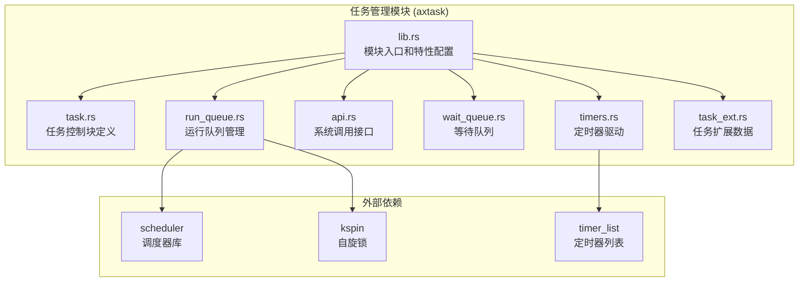

**图表来源**
- [lib.rs](file://arceos/modules/axtask/src/lib.rs#L1-L62)
- [task.rs](file://arceos/modules/axtask/src/task.rs#L1-L442)
- [run_queue.rs](file://arceos/modules/axtask/src/run_queue.rs#L1-L241)

**章节来源**
- [lib.rs](file://arceos/modules/axtask/src/lib.rs#L1-L62)
- [Cargo.toml](file://arceos/modules/axtask/Cargo.toml#L1-L47)

## 核心组件

### 任务控制块 (TCB)

任务控制块是任务管理的核心数据结构，包含了任务的所有必要信息：

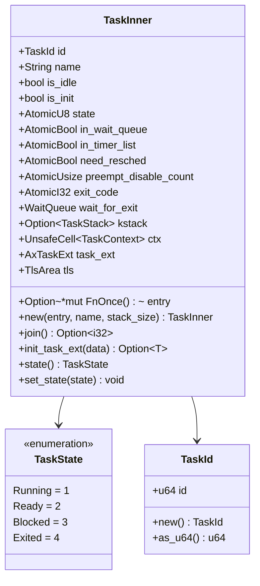

**图表来源**
- [task.rs](file://arceos/modules/axtask/src/task.rs#L32-L60)
- [task.rs](file://arceos/modules/axtask/src/task.rs#L22-L30)

### 运行队列

运行队列是任务调度的核心数据结构，负责维护就绪任务的集合：

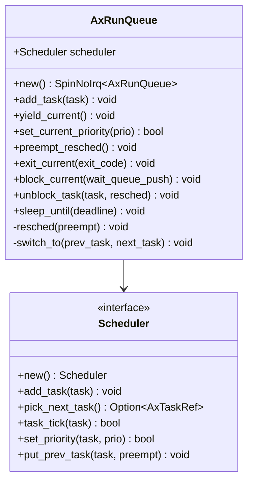

**图表来源**
- [run_queue.rs](file://arceos/modules/axtask/src/run_queue.rs#L21-L23)
- [api.rs](file://arceos/modules/axtask/src/api.rs#L17-L29)

**章节来源**
- [task.rs](file://arceos/modules/axtask/src/task.rs#L32-L162)
- [run_queue.rs](file://arceos/modules/axtask/src/run_queue.rs#L21-L241)

## 架构概览

axtask 模块采用分层架构设计，从上到下包括：

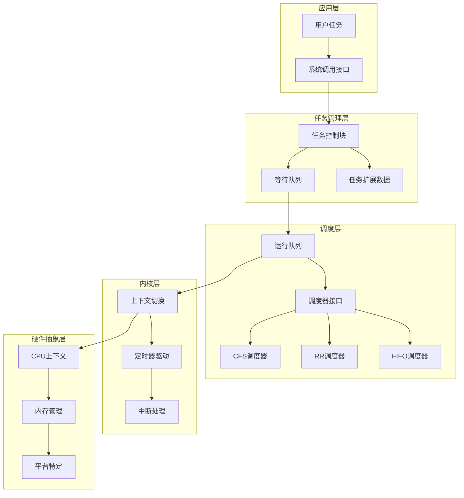

**图表来源**
- [api.rs](file://arceos/modules/axtask/src/api.rs#L1-L174)
- [run_queue.rs](file://arceos/modules/axtask/src/run_queue.rs#L1-L241)

## 详细组件分析

### 任务状态机

任务状态机定义了任务在其生命周期中的状态转换：

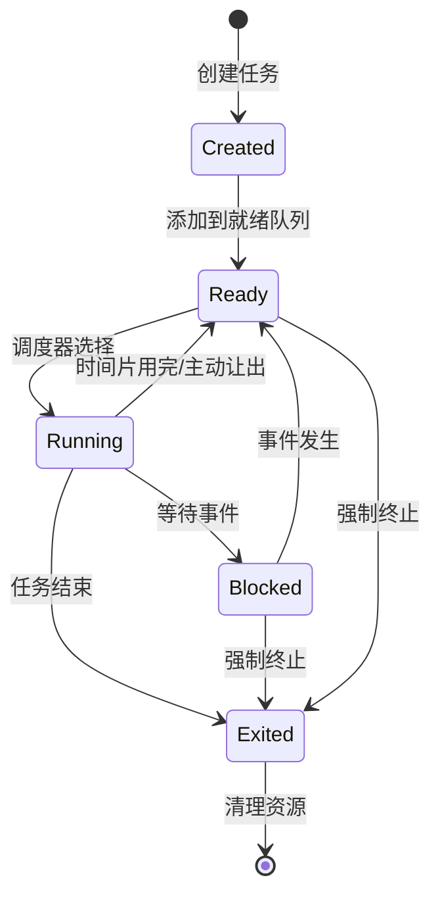

**图表来源**
- [task.rs](file://arceos/modules/axtask/src/task.rs#L22-L30)

### 上下文切换机制

上下文切换是任务调度的核心操作：

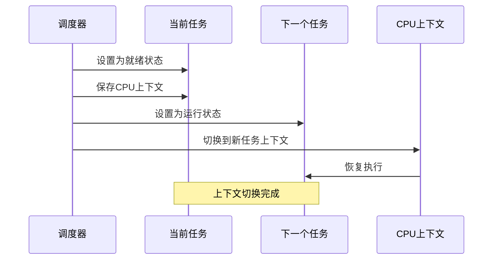

**图表来源**
- [run_queue.rs](file://arceos/modules/axtask/src/run_queue.rs#L166-L190)

**章节来源**
- [task.rs](file://arceos/modules/axtask/src/task.rs#L22-L30)
- [run_queue.rs](file://arceos/modules/axtask/src/run_queue.rs#L149-L190)

## 调度器实现

### FIFO 调度器

FIFO（先来先服务）调度器是最简单的调度算法：

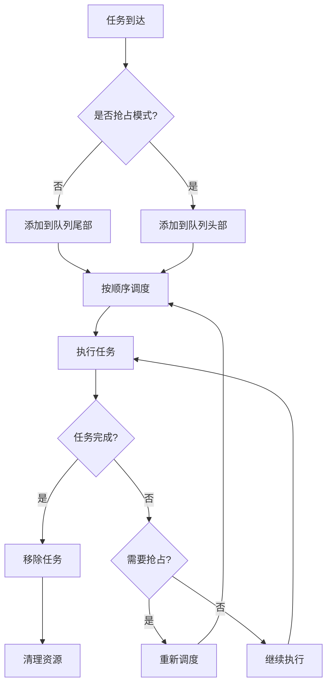

**图表来源**
- [api.rs](file://arceos/modules/axtask/src/api.rs#L26-L28)

### RR 调度器

RR（轮转）调度器为每个任务分配固定的时间片：

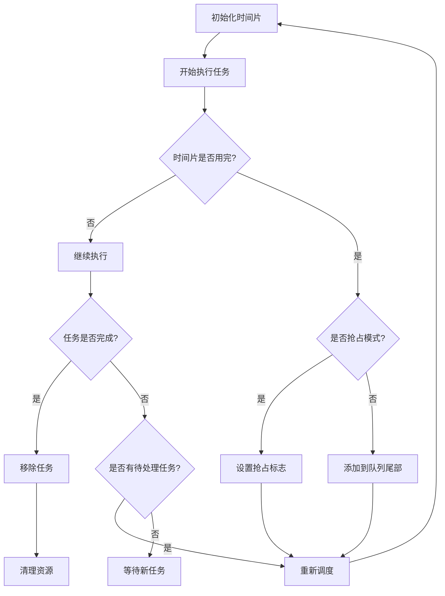

**图表来源**
- [api.rs](file://arceos/modules/axtask/src/api.rs#L18-L21)

### CFS 调度器

CFS（完全公平调度器）基于虚拟运行时间进行调度：

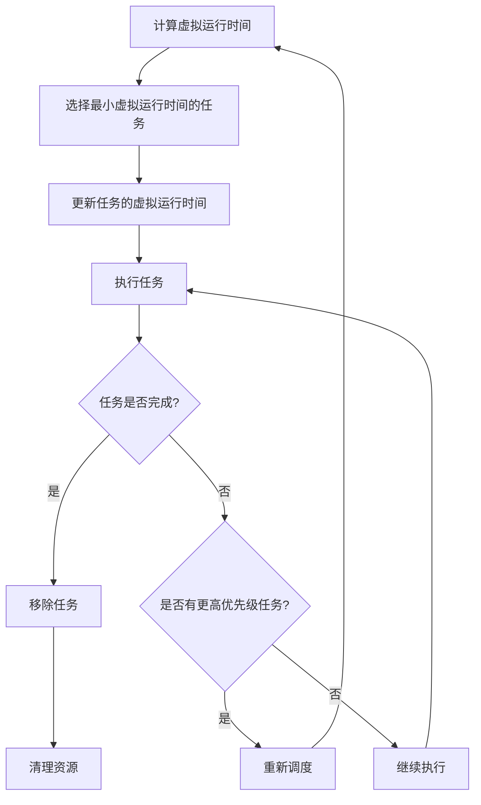

**图表来源**
- [api.rs](file://arceos/modules/axtask/src/api.rs#L22-L25)

**章节来源**
- [api.rs](file://arceos/modules/axtask/src/api.rs#L17-L29)

## 任务生命周期

### 任务创建

任务创建过程涉及多个步骤：

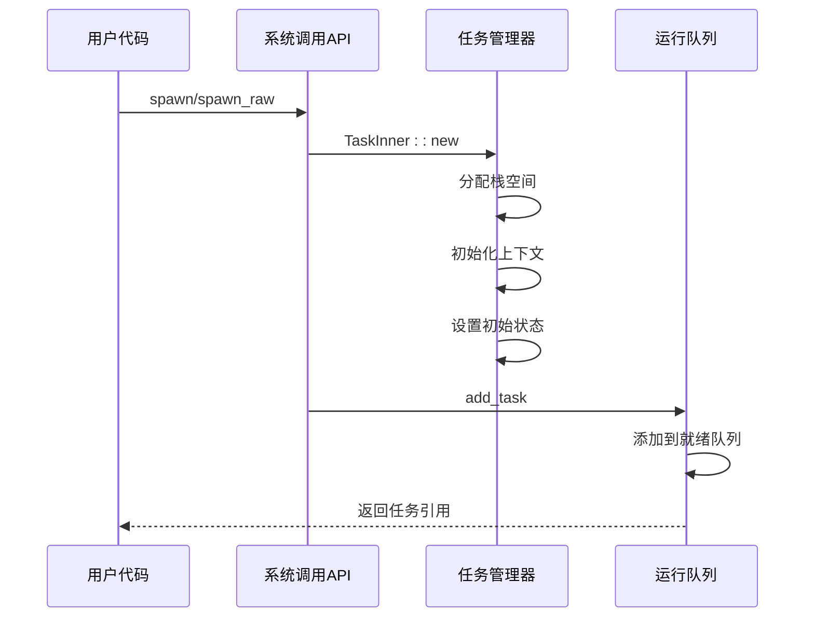

**图表来源**
- [api.rs](file://arceos/modules/axtask/src/api.rs#L99-L120)
- [task.rs](file://arceos/modules/axtask/src/task.rs#L91-L112)

### 任务切换

任务切换是调度器的核心功能：

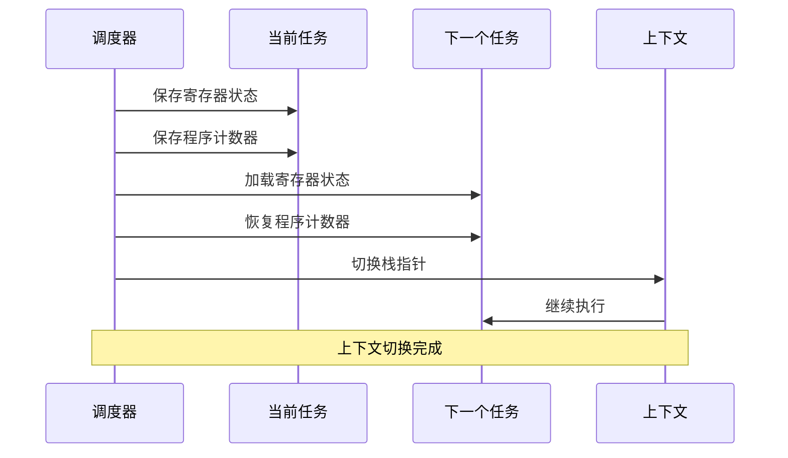

**图表来源**
- [run_queue.rs](file://arceos/modules/axtask/src/run_queue.rs#L166-L190)

### 任务销毁

任务销毁涉及资源清理和垃圾回收：

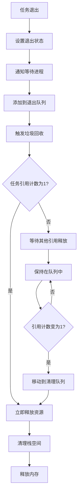

**图表来源**
- [run_queue.rs](file://arceos/modules/axtask/src/run_queue.rs#L84-L98)
- [run_queue.rs](file://arceos/modules/axtask/src/run_queue.rs#L194-L214)

**章节来源**
- [api.rs](file://arceos/modules/axtask/src/api.rs#L99-L120)
- [run_queue.rs](file://arceos/modules/axtask/src/run_queue.rs#L84-L146)

## 同步机制

### 等待队列

等待队列提供了任务间的同步机制：

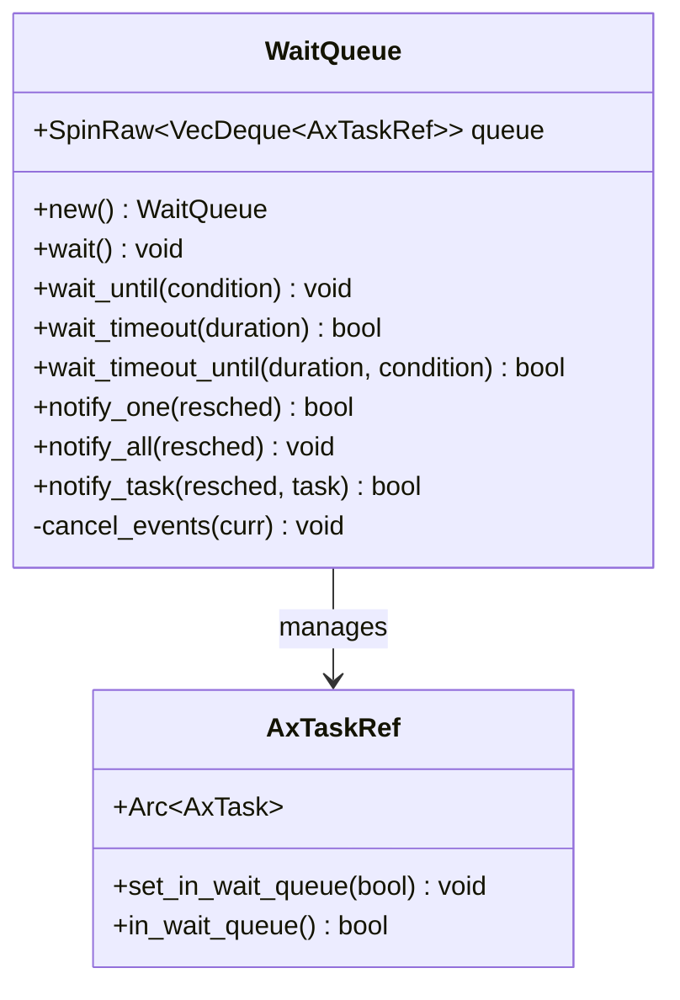

**图表来源**
- [wait_queue.rs](file://arceos/modules/axtask/src/wait_queue.rs#L29-L46)

### 定时器驱动

定时器驱动支持基于时间的调度：

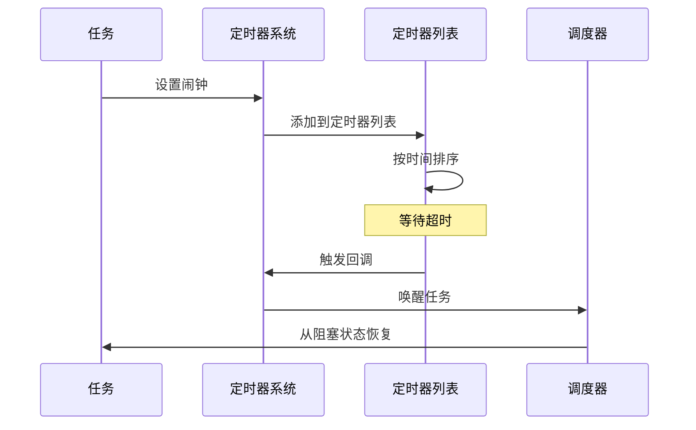

**图表来源**
- [timers.rs](file://arceos/modules/axtask/src/timers.rs#L22-L32)
- [run_queue.rs](file://arceos/modules/axtask/src/run_queue.rs#L132-L145)

**章节来源**
- [wait_queue.rs](file://arceos/modules/axtask/src/wait_queue.rs#L29-L217)
- [timers.rs](file://arceos/modules/axtask/src/timers.rs#L1-L49)

## 性能考虑

### 上下文切换开销

上下文切换是任务管理的主要开销来源：

| 操作类型 | 开销估算 | 优化策略 |
|---------|---------|---------|
| 寄存器保存/恢复 | ~100-200 cycles | 减少寄存器数量，使用快速切换 |
| 栈切换 | ~50-100 cycles | 预分配栈空间，避免动态分配 |
| TLB刷新 | ~1000-5000 cycles | 使用大页，减少地址空间切换 |
| 缓存失效 | ~100-1000 cycles | 保持局部性，预取数据 |

### 调度延迟

不同调度器的延迟特征：

| 调度器 | 延迟范围 | 适用场景 |
|-------|---------|---------|
| FIFO | <100ns | 实时系统，低延迟要求 |
| RR | 100-500ns | 通用系统，公平性要求 |
| CFS | 500-2000ns | 批处理系统，CPU利用率优化 |

### 内存使用优化

| 组件 | 内存占用 | 优化方法 |
|-----|---------|---------|
| 任务控制块 | ~2KB/task | 对齐优化，减少填充字节 |
| 运行队列 | 动态增长 | 预分配池，避免频繁分配 |
| 等待队列 | 动态增长 | 共享池，减少内存碎片 |

## 故障排除指南

### 常见问题诊断

#### 死锁检测

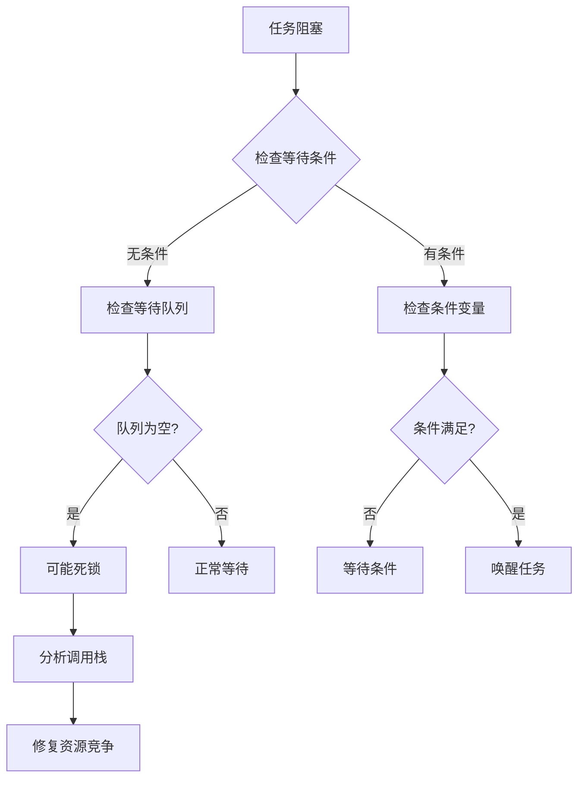

#### 性能问题分析

| 症状 | 可能原因 | 解决方案 |
|-----|---------|---------|
| 高上下文切换频率 | 时间片过短 | 增加时间片长度 |
| 任务饥饿 | 优先级反转 | 实现优先级继承 |
| 内存泄漏 | 任务未正确清理 | 检查退出路径 |
| 死锁 | 锁顺序不一致 | 统一锁获取顺序 |

**章节来源**
- [task.rs](file://arceos/modules/axtask/src/task.rs#L296-L305)
- [run_queue.rs](file://arceos/modules/axtask/src/run_queue.rs#L40-L46)

## 结论

axtask 模块提供了完整的任务管理系统，支持多种调度算法和同步机制。其模块化设计使得不同调度策略可以灵活配置，而统一的接口保证了系统的可移植性和可扩展性。

关键特性包括：
- 支持 FIFO、RR、CFS 三种调度算法
- 提供协作式和抢占式调度模式
- 实现了完善的任务生命周期管理
- 提供丰富的同步原语和定时器功能
- 支持多核调度和 SMP 架构

通过合理的性能优化和错误处理机制，该模块能够满足从实时系统到通用操作系统的各种需求。未来的改进方向包括更好的多核负载均衡、更精细的优先级控制以及更高效的内存管理策略。