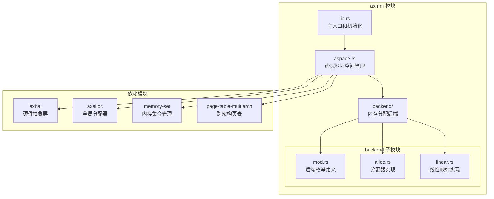
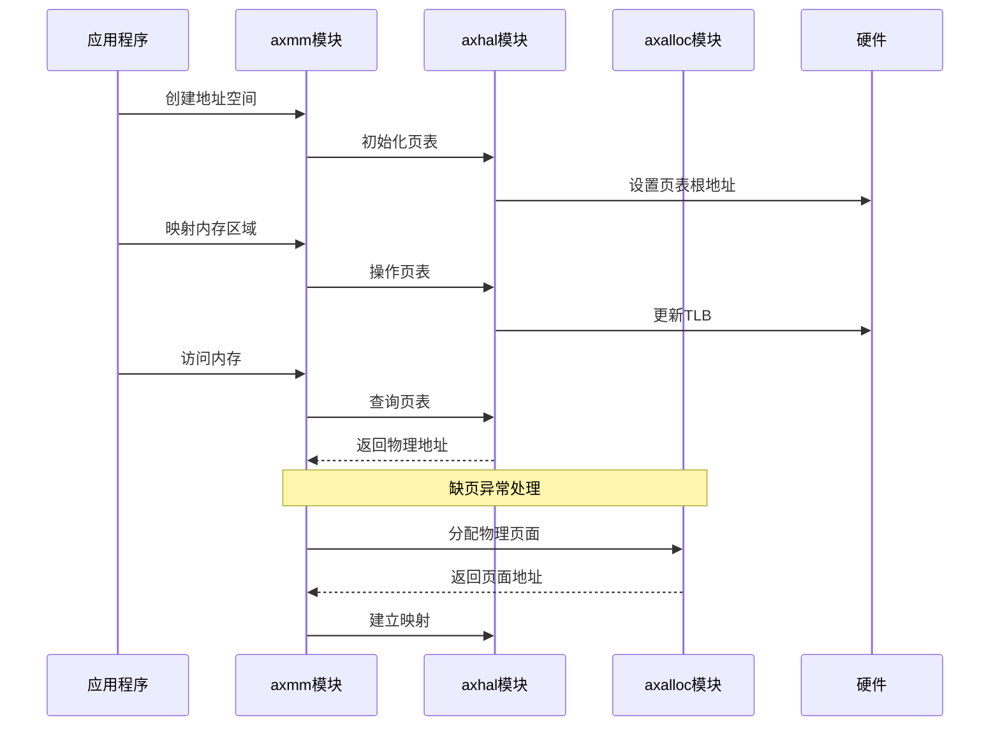
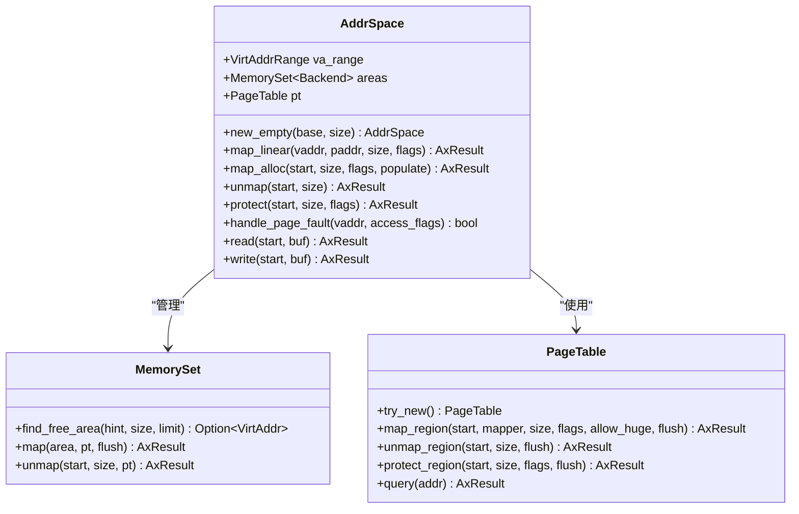
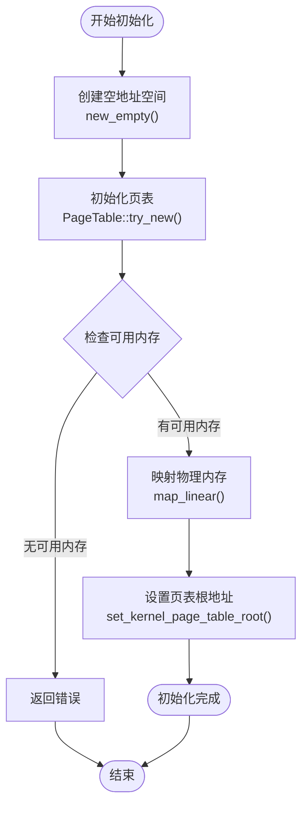
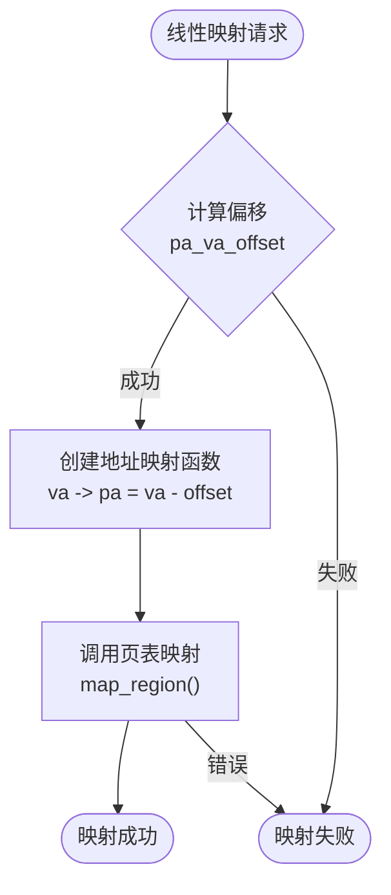
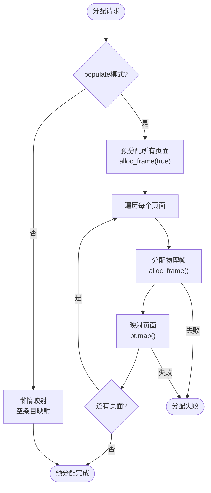
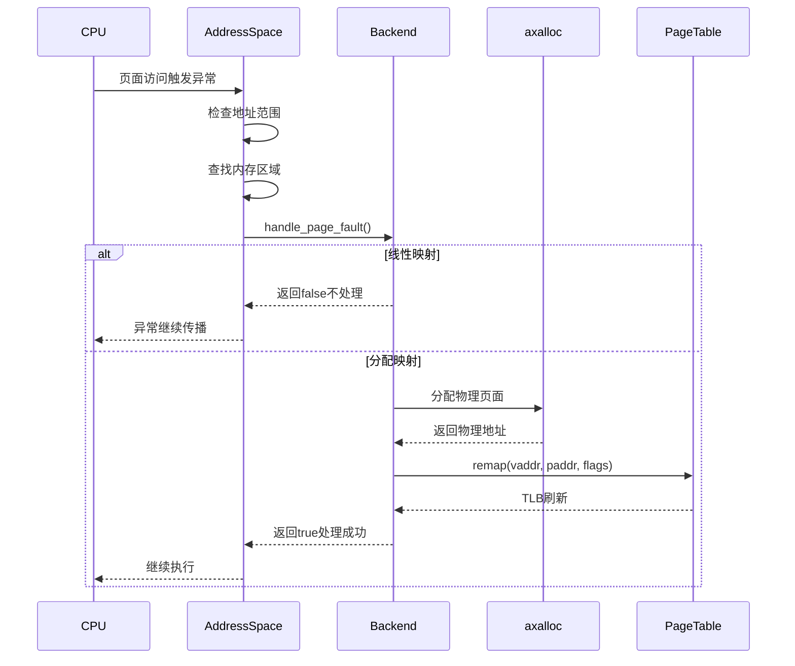
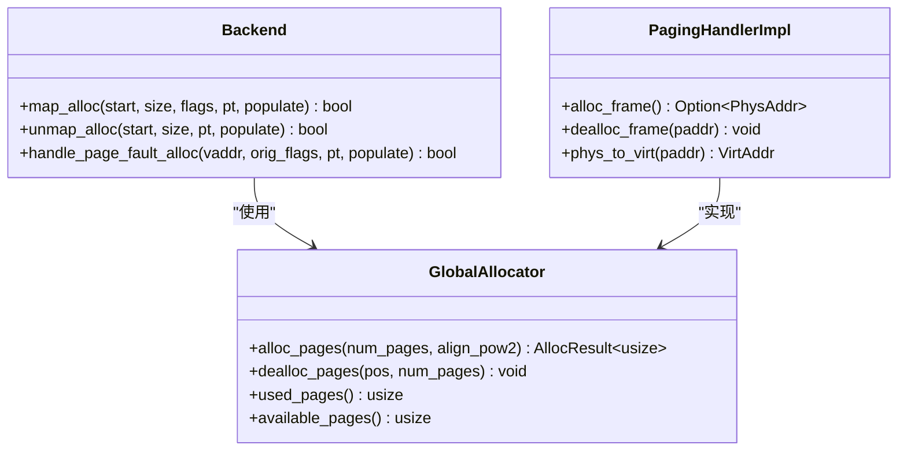
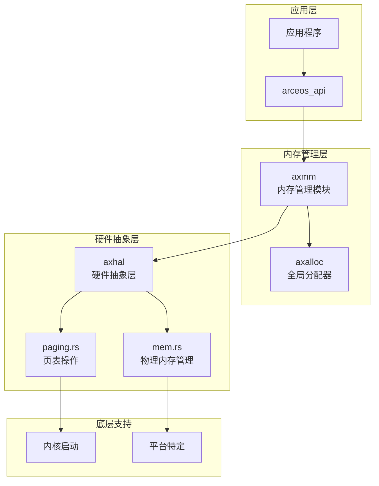
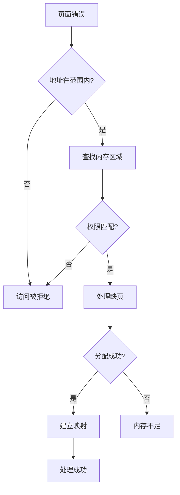

# 内存管理 (axmm)

<cite>
**本文档中引用的文件**
- [lib.rs](file://arceos/modules/axmm/src/lib.rs)
- [aspace.rs](file://arceos/modules/axmm/src/aspace.rs)
- [backend/mod.rs](file://arceos/modules/axmm/src/backend/mod.rs)
- [backend/alloc.rs](file://arceos/modules/axmm/src/backend/alloc.rs)
- [backend/linear.rs](file://arceos/modules/axmm/src/backend/linear.rs)
- [mem.rs](file://arceos/modules/axhal/src/mem.rs)
- [paging.rs](file://arceos/modules/axhal/src/paging.rs)
- [axalloc/lib.rs](file://arceos/modules/axalloc/src/lib.rs)
- [mem.rs](file://arceos/api/arceos_api/src/imp/mem.rs)
</cite>

## 目录
1. [简介](#简介)
2. [项目结构](#项目结构)
3. [核心组件](#核心组件)
4. [架构概览](#架构概览)
5. [详细组件分析](#详细组件分析)
6. [依赖关系分析](#依赖关系分析)
7. [性能考虑](#性能考虑)
8. [故障排除指南](#故障排除指南)
9. [结论](#结论)

## 简介

oscamp 的内存管理模块（axmm）是一个功能完整的虚拟内存管理系统，负责管理系统的虚拟地址空间、页表管理和物理内存分配。该模块提供了灵活的内存映射机制，支持线性映射和按需分配两种不同的内存分配策略，并与底层的物理内存管理模块（axhal）和全局分配器（axalloc）紧密协作。

该模块的主要特性包括：
- 虚拟地址空间管理（AddressSpace）
- 页表操作和内存映射
- 两种内存分配后端（alloc 和 linear）
- 缺页异常处理机制
- 大页支持配置
- 内存泄漏检测能力

## 项目结构

axmm 模块采用分层架构设计，主要包含以下组件：

**图表来源**
- [lib.rs](file://arceos/modules/axmm/src/lib.rs#L1-L97)
- [aspace.rs](file://arceos/modules/axmm/src/aspace.rs#L1-L335)
- [backend/mod.rs](file://arceos/modules/axmm/src/backend/mod.rs#L1-L89)

**章节来源**
- [lib.rs](file://arceos/modules/axmm/src/lib.rs#L1-L97)
- [aspace.rs](file://arceos/modules/axmm/src/aspace.rs#L1-L335)
- [backend/mod.rs](file://arceos/modules/axmm/src/backend/mod.rs#L1-L89)

## 核心组件

### 地址空间管理器（AddrSpace）

AddrSpace 是内存管理模块的核心组件，负责管理单个进程或内核的虚拟地址空间。它维护虚拟地址范围、内存区域集合和页表结构。

主要功能：
- 地址空间的创建和销毁
- 内存映射的添加和移除
- 页面错误处理
- 内存读写操作
- 权限保护设置

### 内存分配后端（Backend）

Backend 枚举定义了两种不同的内存分配策略：

1. **线性映射（Linear）**：适用于连续物理内存区域的直接映射
2. **分配映射（Alloc）**：适用于动态分配的内存区域，支持按需分配

### 物理内存管理（axhal）

提供底层的物理内存管理功能，包括：
- 物理内存区域识别
- 虚拟地址到物理地址转换
- 页表操作接口

**章节来源**
- [aspace.rs](file://arceos/modules/axmm/src/aspace.rs#L17-L22)
- [backend/mod.rs](file://arceos/modules/axmm/src/backend/mod.rs#L20-L39)
- [mem.rs](file://arceos/modules/axhal/src/mem.rs#L1-L164)

## 架构概览

内存管理模块的整体架构展示了各组件之间的交互关系：

**图表来源**
- [lib.rs](file://arceos/modules/axmm/src/lib.rs#L80-L97)
- [aspace.rs](file://arceos/modules/axmm/src/aspace.rs#L257-L276)
- [paging.rs](file://arceos/modules/axhal/src/paging.rs#L38-L54)

## 详细组件分析

### 虚拟地址空间（AddressSpace）

AddressSpace 结构体是内存管理的核心，包含了完整的虚拟地址空间信息：

**图表来源**
- [aspace.rs](file://arceos/modules/axmm/src/aspace.rs#L17-L22)
- [aspace.rs](file://arceos/modules/axmm/src/aspace.rs#L56-L62)

#### 地址空间初始化

地址空间的初始化过程包括创建空的地址空间、设置页表和映射物理内存：

**图表来源**
- [lib.rs](file://arceos/modules/axmm/src/lib.rs#L58-L78)
- [lib.rs](file://arceos/modules/axmm/src/lib.rs#L80-L97)

**章节来源**
- [aspace.rs](file://arceos/modules/axmm/src/aspace.rs#L56-L62)
- [lib.rs](file://arceos/modules/axmm/src/lib.rs#L58-L78)

### 后端分配器（Backend）

#### 线性分配器（Linear）

线性分配器适用于已知物理地址偏移的连续内存映射：

**图表来源**
- [backend/linear.rs](file://arceos/modules/axmm/src/backend/linear.rs#L12-L31)

#### 分配器（Alloc）

分配器支持两种模式：预分配和按需分配：

**图表来源**
- [backend/alloc.rs](file://arceos/modules/axmm/src/backend/alloc.rs#L28-L61)

**章节来源**
- [backend/linear.rs](file://arceos/modules/axmm/src/backend/linear.rs#L1-L47)
- [backend/alloc.rs](file://arceos/modules/axmm/src/backend/alloc.rs#L1-L109)

### 缺页异常处理

缺页异常处理是内存管理系统的重要组成部分：

**图表来源**
- [aspace.rs](file://arceos/modules/axmm/src/aspace.rs#L257-L276)
- [backend/alloc.rs](file://arceos/modules/axmm/src/backend/alloc.rs#L88-L108)

**章节来源**
- [aspace.rs](file://arceos/modules/axmm/src/aspace.rs#L257-L276)
- [backend/alloc.rs](file://arceos/modules/axmm/src/backend/alloc.rs#L88-L108)

### 与 axalloc 协作

axmm 与 axalloc 模块通过统一的页面分配接口协作：

**图表来源**
- [axalloc/lib.rs](file://arceos/modules/axalloc/src/lib.rs#L49-L61)
- [paging.rs](file://arceos/modules/axhal/src/paging.rs#L38-L54)

**章节来源**
- [axalloc/lib.rs](file://arceos/modules/axalloc/src/lib.rs#L49-L61)
- [paging.rs](file://arceos/modules/axhal/src/paging.rs#L38-L54)

## 依赖关系分析

内存管理模块的依赖关系展现了其在系统架构中的位置：

**图表来源**
- [lib.rs](file://arceos/modules/axmm/src/lib.rs#L1-L18)
- [mem.rs](file://arceos/modules/axhal/src/mem.rs#L1-L10)
- [axalloc/lib.rs](file://arceos/modules/axalloc/src/lib.rs#L1-L13)

### 关键依赖说明

1. **memory-set**：提供内存区域管理功能
2. **page-table-multiarch**：跨架构页表操作
3. **memory-addr**：地址计算和验证
4. **axalloc**：全局内存分配器
5. **axhal**：硬件抽象层接口

**章节来源**
- [lib.rs](file://arceos/modules/axmm/src/lib.rs#L1-L18)
- [aspace.rs](file://arceos/modules/axmm/src/aspace.rs#L1-L16)

## 性能考虑

### 内存分配策略优化

1. **预分配 vs 懒分配**：
   - 预分配：减少缺页中断，但占用更多内存
   - 懒分配：节省内存，但增加缺页处理开销

2. **页面大小选择**：
   - 4KB 页面：适合小对象分配
   - 大页面：适合大块内存分配，减少 TLB 填充

3. **内存池管理**：
   - 两级分配器：先尝试字节分配器，不足时向页面分配器请求

### 缓存友好性

- 页面对齐：确保内存访问的缓存效率
- 连续映射：减少页表项数量
- TLB 刷新优化：批量处理 TLB 刷新操作

## 故障排除指南

### 常见问题诊断

#### 内存泄漏检测

虽然当前实现没有内置的内存泄漏检测，但可以通过以下方式监控：

1. **跟踪分配统计**：
   - 监控 `GlobalAllocator.used_bytes()` 和 `used_pages()`
   - 对比分配和释放的数量

2. **页面错误分析**：
   - 检查缺页异常频率
   - 分析页面回收情况

#### 缺页异常处理

**图表来源**
- [aspace.rs](file://arceos/modules/axmm/src/aspace.rs#L257-L276)

#### 大页支持配置

系统支持透明大页（Transparent Huge Pages）：

1. **内核配置**：在 `/sys/kernel/mm/transparent_hugepage/enabled` 中启用
2. **页面大小**：支持 2MB 和 1GB 大页
3. **兼容性**：需要硬件和内核支持

**章节来源**
- [aspace.rs](file://arceos/modules/axmm/src/aspace.rs#L257-L276)
- [lib.rs](file://arceos/modules/axmm/src/lib.rs#L45-L47)

## 结论

oscamp 的内存管理模块（axmm）提供了一个功能完整、设计精良的虚拟内存管理系统。其主要优势包括：

1. **模块化设计**：清晰的职责分离，便于维护和扩展
2. **灵活的分配策略**：支持线性和按需分配两种模式
3. **高效的页面管理**：与底层硬件紧密集成
4. **良好的可扩展性**：支持多种架构和配置选项

该模块为操作系统提供了坚实的内存管理基础，支持现代操作系统的各种内存管理需求。通过合理的架构设计和性能优化，能够满足从嵌入式系统到服务器的各种应用场景。

未来的改进方向包括：
- 增强内存泄漏检测功能
- 优化大页支持的配置和管理
- 改进内存碎片处理策略
- 添加更多的调试和监控工具