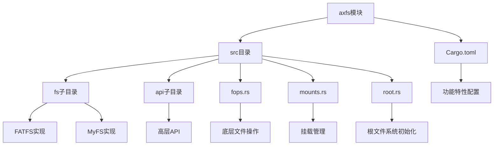
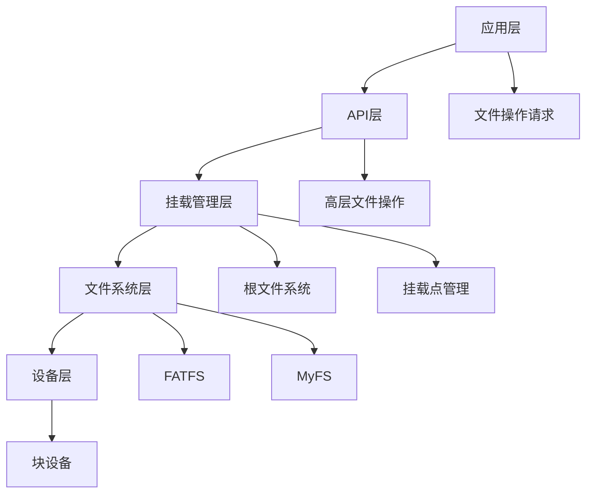
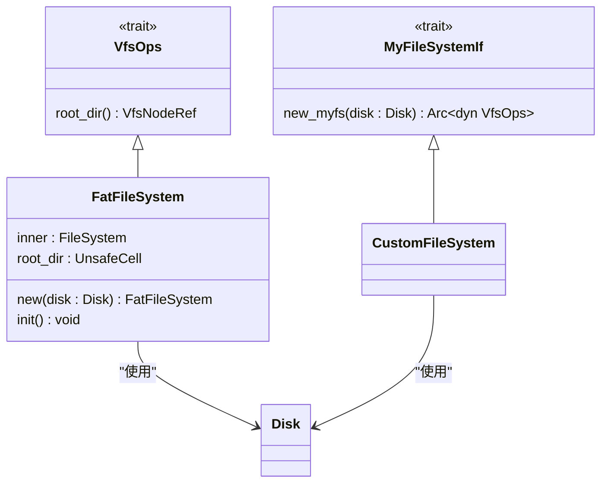
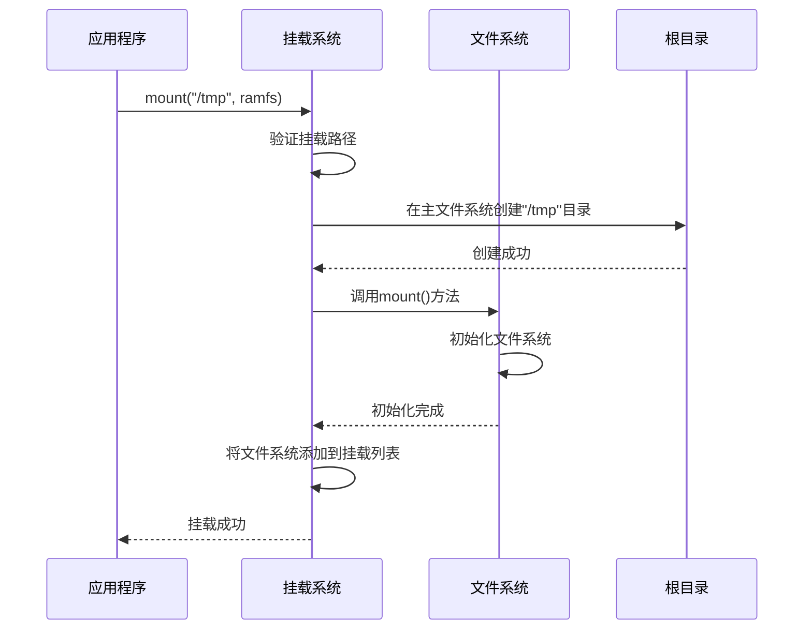
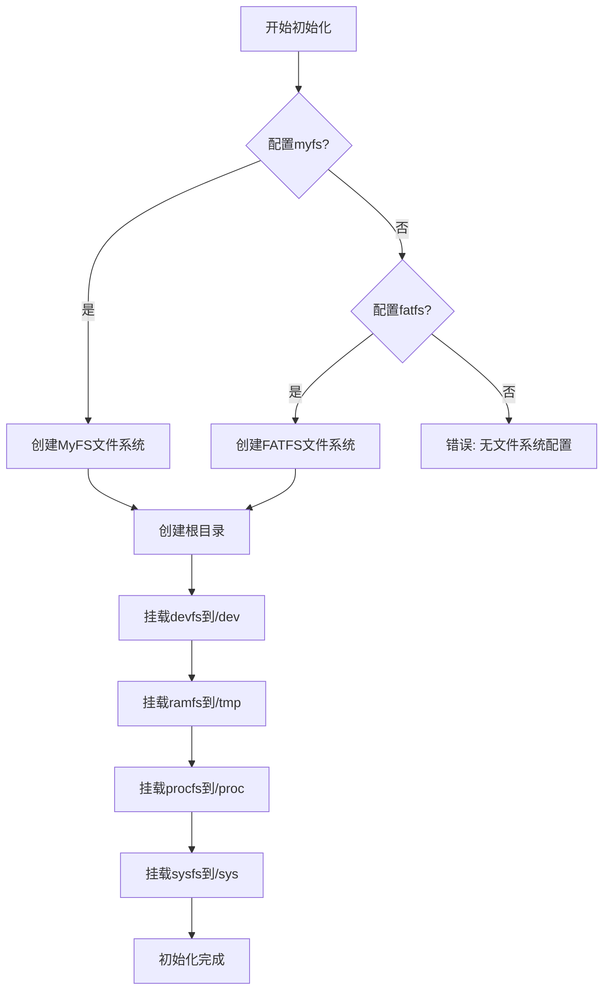
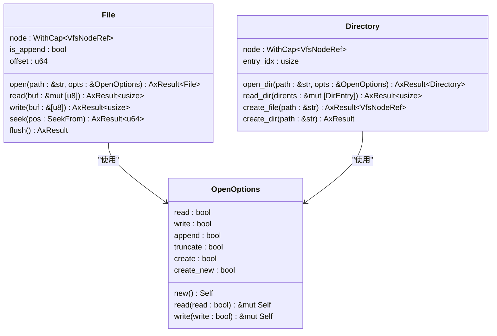
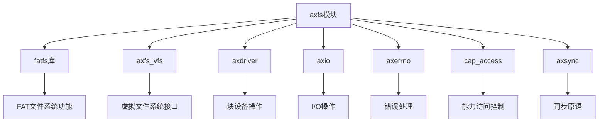

# 文件系统 (axfs)

<cite>
**本文档引用的文件**
- [lib.rs](file://arceos/modules/axfs/src/lib.rs)
- [root.rs](file://arceos/modules/axfs/src/root.rs)
- [mounts.rs](file://arceos/modules/axfs/src/mounts.rs)
- [fops.rs](file://arceos/modules/axfs/src/fops.rs)
- [fatfs.rs](file://arceos/modules/axfs/src/fs/fatfs.rs)
- [myfs.rs](file://arceos/modules/axfs/src/fs/myfs.rs)
- [mod.rs](file://arceos/modules/axfs/src/fs/mod.rs)
- [dev.rs](file://arceos/modules/axfs/src/dev.rs)
- [api/mod.rs](file://arceos/modules/axfs/src/api/mod.rs)
- [Cargo.toml](file://arceos/modules/axfs/Cargo.toml)
</cite>

## 目录
1. [简介](#简介)
2. [项目结构](#项目结构)
3. [核心组件](#核心组件)
4. [架构概述](#架构概述)
5. [详细组件分析](#详细组件分析)
6. [依赖分析](#依赖分析)
7. [性能考虑](#性能考虑)
8. [故障排除指南](#故障排除指南)
9. [结论](#结论)

## 简介
oscamp 的文件系统模块（axfs）为操作系统提供了统一的文件系统操作接口。该模块支持多种文件系统类型，包括 FATFS 和 MyFS，通过统一的 API 实现文件和目录的创建、读取、写入和遍历操作。模块采用分层架构，将底层设备操作与高层文件系统逻辑分离，支持通过挂载机制集成多种文件系统。根文件系统初始化后，可以挂载 devfs、ramfs 等特殊文件系统到特定路径，形成完整的文件系统层次结构。

## 项目结构
axfs 模块的项目结构清晰地划分了不同功能组件。核心功能实现在 `src` 目录下，其中 `fs` 子目录包含 FATFS 和 MyFS 等具体文件系统的实现，`api` 子目录提供高层文件操作接口，`fops.rs` 实现底层文件操作，`mounts.rs` 管理文件系统挂载，`root.rs` 处理根文件系统初始化。模块通过 Cargo.toml 中的 feature 配置灵活启用不同文件系统支持。

**图源**
- [lib.rs](file://arceos/modules/axfs/src/lib.rs#L1-L47)
- [Cargo.toml](file://arceos/modules/axfs/Cargo.toml#L1-L55)

**本节来源**
- [lib.rs](file://arceos/modules/axfs/src/lib.rs#L1-L47)
- [Cargo.toml](file://arceos/modules/axfs/Cargo.toml#L1-L55)

## 核心组件
axfs 模块的核心组件包括文件系统实现、挂载系统、根文件系统初始化和文件操作 API。FATFS 实现基于 rust-fatfs 库，提供对 FAT 文件系统的完整支持；MyFS 提供自定义文件系统的接口；挂载系统管理多个文件系统的挂载点；根文件系统初始化在系统启动时设置基本的文件系统结构；文件操作 API 提供了类似标准库的高层接口，简化文件操作。

**本节来源**
- [lib.rs](file://arceos/modules/axfs/src/lib.rs#L1-L47)
- [root.rs](file://arceos/modules/axfs/src/root.rs#L1-L311)
- [mounts.rs](file://arceos/modules/axfs/src/mounts.rs#L1-L81)

## 架构概述
axfs 模块采用分层架构，从底层到高层依次为设备层、文件系统层、挂载管理层和 API 层。设备层通过 Disk 结构封装块设备操作；文件系统层实现具体的文件系统逻辑；挂载管理层处理多个文件系统的整合；API 层提供统一的文件操作接口。这种分层设计使得模块具有良好的扩展性和可维护性。

**图源**
- [lib.rs](file://arceos/modules/axfs/src/lib.rs#L1-L47)
- [root.rs](file://arceos/modules/axfs/src/root.rs#L1-L311)

## 详细组件分析

### 文件系统实现分析
axfs 模块支持 FATFS 和 MyFS 两种文件系统。FATFS 基于 rust-fatfs 库实现，提供对 FAT 文件系统的完整支持，包括文件读写、目录操作和权限管理。MyFS 提供了一个接口，允许用户定义自定义文件系统。两种文件系统都实现了 VfsOps trait，可以被统一管理。

#### 文件系统类图

**图源**
- [fatfs.rs](file://arceos/modules/axfs/src/fs/fatfs.rs#L1-L284)
- [myfs.rs](file://arceos/modules/axfs/src/fs/myfs.rs#L1-L17)

### 挂载系统分析
挂载系统负责管理多个文件系统的挂载点，将不同的文件系统整合到统一的命名空间中。通过 mount 函数可以将文件系统挂载到指定路径，如 /dev、/tmp 等。挂载系统会检查挂载点的有效性，创建必要的目录，并将文件系统关联到挂载点。

#### 挂载流程序列图

**图源**
- [mounts.rs](file://arceos/modules/axfs/src/mounts.rs#L1-L81)
- [root.rs](file://arceos/modules/axfs/src/root.rs#L1-L311)

### 根文件系统初始化分析
根文件系统初始化是系统启动时的关键步骤，负责设置基本的文件系统结构。初始化过程首先根据配置选择主文件系统（FATFS 或 MyFS），然后创建根目录对象，并依次挂载 devfs、ramfs 等特殊文件系统到预定义路径。初始化完成后，系统就有了完整的文件系统层次结构。

#### 初始化流程图

**图源**
- [root.rs](file://arceos/modules/axfs/src/root.rs#L146-L185)
- [lib.rs](file://arceos/modules/axfs/src/lib.rs#L39-L46)

### 文件/目录操作API分析
文件/目录操作API提供了高层的文件操作接口，类似于标准库的 std::fs 模块。API 封装了底层的复杂性，提供了简单易用的函数，如 read、write、create_dir、remove_file 等。这些函数通过调用底层的 fops 模块实现具体操作，同时处理错误和异常情况。

#### 文件操作API类图

**图源**
- [fops.rs](file://arceos/modules/axfs/src/fops.rs#L1-L413)
- [api/mod.rs](file://arceos/modules/axfs/src/api/mod.rs#L1-L90)

## 依赖分析
axfs 模块依赖多个外部库和内部组件。主要依赖包括 fatfs 库用于 FAT 文件系统实现，axfs_vfs 用于虚拟文件系统接口，axdriver 用于块设备操作。模块内部组件之间通过清晰的接口进行通信，如 fops 模块依赖 root 模块进行文件查找，mounts 模块依赖 fs 模块创建文件系统实例。

**图源**
- [Cargo.toml](file://arceos/modules/axfs/Cargo.toml#L23-L55)
- [lib.rs](file://arceos/modules/axfs/src/lib.rs#L22-L27)

**本节来源**
- [Cargo.toml](file://arceos/modules/axfs/Cargo.toml#L23-L55)
- [lib.rs](file://arceos/modules/axfs/src/lib.rs#L22-L27)

## 性能考虑
axfs 模块在性能方面进行了多项优化。首先，通过将频繁访问的根目录缓存到静态变量中，减少了重复查找的开销。其次，文件读写操作尽量减少内存拷贝，直接在缓冲区上进行操作。此外，模块利用 Rust 的所有权系统避免了不必要的内存分配和释放。对于 FATFS 实现，通过合理设置块大小（512字节）与设备块大小对齐，提高了 I/O 效率。

## 故障排除指南
在使用 axfs 模块时可能遇到的常见问题包括：文件系统挂载失败、文件读写错误、权限不足等。对于挂载失败，应检查挂载路径是否有效，目标路径是否已存在。对于文件读写错误，应确认文件是否存在，是否有足够的权限。对于权限问题，应检查 OpenOptions 的配置是否正确。调试时可以启用日志功能，查看详细的执行流程和错误信息。

**本节来源**
- [fops.rs](file://arceos/modules/axfs/src/fops.rs#L114-L249)
- [root.rs](file://arceos/modules/axfs/src/root.rs#L204-L213)

## 结论
oscamp 的 axfs 文件系统模块提供了一个功能完整、结构清晰的文件系统解决方案。模块通过分层架构实现了良好的扩展性和可维护性，支持多种文件系统类型，并提供了统一的高层 API。通过合理的依赖管理和性能优化，模块能够在资源受限的环境中高效运行。未来可以进一步优化文件系统一致性保障和错误恢复机制，增强模块的健壮性。