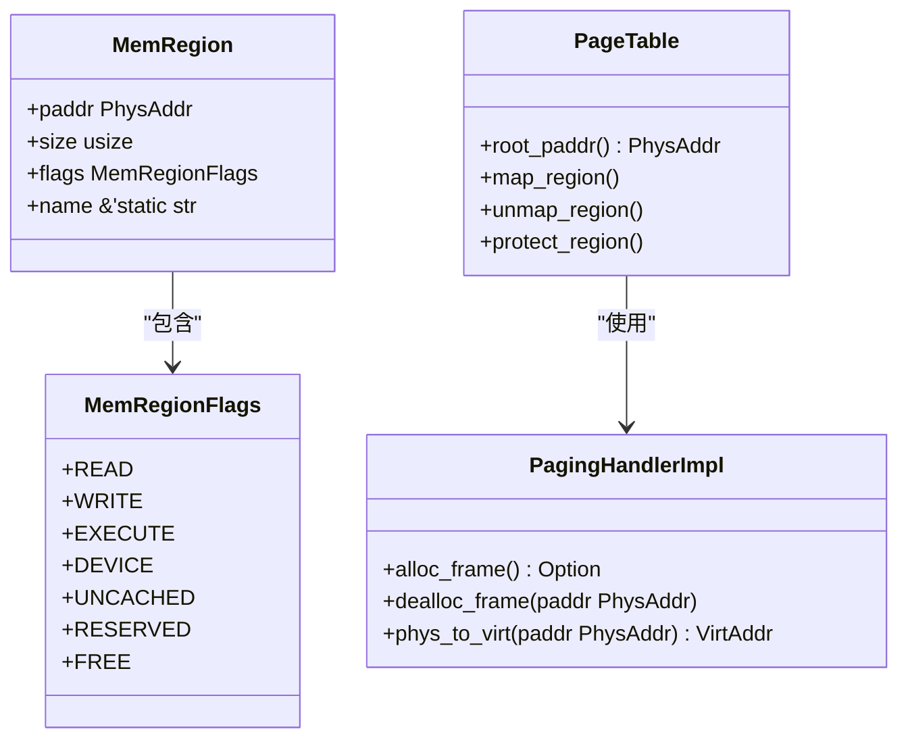
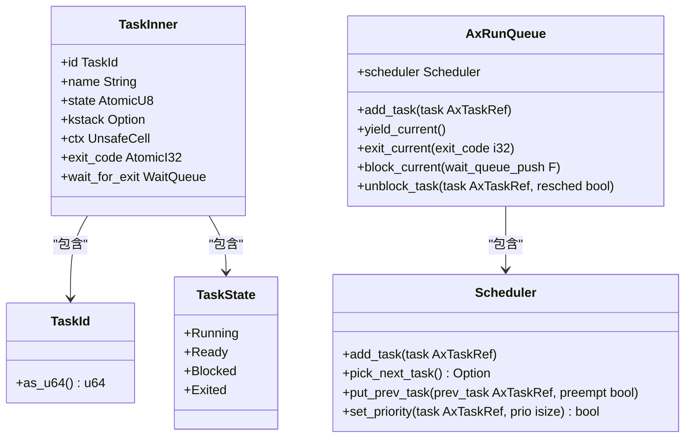
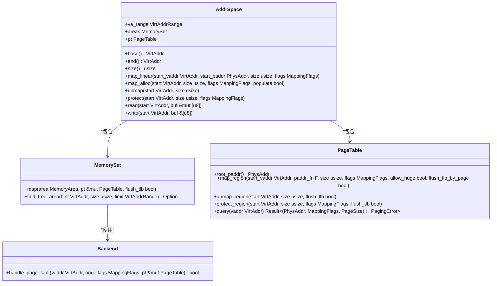
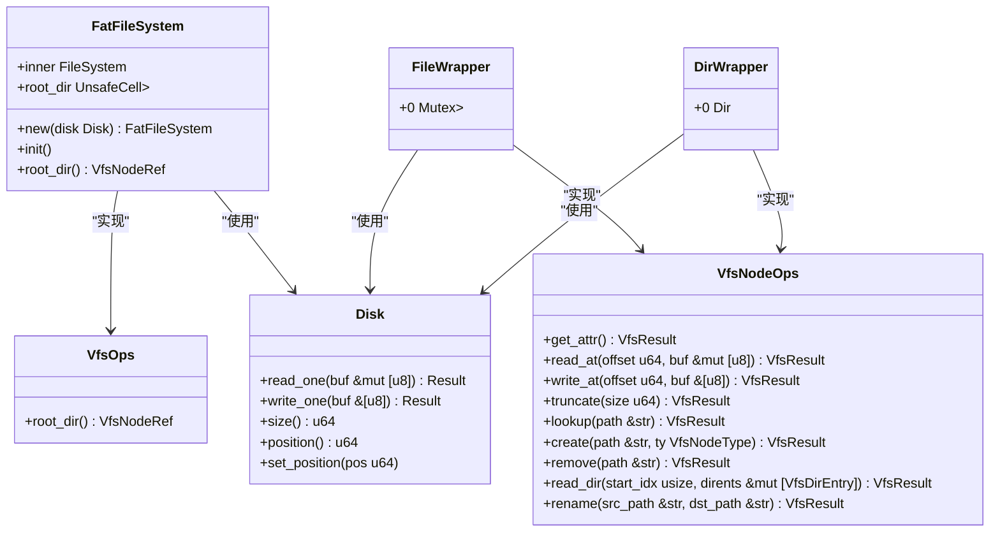
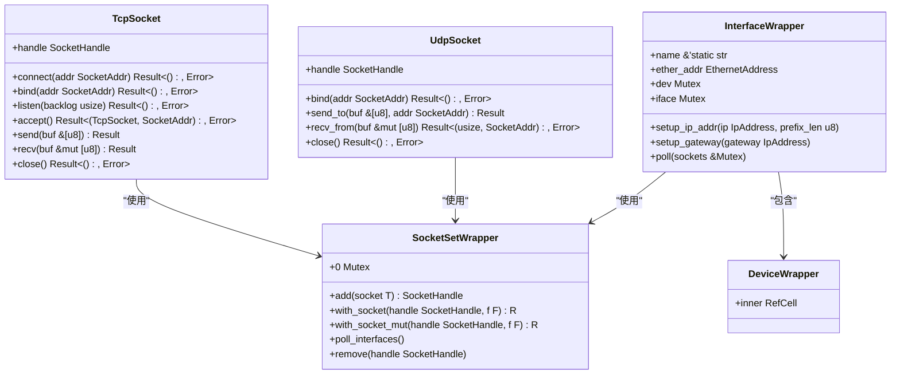

# 核心模块详解

<cite>
**本文档中引用的文件**  
- [axhal/src/lib.rs](file://arceos/modules/axhal/src/lib.rs)
- [axhal/src/arch/mod.rs](file://arceos/modules/axhal/src/arch/mod.rs)
- [axhal/src/platform/mod.rs](file://arceos/modules/axhal/src/platform/mod.rs)
- [axhal/src/cpu.rs](file://arceos/modules/axhal/src/cpu.rs)
- [axhal/src/mem.rs](file://arceos/modules/axhal/src/mem.rs)
- [axhal/src/paging.rs](file://arceos/modules/axhal/src/paging.rs)
- [axtask/src/lib.rs](file://arceos/modules/axtask/src/lib.rs)
- [axtask/src/task.rs](file://arceos/modules/axtask/src/task.rs)
- [axtask/src/run_queue.rs](file://arceos/modules/axtask/src/run_queue.rs)
- [axmm/src/lib.rs](file://arceos/modules/axmm/src/lib.rs)
- [axmm/src/aspace.rs](file://arceos/modules/axmm/src/aspace.rs)
- [axfs/src/lib.rs](file://arceos/modules/axfs/src/lib.rs)
- [axfs/src/fs/fatfs.rs](file://arceos/modules/axfs/src/fs/fatfs.rs)
- [axnet/src/lib.rs](file://arceos/modules/axnet/src/lib.rs)
- [axnet/src/smoltcp_impl/mod.rs](file://arceos/modules/axnet/src/smoltcp_impl/mod.rs)
</cite>

## 目录
1. [硬件抽象层（axhal）](#硬件抽象层axhal)
2. [任务管理（axtask）](#任务管理axtask)
3. [内存管理（axmm）](#内存管理axmm)
4. [文件系统（axfs）](#文件系统axfs)
5. [网络模块（axnet）](#网络模块axnet)

## 硬件抽象层（axhal）

硬件抽象层（axhal）为不同架构（aarch64, riscv64, x86_64）和平台（QEMU, Raspberry Pi）提供了统一的接口。该模块通过条件编译和模块化设计，实现了对不同硬件平台的抽象。

### 架构抽象
axhal 模块通过 `arch` 目录下的子模块实现了对不同 CPU 架构的抽象。根据目标架构，系统会自动选择相应的实现：
- **x86_64**: 实现了 GDT（全局描述符表）、IDT（中断描述符表）和陷阱处理
- **riscv64**: 实现了 RISC-V 特定的上下文和陷阱处理
- **aarch64**: 实现了 ARM64 特定的上下文和陷阱处理

这些架构特定的实现通过 `arch/mod.rs` 文件中的条件编译进行选择，为上层提供了统一的 API 接口。

### 平台抽象
axhal 模块通过 `platform` 目录下的子模块实现了对不同硬件平台的抽象。支持的平台包括：
- **x86_pc**: 标准 PC 平台
- **riscv64_qemu_virt**: QEMU 虚拟机平台
- **aarch64_qemu_virt**: QEMU 虚拟机平台
- **aarch64_raspi**: Raspberry Pi 平台
- **aarch64_bsta1000b**: 特定开发板平台

平台抽象层负责平台特定的初始化、中断处理、CPU 控制和内存初始化等操作。

### 中断处理
axhal 模块通过 `irq` 模块提供了中断处理支持。当启用 `irq` 功能时，系统可以处理硬件中断。中断处理机制通过 `trap` 模块实现，为不同架构提供了统一的陷阱处理接口。

### CPU 控制
axhal 模块提供了对 CPU 的控制功能，包括：
- 获取当前 CPU ID
- 判断当前 CPU 是否为主处理器（BSP）
- 管理当前任务指针
- 多核初始化

CPU 相关操作通过 `cpu.rs` 文件实现，使用了 per-CPU 变量来管理每个 CPU 核心的状态。

### 内存初始化
axhal 模块通过 `mem` 模块管理物理内存。它提供了以下功能：
- 物理地址和虚拟地址的相互转换
- 内存区域管理
- BSS 段清零
- 内存区域标志管理

内存初始化过程中，系统会识别内核映像区域、MMIO 区域和可用内存区域，并为内存管理子系统提供这些信息。

**图源**
- [axhal/src/mem.rs](file://arceos/modules/axhal/src/mem.rs)
- [axhal/src/paging.rs](file://arceos/modules/axhal/src/paging.rs)

**本节来源**
- [axhal/src/lib.rs](file://arceos/modules/axhal/src/lib.rs)
- [axhal/src/arch/mod.rs](file://arceos/modules/axhal/src/arch/mod.rs)
- [axhal/src/platform/mod.rs](file://arceos/modules/axhal/src/platform/mod.rs)
- [axhal/src/cpu.rs](file://arceos/modules/axhal/src/cpu.rs)
- [axhal/src/mem.rs](file://arceos/modules/axhal/src/mem.rs)
- [axhal/src/paging.rs](file://arceos/modules/axhal/src/paging.rs)

## 任务管理（axtask）

axtask 模块提供了任务管理的基本原语，包括任务创建、调度、睡眠、终止等功能。该模块支持多种调度算法和对称多处理（SMP）调度机制。

### 调度算法
axtask 模块支持多种调度算法，通过 Cargo 特性进行配置：
- **FIFO**: 先进先出协作式调度器，默认启用
- **RR**: 时间片轮转抢占式调度器
- **CFS**: 完全公平调度器

这些调度算法通过条件编译特性进行选择，允许开发者根据应用需求配置最合适的调度策略。

### 任务状态
任务在其生命周期中会经历多种状态：
- **运行中（Running）**: 任务正在执行
- **就绪（Ready）**: 任务已准备好执行，等待调度
- **阻塞（Blocked）**: 任务等待某个事件
- **已退出（Exited）**: 任务已执行完毕

任务状态管理通过 `TaskState` 枚举实现，确保了状态转换的正确性和一致性。

### SMP 调度机制
axtask 模块支持对称多处理（SMP）环境下的任务调度。通过 `smp` 特性启用，系统可以在多核处理器上调度任务。每个 CPU 核心都有自己的运行队列和空闲任务，实现了高效的多核任务管理。

### 任务结构
任务的核心数据结构包括：
- 任务 ID 和名称
- 任务状态
- 内核栈
- 上下文信息
- 调度相关数据（如优先级、时间片等）

任务结构设计考虑了性能和内存使用效率，通过原子操作确保了多线程环境下的数据一致性。

**图源**
- [axtask/src/task.rs](file://arceos/modules/axtask/src/task.rs)
- [axtask/src/run_queue.rs](file://arceos/modules/axtask/src/run_queue.rs)

**本节来源**
- [axtask/src/lib.rs](file://arceos/modules/axtask/src/lib.rs)
- [axtask/src/task.rs](file://arceos/modules/axtask/src/task.rs)
- [axtask/src/run_queue.rs](file://arceos/modules/axtask/src/run_queue.rs)

## 内存管理（axmm）

axmm 模块提供了虚拟内存管理功能，包括地址空间管理和分页机制。该模块为内核和用户进程提供了安全、高效的内存管理服务。

### 地址空间管理
axmm 模块通过 `AddrSpace` 结构管理虚拟地址空间。每个地址空间都有：
- 基地址和大小
- 内存区域集合
- 页表

系统维护了内核地址空间和用户地址空间，通过 `new_kernel_aspace()` 和 `new_user_aspace()` 函数创建。

### 分页机制
axmm 模块实现了基于多级页表的分页机制，支持：
- 线性映射：将物理地址直接映射到虚拟地址
- 动态分配映射：按需分配物理页
- 内存保护：设置页面的读、写、执行权限

分页机制通过 `PageTable` 结构实现，支持不同架构的页表格式（x86_64 使用 4 级页表，RISC-V 使用 Sv39，AArch64 使用 A64）。

### 内存操作
axmm 模块提供了丰富的内存操作接口：
- `map_linear()`: 创建线性映射
- `map_alloc()`: 创建动态分配映射
- `unmap()`: 移除映射
- `protect()`: 修改映射权限
- `read()` 和 `write()`: 在地址空间内读写数据

这些操作确保了内存管理的安全性和灵活性。

**图源**
- [axmm/src/lib.rs](file://arceos/modules/axmm/src/lib.rs)
- [axmm/src/aspace.rs](file://arceos/modules/axmm/src/aspace.rs)

**本节来源**
- [axmm/src/lib.rs](file://arceos/modules/axmm/src/lib.rs)
- [axmm/src/aspace.rs](file://arceos/modules/axmm/src/aspace.rs)

## 文件系统（axfs）

axfs 模块提供了统一的文件系统操作接口，支持多种文件系统类型和挂载机制。该模块通过虚拟文件系统（VFS）层实现了对不同文件系统的抽象。

### 支持的文件系统类型
axfs 模块通过 Cargo 特性支持多种文件系统：
- **FATFS**: 默认启用，作为主文件系统挂载在根目录（/）
- **devfs**: 默认启用，挂载在 /dev 目录
- **ramfs**: 默认启用，挂载在 /tmp 目录
- **myfs**: 允许用户定义自定义文件系统

这些文件系统通过 `fs` 目录下的相应模块实现，为上层提供了统一的 VFS 接口。

### 挂载机制
axfs 模块通过 `init_filesystems()` 函数初始化文件系统。该函数接收块设备作为参数，并将指定的文件系统挂载到相应的目录。挂载过程包括：
1. 识别可用的块设备
2. 根据配置选择文件系统类型
3. 初始化文件系统实例
4. 建立根目录结构

### FATFS 实现
FATFS 文件系统通过 `fatfs.rs` 文件实现，基于 `fatfs` crate 提供了完整的 FAT 文件系统支持。主要特性包括：
- 支持 FAT12、FAT16、FAT32 文件系统
- 提供标准的文件操作接口（读、写、创建、删除等）
- 支持目录遍历和文件查找
- 实现了 VFS 接口，与其他文件系统保持一致的 API

FATFS 实现通过 `FatFileSystem` 结构管理文件系统状态，并通过 `FileWrapper` 和 `DirWrapper` 结构提供文件和目录操作。

**图源**
- [axfs/src/lib.rs](file://arceos/modules/axfs/src/lib.rs)
- [axfs/src/fs/fatfs.rs](file://arceos/modules/axfs/src/fs/fatfs.rs)

**本节来源**
- [axfs/src/lib.rs](file://arceos/modules/axfs/src/lib.rs)
- [axfs/src/fs/fatfs.rs](file://arceos/modules/axfs/src/fs/fatfs.rs)

## 网络模块（axnet）

axnet 模块提供了统一的网络编程接口，基于 smoltcp 实现了 TCP/UDP 协议栈。该模块为上层应用提供了类似 POSIX 的网络 API。

### smoltcp 协议栈
axnet 模块通过 `smoltcp_impl` 子模块集成了 smoltcp 网络栈。smoltcp 是一个纯 Rust 实现的 TCP/IP 协议栈，具有以下特点：
- 无操作系统依赖
- 内存安全
- 高性能
- 支持 IPv4、TCP、UDP、ICMP 等协议

smoltcp 实现通过 `smoltcp_impl/mod.rs` 文件集成到 axnet 模块中，为上层提供了统一的网络接口。

### 网络接口
axnet 模块提供了以下主要网络接口：
- **TcpSocket**: TCP 套接字，提供流式通信
- **UdpSocket**: UDP 套接字，提供数据报通信
- **dns_query**: DNS 查询功能
- **poll_interfaces**: 网络轮询功能

这些接口通过 `TcpSocket` 和 `UdpSocket` 结构实现，提供了类似标准库的 API。

### 网络初始化
网络模块通过 `init_network()` 函数初始化。该函数接收网络接口设备作为参数，并完成以下初始化工作：
1. 创建网络接口实例
2. 配置 IP 地址和网关
3. 初始化套接字集合
4. 设置监听表

初始化完成后，网络模块即可处理网络数据包的收发。

### 数据包处理
axnet 模块通过 `poll_interfaces()` 函数轮询网络接口。该函数会：
- 从网络设备接收数据包
- 将数据包传递给 smoltcp 协议栈处理
- 发送待发送的数据包
- 处理 TCP 连接建立等事件

数据包处理流程确保了网络通信的实时性和可靠性。

**图源**
- [axnet/src/lib.rs](file://arceos/modules/axnet/src/lib.rs)
- [axnet/src/smoltcp_impl/mod.rs](file://arceos/modules/axnet/src/smoltcp_impl/mod.rs)

**本节来源**
- [axnet/src/lib.rs](file://arceos/modules/axnet/src/lib.rs)
- [axnet/src/smoltcp_impl/mod.rs](file://arceos/modules/axnet/src/smoltcp_impl/mod.rs)