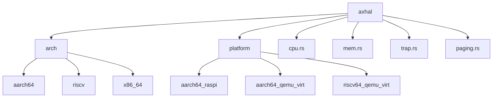
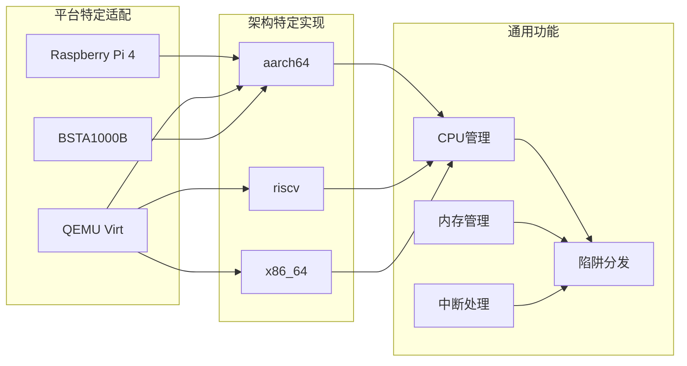
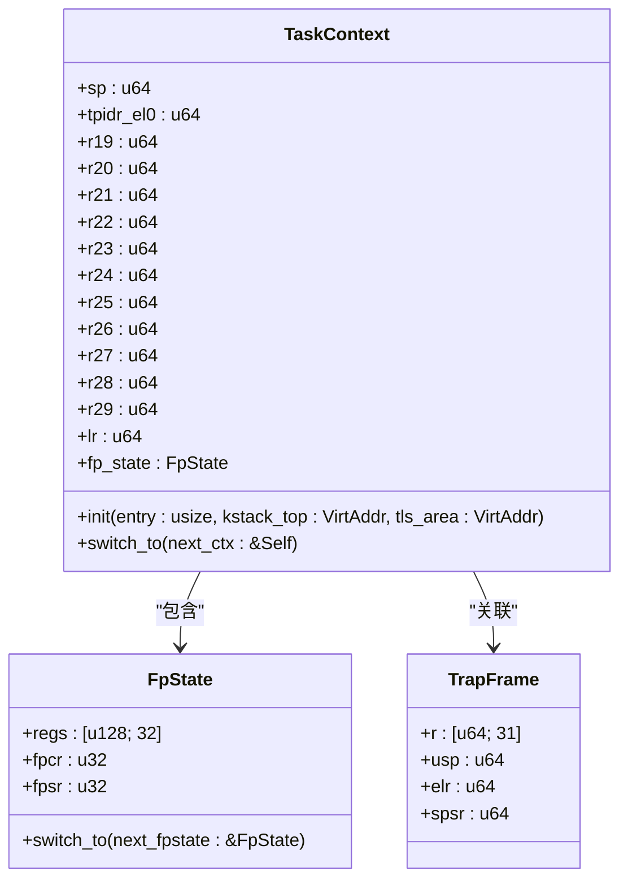
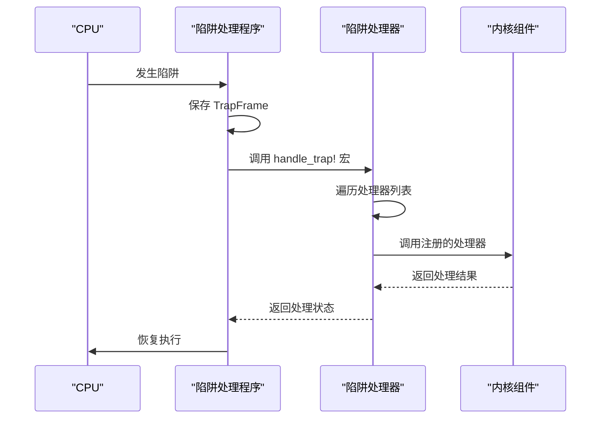
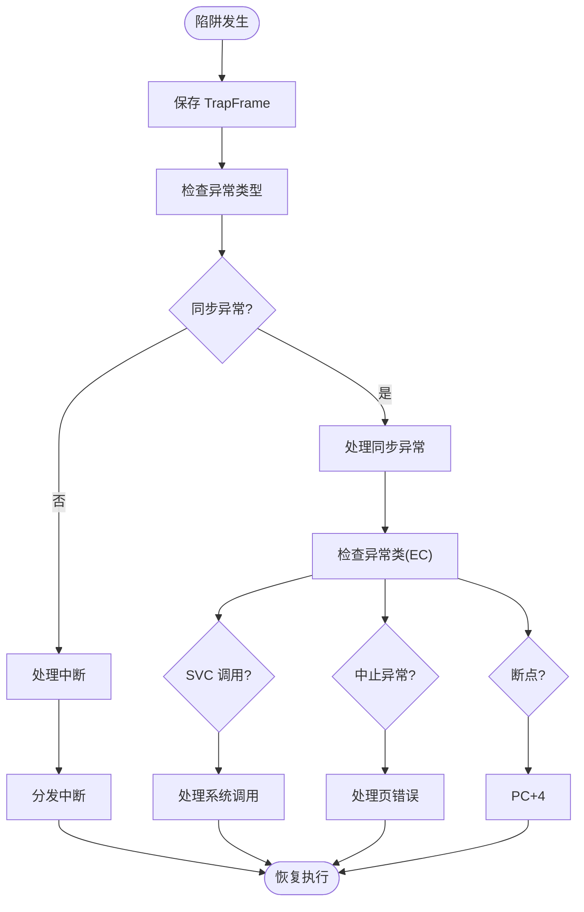
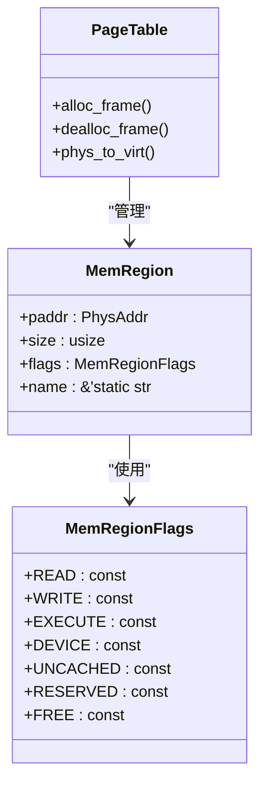
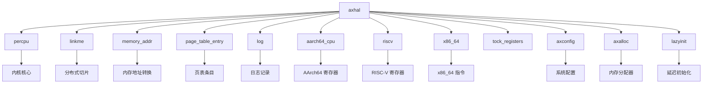

# 硬件抽象层 (axhal)

<cite>
**本文档引用的文件**   
- [lib.rs](file://arceos/modules/axhal/src/lib.rs)
- [arch/mod.rs](file://arceos/modules/axhal/src/arch/mod.rs)
- [trap.rs](file://arceos/modules/axhal/src/trap.rs)
- [cpu.rs](file://arceos/modules/axhal/src/cpu.rs)
- [mem.rs](file://arceos/modules/axhal/src/mem.rs)
- [arch/aarch64/mod.rs](file://arceos/modules/axhal/src/arch/aarch64/mod.rs)
- [arch/riscv/mod.rs](file://arceos/modules/axhal/src/arch/riscv/mod.rs)
- [arch/x86_64/mod.rs](file://arceos/modules/axhal/src/arch/x86_64/mod.rs)
- [arch/aarch64/context.rs](file://arceos/modules/axhal/src/arch/aarch64/context.rs)
- [arch/aarch64/trap.rs](file://arceos/modules/axhal/src/arch/aarch64/trap.rs)
- [arch/aarch64/trap_el2.rs](file://arceos/modules/axhal/src/arch/aarch64/trap_el2.rs)
- [arch/riscv/trap.rs](file://arceos/modules/axhal/src/arch/riscv/trap.rs)
- [arch/x86_64/context.rs](file://arceos/modules/axhal/src/arch/x86_64/context.rs)
- [platform/mod.rs](file://arceos/modules/axhal/src/platform/mod.rs)
- [platform/aarch64_raspi/mod.rs](file://arceos/modules/axhal/src/platform/aarch64_raspi/mod.rs)
- [platform/aarch64_qemu_virt/mod.rs](file://arceos/modules/axhal/src/platform/aarch64_qemu_virt/mod.rs)
- [paging.rs](file://arceos/modules/axhal/src/paging.rs)
</cite>

## 目录
1. [简介](#简介)
2. [项目结构](#项目结构)
3. [核心组件](#核心组件)
4. [架构概述](#架构概述)
5. [详细组件分析](#详细组件分析)
6. [依赖分析](#依赖分析)
7. [性能考虑](#性能考虑)
8. [故障排除指南](#故障排除指南)
9. [结论](#结论)

## 简介

硬件抽象层（axhal）是 ArceOS 操作系统中的关键组件，为不同架构（aarch64、riscv64、x86_64）提供统一的接口。该模块负责系统启动引导、初始化以及硬件相关的操作，包括CPU上下文管理、中断处理、异常陷阱分发、内存初始化和平台特定适配。axhal 通过条件编译和模块化设计，实现了跨平台的兼容性，支持多种硬件平台如 QEMU 虚拟机、Raspberry Pi 4 等。

**Section sources**
- [lib.rs](file://arceos/modules/axhal/src/lib.rs#L1-L86)

## 项目结构

axhal 模块采用分层架构设计，主要分为架构特定实现、平台特定适配和通用功能模块。其目录结构清晰地反映了这种分层：

- `arch/`：包含 aarch64、riscv 和 x86_64 架构的特定实现
- `platform/`：包含不同硬件平台（如 Raspberry Pi 4、QEMU）的适配代码
- `cpu.rs`：CPU 相关操作的通用接口
- `mem.rs`：物理内存管理
- `trap.rs`：陷阱处理机制
- `paging.rs`：页表操作

这种结构使得 axhal 能够在不同架构之间提供统一的接口，同时保持对特定硬件特性的支持。

**Diagram sources **
- [lib.rs](file://arceos/modules/axhal/src/lib.rs#L42-L85)
- [arch/mod.rs](file://arceos/modules/axhal/src/arch/mod.rs#L3-L14)
- [platform/mod.rs](file://arceos/modules/axhal/src/platform/mod.rs#L3-L29)

## 核心组件

axhal 的核心组件包括 CPU 上下文管理、中断处理、陷阱分发、内存管理和平台初始化。这些组件协同工作，为上层操作系统提供稳定的硬件抽象接口。其中，TrapFrame 数据结构是异常处理的关键，它保存了发生陷阱时的 CPU 寄存器状态，为异常分发和恢复提供了基础。

**Section sources**
- [cpu.rs](file://arceos/modules/axhal/src/cpu.rs#L1-L94)
- [mem.rs](file://arceos/modules/axhal/src/mem.rs#L1-L164)
- [trap.rs](file://arceos/modules/axhal/src/trap.rs#L1-L46)

## 架构概述

axhal 的架构设计旨在为不同处理器架构提供统一的硬件抽象接口。通过条件编译和模块化设计，axhal 能够在 aarch64、riscv64 和 x86_64 架构之间无缝切换，同时保持 API 的一致性。该架构的核心是架构特定模块（arch）和平台特定模块（platform）的分离，使得新增架构或平台支持变得更加容易。

**Diagram sources **
- [arch/mod.rs](file://arceos/modules/axhal/src/arch/mod.rs#L3-L14)
- [platform/mod.rs](file://arceos/modules/axhal/src/platform/mod.rs#L3-L29)
- [cpu.rs](file://arceos/modules/axhal/src/cpu.rs#L3-L94)

## 详细组件分析

### CPU 上下文管理分析

CPU 上下文管理是任务切换和异常处理的基础。axhal 为每个架构实现了相应的上下文保存和恢复机制，确保在任务切换或异常发生时能够正确保存和恢复 CPU 状态。

#### 对于对象导向的组件：

**Diagram sources **
- [arch/aarch64/context.rs](file://arceos/modules/axhal/src/arch/aarch64/context.rs#L7-L180)
- [arch/x86_64/context.rs](file://arceos/modules/axhal/src/arch/x86_64/context.rs#L8-L222)

### 陷阱处理机制分析

陷阱处理是操作系统内核的核心功能之一，axhal 提供了跨架构的统一陷阱处理框架。

#### 对于 API/服务组件：

**Diagram sources **
- [trap.rs](file://arceos/modules/axhal/src/trap.rs#L3-L45)
- [arch/aarch64/trap.rs](file://arceos/modules/axhal/src/arch/aarch64/trap.rs#L1-L136)
- [arch/riscv/trap.rs](file://arceos/modules/axhal/src/arch/riscv/trap.rs#L1-L64)

#### 对于复杂逻辑组件：

**Diagram sources **
- [arch/aarch64/trap.rs](file://arceos/modules/axhal/src/arch/aarch64/trap.rs#L108-L135)
- [arch/riscv/trap.rs](file://arceos/modules/axhal/src/arch/riscv/trap.rs#L36-L63)

### 内存管理分析

内存管理组件负责物理内存的分配、映射和保护，为虚拟内存系统提供基础支持。

**Diagram sources **
- [mem.rs](file://arceos/modules/axhal/src/mem.rs#L8-L45)
- [paging.rs](file://arceos/modules/axhal/src/paging.rs#L36-L54)

**Section sources**
- [mem.rs](file://arceos/modules/axhal/src/mem.rs#L1-L164)
- [paging.rs](file://arceos/modules/axhal/src/paging.rs#L1-L88)

## 依赖分析

axhal 模块依赖于多个其他组件和外部库，形成了一个复杂的依赖网络。这些依赖关系确保了硬件抽象层能够与操作系统的其他部分无缝集成。

**Diagram sources **
- [lib.rs](file://arceos/modules/axhal/src/lib.rs#L27-L40)
- [Cargo.toml](file://arceos/modules/axhal/Cargo.toml)

**Section sources**
- [lib.rs](file://arceos/modules/axhal/src/lib.rs#L27-L85)

## 性能考虑

axhal 在设计时充分考虑了性能因素，特别是在关键路径上的优化。通过使用内联函数、避免不必要的内存分配和优化上下文切换，axhal 能够提供高效的硬件抽象服务。对于浮点和 SIMD 支持，通过条件编译特性（fp_simd）允许在不需要时禁用相关开销。多核支持（smp）特性也经过优化，确保在单核和多核系统上都能高效运行。

## 故障排除指南

在使用 axhal 时可能遇到的常见问题包括陷阱处理失败、内存映射错误和平台初始化问题。调试这些问题是理解系统行为的关键。

**Section sources**
- [arch/aarch64/trap.rs](file://arceos/modules/axhal/src/arch/aarch64/trap.rs#L40-L45)
- [arch/riscv/trap.rs](file://arceos/modules/axhal/src/arch/riscv/trap.rs#L54-L61)
- [arch/aarch64/trap_el2.rs](file://arceos/modules/axhal/src/arch/aarch64/trap_el2.rs#L32-L37)

## 结论

axhal 作为 ArceOS 的硬件抽象层，成功地在 aarch64、riscv64 和 x86_64 架构之间提供了统一的接口。通过精心设计的模块化架构，它实现了跨平台兼容性，同时保持了高性能和可扩展性。其陷阱处理机制、CPU 上下文管理和内存管理组件为上层操作系统提供了稳定可靠的基础。未来可以通过进一步优化上下文切换和增强虚拟化支持来提升其性能和功能。