# 网络模块 (axnet)

<cite>
**本文档中引用的文件**
- [lib.rs](file://arceos/modules/axnet/src/lib.rs)
- [mod.rs](file://arceos/modules/axnet/src/smoltcp_impl/mod.rs)
- [tcp.rs](file://arceos/modules/axnet/src/smoltcp_impl/tcp.rs)
- [udp.rs](file://arceos/modules/axnet/src/smoltcp_impl/udp.rs)
- [listen_table.rs](file://arceos/modules/axnet/src/smoltcp_impl/listen_table.rs)
- [dns.rs](file://arceos/modules/axnet/src/smoltcp_impl/dns.rs)
- [addr.rs](file://arceos/modules/axnet/src/smoltcp_impl/addr.rs)
- [bench.rs](file://arceos/modules/axnet/src/smoltcp_impl/bench.rs)
- [httpserver.rs](file://arceos/examples/httpserver/src/main.rs)
- [httpclient.rs](file://arceos/examples/httpclient/src/main.rs)
- [net.rs](file://arceos/api/arceos_api/src/imp/net.rs)
- [drivers.rs](file://arceos/modules/axdriver/src/drivers.rs)
- [ixgbe.rs](file://arceos/modules/axdriver/src/ixgbe.rs)
- [virtio.rs](file://arceos/modules/axdriver/src/virtio.rs)
</cite>

## 目录
1. [简介](#简介)
2. [项目结构](#项目结构)
3. [核心组件](#核心组件)
4. [架构概览](#架构概览)
5. [详细组件分析](#详细组件分析)
6. [网络驱动交互](#网络驱动交互)
7. [网络应用开发](#网络应用开发)
8. [性能优化与故障诊断](#性能优化与故障诊断)
9. [总结](#总结)

## 简介

oscamp 的网络模块（axnet）是一个基于 smoltcp 协议栈的完整网络实现，提供了统一的 TCP/UDP 通信接口。该模块采用分层架构设计，通过抽象层与底层网络驱动（如 ixgbe 和 virtio）进行交互，实现了从数据链路层到传输层的完整网络协议栈。

主要特性包括：
- 基于 smoltcp 的可靠 TCP/UDP 实现
- 支持 IPv4 地址处理和端口管理
- 完整的套接字状态机管理
- 高效的缓冲区管理和数据包处理
- DNS 解析功能
- 性能基准测试工具
- 与多种网络驱动的兼容性

## 项目结构

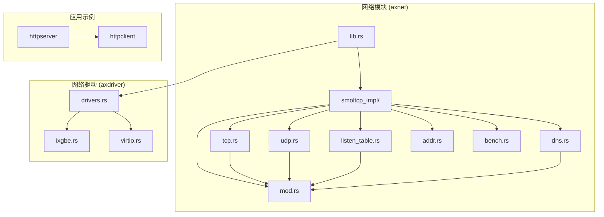

**图表来源**
- [lib.rs](file://arceos/modules/axnet/src/lib.rs#L1-L49)
- [mod.rs](file://arceos/modules/axnet/src/smoltcp_impl/mod.rs#L1-L331)

**章节来源**
- [lib.rs](file://arceos/modules/axnet/src/lib.rs#L1-L49)
- [mod.rs](file://arceos/modules/axnet/src/smoltcp_impl/mod.rs#L1-L331)

## 核心组件

### TCP 套接字 (TcpSocket)

TCP 套接字是网络模块的核心组件之一，提供了完整的 TCP 连接管理功能：

```mermaid
stateDiagram-v2
[*] --> CLOSED
CLOSED --> BUSY --> CONNECTING --> CONNECTED
CONNECTED --> BUSY --> CLOSED
CLOSED --> BUSY --> LISTENING
LISTENING --> BUSY --> CLOSED
CONNECTING --> CLOSED : 连接失败
CONNECTED --> CLOSED : 关闭连接
LISTENING --> CLOSED : 停止监听
```

**图表来源**
- [tcp.rs](file://arceos/modules/axnet/src/smoltcp_impl/tcp.rs#L16-L27)

### UDP 套接字 (UdpSocket)

UDP 套接字提供无连接的数据报服务：

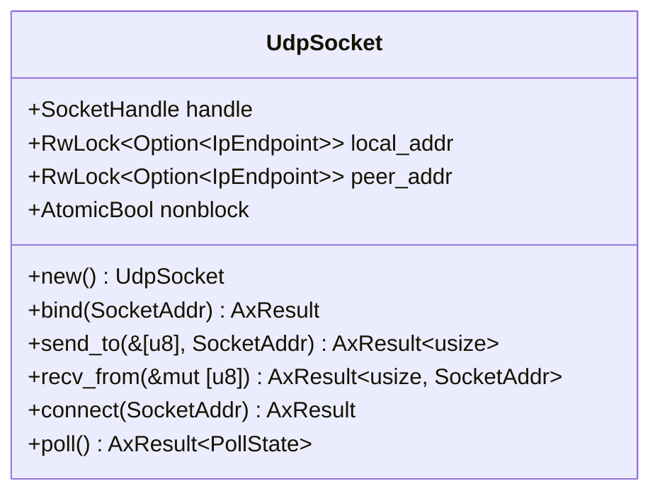

**图表来源**
- [udp.rs](file://arceos/modules/axnet/src/smoltcp_impl/udp.rs#L16-L23)

### 监听表 (ListenTable)

监听表管理 TCP 连接的监听状态和 SYN 队列：

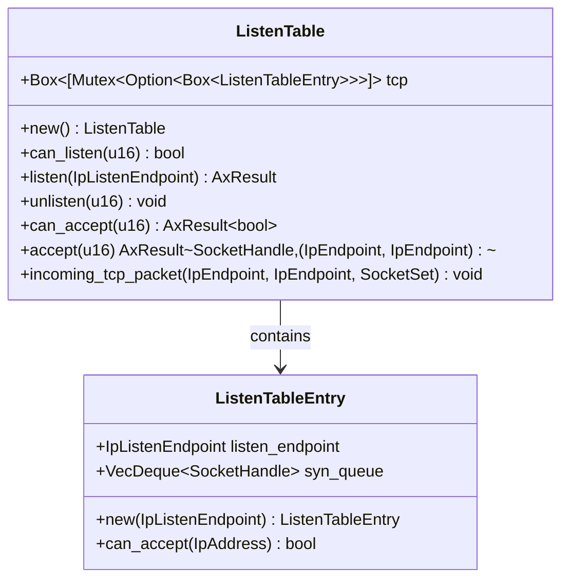

**图表来源**
- [listen_table.rs](file://arceos/modules/axnet/src/smoltcp_impl/listen_table.rs#L44-L156)

**章节来源**
- [tcp.rs](file://arceos/modules/axnet/src/smoltcp_impl/tcp.rs#L1-L528)
- [udp.rs](file://arceos/modules/axnet/src/smoltcp_impl/udp.rs#L1-L295)
- [listen_table.rs](file://arceos/modules/axnet/src/smoltcp_impl/listen_table.rs#L1-L156)

## 架构概览

网络模块采用分层架构设计，从底层到高层依次为：

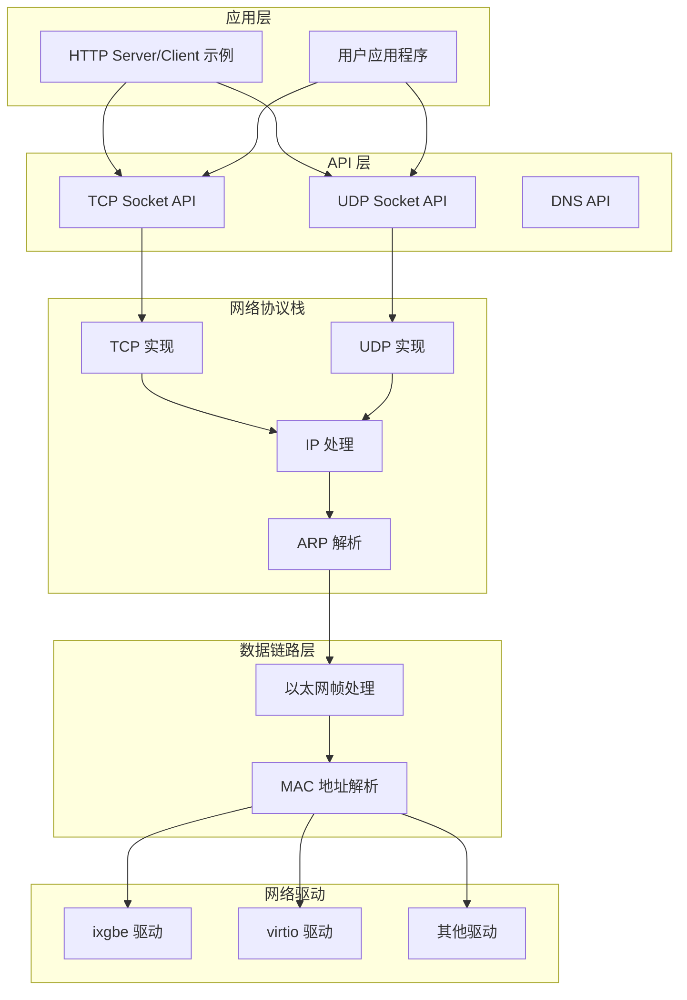

**图表来源**
- [mod.rs](file://arceos/modules/axnet/src/smoltcp_impl/mod.rs#L1-L331)
- [lib.rs](file://arceos/modules/axnet/src/lib.rs#L1-L49)

## 详细组件分析

### TCP 连接建立流程

TCP 连接建立遵循标准的三次握手过程：

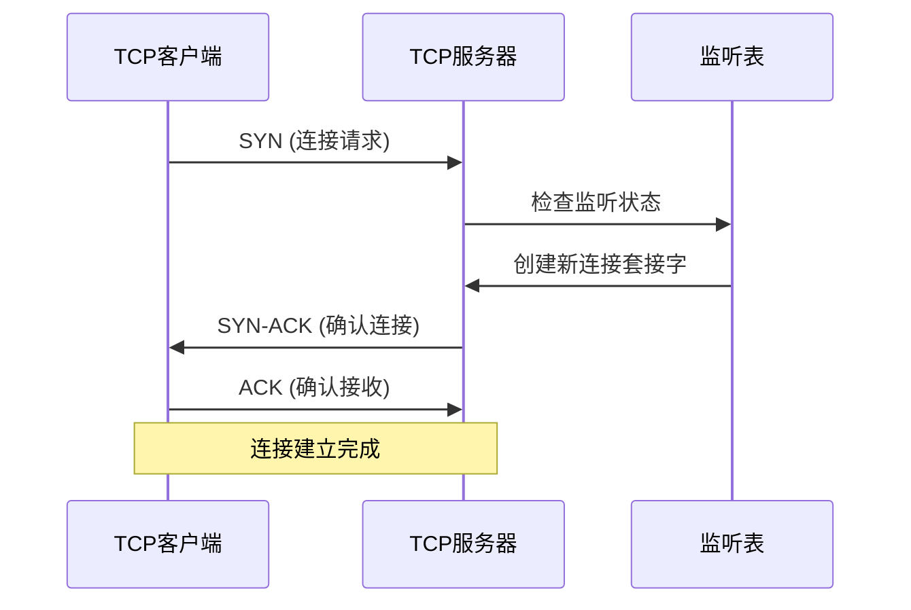

**图表来源**
- [tcp.rs](file://arceos/modules/axnet/src/smoltcp_impl/tcp.rs#L118-L173)
- [listen_table.rs](file://arceos/modules/axnet/src/smoltcp_impl/listen_table.rs#L113-L138)

### 数据包收发机制

网络模块通过 smoltcp 的设备接口实现数据包的收发：

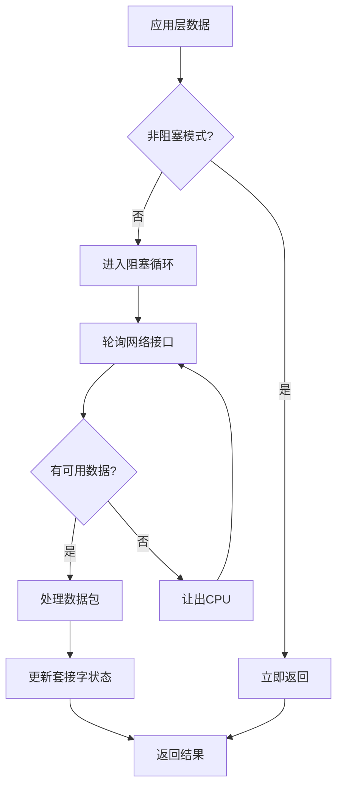

**图表来源**
- [tcp.rs](file://arceos/modules/axnet/src/smoltcp_impl/tcp.rs#L472-L493)
- [udp.rs](file://arceos/modules/axnet/src/smoltcp_impl/udp.rs#L255-L270)

### 套接字状态机

每个套接字都有独立的状态机来管理其生命周期：

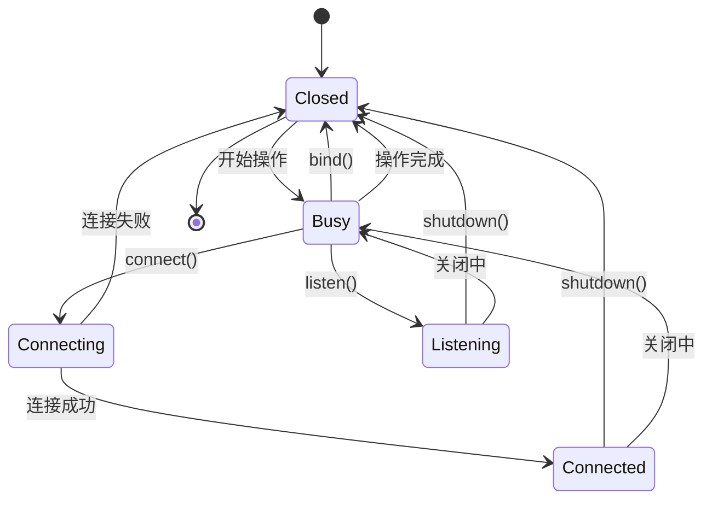

**图表来源**
- [tcp.rs](file://arceos/modules/axnet/src/smoltcp_impl/tcp.rs#L16-L27)

### 缓冲区管理

网络模块使用固定大小的缓冲区来管理数据传输：

| 协议类型 | 接收缓冲区大小 | 发送缓冲区大小 | 最大队列长度 |
|---------|---------------|---------------|-------------|
| TCP | 64KB | 64KB | 无限制 |
| UDP | 64KB | 64KB | 8个数据包 |

**章节来源**
- [mod.rs](file://arceos/modules/axnet/src/smoltcp_impl/mod.rs#L47-L51)
- [tcp.rs](file://arceos/modules/axnet/src/smoltcp_impl/tcp.rs#L75-L97)
- [udp.rs](file://arceos/modules/axnet/src/smoltcp_impl/udp.rs#L38-L50)

## 网络驱动交互

### 网络接口初始化

网络模块通过 `init_network` 函数初始化网络子系统：

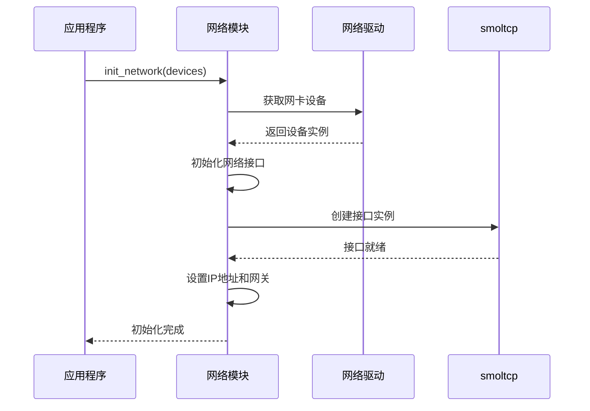

**图表来源**
- [lib.rs](file://arceos/modules/axnet/src/lib.rs#L41-L48)
- [mod.rs](file://arceos/modules/axnet/src/smoltcp_impl/mod.rs#L313-L330)

### 数据链路层通信

网络模块通过设备接口与底层驱动交互：

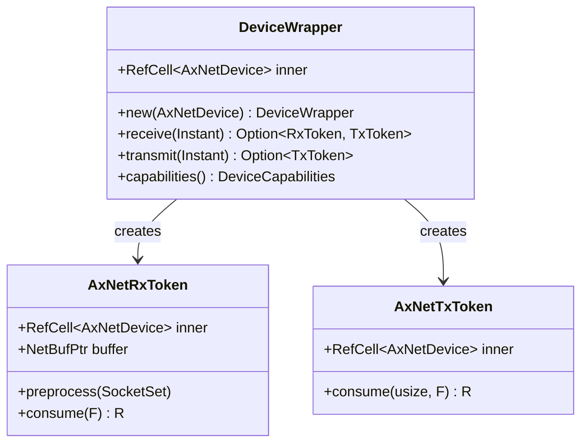

**图表来源**
- [mod.rs](file://arceos/modules/axnet/src/smoltcp_impl/mod.rs#L182-L274)

### 支持的网络驱动

| 驱动类型 | 设备名称 | 特性 | 性能 |
|---------|---------|------|------|
| ixgbe | Intel 82599 | 高性能、多队列 | 10GbE |
| virtio | 虚拟化网卡 | 跨平台、通用 | 可变 |
| 其他 | 自定义驱动 | 可扩展 | 可配置 |

**章节来源**
- [drivers.rs](file://arceos/modules/axdriver/src/drivers.rs#L102-L130)
- [ixgbe.rs](file://arceos/modules/axdriver/src/ixgbe.rs#L1-L39)
- [virtio.rs](file://arceos/modules/axdriver/src/virtio.rs#L1-L140)

## 网络应用开发

### TCP 服务器示例

以下是一个简单的 HTTP 服务器实现：

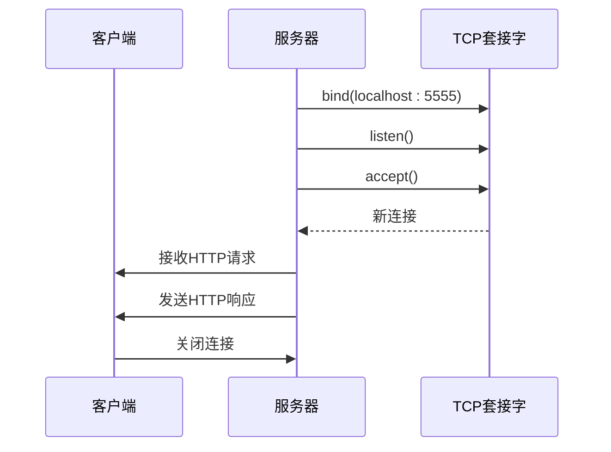

**图表来源**
- [httpserver.rs](file://arceos/examples/httpserver/src/main.rs#L72-L90)

### TCP 客户端示例

TCP 客户端用于发起网络连接：

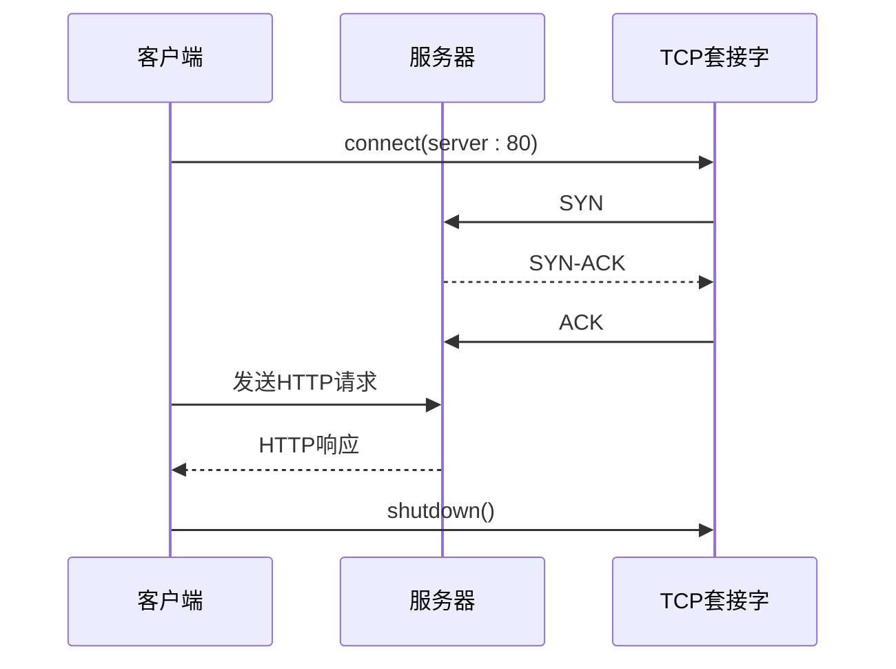

**图表来源**
- [httpclient.rs](file://arceos/examples/httpclient/src/main.rs#L22-L33)

### UDP 通信示例

UDP 套接字适用于无连接的应用场景：

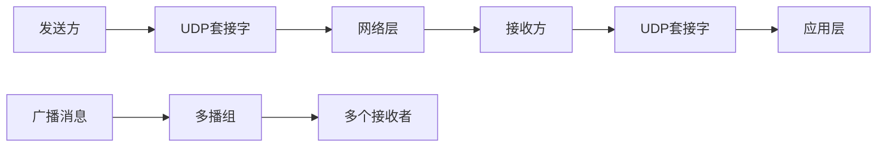

**章节来源**
- [httpserver.rs](file://arceos/examples/httpserver/src/main.rs#L1-L97)
- [httpclient.rs](file://arceos/examples/httpclient/src/main.rs#L1-L41)

## 性能优化与故障诊断

### 网络性能调优

网络模块提供了多种性能优化策略：

| 优化项 | 配置参数 | 默认值 | 优化建议 |
|-------|---------|--------|----------|
| 接收缓冲区 | TCP_RX_BUF_LEN | 64KB | 根据应用需求调整 |
| 发送缓冲区 | TCP_TX_BUF_LEN | 64KB | 根据带宽延迟积调整 |
| SYN队列长度 | LISTEN_QUEUE_SIZE | 512 | 根据并发连接数调整 |
| MTU大小 | STANDARD_MTU | 1500B | 根据网络环境调整 |

### 丢包处理机制

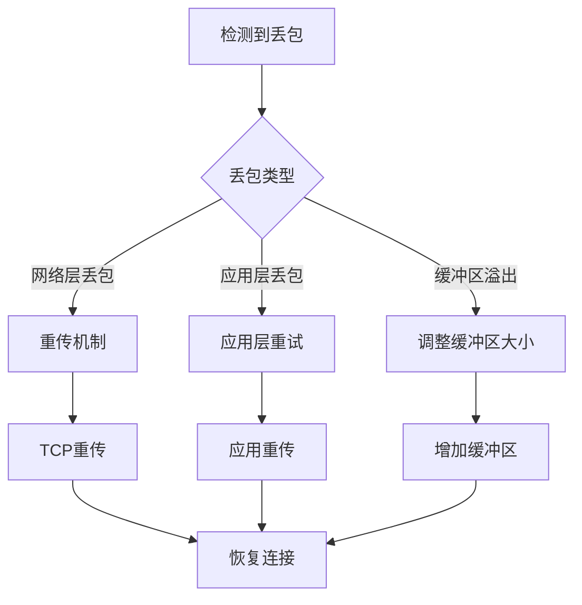

### 常见网络故障诊断

| 故障类型 | 症状 | 可能原因 | 解决方案 |
|---------|------|---------|----------|
| 连接超时 | connect()失败 | 网络不通、防火墙阻止 | 检查网络连通性 |
| 端口冲突 | bind()失败 | 端口被占用 | 更换端口号或释放端口 |
| 缓冲区满 | send()失败 | 发送缓冲区已满 | 增加缓冲区大小或降低发送速率 |
| DNS解析失败 | dns_query()失败 | DNS服务器不可达 | 更换DNS服务器 |

### 性能基准测试

网络模块内置了性能测试工具：

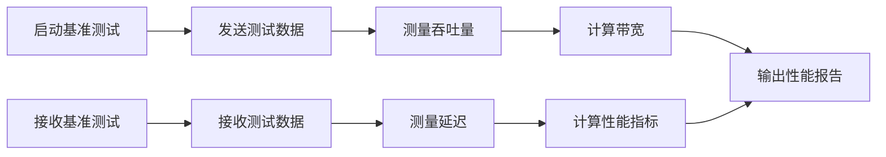

**图表来源**
- [bench.rs](file://arceos/modules/axnet/src/smoltcp_impl/bench.rs#L1-L75)

**章节来源**
- [mod.rs](file://arceos/modules/axnet/src/smoltcp_impl/mod.rs#L47-L51)
- [bench.rs](file://arceos/modules/axnet/src/smoltcp_impl/bench.rs#L1-L75)

## 总结

oscamp 的网络模块（axnet）提供了一个完整、可靠的网络通信解决方案。通过基于 smoltcp 的协议栈实现，结合灵活的驱动接口，该模块能够支持多种网络应用场景。

### 主要优势

1. **可靠性**：基于成熟的 smoltcp 协议栈，确保网络通信的稳定性
2. **灵活性**：支持多种网络驱动，适应不同的硬件平台
3. **易用性**：提供简洁的 API 接口，便于应用开发
4. **可扩展性**：模块化设计，易于添加新的功能和特性

### 技术特点

- 分层架构设计，职责清晰
- 异步 I/O 支持，提高并发性能
- 完整的错误处理机制
- 内置性能监控和调试工具

该网络模块为 oscamp 提供了坚实的网络基础设施，支持各种网络应用的开发和部署，是操作系统网络功能的重要组成部分。