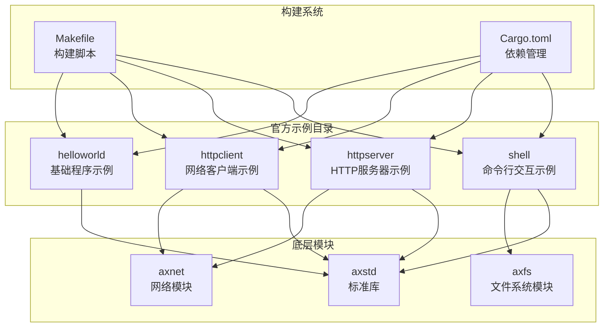
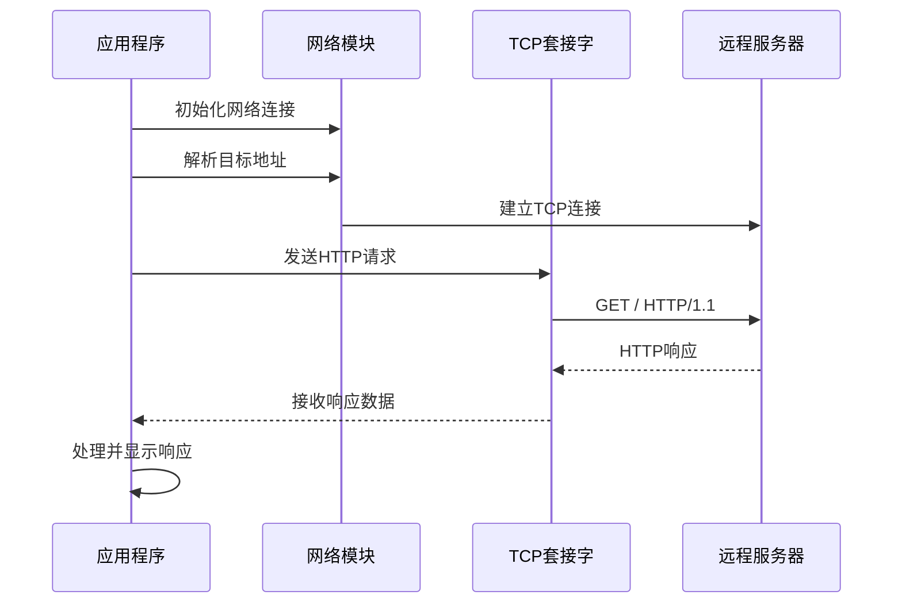
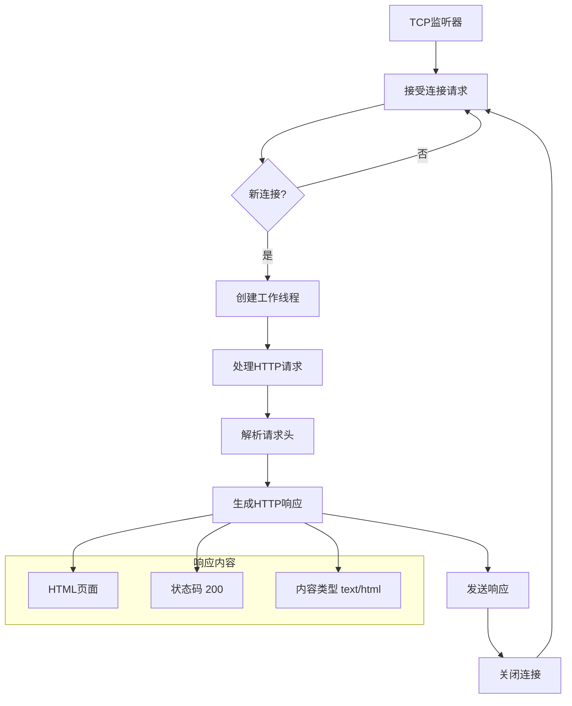
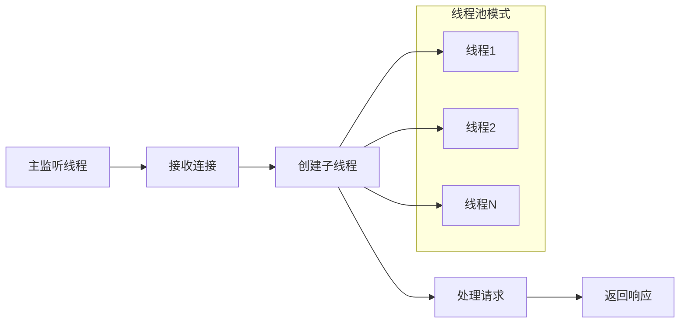
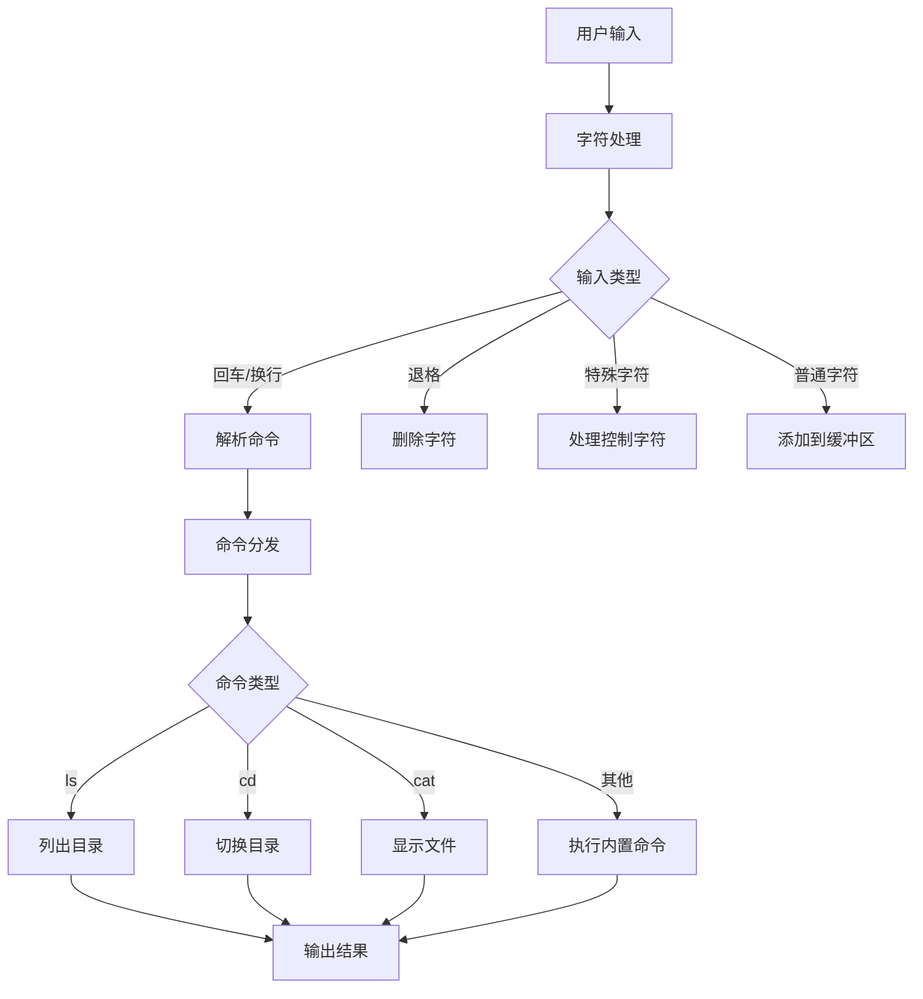
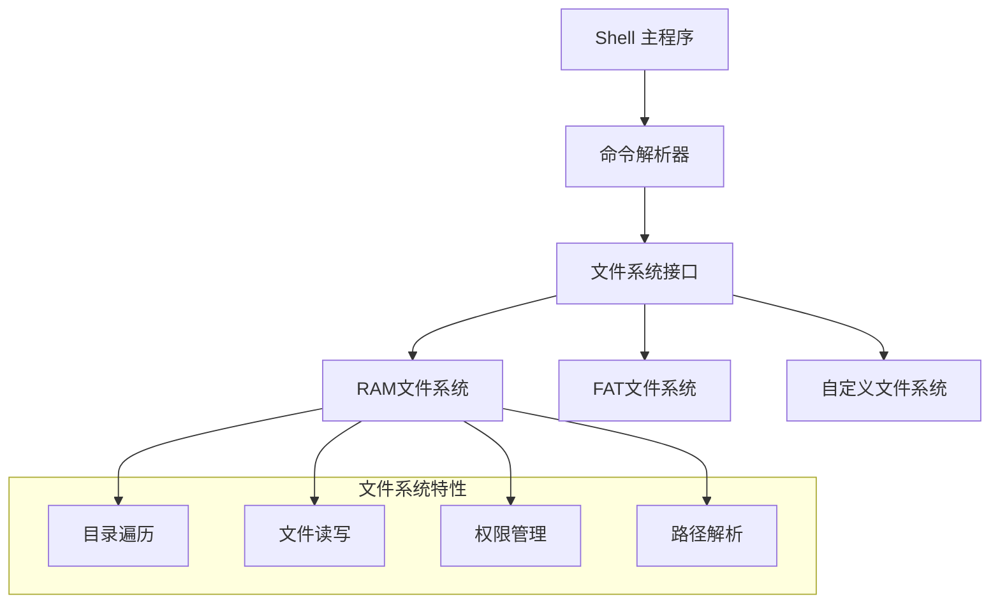
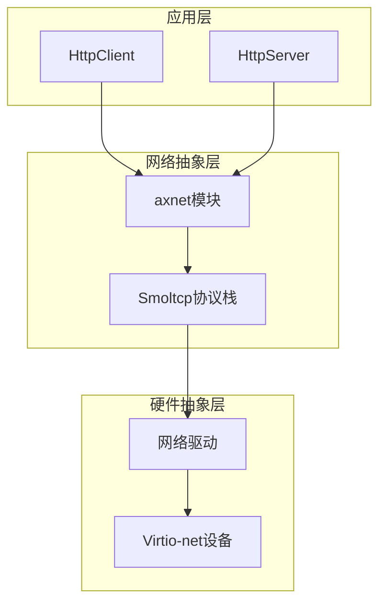
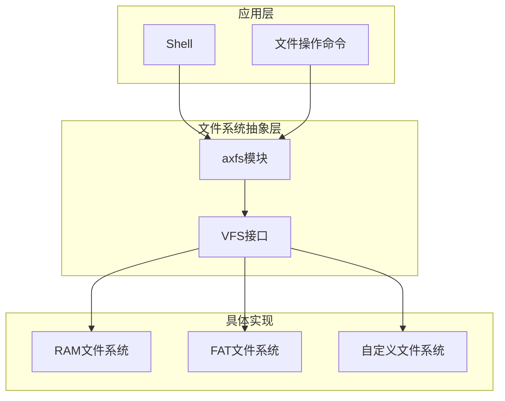
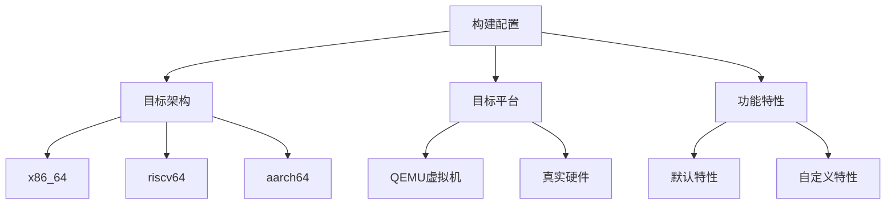

# 官方示例概览

<cite>
**本文档中引用的文件**
- [helloworld/main.rs](file://arceos/examples/helloworld/src/main.rs)
- [helloworld/Cargo.toml](file://arceos/examples/helloworld/Cargo.toml)
- [httpclient/main.rs](file://arceos/examples/httpclient/src/main.rs)
- [httpclient/Cargo.toml](file://arceos/examples/httpclient/Cargo.toml)
- [httpserver/main.rs](file://arceos/examples/httpserver/src/main.rs)
- [httpserver/Cargo.toml](file://arceos/examples/httpserver/Cargo.toml)
- [shell/main.rs](file://arceos/examples/shell/src/main.rs)
- [shell/Cargo.toml](file://arceos/examples/shell/Cargo.toml)
- [shell/cmd.rs](file://arceos/examples/shell/src/cmd.rs)
- [shell/ramfs.rs](file://arceos/examples/shell/src/ramfs.rs)
- [Makefile](file://arceos/Makefile)
- [axnet/mod.rs](file://arceos/modules/axnet/src/smoltcp_impl/mod.rs)
- [axfs/fs.rs](file://arceos/modules/axfs/src/fs/mod.rs)
- [axfs/fs.rs](file://arceos/modules/axfs/src/fs/myfs.rs)
</cite>

## 目录
1. [简介](#简介)
2. [项目结构概述](#项目结构概述)
3. [核心示例详解](#核心示例详解)
4. [系统架构集成](#系统架构集成)
5. [构建和运行指南](#构建和运行指南)
6. [扩展开发指南](#扩展开发指南)
7. [故障排除](#故障排除)
8. [总结](#总结)

## 简介

ArceOS 是一个现代化的系统操作系统，提供了丰富的官方示例来展示其核心功能和设计理念。本文档重点介绍四个核心示例：helloworld、httpclient、httpserver 和 shell，这些示例分别展示了基础构建验证、网络客户端功能、轻量级 HTTP 服务和基础命令行交互能力。

每个示例都经过精心设计，不仅能够独立运行，更重要的是它们展示了 ArceOS 底层模块的集成方式，为开发者提供了学习和扩展的基础。

## 项目结构概述

ArceOS 的示例组织在 `arceos/examples/` 目录下，采用模块化设计，每个示例都是独立的可执行程序：



**图表来源**
- [Makefile](file://arceos/Makefile#L1-L50)
- [helloworld/Cargo.toml](file://arceos/examples/helloworld/Cargo.toml#L1-L11)
- [httpclient/Cargo.toml](file://arceos/examples/httpclient/Cargo.toml#L1-L15)

## 核心示例详解

### HelloWorld 示例

HelloWorld 示例是最基础的程序示例，用于验证 ArceOS 的基本构建和运行环境。

#### 设计目的
- 验证 Rust 工具链和 ArceOS 构建系统的正确性
- 展示最小化的程序结构和入口点定义
- 作为其他复杂示例的基础模板

#### 代码结构分析

```mermaid
flowchart TD
A[程序入口] --> B[条件编译检查]
B --> C{是否启用 axstd?}
C --> |是| D[导入 axstd::println]
C --> |否| E[使用标准 println]
D --> F[定义 main 函数]
E --> F
F --> G[输出 "Hello, world!"]
G --> H[程序结束]
```

**图表来源**
- [helloworld/main.rs](file://arceos/examples/helloworld/src/main.rs#L1-L11)

#### 关键特性
- 条件编译支持：通过 `#![cfg_attr(feature = "axstd", no_std)]` 支持无标准库模式
- 跨平台兼容：适用于不同的目标架构
- 最小化依赖：仅包含必要的功能组件

**章节来源**
- [helloworld/main.rs](file://arceos/examples/helloworld/src/main.rs#L1-L11)
- [helloworld/Cargo.toml](file://arceos/examples/helloworld/Cargo.toml#L1-L11)

### HttpClient 示例

HttpClient 示例展示了 ArceOS 的网络客户端功能，实现了简单的 HTTP 请求发送和响应处理。

#### 设计目的
- 展示 TCP 网络编程能力
- 演示 DNS 解析和地址解析
- 提供网络通信的基础实现模式

#### 代码架构分析



**图表来源**
- [httpclient/main.rs](file://arceos/examples/httpclient/src/main.rs#L22-L33)

#### 功能特性
- 自适应目标地址：根据 DNS 特性自动选择 IP 地址或域名
- HTTP 协议支持：实现基本的 HTTP GET 请求
- 错误处理：完善的 I/O 错误处理机制
- 缓冲区管理：使用固定大小缓冲区处理网络数据

#### 网络特性配置

| 特性 | 描述 | 默认值 | 可选值 |
|------|------|--------|--------|
| DNS 支持 | 是否启用域名解析 | 根据特性决定 | `dns` 启用，无 `dns` 禁用 |
| 目标地址 | HTTP 服务器地址 | `ident.me:80` | 可自定义 |
| 请求方法 | HTTP 请求方法 | GET | 支持扩展 |
| 响应处理 | 响应数据处理 | UTF-8 字符串 | 可扩展 |

**章节来源**
- [httpclient/main.rs](file://arceos/examples/httpclient/src/main.rs#L1-L41)
- [httpclient/Cargo.toml](file://arceos/examples/httpclient/Cargo.toml#L1-L15)

### HttpServer 示例

HttpServer 示例实现了一个轻量级的 HTTP 服务器，展示了并发处理和请求响应的完整流程。

#### 设计目的
- 展示多线程并发处理能力
- 演示 HTTP 协议的服务器端实现
- 提供 Web 服务的基础框架

#### 服务器架构分析



**图表来源**
- [httpserver/main.rs](file://arceos/examples/httpserver/src/main.rs#L72-L90)

#### 并发处理机制



**图表来源**
- [httpserver/main.rs](file://arceos/examples/httpserver/src/main.rs#L80-L84)

#### 服务器特性

| 组件 | 功能 | 实现细节 |
|------|------|----------|
| 监听器 | 监听指定端口 | `0.0.0.0:5555` |
| 连接处理 | 处理并发连接 | 每连接一个线程 |
| 请求解析 | 解析HTTP请求 | 基于缓冲区读取 |
| 响应生成 | 生成HTTP响应 | 固定HTML内容 |
| 日志记录 | 连接状态跟踪 | 可配置的日志级别 |

**章节来源**
- [httpserver/main.rs](file://arceos/examples/httpserver/src/main.rs#L1-L97)
- [httpserver/Cargo.toml](file://arceos/examples/httpserver/Cargo.toml#L1-L11)

### Shell 示例

Shell 示例提供了基础的命令行交互界面，集成了文件系统操作和命令处理功能。

#### 设计目的
- 展示命令行界面的实现
- 提供文件系统操作的基础工具
- 演示用户交互和输入处理

#### 命令处理架构



**图表来源**
- [shell/main.rs](file://arceos/examples/shell/src/main.rs#L54-L84)
- [shell/cmd.rs](file://arceos/examples/shell/src/cmd.rs#L275-L287)

#### 内置命令功能表

| 命令 | 功能 | 参数 | 示例 |
|------|------|------|------|
| `ls` | 列出目录内容 | [路径] | `ls /` |
| `cd` | 切换当前目录 | 路径 | `cd /home` |
| `pwd` | 显示当前路径 | 无 | `pwd` |
| `cat` | 显示文件内容 | 文件名 | `cat readme.txt` |
| `mkdir` | 创建目录 | 目录名 | `mkdir newdir` |
| `rm` | 删除文件/目录 | [-d] 文件名 | `rm file.txt` |
| `echo` | 输出文本 | 文本 >文件 | `echo Hello >test.txt` |
| `uname` | 显示系统信息 | 无 | `uname` |
| `help` | 显示帮助 | 无 | `help` |
| `exit` | 退出程序 | 无 | `exit` |

#### 文件系统集成



**图表来源**
- [shell/ramfs.rs](file://arceos/examples/shell/src/ramfs.rs#L1-L16)
- [shell/Cargo.toml](file://arceos/examples/shell/Cargo.toml#L9-L12)

**章节来源**
- [shell/main.rs](file://arceos/examples/shell/src/main.rs#L1-L86)
- [shell/cmd.rs](file://arceos/examples/shell/src/cmd.rs#L1-L294)
- [shell/Cargo.toml](file://arceos/examples/shell/Cargo.toml#L1-L18)

## 系统架构集成

ArceOS 的示例不仅仅是独立的程序，它们深度集成了底层操作系统模块，展示了完整的系统架构。

### 网络模块集成 (axnet)

所有涉及网络功能的示例都依赖于 `axnet` 模块，该模块基于 smoltcp 实现了完整的网络协议栈。



**图表来源**
- [axnet/mod.rs](file://arceos/modules/axnet/src/smoltcp_impl/mod.rs#L137-L227)

### 文件系统模块集成 (axfs)

Shell 示例展示了文件系统的完整集成，包括多种文件系统类型的统一接口。



**图表来源**
- [axfs/fs.rs](file://arceos/modules/axfs/src/fs/mod.rs#L1-L13)
- [axfs/fs.rs](file://arceos/modules/axfs/src/fs/myfs.rs#L1-L16)

### 标准库集成 (axstd)

所有示例都使用 `axstd` 作为标准库替代，提供与标准库兼容的 API。

| 模块 | 功能 | 示例 |
|------|------|------|
| `axstd::println` | 格式化输出 | helloworld, httpclient |
| `axstd::net` | 网络编程 | httpclient, httpserver |
| `axstd::fs` | 文件系统操作 | shell |
| `axstd::thread` | 多线程支持 | httpserver |

## 构建和运行指南

### 基本构建命令

ArceOS 使用统一的 Makefile 系统进行构建管理，支持多种目标架构和平台。

#### 基本语法
```bash
make run EXAMPLE=<示例名称>
```

#### 支持的示例
```bash
# 运行 HelloWorld 示例
make run EXAMPLE=helloworld

# 运行 HTTP 客户端示例  
make run EXAMPLE=httpclient

# 运行 HTTP 服务器示例
make run EXAMPLE=httpserver

# 运行 Shell 示例
make run EXAMPLE=shell
```

### 平台和架构配置



**图表来源**
- [Makefile](file://arceos/Makefile#L1-L50)

#### 平台配置选项

| 参数 | 描述 | 默认值 | 示例 |
|------|------|--------|------|
| `ARCH` | 目标架构 | riscv64 | x86_64, aarch64 |
| `PLATFORM` | 目标平台 | 自动检测 | x86_64-qemu-q35 |
| `SMP` | 多处理器数量 | 1 | 2, 4, 8 |
| `MODE` | 构建模式 | release | debug |
| `LOG` | 日志级别 | warn | info, debug, trace |

### 特性配置

不同示例支持不同的特性组合，可以通过 Cargo 特性系统进行定制。

#### HttpServer 特性
```bash
# 启用多线程特性
make run EXAMPLE=httpserver FEATURES=multitask

# 启用DNS解析特性
make run EXAMPLE=httpclient FEATURES=dns
```

#### Shell 特性
```bash
# 启用RAM文件系统
make run EXAMPLE=shell FEATURES=use-ramfs
```

**章节来源**
- [Makefile](file://arceos/Makefile#L1-L200)

## 扩展开发指南

### 修改和扩展示例

#### HelloWorld 扩展示例
```rust
// 添加新的功能模块
#![cfg_attr(feature = "axstd", no_std)]
#![cfg_attr(feature = "axstd", no_main)]

#[cfg(feature = "axstd")]
use axstd::println;

#[cfg_attr(feature = "axstd", no_mangle)]
fn main() {
    println!("Hello, ArceOS!");
    
    // 新增功能：环境变量访问
    #[cfg(feature = "axstd")]
    {
        if let Some(value) = std::env::var("MY_VAR") {
            println!("MY_VAR: {}", value);
        }
    }
    
    // 新增功能：时间获取
    #[cfg(feature = "axstd")]
    {
        use std::time::SystemTime;
        if let Ok(time) = SystemTime::now().duration_since(SystemTime::UNIX_EPOCH) {
            println!("Seconds since epoch: {}", time.as_secs());
        }
    }
}
```

#### HttpServer 扩展示例
```rust
// 支持更多HTTP方法
fn http_server(mut stream: TcpStream) -> io::Result<()> {
    let mut buf = [0u8; 4096];
    let len = stream.read(&mut buf)?;
    
    // 解析请求行
    let request = core::str::from_utf8(&buf[..len]).unwrap();
    let lines: Vec<&str> = request.lines().collect();
    
    if lines.is_empty() {
        return Ok(());
    }
    
    let request_line = lines[0];
    let parts: Vec<&str> = request_line.split_whitespace().collect();
    
    if parts.len() >= 2 {
        match parts[0] {
            "GET" => handle_get(&parts[1], &mut stream),
            "POST" => handle_post(&lines, &mut stream),
            "PUT" => handle_put(&parts[1], &lines, &mut stream),
            "DELETE" => handle_delete(&parts[1], &mut stream),
            _ => send_error(&mut stream, 405), // Method Not Allowed
        }
    } else {
        send_error(&mut stream, 400) // Bad Request
    }
    
    Ok(())
}

// 处理GET请求
fn handle_get(path: &str, stream: &mut TcpStream) -> io::Result<()> {
    // 实现文件服务逻辑
    let content = match path {
        "/" => "<html><body><h1>Welcome to ArceOS</h1></body></html>",
        "/about" => "<html><body><h1>About Page</h1></body></html>",
        _ => {
            // 尝试从文件系统读取
            if let Ok(content) = std::fs::read_to_string(path.trim_start_matches('/')) {
                content
            } else {
                send_error(stream, 404);
                return Ok(());
            }
        }
    };
    
    let response = format!(header!(), content.len(), content);
    stream.write_all(response.as_bytes())
}

// 处理POST请求
fn handle_post(lines: &[&str], stream: &mut TcpStream) -> io::Result<()> {
    // 解析Content-Length
    let mut content_length = 0;
    for line in lines.iter().skip(1) {
        if line.starts_with("Content-Length:") {
            content_length = line[15..].trim().parse().unwrap_or(0);
            break;
        }
    }
    
    // 读取请求体
    let body_start = lines.iter().position(|&line| line.is_empty()).unwrap_or(0) + 1;
    let body = lines[body_start..].join("\n");
    
    // 处理POST数据
    println!("Received POST data: {}", body);
    
    // 返回成功响应
    let response = "HTTP/1.1 200 OK\r\nContent-Type: text/plain\r\nContent-Length: 2\r\n\r\nOK";
    stream.write_all(response.as_bytes())
}
```

#### Shell 扩展示例
```rust
// 添加新的内置命令
const CMD_TABLE: &[(&str, CmdHandler)] = &[
    // 现有命令...
    ("grep", do_grep),      // 搜索文本
    ("chmod", do_chmod),    // 修改权限
    ("touch", do_touch),    // 创建空文件
];

// 实现grep命令
fn do_grep(args: &str) {
    let mut args_split = args.split_whitespace();
    let pattern = match args_split.next() {
        Some(p) => p,
        None => {
            print_err!("grep", "missing pattern");
            return;
        }
    };
    
    let files: Vec<&str> = args_split.collect();
    
    if files.is_empty() {
        // 从标准输入读取
        let mut buffer = String::new();
        if let Ok(n) = std::io::stdin().read_to_string(&mut buffer) {
            if n > 0 {
                for (i, line) in buffer.lines().enumerate() {
                    if line.contains(pattern) {
                        println!("{}:{}", i + 1, line);
                    }
                }
            }
        }
        return;
    }
    
    // 处理文件参数
    for file in files {
        if let Ok(content) = std::fs::read_to_string(file) {
            for (i, line) in content.lines().enumerate() {
                if line.contains(pattern) {
                    println!("{}:{}:{}", file, i + 1, line);
                }
            }
        } else {
            print_err!("grep", file, "No such file or directory");
        }
    }
}

// 实现chmod命令
fn do_chmod(args: &str) {
    let mut args_split = args.split_whitespace();
    let mode_str = match args_split.next() {
        Some(m) => m,
        None => {
            print_err!("chmod", "missing mode");
            return;
        }
    };
    
    let mode = match u32::from_str_radix(mode_str, 8) {
        Ok(m) => m,
        Err(_) => {
            print_err!("chmod", "invalid mode");
            return;
        }
    };
    
    for file in args_split {
        if let Err(e) = std::fs::set_permissions(file, std::fs::Permissions::from_mode(mode)) {
            print_err!("chmod", file, e);
        }
    }
}

// 实现touch命令
fn do_touch(args: &str) {
    for file in args.split_whitespace() {
        if let Err(e) = std::fs::OpenOptions::new()
            .write(true)
            .create(true)
            .truncate(true)
            .open(file)
        {
            print_err!("touch", file, e);
        }
    }
}
```

### 性能优化建议

#### HttpServer 优化
```rust
// 连接池实现
struct ConnectionPool {
    pool: Mutex<Vec<TcpStream>>,
    max_size: usize,
}

impl ConnectionPool {
    fn new(max_size: usize) -> Self {
        Self {
            pool: Mutex::new(Vec::with_capacity(max_size)),
            max_size,
        }
    }
    
    fn get_connection(&self) -> Option<TcpStream> {
        self.pool.lock().pop()
    }
    
    fn return_connection(&self, conn: TcpStream) {
        let mut pool = self.pool.lock();
        if pool.len() < self.max_size {
            pool.push(conn);
        }
    }
}

// 实现连接复用
fn http_server(mut stream: TcpStream) -> io::Result<()> {
    let mut buf = [0u8; 4096];
    let len = stream.read(&mut buf)?;
    
    // 检查是否支持Keep-Alive
    let keep_alive = check_keep_alive(&buf);
    
    // 处理请求...
    
    if keep_alive {
        // 将连接放回池中
        CONNECTION_POOL.return_connection(stream);
    }
    
    Ok(())
}
```

#### Shell 输入优化
```rust
// 实现命令历史功能
struct CommandHistory {
    history: Mutex<Vec<String>>,
    max_size: usize,
}

impl CommandHistory {
    fn new(max_size: usize) -> Self {
        Self {
            history: Mutex::new(Vec::with_capacity(max_size)),
            max_size,
        }
    }
    
    fn add_command(&self, cmd: &str) {
        let mut history = self.history.lock();
        if history.last() != Some(&cmd.to_string()) {
            history.push(cmd.to_string());
            if history.len() > self.max_size {
                history.remove(0);
            }
        }
    }
    
    fn get_previous(&self, current: &str) -> Option<String> {
        let history = self.history.lock();
        let index = history.iter().position(|cmd| cmd == current);
        
        index.and_then(|i| {
            if i > 0 {
                Some(history[i - 1].clone())
            } else {
                None
            }
        })
    }
}

// 实现Tab补全
fn tab_completion(input: &str, history: &CommandHistory) -> Vec<String> {
    let mut completions = Vec::new();
    
    // 基于现有命令的补全
    for &(cmd, _) in CMD_TABLE {
        if cmd.starts_with(input) {
            completions.push(cmd.to_string());
        }
    }
    
    // 基于文件系统的补全
    if let Some(last_space) = input.rfind(' ') {
        let dir_path = &input[last_space + 1..];
        if let Ok(entries) = std::fs::read_dir(dir_path) {
            for entry in entries.filter_map(Result::ok) {
                if let Ok(name) = entry.file_name().into_string() {
                    completions.push(format!("{}{}", input, name));
                }
            }
        }
    }
    
    completions
}
```

## 故障排除

### 常见问题及解决方案

#### 构建问题

| 问题 | 原因 | 解决方案 |
|------|------|----------|
| `toolchain not found` | Rust 工具链未安装 | 运行 `rustup install nightly` |
| `target not found` | 目标架构未配置 | 检查 `rust-toolchain.toml` |
| `feature not found` | 特性依赖缺失 | 安装相关依赖包 |

#### 运行时问题

| 问题 | 症状 | 解决方案 |
|------|------|----------|
| 网络连接失败 | HTTP 客户端超时 | 检查网络配置和防火墙设置 |
| 文件系统错误 | 文件操作失败 | 验证文件系统特性配置 |
| 内存不足 | 程序崩溃 | 增加内存限制或优化内存使用 |

#### 调试技巧

```bash
# 启用详细日志
make run EXAMPLE=httpserver LOG=debug

# 使用调试模式构建
make run EXAMPLE=shell MODE=debug

# 启用断点调试
make debug EXAMPLE=shell
```

### 性能监控

```bash
# 监控网络性能
make run EXAMPLE=httpclient NET_DUMP=y

# 监控文件系统性能
make run EXAMPLE=shell LOG=trace

# 性能基准测试
ab -n 5000 -c 20 http://localhost:5555/
```

## 总结

ArceOS 的官方示例系统为开发者提供了全面的学习和开发平台。通过 helloworld、httpclient、httpserver 和 shell 四个核心示例，开发者可以：

1. **掌握基础技能**：从最简单的程序开始，逐步深入系统开发
2. **理解架构设计**：通过实际示例了解模块间的集成方式
3. **学习最佳实践**：借鉴示例中的代码模式和设计思路
4. **扩展开发能力**：基于示例进行二次开发和功能扩展

这些示例不仅是学习工具，更是生产级别的参考实现，展示了现代操作系统开发的最佳实践。随着 ArceOS 的不断发展，这些示例也将持续演进，为开发者提供更丰富的学习资源。

通过深入理解和实践这些示例，开发者能够更好地掌握 ArceOS 的核心概念，为构建复杂的系统应用程序奠定坚实基础。