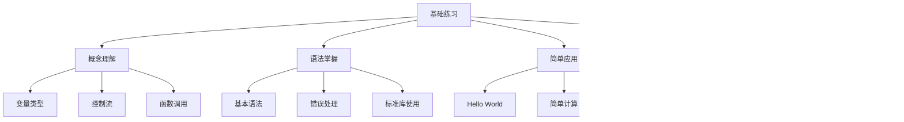
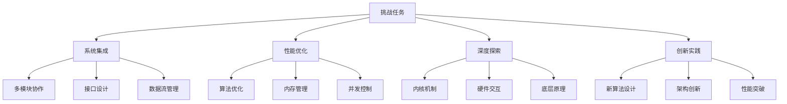
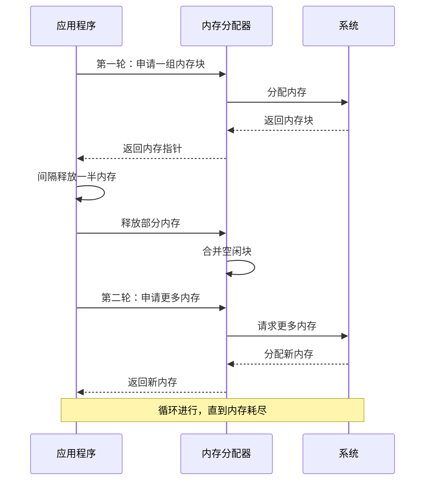
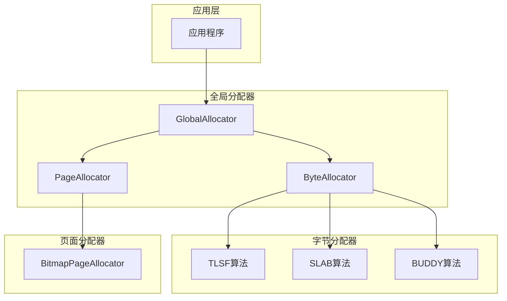
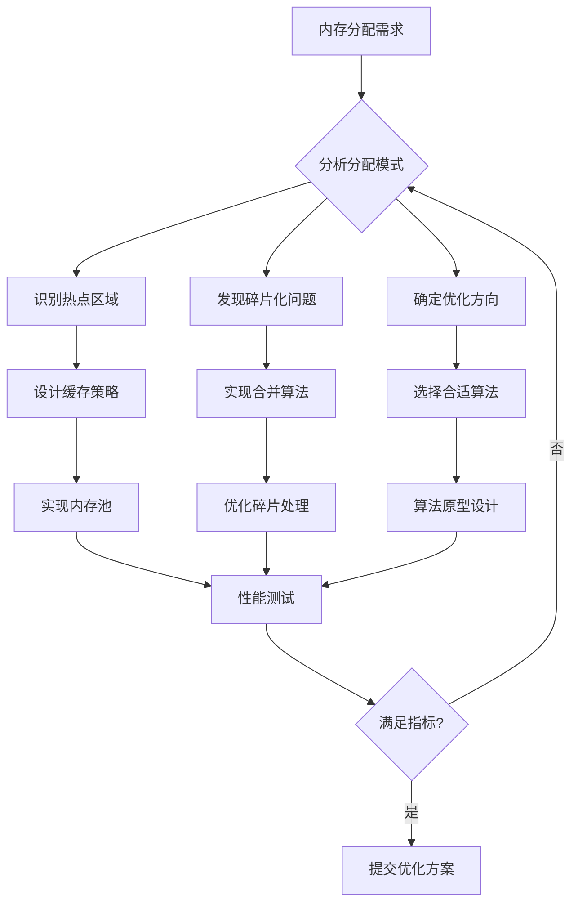
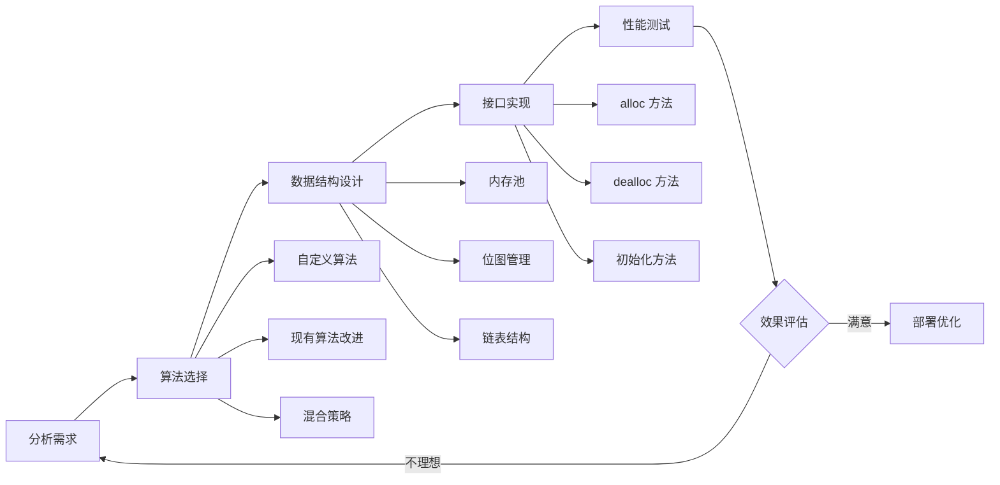
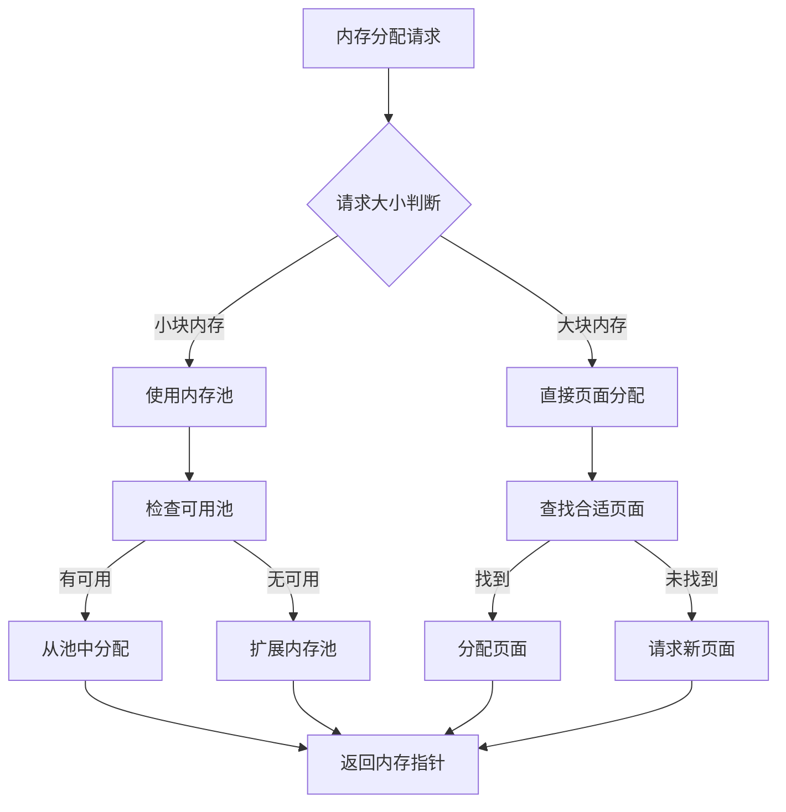
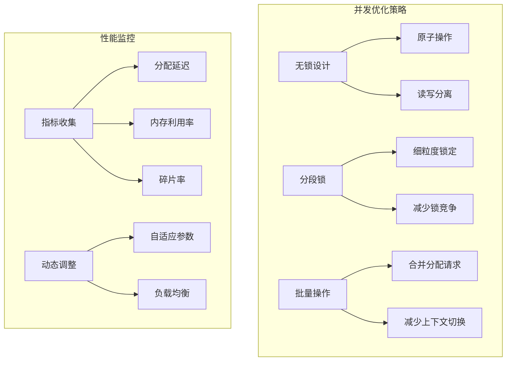

# 挑战任务说明

<cite>
**本文档中引用的文件**
- [challenges/README.md](file://challenges/README.md)
- [challenges/lab1.md](file://challenges/lab1.md)
- [arceos/README.md](file://arceos/README.md)
- [arceos/modules/axalloc/src/lib.rs](file://arceos/modules/axalloc/src/lib.rs)
- [arceos/modules/axalloc/src/page.rs](file://arceos/modules/axalloc/src/page.rs)
- [arceos/modules/axtask/src/lib.rs](file://arceos/modules/axtask/src/lib.rs)
- [arceos/modules/axtask/src/api.rs](file://arceos/modules/axtask/src/api.rs)
- [arceos/modules/axtask/src/run_queue.rs](file://arceos/modules/axtask/src/run_queue.rs)
- [arceos/exercises/print_with_color/src/main.rs](file://arceos/exercises/print_with_color/src/main.rs)
- [arceos/exercises/alt_alloc/src/main.rs](file://arceos/exercises/alt_alloc/src/main.rs)
- [arceos/exercises/support_hashmap/src/main.rs](file://arceos/exercises/support_hashmap/src/main.rs)
- [arceos/tour-README.md](file://arceos/tour-README.md)
</cite>

## 目录
1. [引言](#引言)
2. [挑战任务概述](#挑战任务概述)
3. [基础练习与挑战任务的区别](#基础练习与挑战任务的区别)
4. [Lab1 挑战任务详解](#lab1-挑战任务详解)
5. [系统架构分析](#系统架构分析)
6. [解决方案设计框架](#解决方案设计框架)
7. [性能优化策略](#性能优化策略)
8. [实践指导](#实践指导)
9. [评估标准](#评估标准)
10. [总结](#总结)

## 引言

ArceOS 是一个用 Rust 编写的实验性模块化操作系统（或称单体内核）。该项目不仅提供了丰富的基础练习，还设置了具有挑战性的高级任务，旨在帮助学习者深入理解系统级编程和内核开发的精髓。

挑战任务作为进阶实验的重要组成部分，代表了从基础概念到实际应用的跨越。这些任务不仅考验学习者的技术能力，更重要的是培养他们解决复杂系统问题的思维方式和实践能力。

## 挑战任务概述

### 项目定位

挑战任务在 ArceOS 教学体系中占据着承上启下的关键地位：

- **进阶实验平台**：基于基础练习之上，提供更高难度的实践机会
- **真实场景模拟**：通过具体的应用场景，训练解决实际问题的能力
- **创新思维培养**：鼓励学习者突破常规，探索新的解决方案
- **综合能力检验**：全面考察系统设计、算法优化、性能调优等多方面技能

### 核心特点

挑战任务具有以下显著特点：

1. **场景驱动**：每个挑战都基于真实的使用场景
2. **目标明确**：有清晰的性能指标和评估标准
3. **开放性强**：允许多种解决方案，鼓励创新
4. **渐进式难度**：从简单到复杂，循序渐进

**章节来源**
- [challenges/README.md](file://challenges/README.md#L1-L1)
- [arceos/README.md](file://arceos/README.md#L1-L50)

## 基础练习与挑战任务的区别

### 基础练习的特点

基础练习主要面向初学者，注重以下方面：



**图表来源**
- [arceos/exercises/print_with_color/src/main.rs](file://arceos/exercises/print_with_color/src/main.rs#L1-L11)
- [arceos/exercises/alt_alloc/src/main.rs](file://arceos/exercises/alt_alloc/src/main.rs#L1-L27)

### 挑战任务的特点

挑战任务则侧重于：



**图表来源**
- [arceos/modules/axalloc/src/lib.rs](file://arceos/modules/axalloc/src/lib.rs#L39-L97)
- [arceos/modules/axtask/src/lib.rs](file://arceos/modules/axtask/src/lib.rs#L1-L62)

### 具体差异对比

| 方面 | 基础练习 | 挑战任务 |
|------|----------|----------|
| **目标** | 学习基础知识和语法 | 解决复杂系统问题 |
| **难度** | 简单，步骤明确 | 复杂，需要创新思维 |
| **时间投入** | 几分钟到几小时 | 几天到几周 |
| **知识要求** | 单一知识点 | 多个领域知识整合 |
| **评估标准** | 功能正确性 | 性能指标 + 创新性 |
| **工具使用** | 基础 IDE | 高级调试工具 |

**章节来源**
- [arceos/exercises/support_hashmap/src/main.rs](file://arceos/exercises/support_hashmap/src/main.rs#L1-L31)
- [challenges/lab1.md](file://challenges/lab1.md#L1-L50)

## Lab1 挑战任务详解

### 任务背景

Lab1 挑战任务是一个针对特定应用场景优化内存分配器组件的任务。该任务要求学习者深入理解内存分配算法的工作原理，并根据特定的应用需求设计和实现高效的内存分配策略。

### 应用场景分析

任务描述了一个特殊的内存使用模式：



**图表来源**
- [challenges/lab1.md](file://challenges/lab1.md#L11-L15)

### 技术挑战

该任务面临以下技术挑战：

1. **内存碎片化问题**：频繁的分配和释放可能导致内存碎片
2. **性能瓶颈**：需要在大量分配操作中保持高效
3. **内存泄漏风险**：确保所有分配的内存都能被正确释放
4. **边界条件处理**：处理内存不足等各种异常情况

### 现有算法对比

当前 ArceOS 提供了三种内存分配算法：

| 算法 | 特点 | 性能指标 | 适用场景 |
|------|------|----------|----------|
| **TLSF** | 时间快速，空间效率高 | 170 | 通用场景 |
| **SLAB** | 对象池化，减少碎片 | 92 | 小对象频繁分配 |
| **BUDDY** | 简单，内存利用率高 | 94 | 大小固定分配 |

**章节来源**
- [challenges/lab1.md](file://challenges/lab1.md#L99-L104)
- [arceos/modules/axalloc/src/lib.rs](file://arceos/modules/axalloc/src/lib.rs#L26-L36)

## 系统架构分析

### 内存分配器架构

ArceOS 的内存分配器采用两层架构设计：



**图表来源**
- [arceos/modules/axalloc/src/lib.rs](file://arceos/modules/axalloc/src/lib.rs#L49-L53)

### 任务约束分析

任务有以下重要约束：

1. **修改范围限制**：只能修改 `labs/lab_allocator` 组件
2. **接口兼容性**：必须实现标准的内存分配接口
3. **性能要求**：Indicator 计数必须大于 170
4. **稳定性要求**：执行结束时必须是 "Bump: No Memory."

### 关键技术点



**图表来源**
- [challenges/lab1.md](file://challenges/lab1.md#L99-L107)

**章节来源**
- [arceos/modules/axalloc/src/lib.rs](file://arceos/modules/axalloc/src/lib.rs#L1-L234)
- [arceos/modules/axalloc/src/page.rs](file://arceos/modules/axalloc/src/page.rs#L1-L109)

## 解决方案设计框架

### 分析现有代码

在开始设计解决方案之前，需要深入分析现有代码结构：

1. **GlobalAllocator 结构**：
   - 包含两个主要组件：ByteAllocator 和 PageAllocator
   - 支持多种内存分配算法的切换
   - 提供统一的内存管理接口

2. **内存分配流程**：
   - 首先尝试从字节分配器分配
   - 如果失败，则向页面分配器请求更多内存
   - 页面分配器负责大块内存的分配

3. **同步机制**：
   - 使用 SpinNoIrq 锁保护并发访问
   - 确保多线程环境下的安全性

### 设计修改方案

基于对现有系统的理解，可以考虑以下优化策略：



### 实现步骤框架

1. **需求分析阶段**
   - 深入理解应用的内存使用模式
   - 分析现有算法的性能瓶颈
   - 确定优化目标和约束条件

2. **算法设计阶段**
   - 选择合适的内存分配算法
   - 设计数据结构和组织方式
   - 规划接口实现方案

3. **编码实现阶段**
   - 实现核心分配算法
   - 添加必要的辅助功能
   - 确保线程安全性和异常处理

4. **测试验证阶段**
   - 运行基准测试验证性能
   - 检查内存泄漏和错误处理
   - 优化参数和配置

5. **优化迭代阶段**
   - 根据测试结果调整算法
   - 优化关键路径性能
   - 平衡时间和空间效率

**章节来源**
- [arceos/modules/axalloc/src/lib.rs](file://arceos/modules/axalloc/src/lib.rs#L56-L178)

## 性能优化策略

### 内存分配算法优化

针对 Lab1 的特殊需求，可以考虑以下优化策略：

#### 1. 自适应分配策略



#### 2. 碎片化处理优化

- **合并策略**：及时合并相邻的空闲内存块
- **分裂优化**：避免过度分裂导致的碎片
- **预分配**：预先分配一定量的内存以减少系统调用

#### 3. 缓存友好设计

- **局部性利用**：将相关数据放在相邻位置
- **预取优化**：预测未来的内存访问模式
- **缓存行对齐**：确保数据结构按缓存行对齐

### 并发性能优化



### 内存布局优化

针对特定的应用模式，可以优化内存布局：

1. **连续内存分配**：对于频繁使用的内存块，尽量分配连续的物理内存
2. **预分配策略**：根据应用模式预分配常用大小的内存块
3. **对齐优化**：确保内存对齐以提高访问效率

**章节来源**
- [arceos/modules/axtask/src/run_queue.rs](file://arceos/modules/axtask/src/run_queue.rs#L1-L227)

## 实践指导

### 开发环境准备

1. **代码获取**：
   ```bash
   # Fork 项目到个人账户
   # 克隆项目
   git clone https://github.com/yourusername/oscamp.git
   cd oscamp/arceos
   # 切换到 lab1 分支
   git switch lab1
   ```

2. **环境验证**：
   ```bash
   # 运行验证脚本
   ./verify_lab1.sh
   ```

### 开发流程建议

#### 第一阶段：需求分析和算法选择

1. **深入理解应用模式**：
   - 分析内存分配和释放的规律
   - 识别性能瓶颈和优化机会
   - 确定关键的性能指标

2. **算法调研和选择**：
   - 研究现有的内存分配算法
   - 评估各种算法的优缺点
   - 选择最适合当前场景的算法

#### 第二阶段：设计和实现

1. **接口设计**：
   - 确保与现有接口的兼容性
   - 设计清晰的抽象层次
   - 考虑扩展性和维护性

2. **核心算法实现**：
   - 实现内存分配和回收逻辑
   - 添加必要的数据结构
   - 确保线程安全

#### 第三阶段：测试和优化

1. **功能测试**：
   - 运行基本的功能测试
   - 验证内存分配的正确性
   - 检查异常情况的处理

2. **性能测试**：
   - 测量 Indicator 计数
   - 分析性能瓶颈
   - 迭代优化

### 常见问题和解决方案

#### 1. 内存泄漏问题

**症状**：程序运行一段时间后内存持续增长
**解决方案**：
- 仔细检查分配和释放的配对关系
- 使用内存检测工具
- 添加内存使用统计

#### 2. 性能瓶颈

**症状**：Indicator 计数低于预期
**解决方案**：
- 分析热点代码路径
- 优化关键算法
- 减少不必要的系统调用

#### 3. 并发问题

**症状**：多线程环境下出现异常
**解决方案**：
- 确保正确的同步机制
- 避免死锁和竞态条件
- 使用适当的并发原语

### 提交和验证

1. **代码审查**：
   ```bash
   # 确保只修改了 lab_allocator 组件
   git diff 13a8c47 --stat --name-only
   ```

2. **功能验证**：
   ```bash
   # 重新运行验证脚本
   ./verify_lab1.sh
   ```

3. **性能测试**：
   - 确保 Indicator 计数大于 170
   - 验证程序正常终止
   - 检查内存使用情况

**章节来源**
- [challenges/lab1.md](file://challenges/lab1.md#L33-L75)

## 评估标准

### 主要评估指标

挑战任务的评估主要基于以下标准：

#### 1. 性能指标（70%）

- **Indicator 计数**：衡量内存分配效率的核心指标
- **内存利用率**：有效内存占总内存的比例
- **分配延迟**：内存分配操作的平均时间

#### 2. 代码质量（20%）

- **可读性**：代码结构清晰，易于理解
- **可维护性**：良好的注释和文档
- **健壮性**：完善的错误处理和边界检查

#### 3. 创新性（10%）

- **算法创新**：提出了新的或改进的算法
- **优化策略**：采用了独特的优化方法
- **设计思想**：体现了深刻的设计洞察

### 排名规则

1. **优先级**：Indicator 计数 > 提交时间
2. **并列处理**：相同计数按提交时间排序
3. **有效性**：只有 Indicator > 170 的提交才计入排名

### 最佳实践案例

以下是一些成功的优化策略示例：

#### 策略一：混合分配算法
- 小块内存使用 SLAB 算法
- 中等块内存使用 TLSF
- 大块内存直接页面分配

#### 策略二：智能预分配
- 根据历史数据预分配常用大小的内存块
- 使用内存池减少系统调用
- 实现内存压缩和整理

#### 策略三：自适应算法
- 动态调整分配策略
- 根据内存使用模式优化
- 实现负载感知的分配

**章节来源**
- [challenges/lab1.md](file://challenges/lab1.md#L90-L107)

## 总结

挑战任务是 ArceOS 教学体系中的重要组成部分，它不仅检验了学习者的基础知识掌握程度，更重要的是培养了解决复杂系统问题的能力。通过 Lab1 这样的挑战任务，学习者可以：

### 核心收获

1. **深入理解系统架构**：通过实际项目理解操作系统的内部机制
2. **掌握性能优化技巧**：学会分析和优化系统性能
3. **培养创新思维**：面对复杂问题时能够提出创新解决方案
4. **提升工程能力**：从需求分析到产品交付的完整工程经验

### 学习建议

1. **循序渐进**：先完成基础练习，再挑战高级任务
2. **深入思考**：不仅要完成任务，更要理解背后的原理
3. **持续迭代**：不断优化和改进，追求更好的解决方案
4. **交流分享**：与其他学习者交流心得，共同进步

### 未来发展方向

挑战任务的设计理念可以推广到更多的系统级编程领域：

- **网络协议优化**：实现高性能的网络栈
- **存储系统设计**：开发高效的文件系统
- **并发机制创新**：设计新的同步原语
- **虚拟化技术**：实现轻量级的虚拟机监控器

通过参与这样的挑战任务，学习者不仅能够提升技术能力，更重要的是培养了系统性思维和解决复杂问题的能力，这是成为优秀系统程序员的关键素质。

**章节来源**
- [arceos/README.md](file://arceos/README.md#L190-L201)
- [arceos/tour-README.md](file://arceos/tour-README.md#L1-L112)