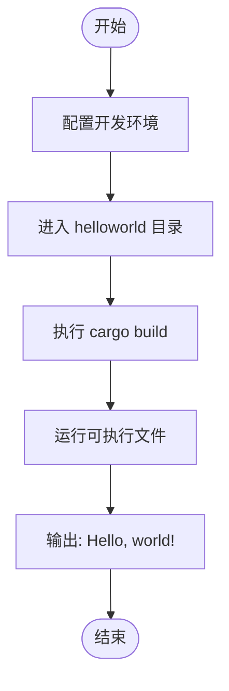
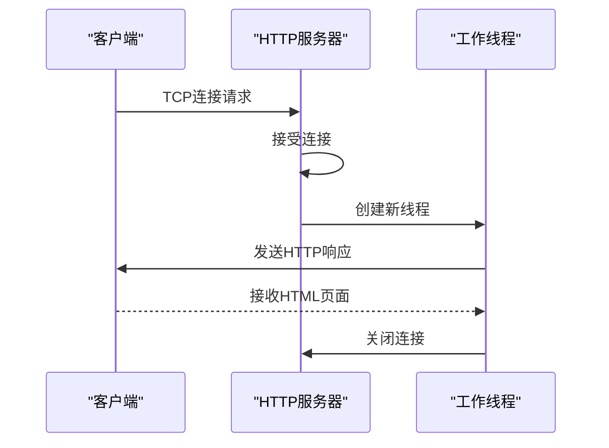
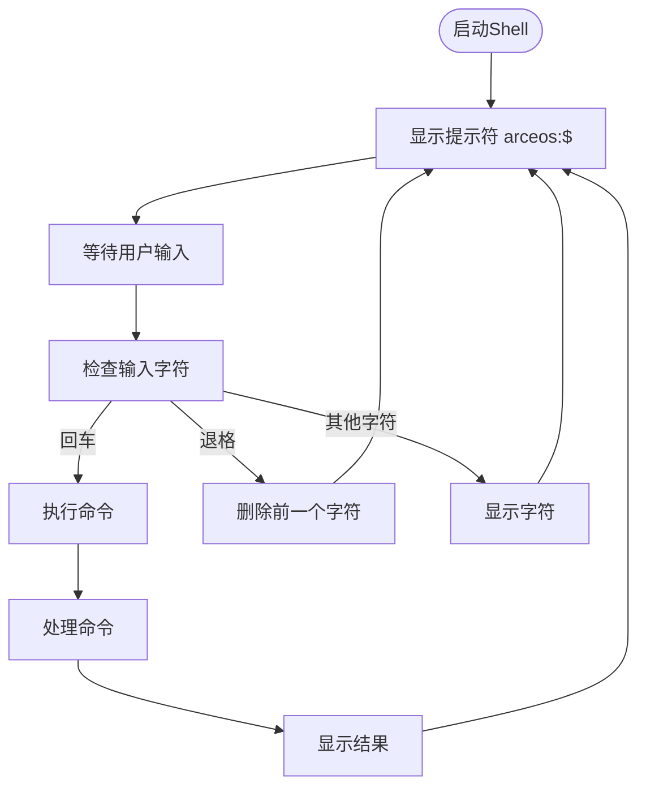
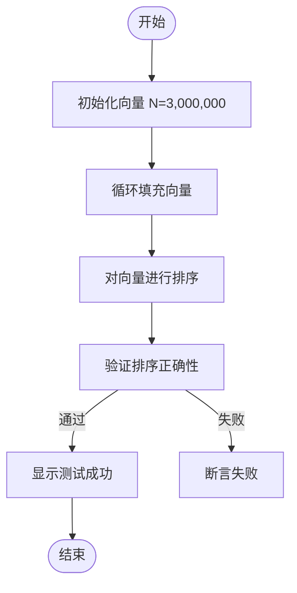
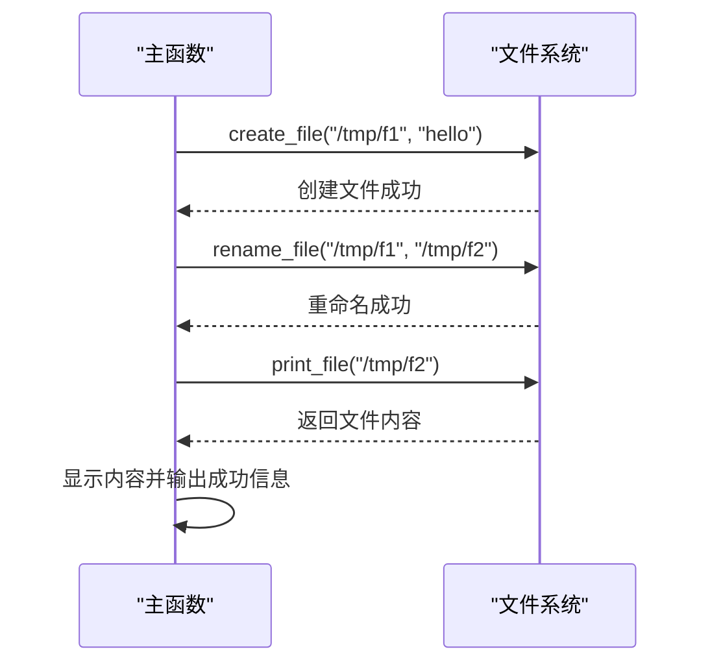
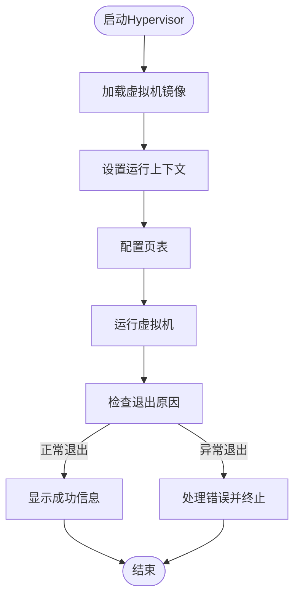
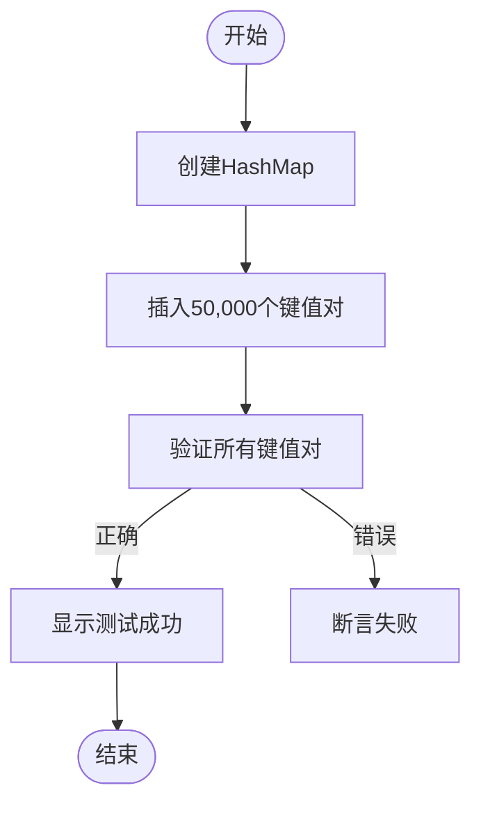

# 示例与练习

<cite>
**本文档中引用的文件**   
- [helloworld/Cargo.toml](file://arceos/examples/helloworld/Cargo.toml)
- [helloworld/src/main.rs](file://arceos/examples/helloworld/src/main.rs)
- [httpserver/Cargo.toml](file://arceos/examples/httpserver/Cargo.toml)
- [httpserver/src/main.rs](file://arceos/examples/httpserver/src/main.rs)
- [shell/Cargo.toml](file://arceos/examples/shell/Cargo.toml)
- [shell/src/main.rs](file://arceos/examples/shell/src/main.rs)
- [alt_alloc/Cargo.toml](file://arceos/exercises/alt_alloc/Cargo.toml)
- [alt_alloc/src/main.rs](file://arceos/exercises/alt_alloc/src/main.rs)
- [print_with_color/Cargo.toml](file://arceos/exercises/print_with_color/Cargo.toml)
- [print_with_color/src/main.rs](file://arceos/exercises/print_with_color/src/main.rs)
- [ramfs_rename/Cargo.toml](file://arceos/exercises/ramfs_rename/Cargo.toml)
- [ramfs_rename/src/main.rs](file://arceos/exercises/ramfs_rename/src/main.rs)
- [simple_hv/Cargo.toml](file://arceos/exercises/simple_hv/Cargo.toml)
- [simple_hv/src/main.rs](file://arceos/exercises/simple_hv/src/main.rs)
- [support_hashmap/Cargo.toml](file://arceos/exercises/support_hashmap/Cargo.toml)
- [support_hashmap/src/main.rs](file://arceos/exercises/support_hashmap/src/main.rs)
- [README.md](file://arceos/README.md)
- [lab1.md](file://challenges/lab1.md)
</cite>

## 目录
1. [简介](#简介)
2. [示例项目](#示例项目)
3. [练习项目](#练习项目)
4. [挑战任务](#挑战任务)
5. [构建与测试指南](#构建与测试指南)
6. [结论](#结论)

## 简介
本文档旨在指导用户通过 ArceOS 项目中的示例、练习和挑战任务来深入理解操作系统原理。文档首先介绍 `examples/` 目录下的官方示例，然后详细说明 `exercises/` 目录下的练习项目，最后介绍 `challenges/` 目录下的挑战任务。通过实践这些项目，用户可以掌握操作系统的核心概念和实现技术。

## 示例项目

### helloworld 示例
`helloworld` 示例是 ArceOS 项目中最基础的入门程序，其主要目的是展示如何在 ArceOS 环境下编写和运行一个简单的 Rust 程序。

**目的与功能**：
- 演示基本的 Rust 程序结构
- 展示如何使用 ArceOS 的标准库（axstd）进行输出
- 验证开发环境的正确配置

**运行方法**：
1. 确保已正确配置 ArceOS 开发环境
2. 进入 `arceos/examples/helloworld` 目录
3. 使用 `cargo build` 命令构建项目
4. 运行生成的可执行文件



**代码分析**：
该示例使用了 `#![cfg_attr(feature = "axstd", no_std)]` 和 `#![cfg_attr(feature = "axstd", no_main)]` 属性，表明这是一个无标准库的 Rust 程序。程序通过 `axstd::println!` 宏输出 "Hello, world!" 字符串。

**示例来源**
- [helloworld/Cargo.toml](file://arceos/examples/helloworld/Cargo.toml#L1-L11)
- [helloworld/src/main.rs](file://arceos/examples/helloworld/src/main.rs#L1-L11)

### httpserver 示例
`httpserver` 示例实现了一个简单的 HTTP 服务器，用于演示网络编程和多线程处理。

**目的与功能**：
- 展示如何在 ArceOS 中实现网络服务
- 演示多线程处理客户端连接
- 提供性能基准测试的参考

**运行方法**：
1. 进入 `arceos/examples/httpserver` 目录
2. 使用 `cargo build` 构建项目
3. 运行服务器
4. 使用 Apache 的 `ab` 工具进行压力测试：
   ```
   ab -n 5000 -c 20 http://X.X.X.X:5555/
   ```

**功能特点**：
- 监听 0.0.0.0:5555 端口
- 返回包含 ArceOS 链接的 HTML 页面
- 使用线程池处理并发连接
- 支持日志输出（通过 LOG 环境变量控制）



**代码分析**：
该示例使用了 `TcpListener` 和 `TcpStream` 来处理网络连接，并通过 `thread::spawn` 创建新线程来处理每个客户端。服务器返回一个预定义的 HTML 页面，展示了 ArceOS 项目的基本信息。

**示例来源**
- [httpserver/Cargo.toml](file://arceos/examples/httpserver/Cargo.toml#L1-L11)
- [httpserver/src/main.rs](file://arceos/examples/httpserver/src/main.rs#L1-L97)

### shell 示例
`shell` 示例实现了一个简单的命令行解释器，用于演示文件系统操作和命令解析。

**目的与功能**：
- 提供一个交互式的命令行界面
- 演示基本的命令解析和执行
- 展示文件系统操作（当启用 ramfs 特性时）

**运行方法**：
1. 进入 `arceos/examples/shell` 目录
2. 使用 `cargo build` 构建项目
3. 运行生成的 shell 程序
4. 输入命令进行交互

**功能特点**：
- 支持基本的命令行编辑（退格键等）
- 显示当前工作目录作为提示符
- 支持 `use-ramfs` 特性，启用内存文件系统功能
- 提供帮助命令



**代码分析**：
该示例实现了基本的命令行处理逻辑，包括字符输入处理、退格键处理和回车键处理。通过 `cmd::run_cmd` 函数调用执行具体的命令。当启用 `use-ramfs` 特性时，可以使用内存文件系统进行文件操作。

**示例来源**
- [shell/Cargo.toml](file://arceos/examples/shell/Cargo.toml#L1-L18)
- [shell/src/main.rs](file://arceos/examples/shell/src/main.rs#L1-L86)

## 练习项目

### alt_alloc 练习
`alt_alloc` 练习旨在测试和验证替代内存分配器的性能和正确性。

**背景知识**：
- 内存分配器是操作系统的核心组件之一
- 不同的分配策略会影响系统性能
- bump allocator 是一种简单的内存分配策略

**实现目标**：
- 验证替代内存分配器的正确性
- 测试大量内存分配和释放的性能
- 验证数据完整性

**关键代码点指引**：
- 使用 `Vec::with_capacity` 预分配大量内存
- 通过循环填充向量并验证排序正确性
- 使用 `assert!` 宏验证数据完整性



**练习来源**
- [alt_alloc/Cargo.toml](file://arceos/exercises/alt_alloc/Cargo.toml#L1-L10)
- [alt_alloc/src/main.rs](file://arceos/exercises/alt_alloc/src/main.rs#L1-L27)

### print_with_color 练习
`print_with_color` 练习演示了如何在 ArceOS 环境下进行带颜色的输出。

**背景知识**：
- 终端颜色输出使用 ANSI 转义序列
- 不同的操作系统和终端对颜色支持有所不同
- 日志输出中使用颜色可以提高可读性

**实现目标**：
- 实现基本的彩色输出功能
- 验证输出格式的正确性
- 学习如何使用 ArceOS 的打印宏

**关键代码点指引**：
- 使用 `println!` 宏进行输出
- 输出包含 "[WithColor]" 前缀的消息
- 验证输出内容的正确性

**练习来源**
- [print_with_color/Cargo.toml](file://arceos/exercises/print_with_color/Cargo.toml#L1-L8)
- [print_with_color/src/main.rs](file://arceos/exercises/print_with_color/src/main.rs#L1-L11)

### ramfs_rename 练习
`ramfs_rename` 练习专注于内存文件系统的重命名操作。

**背景知识**：
- RAM 文件系统是存储在内存中的临时文件系统
- 重命名操作是文件系统的基本功能之一
- 文件系统操作需要考虑原子性和一致性

**实现目标**：
- 实现文件创建、重命名和读取功能
- 验证重命名操作的正确性
- 学习文件系统 API 的使用

**关键代码点指引**：
- `create_file` 函数：创建文件并写入内容
- `rename_file` 函数：重命名文件（不支持跨目录移动）
- `print_file` 函数：读取并显示文件内容
- `process` 函数：按顺序执行文件操作



**练习来源**
- [ramfs_rename/Cargo.toml](file://arceos/exercises/ramfs_rename/Cargo.toml#L1-L17)
- [ramfs_rename/src/main.rs](file://arceos/exercises/ramfs_rename/src/main.rs#L1-L55)

### simple_hv 练习
`simple_hv` 练习实现了一个简单的 RISC-V 虚拟机监控器（Hypervisor）。

**背景知识**：
- 虚拟化技术允许在单个物理机器上运行多个虚拟机
- RISC-V 架构提供了硬件虚拟化支持
- SBI（Supervisor Binary Interface）是 RISC-V 的标准接口

**实现目标**：
- 实现基本的虚拟机监控器功能
- 加载和运行虚拟机镜像
- 处理虚拟机退出事件
- 实现虚拟化相关的 CSR（Control and Status Register）操作

**关键代码点指引**：
- `main` 函数：初始化监控器并加载虚拟机镜像
- `prepare_guest_context` 函数：准备虚拟机运行上下文
- `prepare_vm_pgtable` 函数：设置虚拟机页表
- `vmexit_handler` 函数：处理虚拟机退出事件
- `run_guest` 函数：运行虚拟机并等待退出



**练习来源**
- [simple_hv/Cargo.toml](file://arceos/exercises/simple_hv/Cargo.toml#L1-L19)
- [simple_hv/src/main.rs](file://arceos/exercises/simple_hv/src/main.rs#L1-L147)

### support_hashmap 练习
`support_hashmap` 练习验证了哈希表数据结构在 ArceOS 环境下的正确性。

**背景知识**：
- 哈希表是一种高效的键值存储数据结构
- 内存管理对哈希表性能有重要影响
- 标准库中的 HashMap 实现了高效的哈希算法

**实现目标**：
- 验证 HashMap 的基本操作
- 测试大量键值对的插入和查找性能
- 验证数据完整性

**关键代码点指引**：
- `test_hashmap` 函数：测试哈希表功能
- 使用 `format!` 宏生成键名
- 通过迭代器验证所有键值对的正确性
- 使用 `strip_prefix` 和 `parse` 进行字符串处理



**练习来源**
- [support_hashmap/Cargo.toml](file://arceos/exercises/support_hashmap/Cargo.toml#L1-L8)
- [support_hashmap/src/main.rs](file://arceos/exercises/support_hashmap/src/main.rs#L1-L31)

## 挑战任务
`challenges/` 目录包含更高级的实验任务，旨在挑战用户的操作系统知识和编程技能。

**作用与特点**：
- 作为更高级的实验平台
- 涉及更复杂的操作系统概念
- 需要深入理解 ArceOS 架构
- 鼓励创新和探索

**lab1 挑战**：
- 目标：实现特定的操作系统功能
- 要求：深入理解内存管理、进程调度等核心概念
- 评估：通过一系列测试验证实现的正确性

挑战任务的设计目的是让用户将所学知识应用于更复杂的场景，解决实际的操作系统问题。这些任务通常没有固定的解决方案，鼓励用户探索不同的实现方法。

**挑战来源**
- [lab1.md](file://challenges/lab1.md)

## 构建与测试指南
为了成功构建和测试这些示例与练习项目，请遵循以下指南：

### 构建步骤
1. 确保已安装必要的构建工具（Rust 工具链等）
2. 进入具体项目目录
3. 使用 `cargo build` 命令构建项目
4. 检查构建输出，确保没有错误

### 测试方法
1. 运行生成的可执行文件
2. 验证输出是否符合预期
3. 对于网络相关项目，使用相应的测试工具（如 `ab`）
4. 对于性能敏感的项目，进行基准测试

### 调试技巧
- 使用 `println!` 宏输出调试信息
- 逐步执行代码，验证每个步骤的正确性
- 参考 ArceOS 文档和源代码理解底层实现

## 结论
通过完成这些示例、练习和挑战任务，用户可以系统地学习和掌握操作系统的核心概念和实现技术。从简单的 "Hello World" 程序到复杂的虚拟机监控器，这些项目提供了循序渐进的学习路径。建议用户按照从简单到复杂的顺序完成这些项目，并在实践中不断深化对操作系统原理的理解。