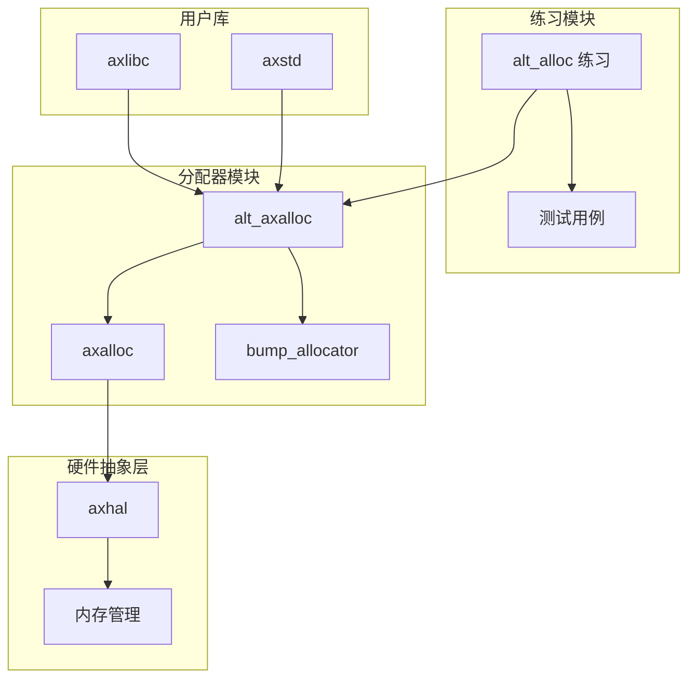
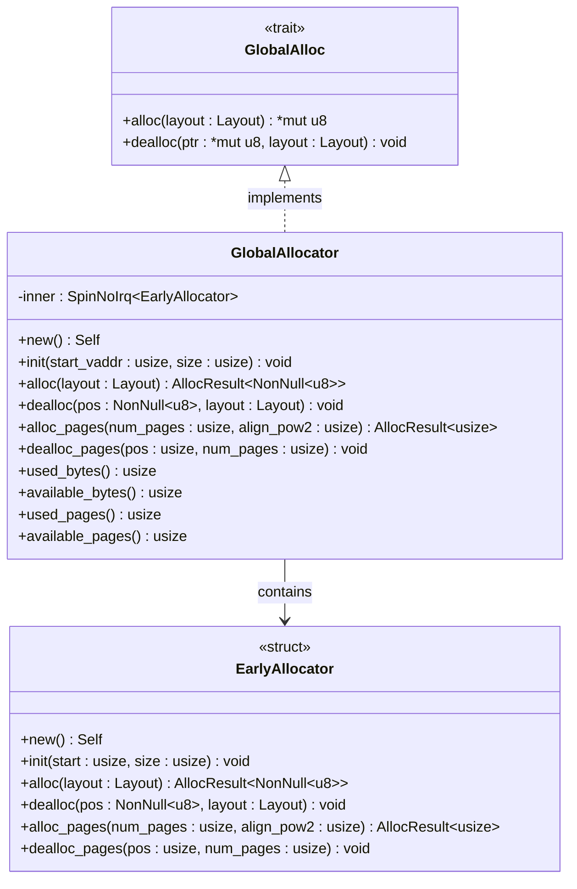
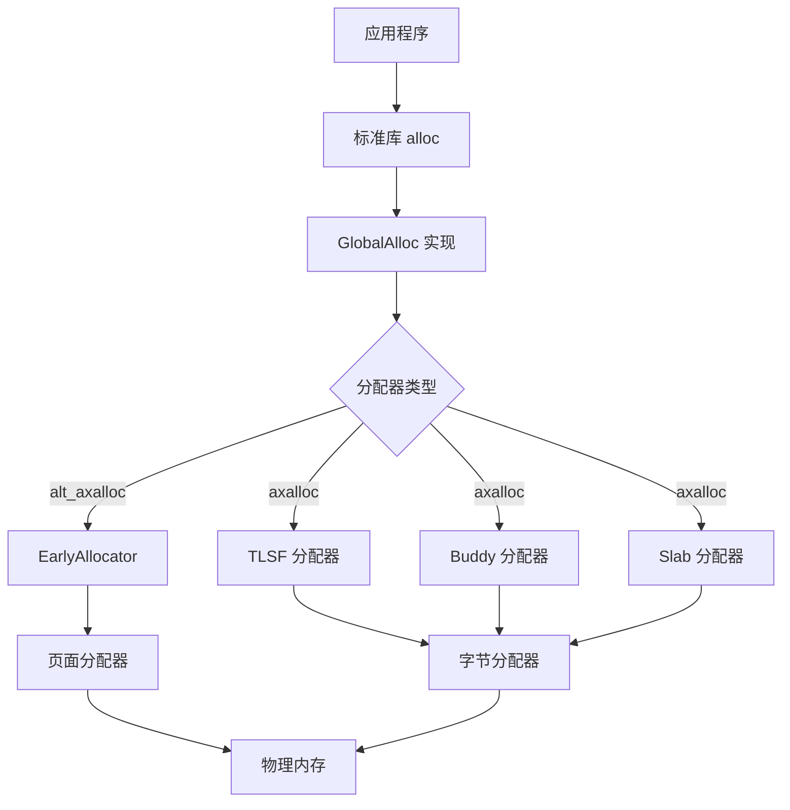
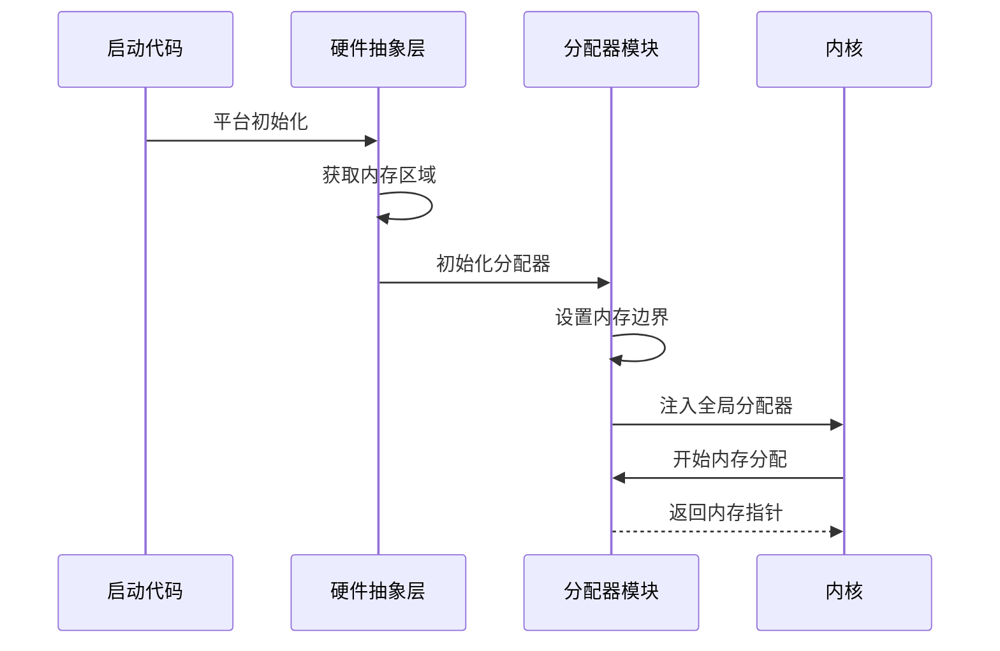
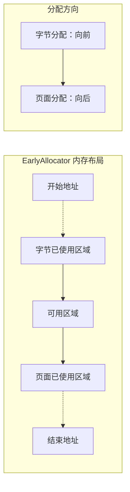
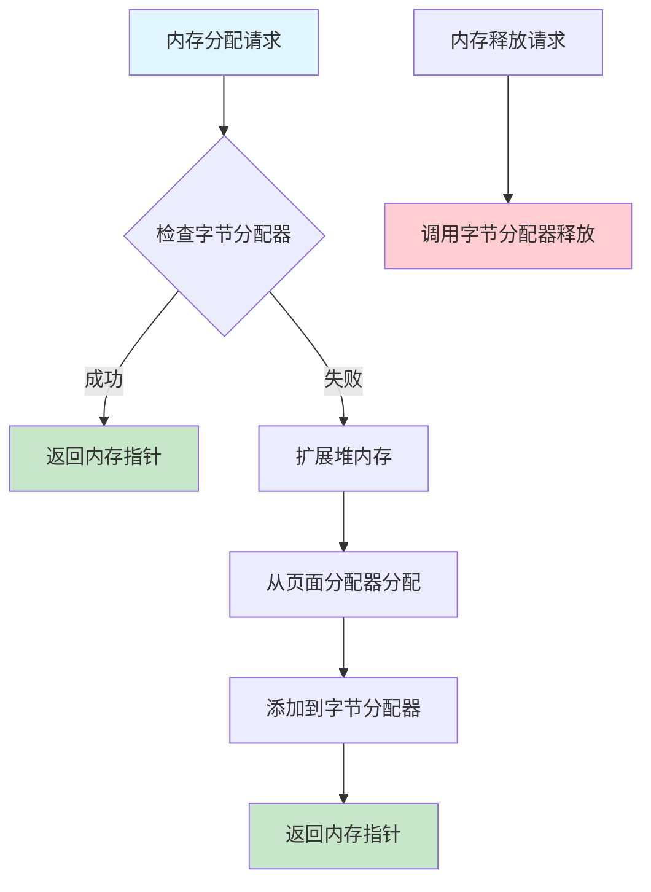
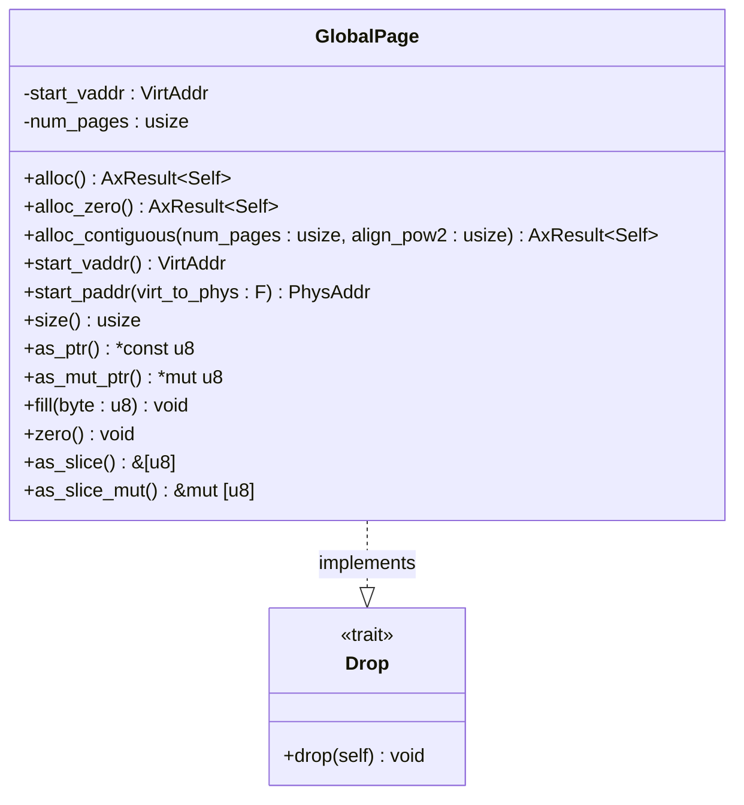
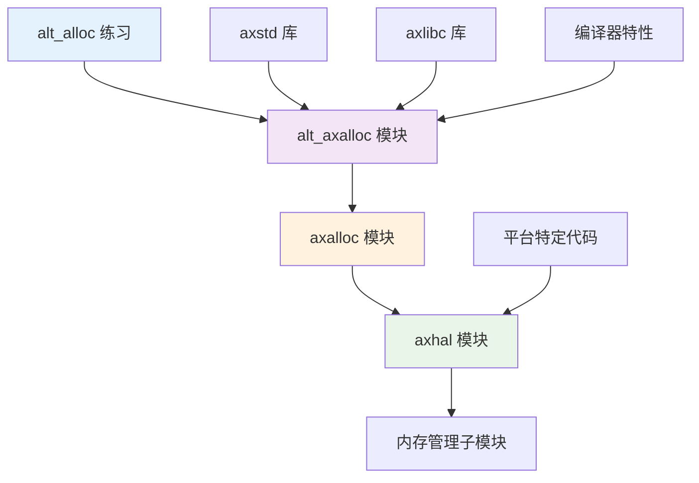

# alt_alloc 练习指导

<cite>
**本文档中引用的文件**
- [main.rs](file://arceos/exercises/alt_alloc/src/main.rs)
- [Cargo.toml](file://arceos/exercises/alt_alloc/Cargo.toml)
- [lib.rs](file://arceos/modules/alt_axalloc/src/lib.rs)
- [lib.rs](file://arceos/modules/axalloc/src/lib.rs)
- [lib.rs](file://arceos/modules/bump_allocator/src/lib.rs)
- [page.rs](file://arceos/modules/axalloc/src/page.rs)
- [lib.rs](file://arceos/modules/axmm/src/lib.rs)
- [lib.rs](file://arceos/modules/axhal/src/lib.rs)
- [mem.rs](file://arceos/modules/axhal/src/mem.rs)
- [malloc.rs](file://arceos/ulib/axlibc/src/malloc.rs)
</cite>

## 目录
1. [简介](#简介)
2. [项目结构](#项目结构)
3. [核心组件](#核心组件)
4. [架构概览](#架构概览)
5. [详细组件分析](#详细组件分析)
6. [依赖关系分析](#依赖关系分析)
7. [性能考虑](#性能考虑)
8. [故障排除指南](#故障排除指南)
9. [结论](#结论)

## 简介

alt_alloc 练习是 ArceOS 操作系统中的一个重要实践项目，旨在帮助开发者深入理解 Rust no_std 环境下全局内存分配器的工作原理。通过替换 ArceOS 默认的内存分配器，学习者可以掌握以下关键技术：

- **全局分配器（Global Allocator）** 在 Rust no_std 环境下的工作机制
- **#[global_allocator]** 属性的使用和内存分配器的注入方法
- **内存对齐** 和分配/释放接口的实现注意事项
- **内存泄漏检测** 和双重释放问题的预防
- **QEMU 模拟器** 配合日志输出进行调试的方法

该练习对理解操作系统内存管理机制具有重要意义，为后续开发更复杂的内核功能奠定了坚实基础。

## 项目结构

ArceOS 的 alt_alloc 练习采用模块化设计，主要包含以下关键组件：



**图表来源**
- [main.rs](file://arceos/exercises/alt_alloc/src/main.rs#L1-L27)
- [lib.rs](file://arceos/modules/alt_axalloc/src/lib.rs#L1-L122)

**章节来源**
- [main.rs](file://arceos/exercises/alt_alloc/src/main.rs#L1-L27)
- [Cargo.toml](file://arceos/exercises/alt_alloc/Cargo.toml#L1-L10)

## 核心组件

### 全局分配器接口

在 Rust no_std 环境中，全局分配器通过实现 `core::alloc::GlobalAlloc` 特征来提供内存分配服务：



**图表来源**
- [lib.rs](file://arceos/modules/alt_axalloc/src/lib.rs#L86-L101)
- [lib.rs](file://arceos/modules/bump_allocator/src/lib.rs#L19-L88)

### 内存管理层次结构

ArceOS 采用分层内存管理架构，支持多种分配策略：



**图表来源**
- [lib.rs](file://arceos/modules/axalloc/src/lib.rs#L26-L37)
- [lib.rs](file://arceos/modules/alt_axalloc/src/lib.rs#L15-L31)

**章节来源**
- [lib.rs](file://arceos/modules/alt_axalloc/src/lib.rs#L15-L122)
- [lib.rs](file://arceos/modules/axalloc/src/lib.rs#L39-L234)

## 架构概览

### 内存分配器初始化流程



**图表来源**
- [lib.rs](file://arceos/modules/axhal/src/lib.rs#L1-L86)
- [mem.rs](file://arceos/modules/axhal/src/mem.rs#L78-L163)

### 内存对齐要求

内存分配器必须满足严格的对齐要求以确保数据访问的正确性：

| 数据类型 | 对齐要求 | 说明 |
|---------|---------|------|
| 基本整数 | 1 字节 | 任意对齐 |
| 指针 | 4/8 字节 | 与架构相关的对齐 |
| 浮点数 | 4/8 字节 | 与架构相关的对齐 |
| 结构体 | 最大成员对齐 | 结构体整体对齐 |

**章节来源**
- [lib.rs](file://arceos/modules/alt_axalloc/src/lib.rs#L86-L101)
- [lib.rs](file://arceos/modules/axalloc/src/lib.rs#L181-L193)

## 详细组件分析

### EarlyAllocator 实现

EarlyAllocator 是一个双端内存范围分配器，在正式字节分配器和页面分配器可用之前提供早期内存管理功能：



**图表来源**
- [lib.rs](file://arceos/modules/bump_allocator/src/lib.rs#L7-L18)

#### 关键特性

1. **双端分配策略**：字节区域向前分配，页面区域向后分配
2. **计数器管理**：字节区域使用计数器跟踪分配次数
3. **不可释放页面**：页面区域一旦分配永不释放

### GlobalAllocator 接口实现

GlobalAllocator 作为全局分配器的核心实现，提供了完整的内存管理功能：



**图表来源**
- [lib.rs](file://arceos/modules/axalloc/src/lib.rs#L105-L125)

#### 实现要点

1. **两层分配策略**：优先使用字节分配器，必要时扩展堆内存
2. **动态内存扩展**：根据需要自动分配新的内存块
3. **线程安全**：使用自旋锁保护并发访问

**章节来源**
- [lib.rs](file://arceos/modules/axalloc/src/lib.rs#L56-L234)

### 内存页面管理

GlobalPage 提供了 RAII 风格的页面管理，确保内存的自动释放：



**图表来源**
- [page.rs](file://arceos/modules/axalloc/src/page.rs#L11-L98)

**章节来源**
- [page.rs](file://arceos/modules/axalloc/src/page.rs#L1-L109)

## 依赖关系分析

### 模块间依赖关系



**图表来源**
- [Cargo.toml](file://arceos/Cargo.toml#L1-L104)
- [lib.rs](file://arceos/modules/alt_axalloc/src/lib.rs#L1-L10)

### 编译时依赖

| 依赖项 | 类型 | 用途 |
|-------|------|------|
| alloc | 标准库 | 提供 alloc::vec::Vec |
| log | 外部 | 日志记录功能 |
| core | 标准库 | no_std 环境下的核心功能 |
| kspin | 外部 | 自旋锁实现 |
| allocator | 外部 | 分配器接口定义 |

**章节来源**
- [main.rs](file://arceos/exercises/alt_alloc/src/main.rs#L1-L10)
- [lib.rs](file://arceos/modules/alt_axalloc/src/lib.rs#L1-L10)

## 性能考虑

### 内存分配性能优化

1. **局部性原理**：相邻对象分配在物理上也接近
2. **预分配策略**：预先分配大块内存减少系统调用
3. **缓存友好**：优化数据结构布局提高缓存命中率

### 并发性能

- **无锁设计**：使用原子操作避免锁竞争
- **细粒度同步**：最小化临界区长度
- **NUMA 友好**：考虑多处理器架构特点

## 故障排除指南

### 常见问题及解决方案

#### 1. 双重释放问题

**症状**：程序崩溃或内存损坏
**原因**：同一内存块被释放两次
**解决方案**：
- 使用内存调试工具检测
- 实现引用计数机制
- 添加释放前检查

#### 2. 内存泄漏检测

**方法**：
- 跟踪分配和释放计数
- 定期检查未释放内存
- 使用专门的内存检测工具

#### 3. 对齐错误

**症状**：数据访问异常或性能下降
**解决方案**：
- 严格遵守 Rust 的对齐规则
- 使用 `Layout::from_size_align` 正确指定对齐
- 验证分配器的对齐处理

### 调试技巧

#### 使用 QEMU 进行调试

1. **启用调试输出**：
```bash
qemu-system-x86_64 -kernel arceos.bin -serial stdio -d guest_errors,int
```

2. **内存映射检查**：
```bash
# 查看内存布局
cat /proc/self/maps
```

3. **日志分析**：
```bash
# 过滤分配器相关日志
grep "allocator\|memory\|alloc\|dealloc" arceos.log
```

#### 内存监控工具

- **Valgrind**：内存泄漏检测
- **AddressSanitizer**：地址错误检测
- **LeakSanitizer**：泄漏检测

**章节来源**
- [malloc.rs](file://arceos/ulib/axlibc/src/malloc.rs#L38-L56)
- [lib.rs](file://arceos/modules/axalloc/src/lib.rs#L105-L125)

## 结论

alt_alloc 练习为学习者提供了一个深入理解 Rust no_std 环境下内存管理机制的绝佳机会。通过替换 ArceOS 默认分配器，开发者可以：

1. **掌握全局分配器的工作原理**：理解 #[global_allocator] 属性的作用和实现细节
2. **学习内存对齐的重要性**：认识到对齐要求对性能和正确性的关键影响
3. **熟悉分配/释放接口的实现**：掌握内存管理的核心技术
4. **获得调试技能**：学会使用 QEMU 和日志输出进行系统级调试
5. **理解操作系统内存管理**：为开发更复杂的内核功能奠定基础

这个练习不仅提升了技术能力，更重要的是培养了对系统级编程的深刻理解，这对于从事操作系统开发、嵌入式系统或高性能计算领域的工作具有重要意义。

通过完成这个练习，学习者将能够：
- 正确实现和集成自定义内存分配器
- 理解多层内存管理架构的设计思想
- 掌握内存泄漏和双重释放等常见问题的预防和检测方法
- 学会使用现代工具链进行系统级调试

这些技能对于任何希望深入了解计算机系统底层机制的开发者来说都是宝贵的财富。