# print_with_color 练习指导

<cite>
**本文档中引用的文件**
- [main.rs](file://arceos/exercises/print_with_color/src/main.rs)
- [Cargo.toml](file://arceos/exercises/print_with_color/Cargo.toml)
- [lib.rs](file://arceos/modules/axlog/src/lib.rs)
- [macros.rs](file://arceos/api/arceos_api/src/macros.rs)
- [stdio.rs](file://arceos/api/arceos_posix_api/src/imp/stdio.rs)
- [console.rs](file://arceos/tools/raspi4/chainloader/src/console.rs)
- [miniterm.rb](file://arceos/tools/raspi4/common/serial/miniterm.rb)
- [dw_apb_uart.rs](file://arceos/modules/axhal/src/platform/aarch64_bsta1000b/dw_apb_uart.rs)
- [uart16550.rs](file://arceos/modules/axhal/src/platform/x86_pc/uart16550.rs)
- [pl011.rs](file://arceos/modules/axhal/src/platform/aarch64_common/pl011.rs)
- [bcm2xxx_pl011_uart.rs](file://arceos/tools/raspi4/chainloader/src/bsp/device_driver/bcm/bcm2xxx_pl011_uart.rs)
</cite>

## 目录
1. [简介](#简介)
2. [项目结构](#项目结构)
3. [ANSI 转义序列基础](#ansi-转义序列基础)
4. [核心组件分析](#核心组件分析)
5. [架构概览](#架构概览)
6. [详细组件分析](#详细组件分析)
7. [裸机环境下的颜色输出](#裸机环境下的颜色输出)
8. [常见问题与调试](#常见问题与调试)
9. [实践练习指南](#实践练习指南)
10. [总结](#总结)

## 简介

本指导文档旨在深入解析 ArceOS 中的 `print_with_color` 练习，详细说明 ANSI 转义序列在终端着色中的应用机制。通过分析实际代码实现，我们将探讨如何在裸机环境下通过串口或虚拟终端输出彩色文本，包括转义码格式（如 `\x1b[31m` 表示红色）的使用方法。

该练习涵盖了从底层硬件抽象到高级格式化输出的完整技术栈，包括控制台 I/O 抽象层与设备驱动之间的交互关系。通过学习这个练习，您将掌握：
- ANSI 转义序列的工作原理和格式规范
- 裸机环境中串口通信的实现机制
- 多平台控制台驱动的统一抽象接口
- 颜色输出失败的诊断和解决方案

## 项目结构

`print_with_color` 练习位于 ArceOS 的 `exercises` 目录下，具有简洁的项目结构：

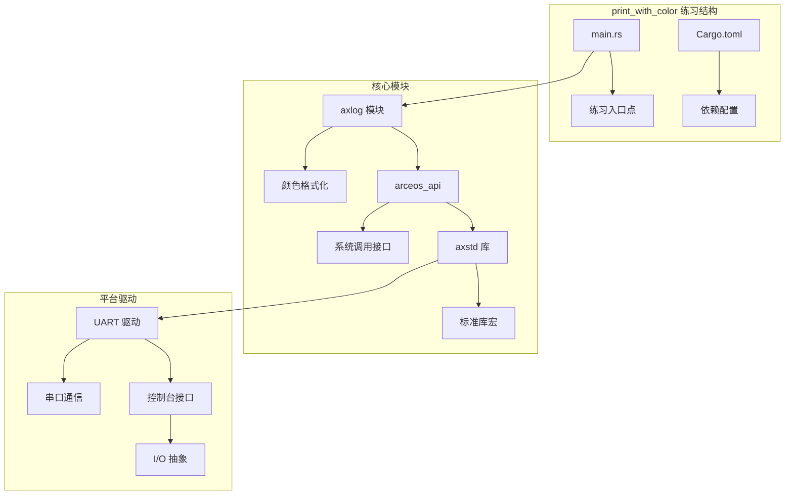

**图表来源**
- [main.rs](file://arceos/exercises/print_with_color/src/main.rs#L1-L11)
- [Cargo.toml](file://arceos/exercises/print_with_color/Cargo.toml#L1-L7)

**章节来源**
- [main.rs](file://arceos/exercises/print_with_color/src/main.rs#L1-L11)
- [Cargo.toml](file://arceos/exercises/print_with_color/Cargo.toml#L1-L7)

## ANSI 转义序列基础

### 转义序列格式

ANSI 转义序列是控制终端显示效果的标准协议，其基本格式为：`\x1b[` + 参数 + `m`。其中：
- `\x1b` 是 ESC 字符（ASCII 值 27）
- `[` 标识转义序列的开始
- 参数指定具体的显示属性
- `m` 结束转义序列

### 颜色代码体系

ArceOS 实现了完整的 ANSI 颜色代码体系：

| 颜色类型 | 颜色代码 | 十进制值 | 描述 |
|---------|---------|---------|------|
| 黑色 | `\x1b[30m` | 30 | 标准黑色前景色 |
| 红色 | `\x1b[31m` | 31 | 标准红色前景色 |
| 绿色 | `\x1b[32m` | 32 | 标准绿色前景色 |
| 黄色 | `\x1b[33m` | 33 | 标准黄色前景色 |
| 蓝色 | `\x1b[34m` | 34 | 标准蓝色前景色 |
| 品红 | `\x1b[35m` | 35 | 标准品红色前景色 |
| 青色 | `\x1b[36m` | 36 | 标准青色前景色 |
| 白色 | `\x1b[37m` | 37 | 标准白色前景色 |

### 亮度增强颜色

| 亮度类型 | 颜色代码 | 十进制值 | 描述 |
|---------|---------|---------|------|
| 亮黑色 | `\x1b[90m` | 90 | 亮度增强的黑色 |
| 亮红色 | `\x1b[91m` | 91 | 亮度增强的红色 |
| 亮绿色 | `\x1b[92m` | 92 | 亮度增强的绿色 |
| 亮黄色 | `\x1b[93m` | 93 | 亮度增强的黄色 |
| 亮蓝色 | `\x1b[94m` | 94 | 亮度增强的蓝色 |
| 亮品红 | `\x1b[95m` | 95 | 亮度增强的品红色 |
| 亮青色 | `\x1b[96m` | 96 | 亮度增强的青色 |
| 亮白色 | `\x1b[97m` | 97 | 亮度增强的白色 |

### 转义序列工作流程

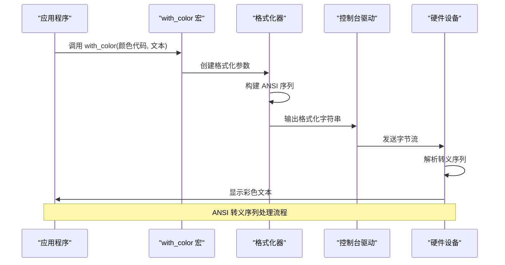

**图表来源**
- [lib.rs](file://arceos/modules/axlog/src/lib.rs#L81-L85)
- [lib.rs](file://arceos/modules/axlog/src/lib.rs#L87-L106)

## 核心组件分析

### 颜色格式化宏

ArceOS 提供了强大的 `with_color` 宏来实现颜色格式化：

```rust
macro_rules! with_color {
    ($color_code:expr, $($arg:tt)*) => {{
        format_args!("\u{1B}[{}m{}\u{1B}[m", $color_code as u8, format_args!($($arg)*))
    }};
}
```

该宏的核心特性：
- 接受颜色代码和可变参数
- 使用 Unicode 转义序列 `\u{1B}` 表示 ESC 字符
- 自动添加结束序列 `\u{1B}[m` 重置颜色
- 支持嵌套格式化参数

### 控制台抽象层

系统实现了统一的控制台接口：

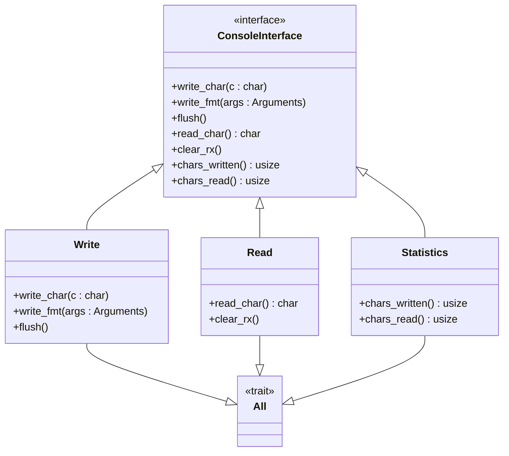

**图表来源**
- [console.rs](file://arceos/tools/raspi4/chainloader/src/console.rs#L15-L56)

**章节来源**
- [lib.rs](file://arceos/modules/axlog/src/lib.rs#L81-L106)
- [console.rs](file://arceos/tools/raspi4/chainloader/src/console.rs#L15-L56)

## 架构概览

ArceOS 的颜色输出系统采用分层架构设计，从底层硬件到高层应用形成完整的抽象层次：

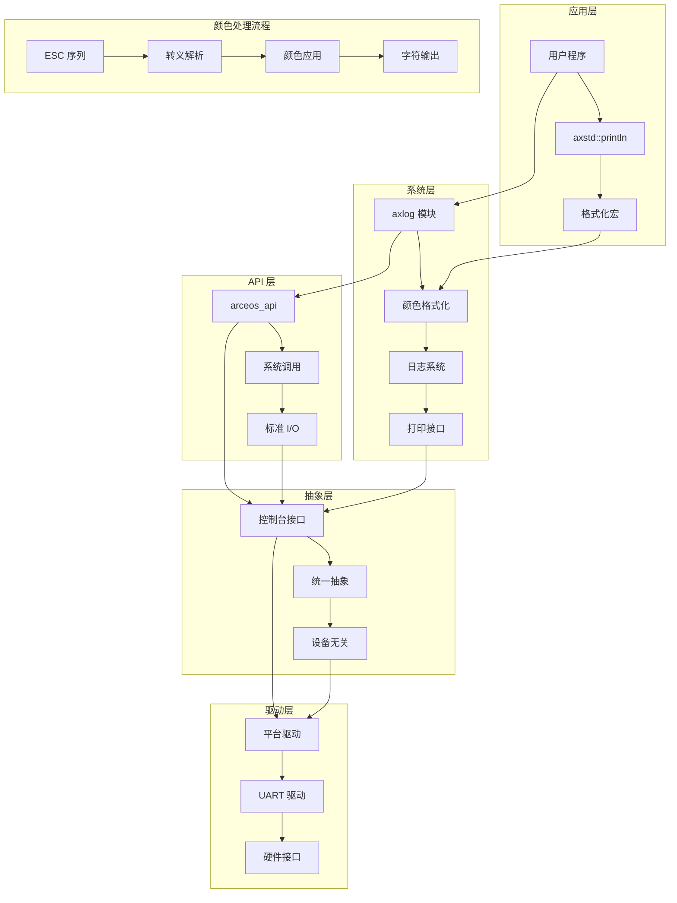

**图表来源**
- [main.rs](file://arceos/exercises/print_with_color/src/main.rs#L1-L11)
- [lib.rs](file://arceos/modules/axlog/src/lib.rs#L1-L261)
- [stdio.rs](file://arceos/api/arceos_posix_api/src/imp/stdio.rs#L1-L48)

## 详细组件分析

### 颜色枚举定义

系统定义了完整的颜色代码枚举：

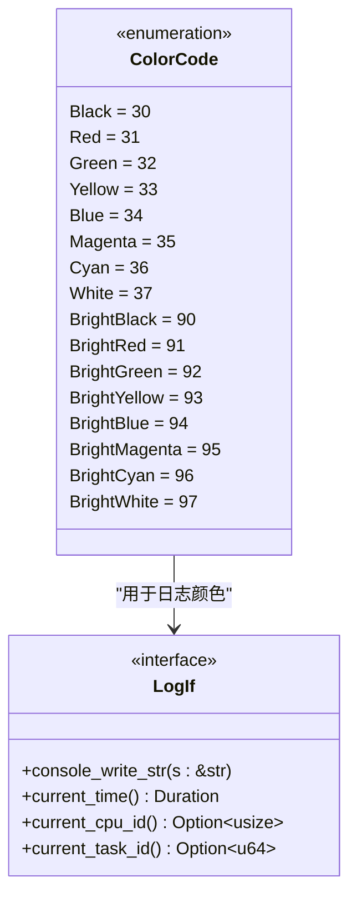

**图表来源**
- [lib.rs](file://arceos/modules/axlog/src/lib.rs#L87-L106)

### 日志系统中的颜色应用

在日志系统中，不同级别的日志使用不同的颜色：

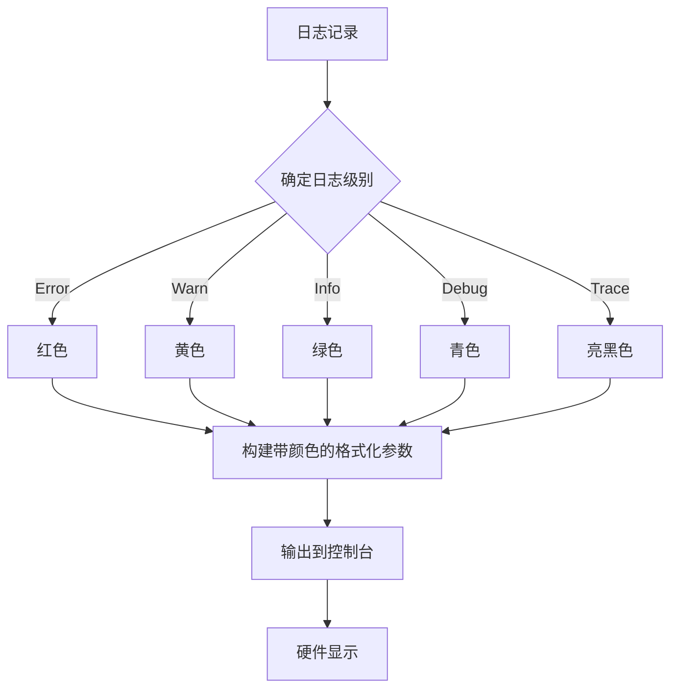

**图表来源**
- [lib.rs](file://arceos/modules/axlog/src/lib.rs#L157-L163)

### 打印实现机制

系统提供了两种主要的打印实现路径：

```mermaid
flowchart TD
A[__print_impl 函数] --> B{检查 SMP 特性}
B --> |启用| C[使用 axlog 锁同步]
B --> |禁用| D[直接使用 stdout]
C --> E[调用 ax_console_write_fmt]
D --> F[stdout().lock().write_fmt]
E --> G[LogIf::console_write_str]
F --> H[StdoutRaw::write_fmt]
G --> I[平台特定的控制台驱动]
H --> I
I --> J[UART 驱动]
J --> K[硬件串口]
style C fill:#e1f5fe
style D fill:#f3e5f5
style G fill:#e8f5e8
style H fill:#fff3e0
```

**图表来源**
- [stdio.rs](file://arceos/ulib/axstd/src/io/stdio.rs#L164-L173)

**章节来源**
- [lib.rs](file://arceos/modules/axlog/src/lib.rs#L81-L106)
- [stdio.rs](file://arceos/ulib/axstd/src/io/stdio.rs#L164-L173)

## 裸机环境下的颜色输出

### 平台驱动架构

ArceOS 支持多种平台的串口驱动，每种平台都有其特定的实现：

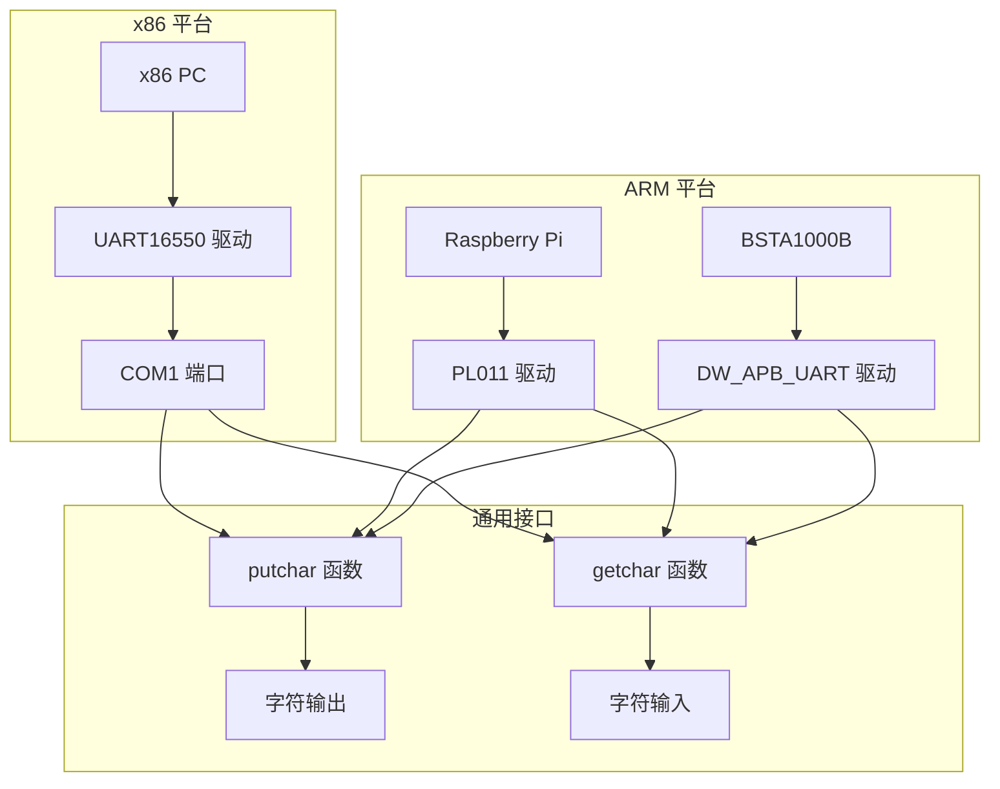

**图表来源**
- [uart16550.rs](file://arceos/modules/axhal/src/platform/x86_pc/uart16550.rs#L1-L105)
- [pl011.rs](file://arceos/modules/axhal/src/platform/aarch64_common/pl011.rs#L1-L51)
- [dw_apb_uart.rs](file://arceos/modules/axhal/src/platform/aarch64_bsta1000b/dw_apb_uart.rs#L1-L45)

### 串口初始化流程

每个平台的串口驱动都需要进行初始化配置：

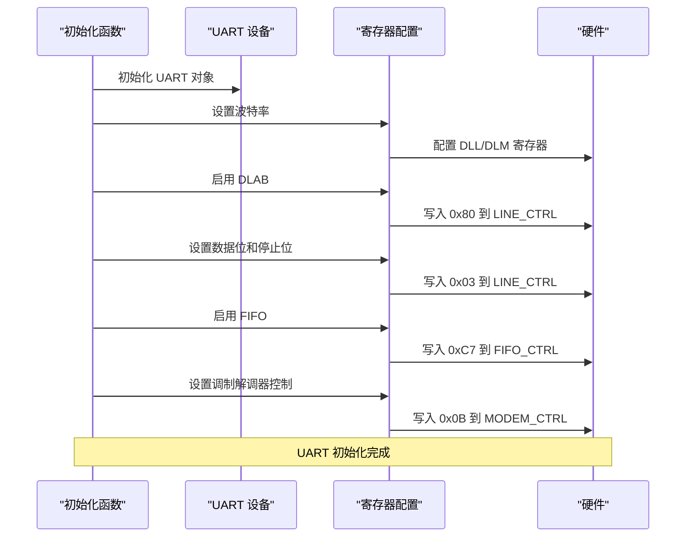

**图表来源**
- [uart16550.rs](file://arceos/modules/axhal/src/platform/x86_pc/uart16550.rs#L42-L65)

### 字符输出机制

串口驱动的字符输出遵循严格的时序要求：

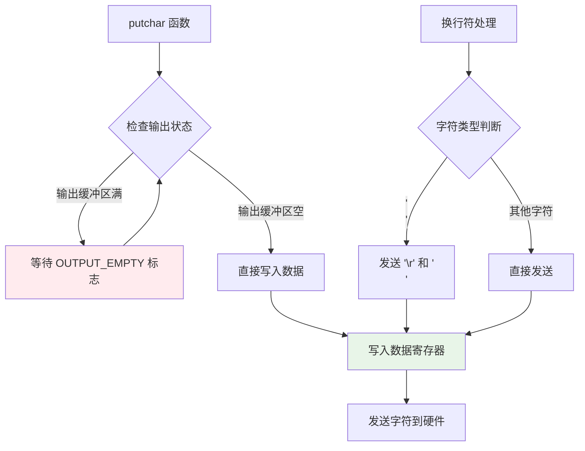

**图表来源**
- [uart16550.rs](file://arceos/modules/axhal/src/platform/x86_pc/uart16550.rs#L72-L82)
- [pl011.rs](file://arceos/modules/axhal/src/platform/aarch64_common/pl011.rs#L15-L23)

**章节来源**
- [uart16550.rs](file://arceos/modules/axhal/src/platform/x86_pc/uart16550.rs#L42-L105)
- [pl011.rs](file://arceos/modules/axhal/src/platform/aarch64_common/pl011.rs#L15-L51)
- [dw_apb_uart.rs](file://arceos/modules/axhal/src/platform/aarch64_bsta1000b/dw_apb_uart.rs#L12-L27)

## 常见问题与调试

### 颜色输出失败的可能原因

1. **终端不支持 ANSI 转义序列**
   - 问题表现：显示转义序列本身而非颜色效果
   - 解决方案：检查终端设置，确保支持 ANSI 转义序列
   - 验证方法：在终端中直接输入 `\x1b[31m测试\x1b[0m`

2. **转义码拼写错误**
   - 问题表现：部分字符显示异常或无效果
   - 常见错误：缺少 `m` 结束符、参数格式错误
   - 调试技巧：使用十六进制编辑器检查输出字节

3. **硬件串口配置问题**
   - 问题表现：颜色无法显示或显示乱码
   - 可能原因：波特率不匹配、数据位配置错误
   - 调试步骤：检查驱动初始化日志，验证硬件连接

4. **控制台驱动未正确注册**
   - 问题表现：打印函数无响应
   - 检查要点：确认控制台驱动已成功注册到全局实例

### 调试工具和技术

#### Miniterm 调试工具

ArceOS 提供了专门的串口调试工具：

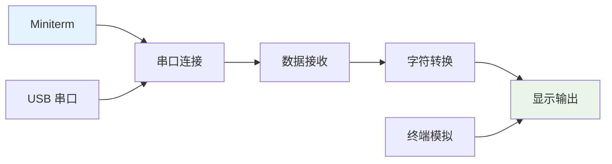

**图表来源**
- [miniterm.rb](file://arceos/tools/raspi4/common/serial/miniterm.rb#L1-L112)

#### 日志级别调试

系统提供了多级别的日志输出功能：

| 级别 | 宏名称 | 颜色 | 用途 |
|------|--------|------|------|
| ERROR | `error!` | 红色 | 致命错误 |
| WARN | `warn!` | 黄色 | 警告信息 |
| INFO | `info!` | 绿色 | 一般信息 |
| DEBUG | `debug!` | 青色 | 调试信息 |
| TRACE | `trace!` | 亮黑色 | 详细跟踪 |

### 故障排除流程

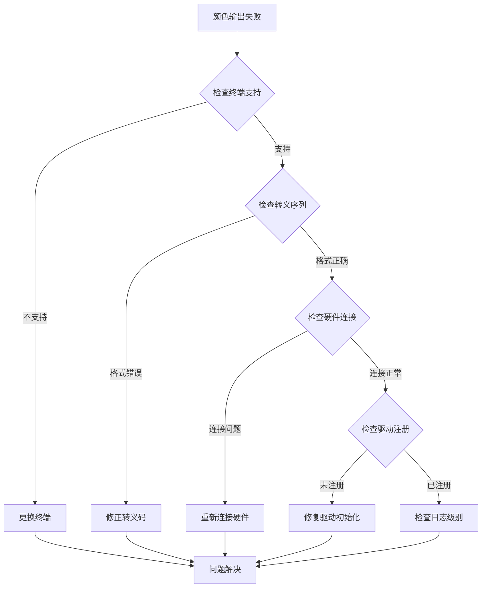

**章节来源**
- [miniterm.rb](file://arceos/tools/raspi4/common/serial/miniterm.rb#L1-L112)
- [lib.rs](file://arceos/modules/axlog/src/lib.rs#L157-L163)

## 实践练习指南

### 基础练习：颜色宏的使用

1. **修改现有练习**
   - 在 `main.rs` 中添加颜色宏调用
   - 尝试不同的颜色组合
   - 观察输出效果

2. **自定义颜色函数**
   - 创建自己的颜色格式化函数
   - 支持背景色和特殊效果
   - 实现颜色渐变效果

### 进阶练习：扩展控制台功能

1. **实现颜色日志系统**
   - 扩展日志宏支持更多颜色
   - 添加时间戳和线程信息
   - 实现彩色日志过滤

2. **开发终端模拟器**
   - 模拟 ANSI 转义序列处理器
   - 支持光标移动和屏幕擦除
   - 实现简单的文本编辑功能

### 高级练习：多平台适配

1. **平台特定优化**
   - 为不同平台实现优化的串口驱动
   - 添加硬件流控制支持
   - 实现中断驱动的串口通信

2. **网络控制台**
   - 实现基于网络的控制台输出
   - 支持远程调试和监控
   - 添加会话管理和权限控制

## 总结

通过深入分析 `print_with_color` 练习，我们全面了解了 ANSI 转义序列在终端着色中的应用机制。从底层的硬件抽象到高层的应用接口，ArceOS 展现了优秀的系统设计：

### 关键技术要点

1. **ANSI 转义序列**：标准化的终端控制协议，支持丰富的显示效果
2. **分层架构**：从硬件驱动到应用接口的清晰抽象层次
3. **跨平台兼容**：统一的接口设计支持多种硬件平台
4. **错误处理**：完善的故障诊断和恢复机制

### 学习成果

通过这个练习，您将：
- 掌握 ANSI 转义序列的语法和应用
- 理解裸机环境下串口通信的实现
- 学会调试和诊断颜色输出问题
- 了解操作系统控制台子系统的架构

### 未来发展方向

随着技术的发展，控制台系统将继续演进：
- 更丰富的显示效果支持
- 更好的用户体验设计
- 更强的安全性和可靠性保障
- 更广泛的硬件平台支持

这个练习不仅是一个技术实践，更是理解操作系统底层机制的重要窗口。通过深入学习和实践，您将获得宝贵的系统编程经验，为更复杂的操作系统开发奠定坚实基础。