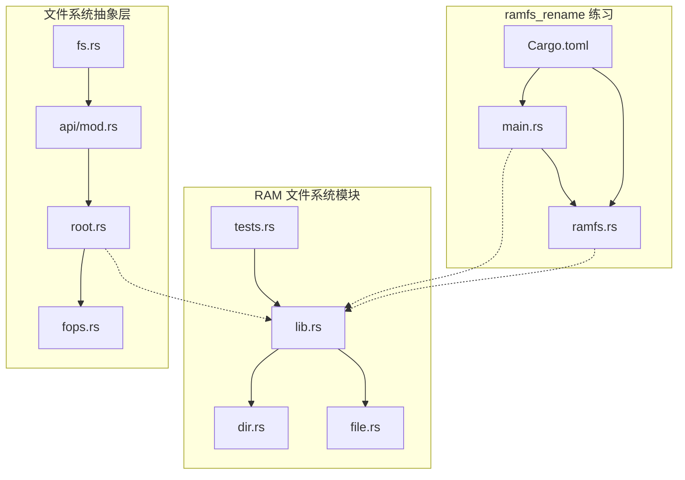
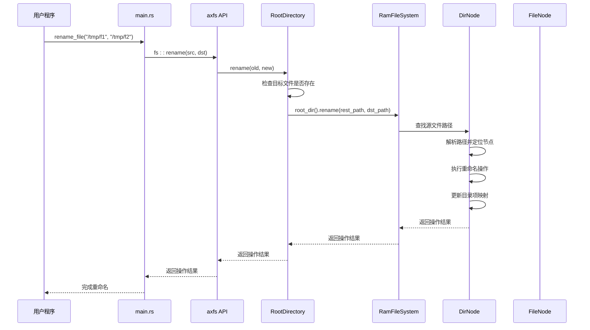
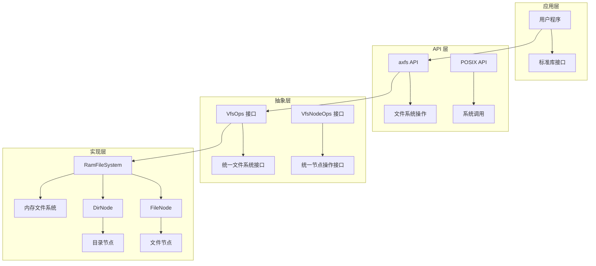
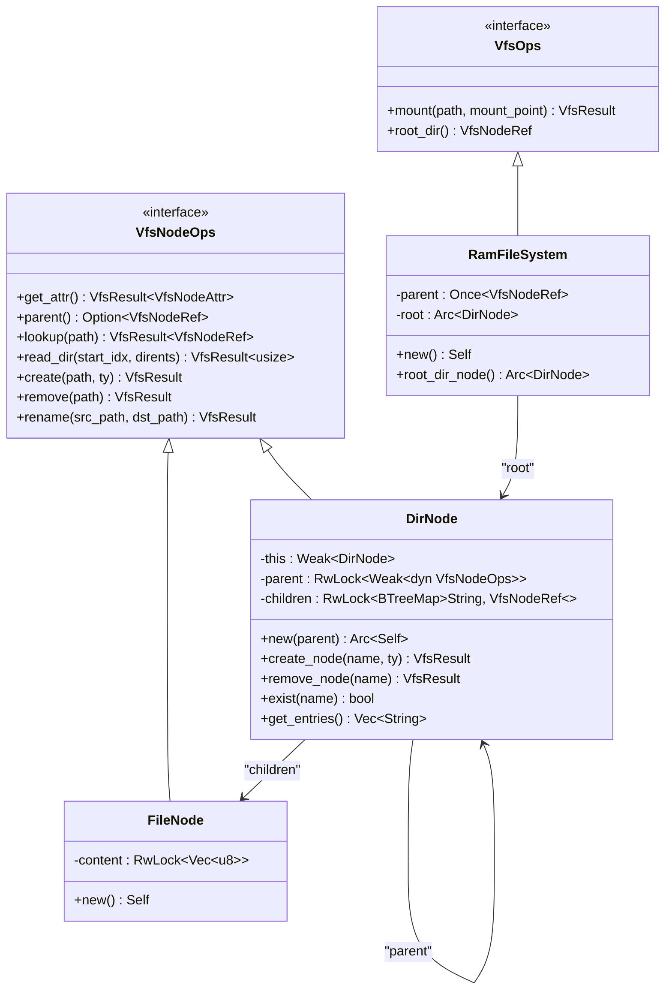
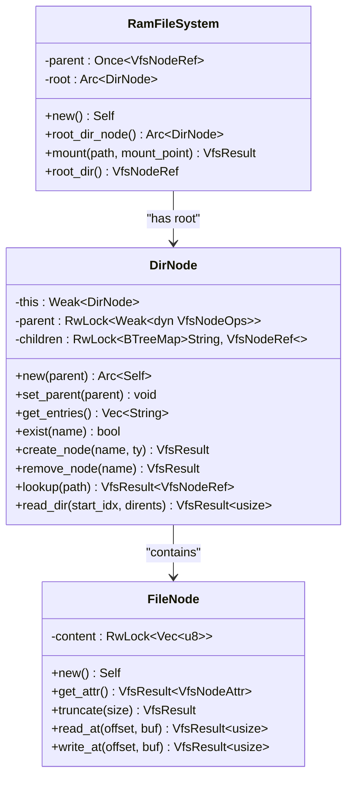
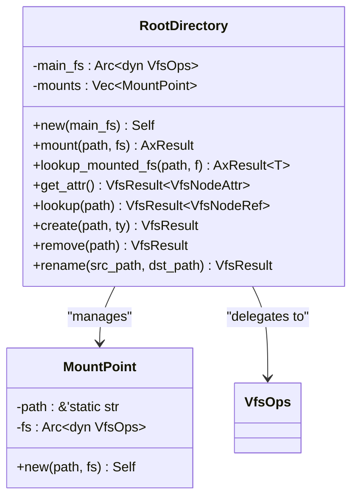
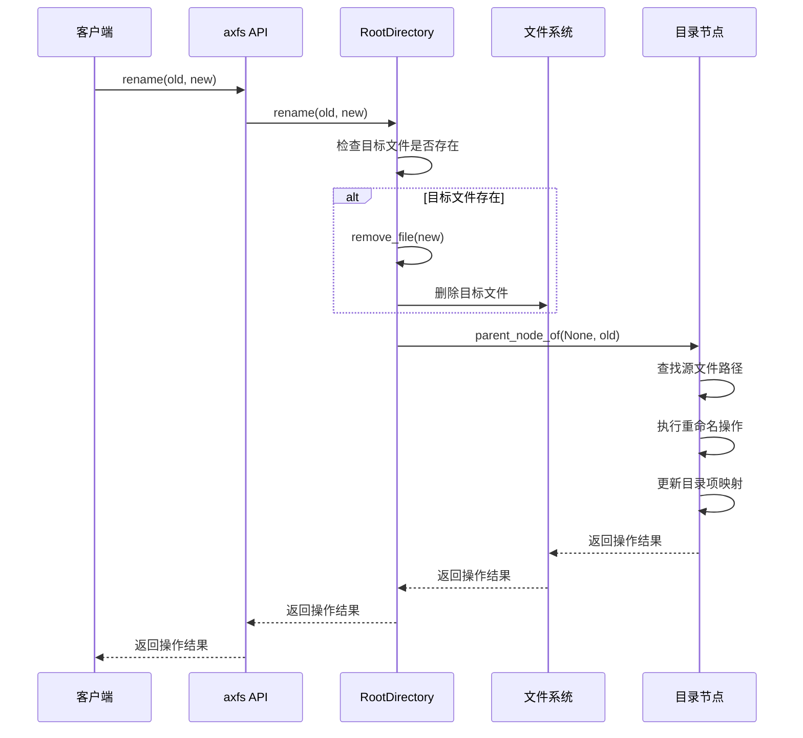
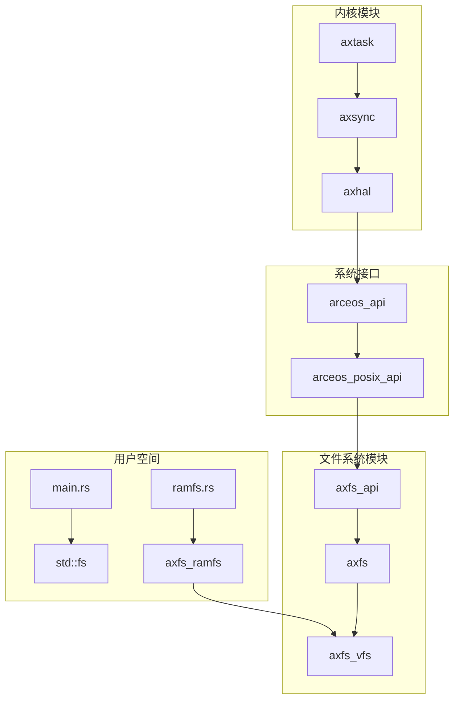
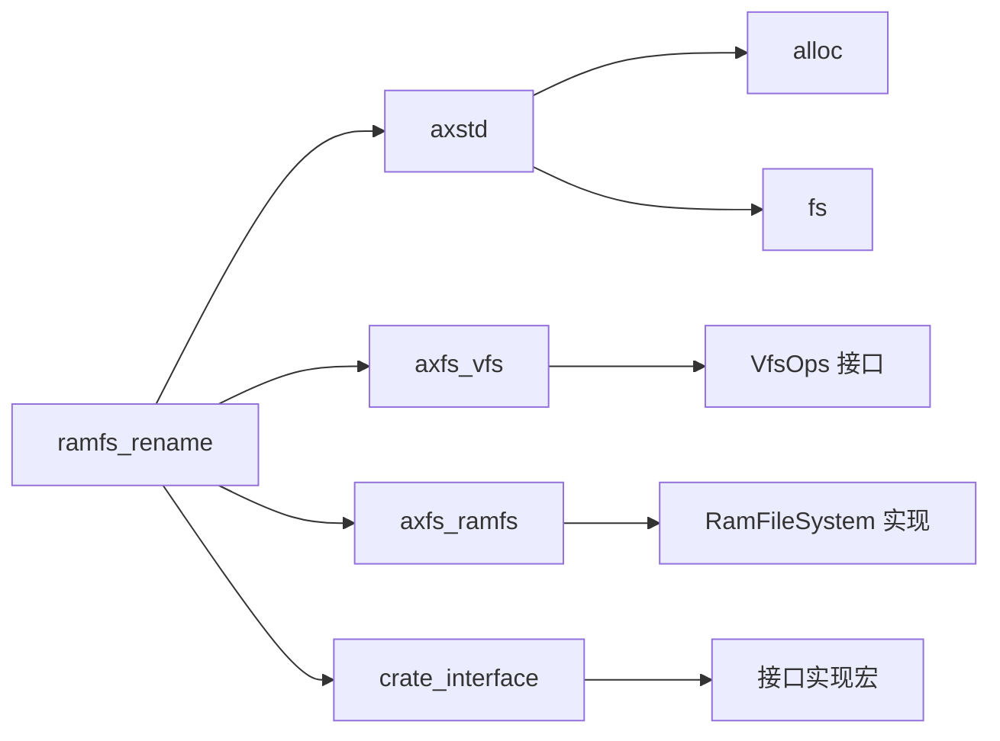

# ramfs_rename 练习指导

<cite>
**本文档引用的文件**
- [main.rs](file://arceos/exercises/ramfs_rename/src/main.rs)
- [ramfs.rs](file://arceos/exercises/ramfs_rename/src/ramfs.rs)
- [Cargo.toml](file://arceos/exercises/ramfs_rename/Cargo.toml)
- [lib.rs](file://arceos/axfs_ramfs/src/lib.rs)
- [dir.rs](file://arceos/axfs_ramfs/src/dir.rs)
- [file.rs](file://arceos/axfs_ramfs/src/file.rs)
- [root.rs](file://arceos/modules/axfs/src/root.rs)
- [fops.rs](file://arceos/modules/axfs/src/fops.rs)
- [api/mod.rs](file://arceos/modules/axfs/src/api/mod.rs)
- [fs.rs](file://arceos/api/arceos_posix_api/src/imp/fs.rs)
- [tests.rs](file://arceos/axfs_ramfs/src/tests.rs)
</cite>

## 目录
1. [简介](#简介)
2. [项目结构](#项目结构)
3. [核心组件](#核心组件)
4. [架构概览](#架构概览)
5. [详细组件分析](#详细组件分析)
6. [依赖关系分析](#依赖关系分析)
7. [性能考虑](#性能考虑)
8. [故障排除指南](#故障排除指南)
9. [结论](#结论)

## 简介

ramfs_rename 练习是 ArceOS 操作系统中的一个重要练习，专注于演示 RAM 文件系统中文件重命名功能的实现机制。该练习展示了如何在内存文件系统中安全地修改文件名，包括文件系统抽象接口的设计、目录项管理、路径解析和原子性操作的处理方式。

通过这个练习，开发者可以深入理解：
- RAM 文件系统的内部架构和实现原理
- 文件系统抽象接口（VfsOps）的设计模式
- 路径解析算法和目录项管理机制
- 原子性操作的保证和异常处理策略
- 日志追踪和调试技巧

## 项目结构

ramfs_rename 练习位于 `arceos/exercises/ramfs_rename/` 目录下，包含以下关键文件：



**图表来源**
- [main.rs](file://arceos/exercises/ramfs_rename/src/main.rs#L1-L55)
- [ramfs.rs](file://arceos/exercises/ramfs_rename/src/ramfs.rs#L1-L16)
- [lib.rs](file://arceos/axfs_ramfs/src/lib.rs#L1-L63)

**章节来源**
- [main.rs](file://arceos/exercises/ramfs_rename/src/main.rs#L1-L55)
- [ramfs.rs](file://arceos/exercises/ramfs_rename/src/ramfs.rs#L1-L16)
- [Cargo.toml](file://arceos/exercises/ramfs_rename/Cargo.toml#L1-L17)

## 核心组件

### 主要组件概述

ramfs_rename 练习涉及多个核心组件，每个组件都有特定的职责和功能：

1. **主程序模块** (`main.rs`)：提供用户界面和基本的文件操作
2. **RAM 文件系统实现** (`axfs_ramfs`)：内存文件系统的具体实现
3. **文件系统抽象层** (`axfs`)：提供统一的文件系统接口
4. **系统调用接口** (`arceos_posix_api`)：操作系统与用户空间的桥梁

### 组件交互关系



**图表来源**
- [main.rs](file://arceos/exercises/ramfs_rename/src/main.rs#L18-L22)
- [api/mod.rs](file://arceos/modules/axfs/src/api/mod.rs#L82-L88)
- [root.rs](file://arceos/modules/axfs/src/root.rs#L134-L142)

**章节来源**
- [main.rs](file://arceos/exercises/ramfs_rename/src/main.rs#L18-L22)
- [api/mod.rs](file://arceos/modules/axfs/src/api/mod.rs#L82-L88)
- [root.rs](file://arceos/modules/axfs/src/root.rs#L134-L142)

## 架构概览

### 整体架构设计

ramfs_rename 练习采用分层架构设计，从上到下包括应用层、API 层、抽象层和实现层：



**图表来源**
- [main.rs](file://arceos/exercises/ramfs_rename/src/main.rs#L1-L55)
- [lib.rs](file://arceos/axfs_ramfs/src/lib.rs#L18-L63)
- [root.rs](file://arceos/modules/axfs/src/root.rs#L1-L311)

### 文件系统抽象接口

VfsOps 是文件系统的核心抽象接口，定义了所有文件系统必须实现的基本操作：



**图表来源**
- [lib.rs](file://arceos/axfs_ramfs/src/lib.rs#L18-L63)
- [dir.rs](file://arceos/axfs_ramfs/src/dir.rs#L11-L177)
- [file.rs](file://arceos/axfs_ramfs/src/file.rs#L8-L57)

**章节来源**
- [lib.rs](file://arceos/axfs_ramfs/src/lib.rs#L18-L63)
- [dir.rs](file://arceos/axfs_ramfs/src/dir.rs#L11-L177)
- [file.rs](file://arceos/axfs_ramfs/src/file.rs#L8-L57)

## 详细组件分析

### 主程序组件分析

主程序组件提供了用户友好的文件重命名操作接口，封装了底层的文件系统调用。

#### 核心函数实现

主要包含三个核心函数：文件创建、重命名和内容读取：

```mermaid
flowchart TD
A[process 函数] --> B[create_file "/tmp/f1" "hello"]
B --> C[检查路径有效性]
C --> D[创建文件并写入内容]
D --> E[打印创建信息]
E --> F[rename_file "/tmp/f1" "/tmp/f2"]
F --> G[调用 fs::rename]
G --> H[打印重命名信息]
H --> I[print_file "/tmp/f2"]
I --> J[打开文件]
J --> K[读取文件内容]
K --> L[打印内容]
L --> M[完成操作]
F --> N{源文件存在?}
N --> |否| O[返回 NotFound 错误]
N --> |是| P{目标文件存在?}
P --> |是| Q[删除目标文件]
P --> |否| R[直接重命名]
Q --> R
R --> S[执行重命名操作]
```

**图表来源**
- [main.rs](file://arceos/exercises/ramfs_rename/src/main.rs#L40-L46)

#### 错误处理机制

主程序实现了基本的错误处理机制，确保操作失败时能够正确报告错误：

| 错误类型 | 处理方式 | 示例场景 |
|---------|---------|---------|
| 文件不存在 | 返回 NotFound 错误 | 源文件路径无效 |
| 权限不足 | 返回 PermissionDenied 错误 | 缺少写权限 |
| 路径格式错误 | 返回 InvalidInput 错误 | 路径包含非法字符 |
| 系统资源不足 | 返回 ResourceExhausted 错误 | 内存或文件描述符耗尽 |

**章节来源**
- [main.rs](file://arceos/exercises/ramfs_rename/src/main.rs#L13-L46)

### RAM 文件系统组件分析

RAM 文件系统是练习的核心实现部分，提供了完整的内存文件系统功能。

#### 目录节点管理

目录节点负责管理文件系统中的目录结构和文件映射：



**图表来源**
- [dir.rs](file://arceos/axfs_ramfs/src/dir.rs#L11-L177)
- [file.rs](file://arceos/axfs_ramfs/src/file.rs#L8-L57)
- [lib.rs](file://arceos/axfs_ramfs/src/lib.rs#L18-L63)

#### 路径解析算法

RAM 文件系统实现了高效的路径解析算法，支持相对路径和绝对路径：

```mermaid
flowchart TD
A[输入路径] --> B[trim_start_matches('/')]
B --> C[find('/')]
C --> D{找到分隔符?}
D --> |是| E[提取基础名称]
D --> |否| F[整个路径作为基础名称]
E --> G[剩余路径作为子路径]
F --> H[设置子路径为 None]
G --> I[检查基础名称]
H --> I
I --> J{基础名称类型}
J --> |"."| K[返回当前节点]
J --> |".."| L[查找父节点]
J --> |其他| M[查找子节点]
L --> N{父节点存在?}
N --> |是| O[递归处理子路径]
N --> |否| P[返回 NotFound]
M --> Q{子节点存在?}
Q --> |是| O
Q --> |否| P
K --> R[返回当前节点]
O --> S[返回最终节点]
```

**图表来源**
- [dir.rs](file://arceos/axfs_ramfs/src/dir.rs#L171-L177)

**章节来源**
- [dir.rs](file://arceos/axfs_ramfs/src/dir.rs#L11-L177)
- [file.rs](file://arceos/axfs_ramfs/src/file.rs#L8-L57)
- [lib.rs](file://arceos/axfs_ramfs/src/lib.rs#L18-L63)

### 文件系统抽象层分析

文件系统抽象层提供了统一的接口，使得上层应用可以不依赖具体的文件系统实现。

#### 根目录管理

根目录是整个文件系统的入口点，负责挂载点管理和路径解析：



**图表来源**
- [root.rs](file://arceos/modules/axfs/src/root.rs#L21-L101)

#### 重命名操作流程

重命名操作是文件系统中最复杂的操作之一，需要确保原子性和一致性：



**图表来源**
- [root.rs](file://arceos/modules/axfs/src/root.rs#L303-L310)
- [fops.rs](file://arceos/modules/axfs/src/fops.rs#L340-L346)

**章节来源**
- [root.rs](file://arceos/modules/axfs/src/root.rs#L21-L101)
- [fops.rs](file://arceos/modules/axfs/src/fops.rs#L340-L346)

### 系统调用接口分析

系统调用接口提供了用户空间程序与内核文件系统的通信桥梁。

#### POSIX 兼容性

系统调用接口遵循 POSIX 标准，提供标准的文件操作：

| 系统调用 | 功能描述 | 参数 | 返回值 |
|---------|---------|------|--------|
| sys_rename | 重命名文件或目录 | old_path, new_path | 成功返回 0，失败返回 -1 |
| sys_getcwd | 获取当前工作目录 | buf, size | 成功返回 buf，失败返回 NULL |
| sys_chdir | 改变当前工作目录 | path | 成功返回 0，失败返回 -1 |

**章节来源**
- [fs.rs](file://arceos/api/arceos_posix_api/src/imp/fs.rs#L185-L217)

## 依赖关系分析

### 模块依赖图

ramfs_rename 练习涉及多个模块之间的复杂依赖关系：



**图表来源**
- [main.rs](file://arceos/exercises/ramfs_rename/src/main.rs#L1-L55)
- [ramfs.rs](file://arceos/exercises/ramfs_rename/src/ramfs.rs#L1-L16)
- [lib.rs](file://arceos/axfs_ramfs/src/lib.rs#L1-L63)

### 特性依赖关系

练习使用了多个可选特性来控制编译配置：



**图表来源**
- [Cargo.toml](file://arceos/exercises/ramfs_rename/Cargo.toml#L9-L16)

**章节来源**
- [Cargo.toml](file://arceos/exercises/ramfs_rename/Cargo.toml#L9-L16)

## 性能考虑

### 内存使用优化

RAM 文件系统采用多种策略来优化内存使用：

1. **延迟初始化**：使用 `Once` 类型延迟初始化根目录
2. **弱引用**：目录节点使用弱引用避免循环引用
3. **共享数据结构**：文件内容使用 `Arc<RwLock<Vec<u8>>>` 共享

### 并发性能

文件系统实现了细粒度的锁机制：

- **读写锁**：目录项使用 `RwLock` 支持并发读取
- **原子操作**：关键操作使用原子类型保证线程安全
- **无锁设计**：尽可能使用无锁数据结构减少竞争

### 路径解析优化

路径解析算法经过优化以提高性能：

- **缓存机制**：避免重复解析相同路径
- **快速路径**：对简单路径提供快速处理路径
- **内存局部性**：使用 BTreeMap 提高缓存命中率

## 故障排除指南

### 常见错误及解决方案

#### 路径不存在错误

**错误现象**：尝试重命名不存在的文件时返回 `NotFound` 错误

**原因分析**：源文件路径无效或文件已被删除

**解决方案**：
1. 验证源文件路径的正确性
2. 检查文件是否存在于预期位置
3. 使用 `canonicalize` 函数获取规范路径

#### 目标文件已存在

**错误现象**：目标文件已存在时无法完成重命名

**原因分析**：默认行为会先删除目标文件再重命名

**解决方案**：
1. 手动检查目标文件是否存在
2. 在重命名前删除目标文件
3. 使用原子操作避免竞态条件

#### 跨文件系统重命名

**错误现象**：尝试跨文件系统重命名文件

**原因分析**：重命名操作要求源文件和目标文件在同一挂载点

**解决方案**：
1. 确保源文件和目标文件在同一文件系统
2. 使用相对路径避免跨文件系统操作
3. 在同一 `/tmp` 目录下进行重命名

### 调试技巧

#### 启用调试日志

```rust
// 在代码中添加调试输出
log::debug!("重命名操作: {} -> {}", src, dst);
log::trace!("当前工作目录: {}", current_dir()?);
```

#### 使用测试工具

练习包含完整的测试套件，可以验证各种边界情况：

```bash
# 运行 RAM 文件系统测试
cargo test --features ramfs -p axfs_ramfs

# 运行文件系统集成测试
cargo test --features ramfs -p axfs
```

**章节来源**
- [tests.rs](file://arceos/axfs_ramfs/src/tests.rs#L118-L136)

## 结论

ramfs_rename 练习展示了 ArceOS 中 RAM 文件系统的完整实现，涵盖了从用户接口到内核实现的各个层面。通过这个练习，开发者可以深入理解：

1. **文件系统架构**：分层设计和模块化实现的重要性
2. **抽象接口设计**：VfsOps 和 VfsNodeOps 接口的通用性
3. **路径解析算法**：高效且健壮的路径处理机制
4. **原子性操作**：确保文件系统一致性的关键原则
5. **错误处理策略**：全面的错误检测和恢复机制

这个练习不仅是一个学习文件系统实现的好机会，也为实际开发提供了宝贵的参考。通过理解这些概念和实现细节，开发者可以更好地设计和实现自己的文件系统，或者在现有系统基础上进行扩展和优化。

未来的改进方向可能包括：
- 支持更复杂的文件属性和权限模型
- 实现文件系统快照和备份功能
- 优化大文件和大量小文件的处理性能
- 增强并发访问的性能和安全性