# simple_hv 练习指导

<cite>
**本文档引用的文件**
- [main.rs](file://arceos/exercises/simple_hv/src/main.rs)
- [vcpu.rs](file://arceos/exercises/simple_hv/src/vcpu.rs)
- [task.rs](file://arceos/exercises/simple_hv/src/task.rs)
- [loader.rs](file://arceos/exercises/simple_hv/src/loader.rs)
- [guest.S](file://arceos/exercises/simple_hv/src/guest.S)
- [regs.rs](file://arceos/exercises/simple_hv/src/regs.rs)
- [csrs.rs](file://arceos/exercises/simple_hv/src/csrs.rs)
- [sbi/mod.rs](file://arceos/exercises/simple_hv/src/sbi/mod.rs)
- [sbi/dbcn.rs](file://arceos/exercises/simple_hv/src/sbi/dbcn.rs)
- [sbi/base.rs](file://arceos/exercises/simple_hv/src/sbi/base.rs)
- [Cargo.toml](file://arceos/exercises/simple_hv/Cargo.toml)
</cite>

## 目录
1. [简介](#简介)
2. [项目结构](#项目结构)
3. [核心组件](#核心组件)
4. [架构概览](#架构概览)
5. [详细组件分析](#详细组件分析)
6. [虚拟 CPU 创建与上下文切换](#虚拟-cpu-创建与上下文切换)
7. [SBI 调用拦截与处理](#sbi-调用拦截与处理)
8. [异常处理机制](#异常处理机制)
9. [调试指南](#调试指南)
10. [常见问题与解决方案](#常见问题与解决方案)
11. [总结](#总结)

## 简介

simple_hv 是一个轻量级的 RISC-V 虚拟化练习项目，旨在帮助开发者深入理解虚拟机监控器（Hypervisor）的工作原理。该项目通过模拟 EL2 异常向量表、处理 SBI 扩展调用（如 DBCN 调试通信），以及实现虚拟机与宿主机之间的控制权转移机制，为学习者提供了完整的虚拟化系统实现示例。

本练习的核心目标是：
- 理解虚拟 CPU 的创建和管理机制
- 掌握上下文切换的实现原理
- 学习 SBI 调用的拦截与处理技术
- 熟悉异常向量表的模拟方法
- 掌握虚拟机监控器与客户机操作系统的交互方式

## 项目结构

simple_hv 项目采用模块化设计，主要包含以下核心模块：

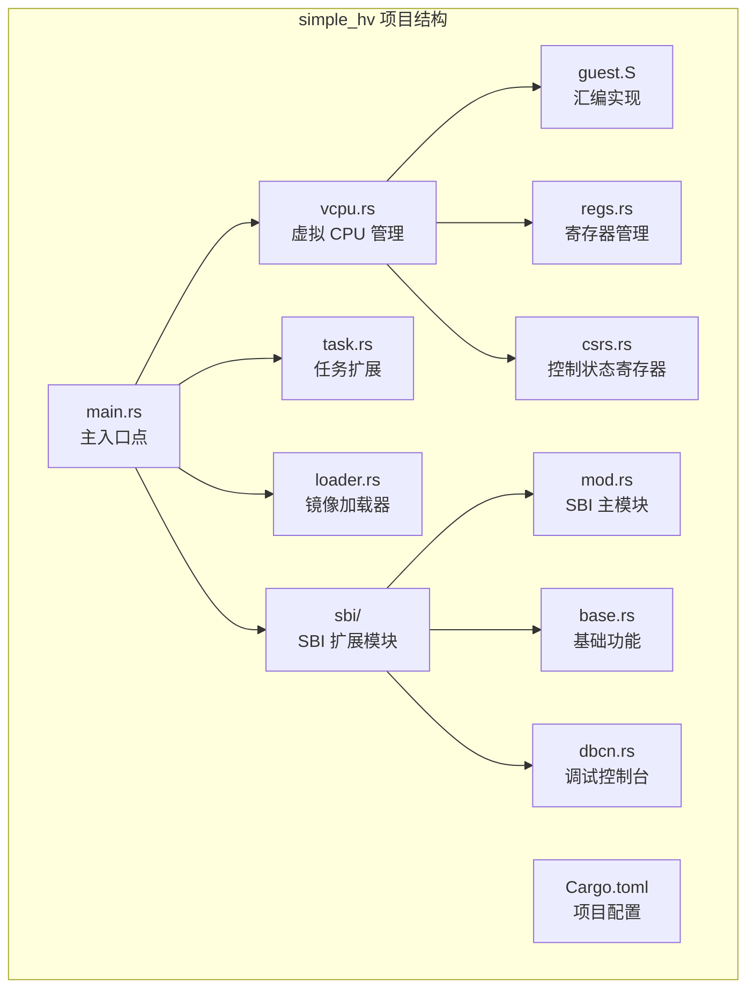

**图表来源**
- [main.rs](file://arceos/exercises/simple_hv/src/main.rs#L1-L147)
- [vcpu.rs](file://arceos/exercises/simple_hv/src/vcpu.rs#L1-L187)
- [sbi/mod.rs](file://arceos/exercises/simple_hv/src/sbi/mod.rs#L1-L91)

**章节来源**
- [main.rs](file://arceos/exercises/simple_hv/src/main.rs#L1-L147)
- [Cargo.toml](file://arceos/exercises/simple_hv/Cargo.toml#L1-L19)

## 核心组件

### 虚拟 CPU 状态管理

虚拟 CPU 的状态管理是整个虚拟化系统的核心，它负责保存和恢复宿主机与客户机之间的寄存器状态。

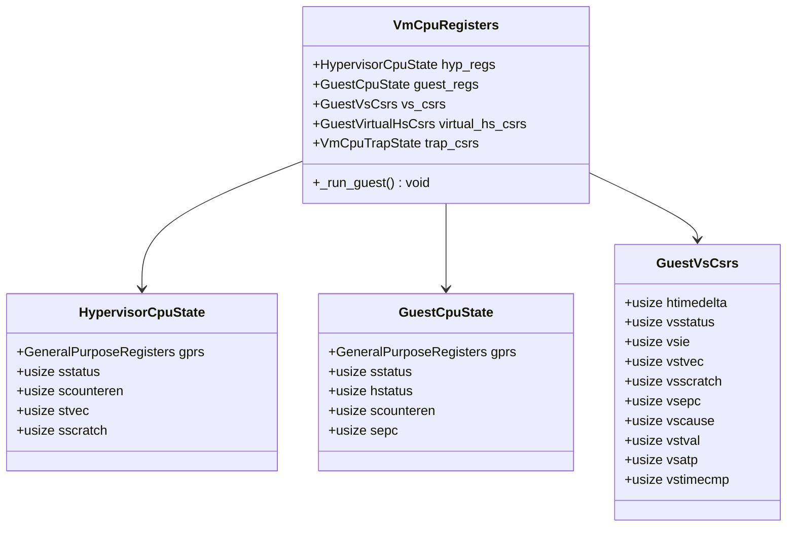

**图表来源**
- [vcpu.rs](file://arceos/exercises/simple_hv/src/vcpu.rs#L67-L86)
- [vcpu.rs](file://arceos/exercises/simple_hv/src/vcpu.rs#L8-L28)
- [vcpu.rs](file://arceos/exercises/simple_hv/src/vcpu.rs#L29-L44)

### 寄存器管理系统

寄存器管理系统提供了对 RISC-V 通用寄存器的统一访问接口，支持按索引读写寄存器值。

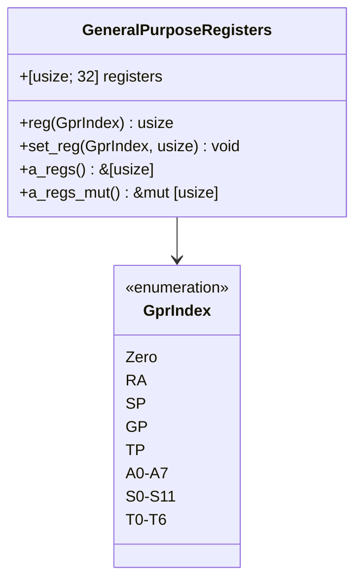

**图表来源**
- [regs.rs](file://arceos/exercises/simple_hv/src/regs.rs#L1-L115)

**章节来源**
- [vcpu.rs](file://arceos/exercises/simple_hv/src/vcpu.rs#L67-L86)
- [regs.rs](file://arceos/exercises/simple_hv/src/regs.rs#L1-L115)

## 架构概览

simple_hv 采用了分层架构设计，从底层到顶层依次为：

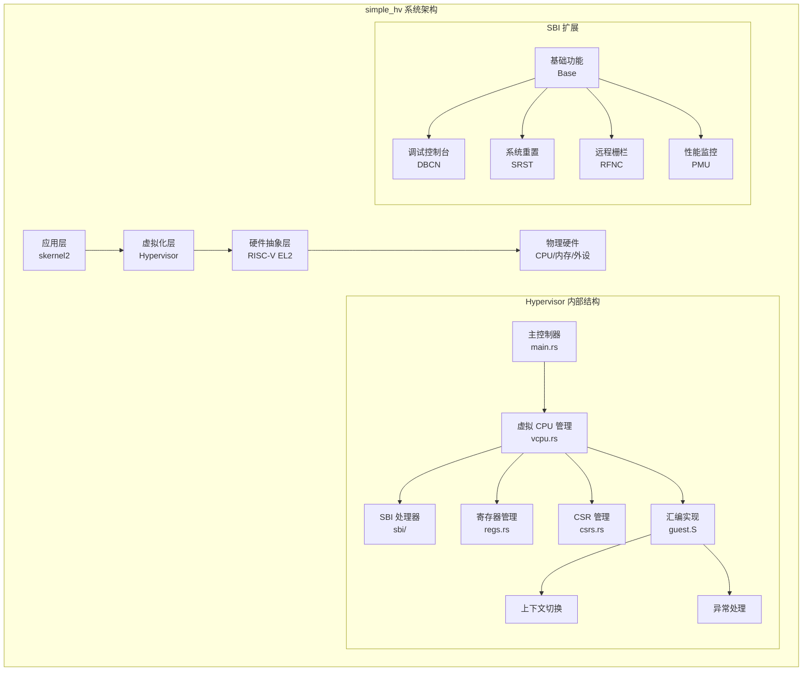

**图表来源**
- [main.rs](file://arceos/exercises/simple_hv/src/main.rs#L32-L56)
- [vcpu.rs](file://arceos/exercises/simple_hv/src/vcpu.rs#L116-L187)
- [sbi/mod.rs](file://arceos/exercises/simple_hv/src/sbi/mod.rs#L45-L63)

## 详细组件分析

### 主控制器 (main.rs)

主控制器是整个虚拟化系统的入口点，负责初始化虚拟化环境并启动客户机操作系统。

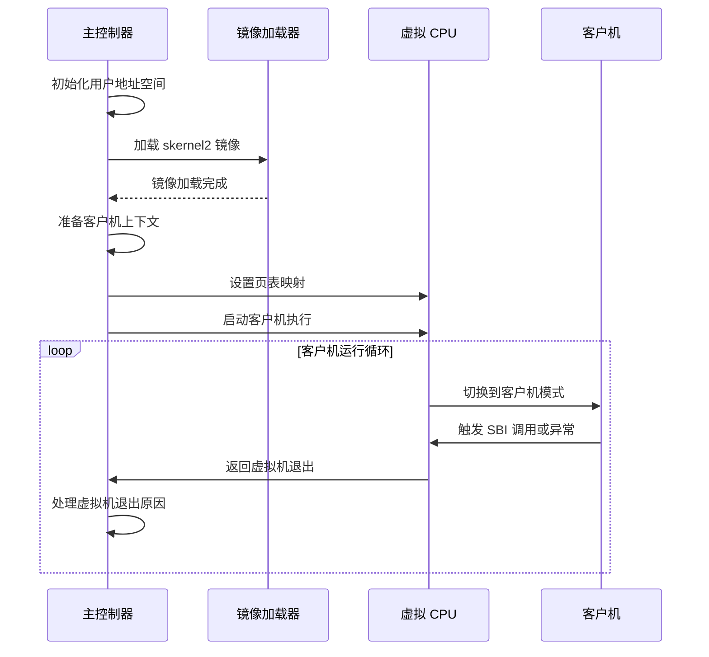

**图表来源**
- [main.rs](file://arceos/exercises/simple_hv/src/main.rs#L32-L56)

### 虚拟 CPU 管理器

虚拟 CPU 管理器负责维护虚拟 CPU 的完整状态，并提供上下文切换的底层实现。

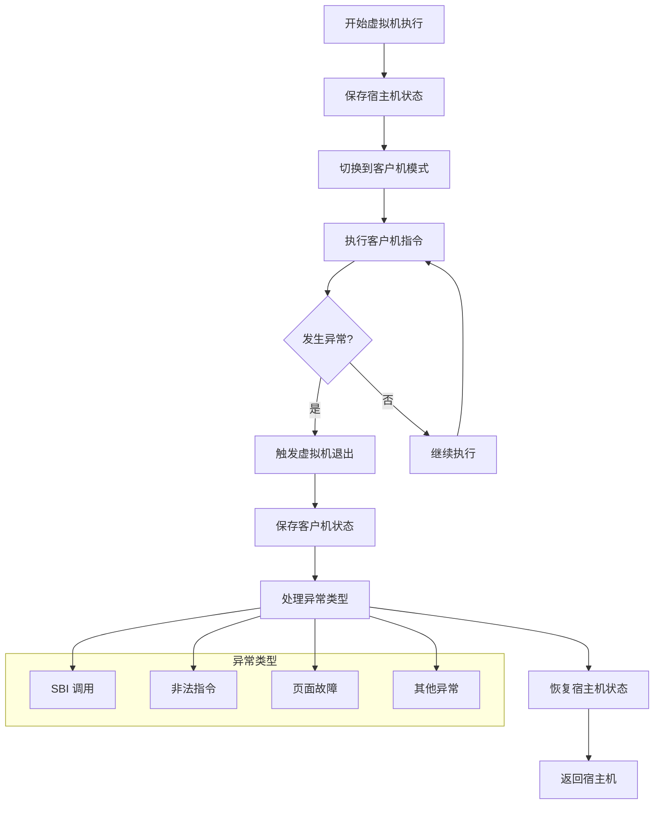

**图表来源**
- [main.rs](file://arceos/exercises/simple_hv/src/main.rs#L70-L126)
- [guest.S](file://arceos/exercises/simple_hv/src/guest.S#L1-L182)

**章节来源**
- [main.rs](file://arceos/exercises/simple_hv/src/main.rs#L32-L147)
- [vcpu.rs](file://arceos/exercises/simple_hv/src/vcpu.rs#L116-L187)

## 虚拟 CPU 创建与上下文切换

### 上下文切换机制

上下文切换是虚拟化系统中最核心的功能之一，它确保宿主机和客户机能够正确地共享处理器资源。

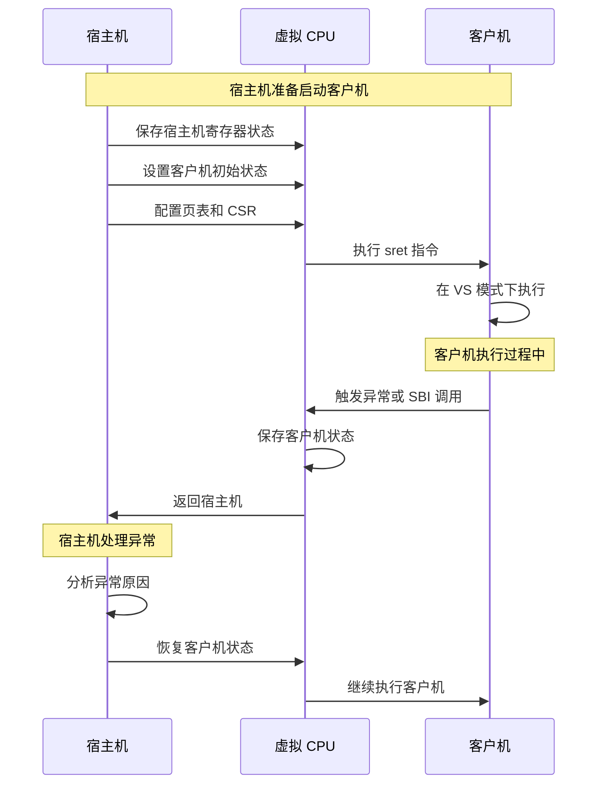

**图表来源**
- [guest.S](file://arceos/exercises/simple_hv/src/guest.S#L1-L182)

### CSR 状态管理

控制状态寄存器（CSR）的状态管理对于虚拟化至关重要，它决定了处理器在不同特权级别下的行为。

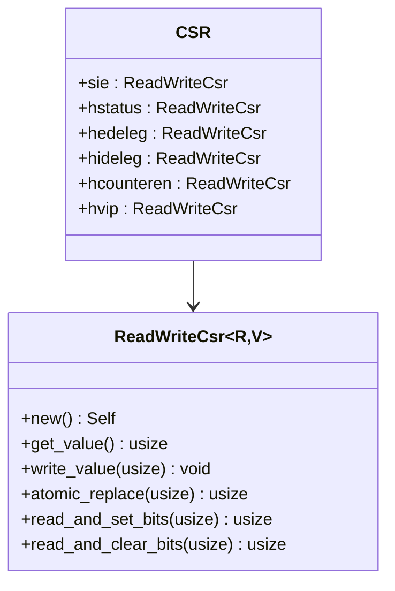

**图表来源**
- [csrs.rs](file://arceos/exercises/simple_hv/src/csrs.rs#L7-L25)

**章节来源**
- [guest.S](file://arceos/exercises/simple_hv/src/guest.S#L1-L182)
- [csrs.rs](file://arceos/exercises/simple_hv/src/csrs.rs#L1-L313)

## SBI 调用拦截与处理

### SBI 调用流程

Supervisor Binary Interface (SBI) 是 RISC-V 架构中用于宿主机和操作系统之间通信的标准接口。在虚拟化环境中，SBI 调用需要被 Hypervisor 拦截和处理。

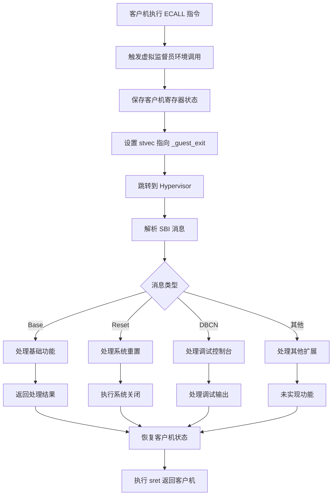

**图表来源**
- [main.rs](file://arceos/exercises/simple_hv/src/main.rs#L82-L126)
- [sbi/mod.rs](file://arceos/exercises/simple_hv/src/sbi/mod.rs#L65-L91)

### SBI 消息处理

SBI 消息的处理涉及多个扩展功能，每个扩展都有其特定的用途和实现方式。

| SBI 扩展 | 功能描述 | 实现状态 | 参数格式 |
|---------|---------|---------|---------|
| Base | 基础功能查询 | 已实现 | 版本号、ID、特性检测 |
| DBCN | 调试控制台 | 已实现 | 字符串地址和长度 |
| SRST | 系统重置 | 已实现 | 重启/关机参数 |
| RFNC | 远程栅栏 | 待实现 | 缓存一致性操作 |
| PMU | 性能监控 | 待实现 | 计数器访问 |

**章节来源**
- [main.rs](file://arceos/exercises/simple_hv/src/main.rs#L82-L126)
- [sbi/mod.rs](file://arceos/exercises/simple_hv/src/sbi/mod.rs#L1-L91)
- [sbi/base.rs](file://arceos/exercises/simple_hv/src/sbi/base.rs#L1-L36)
- [sbi/dbcn.rs](file://arceos/exercises/simple_hv/src/sbi/dbcn.rs#L1-L12)

## 异常处理机制

### 异常类型与处理

虚拟化系统中的异常处理需要区分不同类型的异常，并采取相应的处理策略。

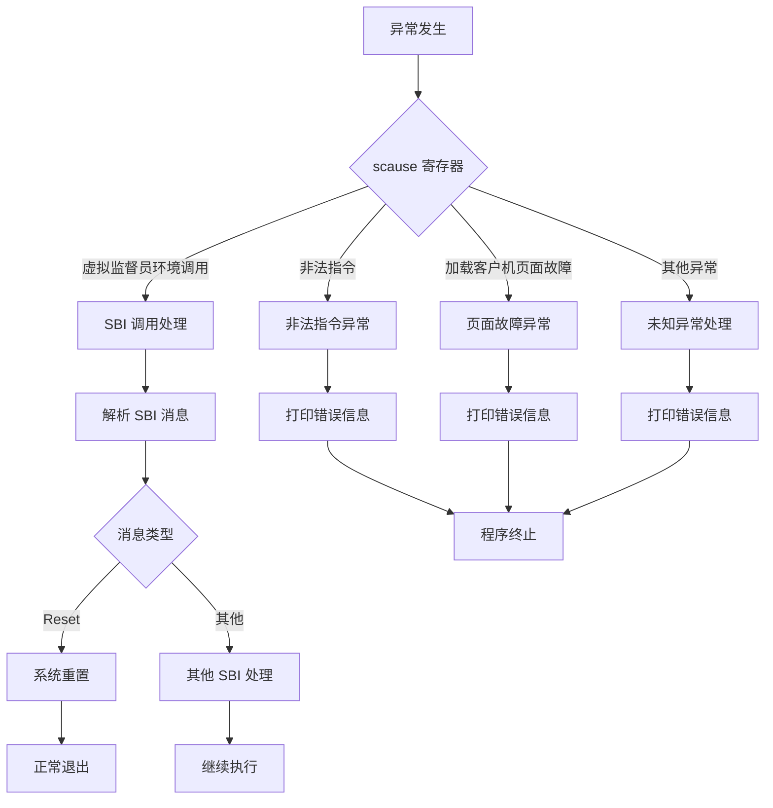

**图表来源**
- [main.rs](file://arceos/exercises/simple_hv/src/main.rs#L82-L126)

### 异常返回地址管理

异常返回地址的正确管理对于系统的稳定性至关重要，错误的返回地址会导致系统崩溃。

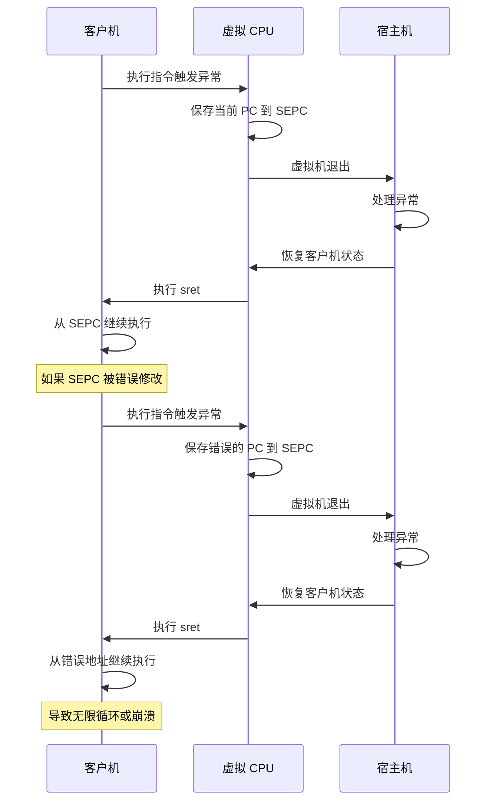

**章节来源**
- [main.rs](file://arceos/exercises/simple_hv/src/main.rs#L82-L126)

## 调试指南

### 使用 GDB 单步跟踪 trap 处理流程

调试虚拟化系统时，使用 GDB 对 trap 处理流程进行单步跟踪是非常重要的技能。

#### 调试环境配置

1. **编译调试版本**：确保使用调试符号编译项目
2. **设置断点**：在关键函数设置断点
3. **观察寄存器状态**：监控 CSR 和通用寄存器的变化

#### 关键调试点

```bash
# 启动 GDB 调试会话
gdb ./target/riscv64imac-unknown-none-elf/debug/simple_hv

# 设置断点
break main
break vmexit_handler
break _run_guest

# 单步执行
step
next

# 查看寄存器状态
info registers
info registers sstatus
info registers hstatus
info registers sepc
```

#### 跟踪上下文切换过程

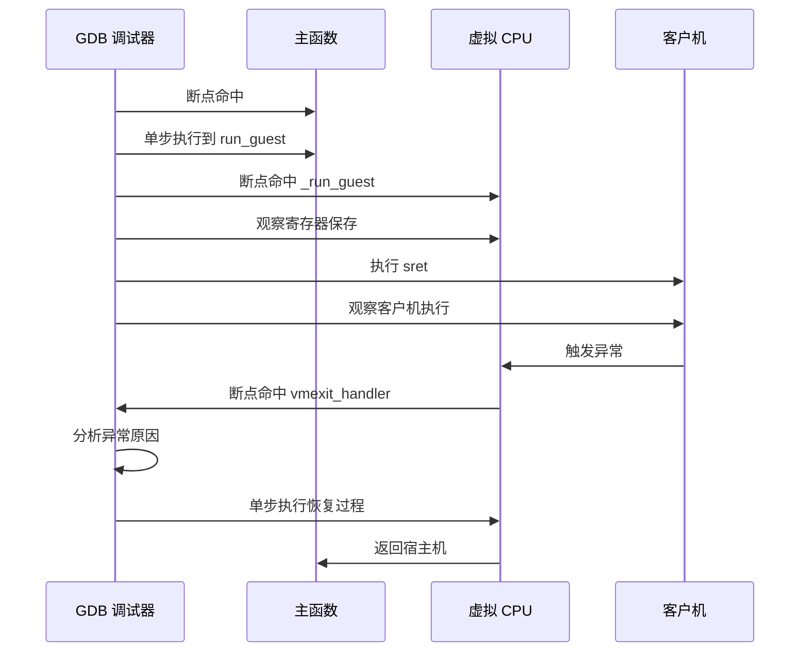

### 常见陷阱与调试技巧

#### 1. 异常返回地址错误

**问题表现**：程序陷入无限循环或崩溃
**调试方法**：
- 检查 SEPC 寄存器的值是否正确
- 验证 sret 指令执行前后的状态
- 使用 GDB 观察程序计数器的变化

#### 2. 寄存器状态保存不完整

**问题表现**：客户机行为异常或数据损坏
**调试方法**：
- 检查 guest.S 中的寄存器保存顺序
- 验证寄存器偏移量的计算
- 对比宿主机和客户机的寄存器状态

#### 3. SBI 调用参数错误

**问题表现**：SBI 调用失败或返回错误结果
**调试方法**：
- 检查 A0-A7 寄存器的值
- 验证 SBI 消息的解析逻辑
- 使用日志输出验证参数传递

## 常见问题与解决方案

### 问题分类与解决策略

#### 1. 编译相关问题

| 问题类型 | 症状 | 解决方案 |
|---------|------|---------|
| 汇编语法错误 | 编译时汇编器报错 | 检查 guest.S 中的汇编语法 |
| 寄存器偏移量错误 | 运行时访问越界 | 验证 memoffset::offset_of! 宏的使用 |
| 类型不匹配 | Rust 类型检查失败 | 确保结构体字段类型正确 |

#### 2. 运行时问题

| 问题类型 | 症状 | 解决方案 |
|---------|------|---------|
| 无限循环 | 程序无法正常退出 | 检查异常返回地址设置 |
| 数据损坏 | 客户机行为异常 | 验证寄存器保存/恢复逻辑 |
| 权限错误 | 访问违规异常 | 检查页表和 CSR 配置 |

#### 3. 调试相关问题

| 问题类型 | 症状 | 解决方案 |
|---------|------|---------|
| 断点失效 | GDB 无法命中断点 | 检查调试符号是否正确生成 |
| 寄存器显示错误 | GDB 显示寄存器值异常 | 验证寄存器布局定义 |
| 单步执行异常 | 程序计数器跳转错误 | 检查 SEPC 和 stvec 的设置 |

### 性能优化建议

#### 1. 上下文切换优化

- 减少不必要的寄存器保存/恢复
- 优化 CSR 状态切换逻辑
- 使用内联汇编减少函数调用开销

#### 2. 内存访问优化

- 合理安排结构体字段布局
- 使用对齐的内存访问
- 减少跨页边界访问

#### 3. 异常处理优化

- 快速路径处理常见异常
- 减少异常处理的分支预测失误
- 优化异常返回地址的计算

## 总结

simple_hv 练习为我们提供了一个深入理解虚拟化机制的绝佳机会。通过这个项目，我们学习了：

1. **虚拟 CPU 的创建和管理**：理解了虚拟 CPU 状态的保存和恢复机制
2. **上下文切换的实现**：掌握了宿主机和客户机之间的控制权转移
3. **SBI 调用的拦截与处理**：学会了如何处理客户机与宿主机之间的通信
4. **异常处理机制**：了解了虚拟化环境中的异常处理策略
5. **调试技巧**：掌握了使用 GDB 调试虚拟化系统的技能

这些知识不仅有助于理解现代虚拟化技术的工作原理，也为开发高性能的虚拟化系统奠定了坚实的基础。通过深入研究 simple_hv 项目的实现细节，我们可以更好地理解虚拟化技术的核心概念，并将其应用到更复杂的系统中。

在实际开发中，还需要注意以下几点：
- 保持寄存器状态的一致性
- 正确处理异常返回地址
- 优化上下文切换的性能
- 实现完善的错误处理机制

通过不断实践和调试，我们将能够掌握虚拟化系统开发的核心技能，为构建高质量的虚拟化解决方案做好准备。