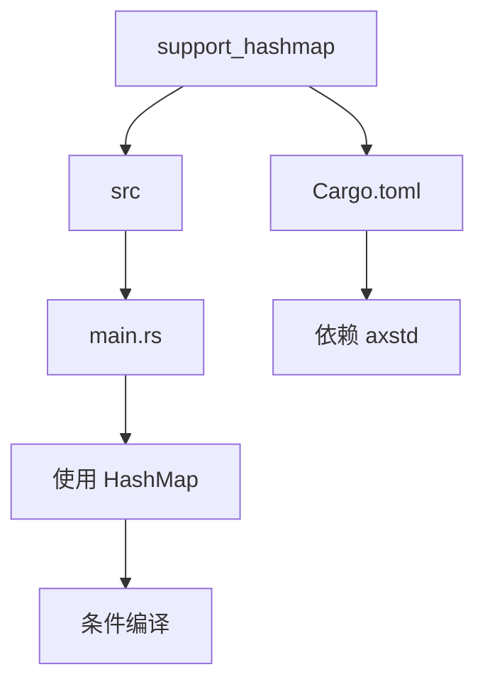
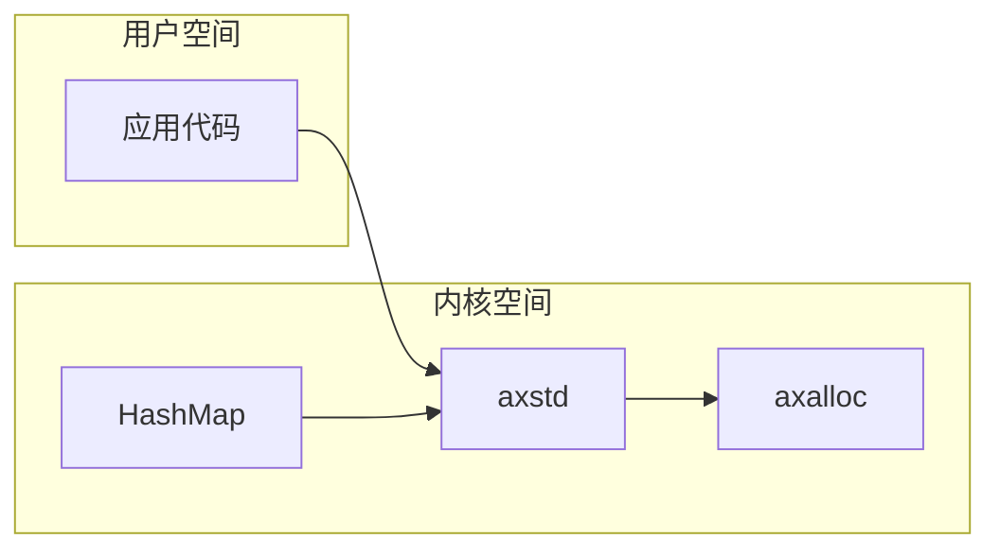
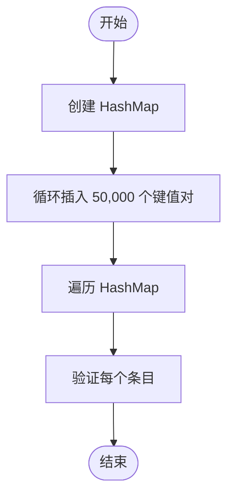
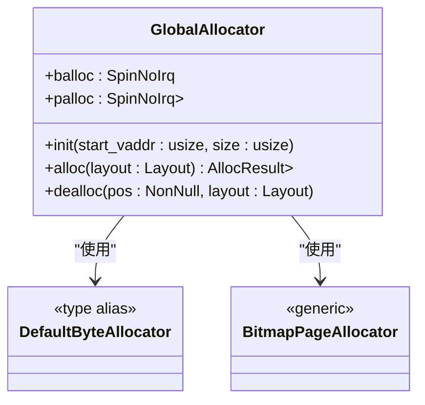
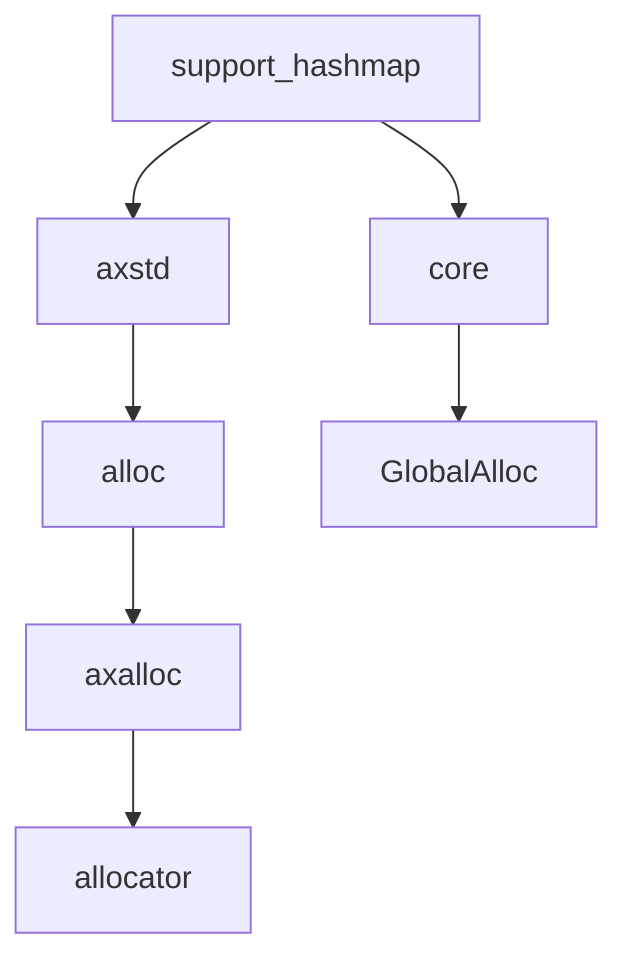

# support_hashmap 练习指导

<cite>
**本文档引用的文件**  
- [main.rs](file://arceos/exercises/support_hashmap/src/main.rs)
- [Cargo.toml](file://arceos/exercises/support_hashmap/Cargo.toml)
- [axalloc/src/lib.rs](file://arceos/modules/axalloc/src/lib.rs)
- [alt_axalloc/src/lib.rs](file://arceos/modules/alt_axalloc/src/lib.rs)
- [bump_allocator/src/lib.rs](file://arceos/modules/bump_allocator/src/lib.rs)
- [axstd](file://arceos/ulib/axstd)
- [Cargo.toml](file://arceos/Cargo.toml)
</cite>

## 目录
1. [简介](#简介)
2. [项目结构](#项目结构)
3. [核心组件](#核心组件)
4. [架构概述](#架构概述)
5. [详细组件分析](#详细组件分析)
6. [依赖分析](#依赖分析)
7. [性能考量](#性能考量)
8. [故障排除指南](#故障排除指南)
9. [结论](#结论)

## 简介
本指导文档详细说明了如何在操作系统内核环境中集成和使用标准库 HashMap 数据结构。重点介绍在 `no_std` 环境下配置 hash 和 collections crate 的方法，包括启用 `allocator_api` 特性与适配自定义分配器。通过实例展示 HashMap 在任务管理、资源索引等场景中的典型应用模式，分析其性能特征（如哈希冲突、内存开销）及在内核中使用的注意事项（如不可 panic、确定性行为）。同时提供编译失败或运行时崩溃的常见原因分析与解决路径。

## 项目结构
`support_hashmap` 练习位于 ArceOS 操作系统框架的 exercises 目录下，旨在演示如何在操作系统内核中使用标准库的 HashMap 数据结构。该项目依赖于 `axstd` 库提供的内存分配功能，并通过条件编译特性来控制标准库的使用。

**图示来源**  
- [Cargo.toml](file://arceos/exercises/support_hashmap/Cargo.toml#L1-L7)
- [main.rs](file://arceos/exercises/support_hashmap/src/main.rs#L1-L30)

**本节来源**  
- [arceos/exercises/support_hashmap](file://arceos/exercises/support_hashmap)

## 核心组件
`support_hashmap` 练习的核心在于演示如何在 `no_std` 环境下使用 Rust 标准库的集合类型，特别是 HashMap。该练习通过 `axstd` 库实现了对 `alloc` 特性的支持，使得可以在没有完整标准库的情况下使用动态内存分配和集合类型。

**本节来源**  
- [main.rs](file://arceos/exercises/support_hashmap/src/main.rs#L1-L30)
- [Cargo.toml](file://arceos/exercises/support_hashmap/Cargo.toml#L1-L7)

## 架构概述
`support_hashmap` 练习的架构基于 ArceOS 操作系统的模块化设计，利用 `axalloc` 模块作为全局内存分配器，`axstd` 作为标准库的替代实现。通过条件编译特性，可以在需要时启用标准库功能，从而在内核环境中安全地使用 HashMap 等数据结构。

**图示来源**  
- [axstd](file://arceos/ulib/axstd)
- [axalloc/src/lib.rs](file://arceos/modules/axalloc/src/lib.rs#L1-L234)

## 详细组件分析

### HashMap 使用分析
`support_hashmap` 练习中的 `test_hashmap` 函数展示了如何在内核环境中使用 HashMap。函数创建了一个 HashMap 实例，插入了 50,000 个键值对，然后遍历并验证所有条目。

**图示来源**  
- [main.rs](file://arceos/exercises/support_hashmap/src/main.rs#L17-L30)

**本节来源**  
- [main.rs](file://arceos/exercises/support_hashmap/src/main.rs#L17-L30)

### 内存分配器分析
ArceOS 使用 `axalloc` 模块作为全局内存分配器，该模块实现了 `GlobalAlloc` trait。`axalloc` 提供了多种分配策略，包括 TLSF、Slab 和 Buddy 分配器，可以根据需要选择合适的分配策略。

**图示来源**  
- [axalloc/src/lib.rs](file://arceos/modules/axalloc/src/lib.rs#L50-L196)

**本节来源**  
- [axalloc/src/lib.rs](file://arceos/modules/axalloc/src/lib.rs#L1-L234)

## 依赖分析
`support_hashmap` 练习依赖于多个 ArceOS 模块，这些模块共同提供了在 `no_std` 环境下使用标准库功能所需的基础支持。

**图示来源**  
- [Cargo.toml](file://arceos/exercises/support_hashmap/Cargo.toml#L1-L7)
- [axstd](file://arceos/ulib/axstd)
- [axalloc](file://arceos/modules/axalloc)

**本节来源**  
- [Cargo.toml](file://arceos/exercises/support_hashmap/Cargo.toml#L1-L7)
- [axstd](file://arceos/ulib/axstd)
- [axalloc](file://arceos/modules/axalloc)

## 性能考量
在内核环境中使用 HashMap 需要考虑性能和内存使用效率。由于内核环境对稳定性和性能要求极高，应避免频繁的内存分配和释放操作。建议在初始化阶段预分配足够的内存，并尽量减少运行时的动态分配。

## 故障排除指南
当 `support_hashmap` 练习出现编译或运行时错误时，常见的问题包括：
- 未正确启用 `axstd` 的 `alloc` 特性
- 内存分配器未正确初始化
- `no_std` 环境下缺少必要的语言项

**本节来源**  
- [main.rs](file://arceos/exercises/support_hashmap/src/main.rs#L1-L30)
- [axalloc/src/lib.rs](file://arceos/modules/axalloc/src/lib.rs#L1-L234)

## 结论
`support_hashmap` 练习成功演示了如何在操作系统内核中集成和使用标准库 HashMap 数据结构。通过合理配置 `axstd` 和 `axalloc` 模块，可以在 `no_std` 环境下安全高效地使用动态数据结构，为更复杂的功能开发奠定了基础。