# sys_map 练习指导

<cite>
**本文档中引用的文件**
- [main.rs](file://arceos/exercises/sys_map/src/main.rs)
- [syscall.rs](file://arceos/exercises/sys_map/src/syscall.rs)
- [task.rs](file://arceos/exercises/sys_map/src/task.rs)
- [loader.rs](file://arceos/exercises/sys_map/src/loader.rs)
- [trap.rs](file://arceos/modules/axhal/src/trap.rs)
- [task.rs](file://arceos/tour/m_1_0/src/task.rs)
- [lib.rs](file://arceos/api/arceos_posix_api/src/lib.rs)
- [task.rs](file://arceos/api/arceos_posix_api/src/imp/task.rs)
- [io.rs](file://arceos/api/arceos_posix_api/src/imp/io.rs)
</cite>

## 目录
1. [概述](#概述)
2. [项目结构分析](#项目结构分析)
3. [系统调用映射表设计](#系统调用映射表设计)
4. [陷阱中心与分发机制](#陷阱中心与分发机制)
5. [任务上下文管理](#任务上下文管理)
6. [系统调用接口实现](#系统调用接口实现)
7. [核心组件详细分析](#核心组件详细分析)
8. [常见实现错误与调试](#常见实现错误与调试)
9. [性能优化考虑](#性能优化考虑)
10. [总结](#总结)

## 概述

sys_map 练习是 ArceOS 操作系统中的一个重要练习，它深入展示了系统调用映射表的设计与实现机制。通过这个练习，开发者可以理解如何定义系统调用号、注册系统调用处理函数、在陷阱中心分发调用请求的完整流程。

系统调用是用户程序与内核交互的核心机制，它通过特定的指令（如 `int 0x80` 或 `syscall`）触发，将控制权从用户态转移到内核态。sys_map 练习重点展示了这一过程的技术细节，包括系统调用号的定义、处理函数的注册、参数传递机制以及返回值处理。

## 项目结构分析

sys_map 练习的项目结构清晰地展示了系统调用处理的各个层次：

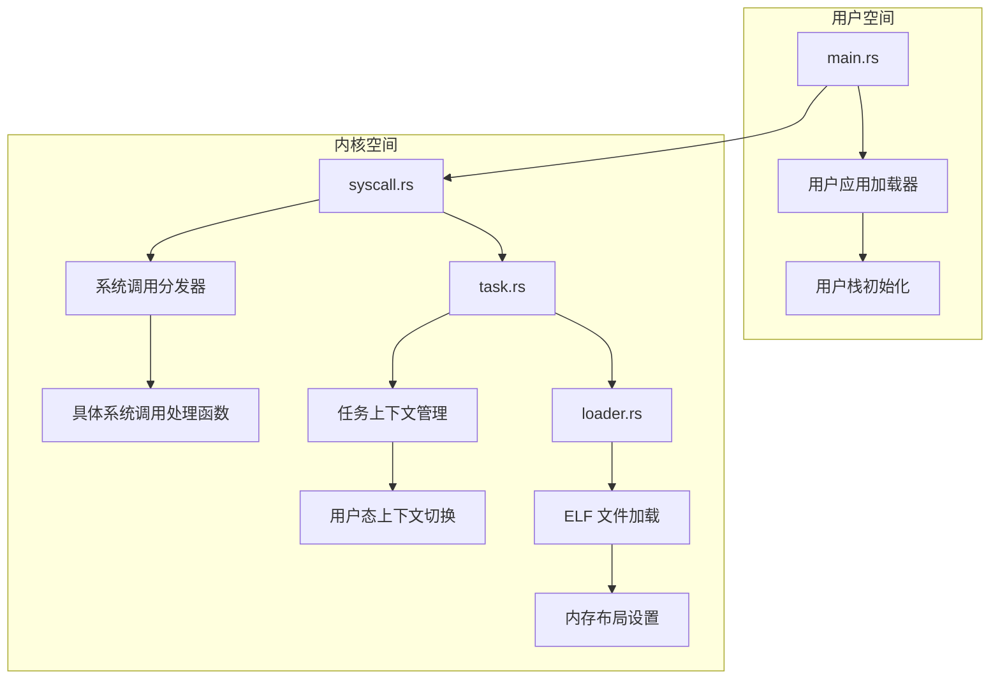

**图表来源**
- [main.rs](file://arceos/exercises/sys_map/src/main.rs#L1-L83)
- [syscall.rs](file://arceos/exercises/sys_map/src/syscall.rs#L1-L177)
- [task.rs](file://arceos/exercises/sys_map/src/task.rs#L1-L72)
- [loader.rs](file://arceos/exercises/sys_map/src/loader.rs#L1-L77)

**章节来源**
- [main.rs](file://arceos/exercises/sys_map/src/main.rs#L1-L83)
- [syscall.rs](file://arceos/exercises/sys_map/src/syscall.rs#L1-L177)
- [task.rs](file://arceos/exercises/sys_map/src/task.rs#L1-L72)
- [loader.rs](file://arceos/exercises/sys_map/src/loader.rs#L1-L77)

## 系统调用映射表设计

### 系统调用号定义

系统调用号是系统调用的唯一标识符，每个系统调用都有一个对应的数字。在 sys_map 练习中，系统调用号被明确定义：

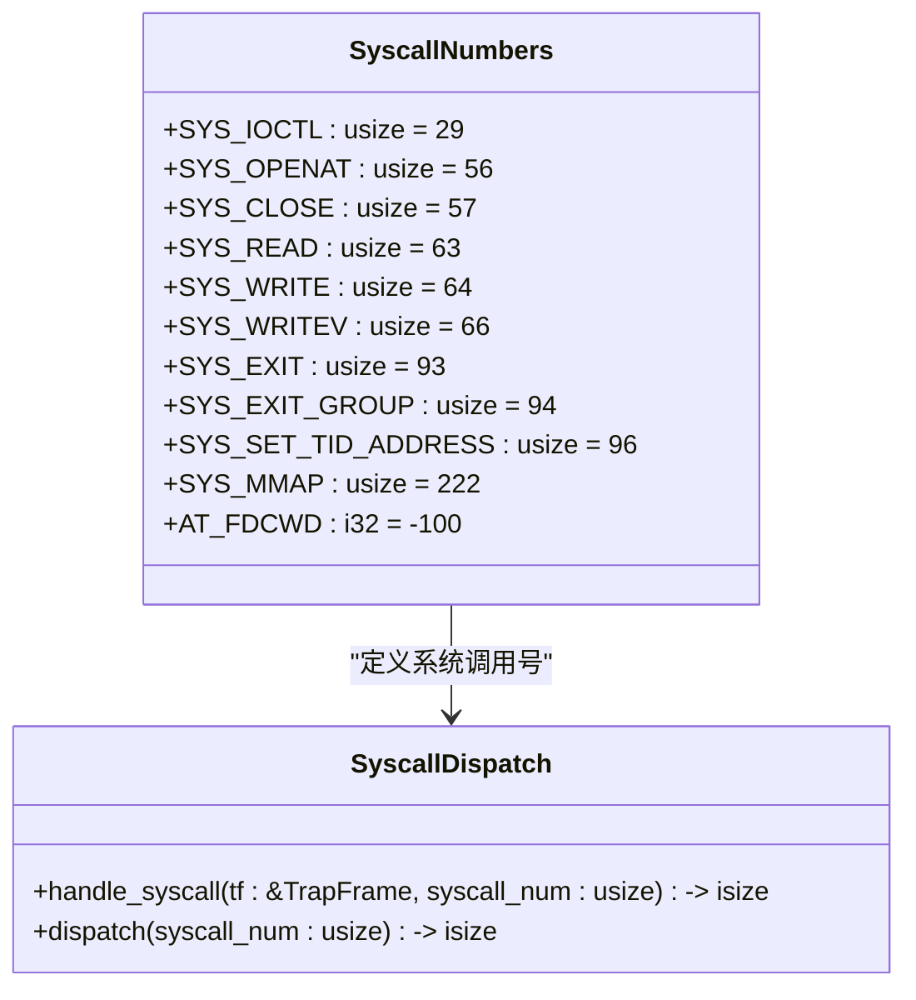

**图表来源**
- [syscall.rs](file://arceos/exercises/sys_map/src/syscall.rs#L12-L22)

### 系统调用映射表结构

系统调用映射表是一个关键的数据结构，它将系统调用号映射到相应的处理函数。在 ArceOS 中，这个映射通过宏和分布式切片机制实现：

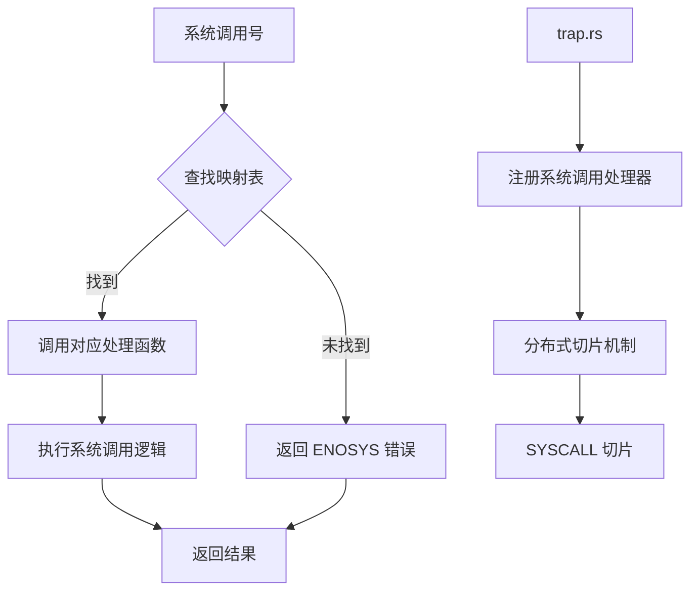

**图表来源**
- [trap.rs](file://arceos/modules/axhal/src/trap.rs#L20-L23)
- [syscall.rs](file://arceos/exercises/sys_map/src/syscall.rs#L99-L132)

**章节来源**
- [syscall.rs](file://arceos/exercises/sys_map/src/syscall.rs#L12-L22)
- [trap.rs](file://arceos/modules/axhal/src/trap.rs#L20-L23)

## 陷阱中心与分发机制

### 陷阱处理架构

ArceOS 的陷阱处理采用模块化设计，通过分布式切片机制实现可扩展的陷阱处理：

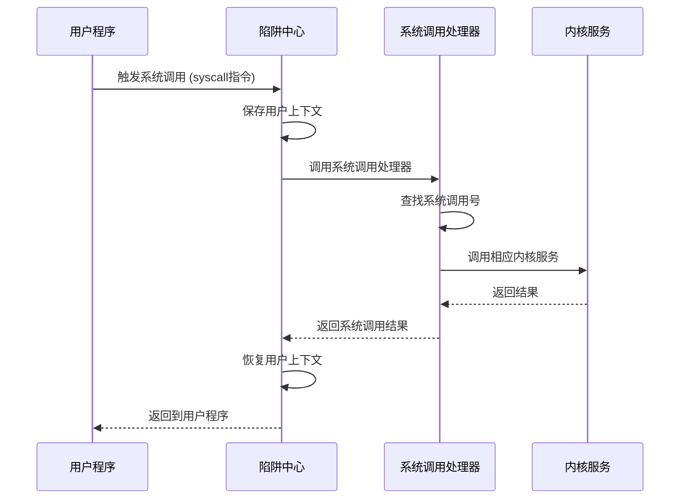

**图表来源**
- [trap.rs](file://arceos/modules/axhal/src/trap.rs#L42-L45)
- [syscall.rs](file://arceos/exercises/sys_map/src/syscall.rs#L99-L132)

### 系统调用分发流程

系统调用分发是整个系统调用处理的核心环节：

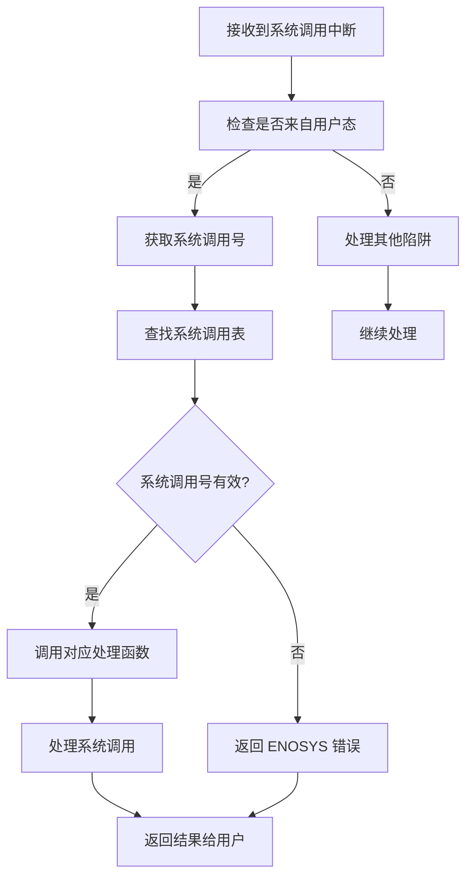

**图表来源**
- [syscall.rs](file://arceos/exercises/sys_map/src/syscall.rs#L99-L132)

**章节来源**
- [trap.rs](file://arceos/modules/axhal/src/trap.rs#L42-L45)
- [syscall.rs](file://arceos/exercises/sys_map/src/syscall.rs#L99-L132)

## 任务上下文管理

### 任务扩展数据结构

任务上下文管理是系统调用处理的重要组成部分，它维护了每个任务的用户态上下文：

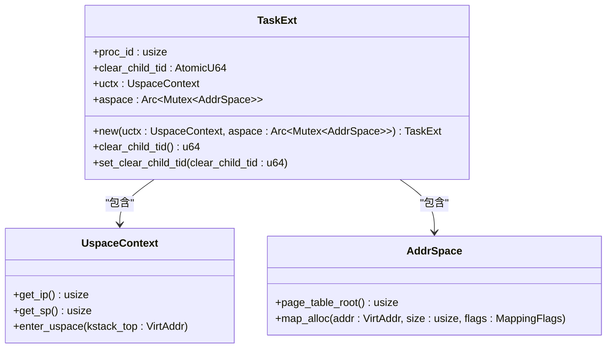

**图表来源**
- [task.rs](file://arceos/exercises/sys_map/src/task.rs#L12-L46)

### 用户态上下文切换

用户态上下文切换是系统调用处理的关键步骤：

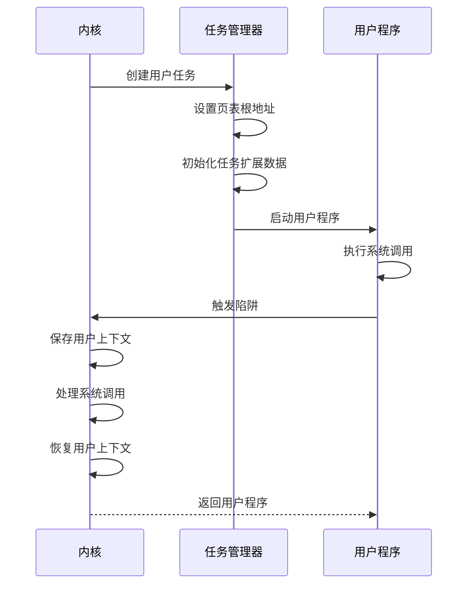

**图表来源**
- [task.rs](file://arceos/exercises/sys_map/src/task.rs#L51-L71)

**章节来源**
- [task.rs](file://arceos/exercises/sys_map/src/task.rs#L12-L71)

## 系统调用接口实现

### 系统调用宏机制

ArceOS 使用宏机制简化系统调用的实现，提供统一的错误处理和日志记录：

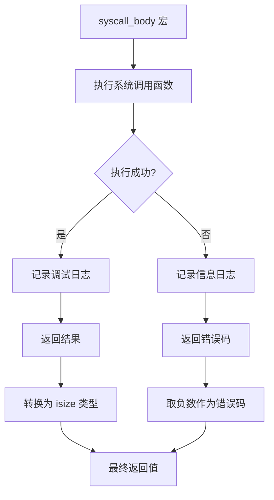

**图表来源**
- [syscall.rs](file://arceos/exercises/sys_map/src/syscall.rs#L25-L45)

### 具体系统调用实现

以常见的系统调用为例，展示如何实现系统调用处理函数：

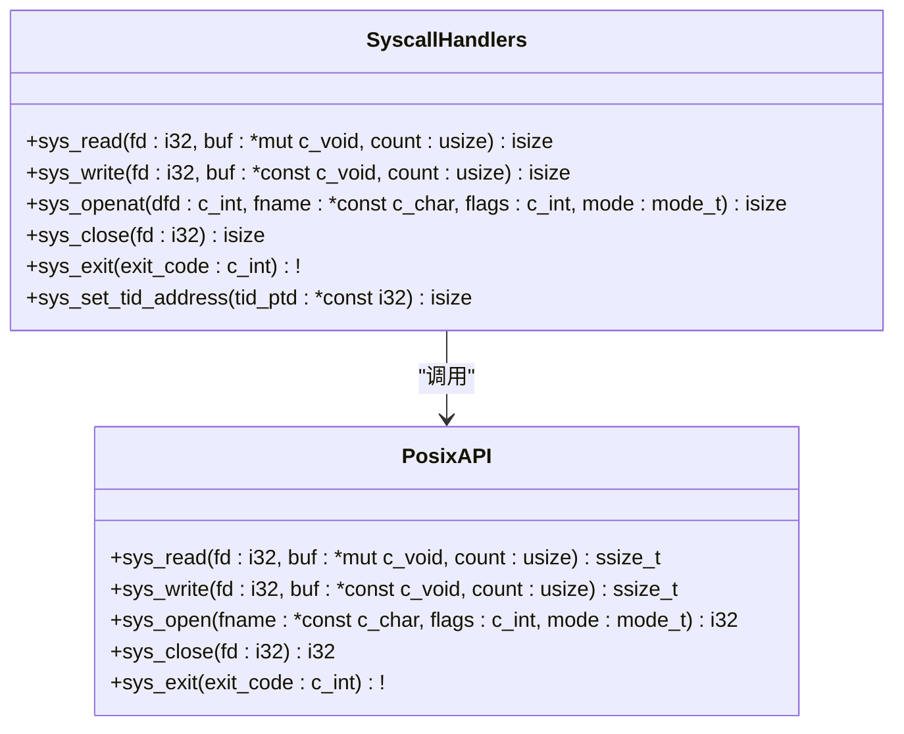

**图表来源**
- [syscall.rs](file://arceos/exercises/sys_map/src/syscall.rs#L146-L176)
- [io.rs](file://arceos/api/arceos_posix_api/src/imp/io.rs#L13-L72)

**章节来源**
- [syscall.rs](file://arceos/exercises/sys_map/src/syscall.rs#L25-L45)
- [syscall.rs](file://arceos/exercises/sys_map/src/syscall.rs#L146-L176)
- [io.rs](file://arceos/api/arceos_posix_api/src/imp/io.rs#L13-L72)

## 核心组件详细分析

### 主程序入口分析

主程序负责初始化用户地址空间、加载用户程序并启动用户任务：

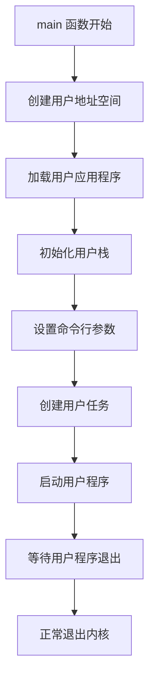

**图表来源**
- [main.rs](file://arceos/exercises/sys_map/src/main.rs#L29-L53)

### ELF 文件加载机制

ELF 文件加载是系统调用练习的重要组成部分：

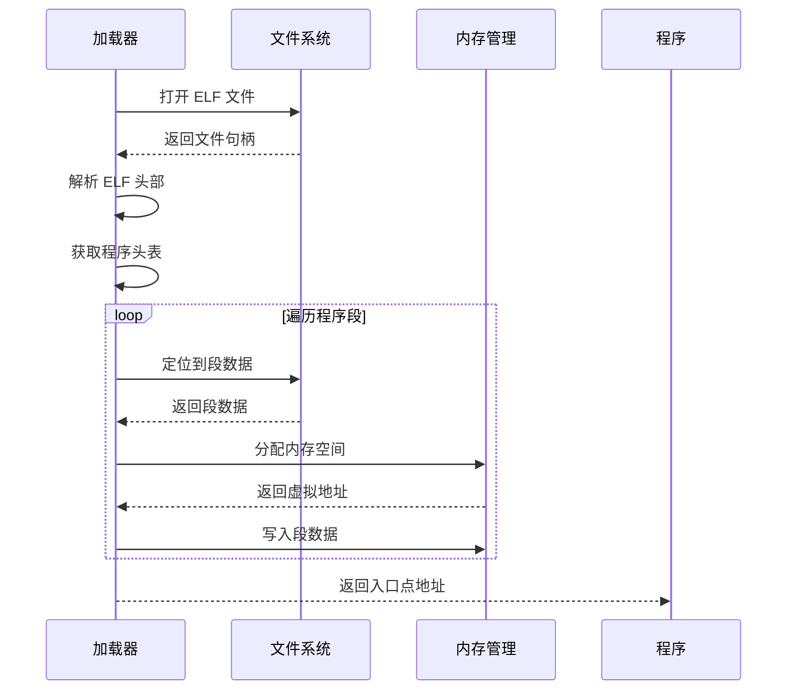

**图表来源**
- [loader.rs](file://arceos/exercises/sys_map/src/loader.rs#L20-L50)

### 系统调用处理函数分析

系统调用处理函数展示了如何正确处理各种系统调用：

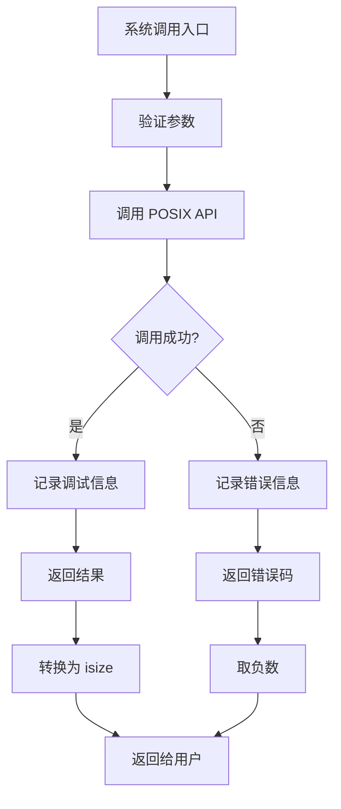

**图表来源**
- [syscall.rs](file://arceos/exercises/sys_map/src/syscall.rs#L99-L132)

**章节来源**
- [main.rs](file://arceos/exercises/sys_map/src/main.rs#L29-L53)
- [loader.rs](file://arceos/exercises/sys_map/src/loader.rs#L20-L50)
- [syscall.rs](file://arceos/exercises/sys_map/src/syscall.rs#L99-L132)

## 常见实现错误与调试

### 系统调用号冲突

系统调用号冲突是最常见的问题之一。在实现时需要注意：

| 错误类型 | 描述 | 解决方案 |
|---------|------|----------|
| 号码重复 | 不同系统调用使用相同号码 | 确保每个系统调用有唯一编号 |
| 范围重叠 | 用户定义与标准系统调用范围重叠 | 使用预留的系统调用号范围 |
| 平台差异 | 不同架构下系统调用号不一致 | 使用条件编译处理平台差异 |

### 参数传递错误

参数传递是系统调用中最容易出错的部分：

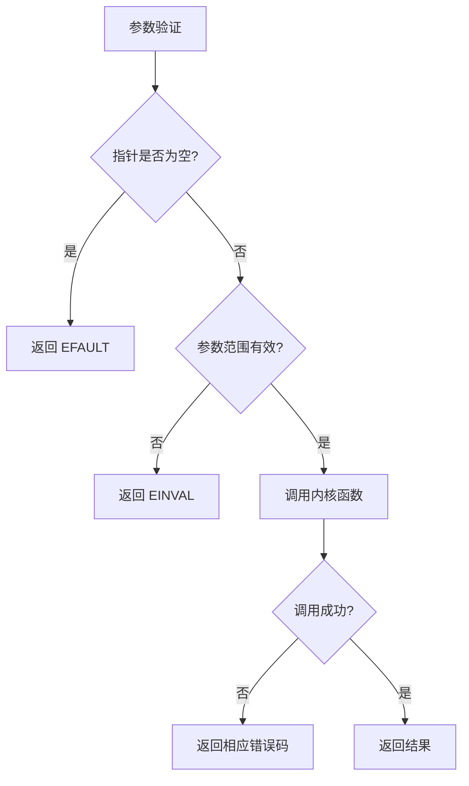

### 返回值处理不当

正确的返回值处理对于系统调用的稳定性至关重要：

| 返回值类型 | 处理方式 | 注意事项 |
|-----------|----------|----------|
| 成功值 | 直接返回 | 确保类型转换正确 |
| 错误码 | 取负数返回 | 使用 LinuxError 枚举 |
| 字节数 | 正常返回 | 检查溢出情况 |
| 文件描述符 | 正常返回 | 验证有效性 |

### 调试方法

有效的调试方法可以帮助快速定位系统调用问题：

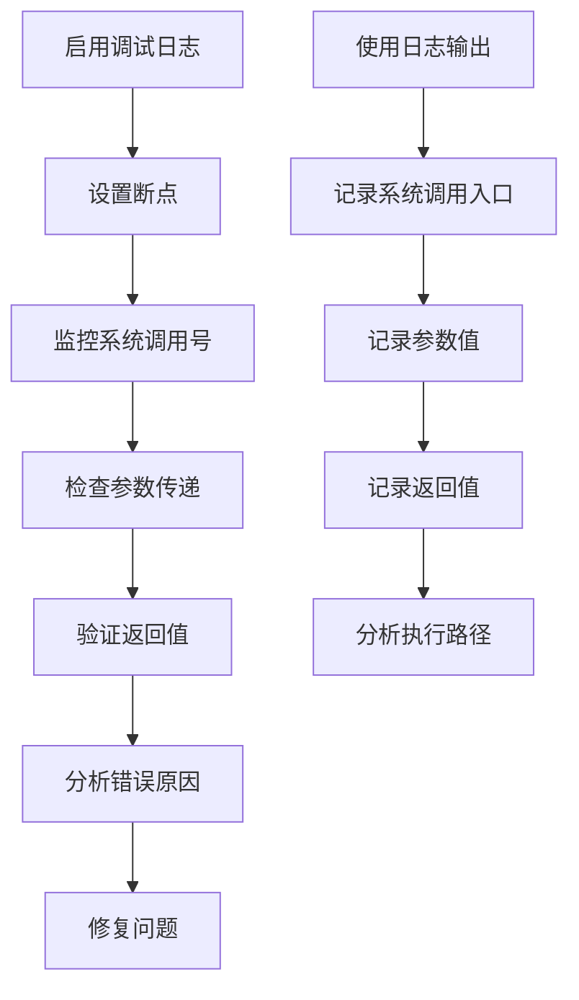

**章节来源**
- [syscall.rs](file://arceos/exercises/sys_map/src/syscall.rs#L25-L45)
- [io.rs](file://arceos/api/arceos_posix_api/src/imp/io.rs#L13-L72)

## 性能优化考虑

### 系统调用优化策略

系统调用的性能优化主要集中在减少开销和提高效率：

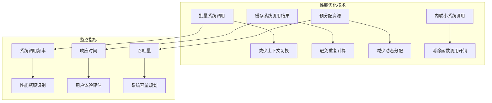

### 内存管理优化

系统调用中的内存管理对性能影响显著：

| 优化技术 | 应用场景 | 效果 |
|---------|----------|------|
| 内存池 | 频繁的小对象分配 | 减少分配开销 |
| 缓存友好访问 | 大块数据传输 | 提高缓存命中率 |
| 零拷贝技术 | 网络和文件操作 | 减少内存复制 |
| 内存映射 | 大文件处理 | 直接访问文件内容 |

## 总结

sys_map 练习深入展示了系统调用映射表的设计与实现机制，涵盖了从系统调用号定义、注册处理函数、陷阱中心分发到任务上下文管理的完整流程。通过这个练习，开发者可以：

1. **理解系统调用的基本原理**：掌握用户态与内核态之间的交互机制
2. **熟悉系统调用映射表设计**：了解如何定义和管理系统调用号
3. **掌握陷阱处理机制**：学习如何在内核中处理各种类型的陷阱
4. **学会任务上下文管理**：理解用户态上下文的保存和恢复
5. **提高调试技能**：掌握系统调用链路的调试方法

系统调用是操作系统的核心功能，其设计和实现直接影响系统的稳定性和性能。通过深入理解 sys_map 练习中的技术细节，开发者能够更好地设计和实现高质量的操作系统内核。

在实际开发中，还需要注意以下几点：
- 确保系统调用接口的稳定性，避免频繁变更
- 实现完善的错误处理机制
- 保持良好的性能特征
- 提供充分的调试和诊断支持

这些技术和经验对于开发高性能、稳定的系统软件具有重要意义。