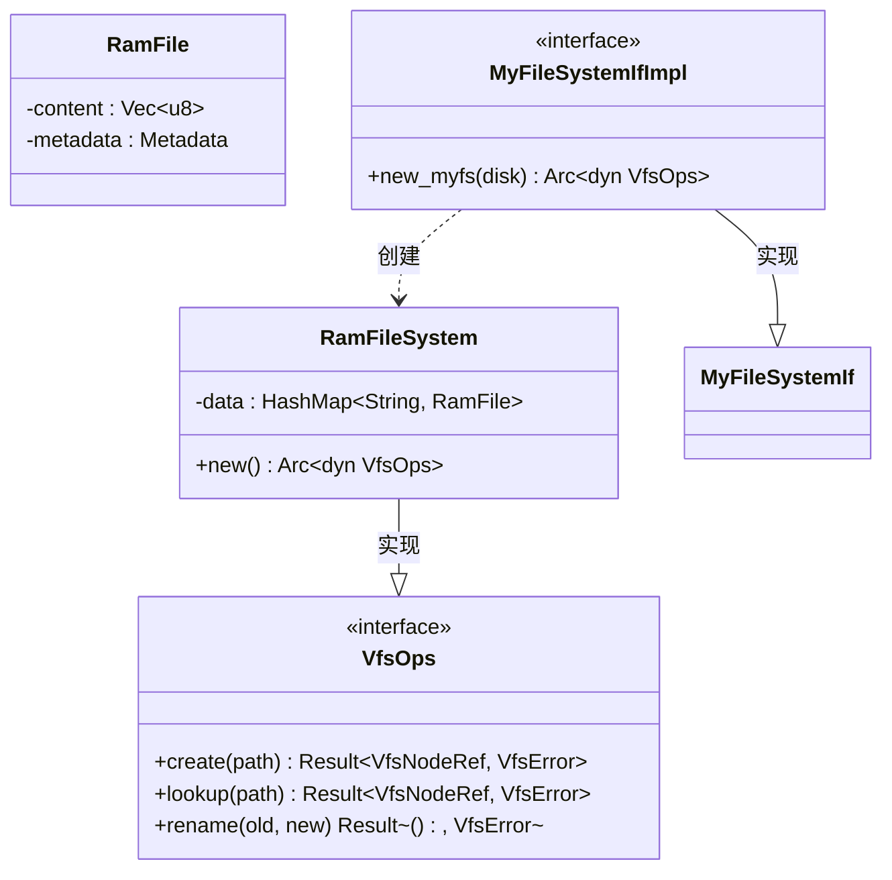
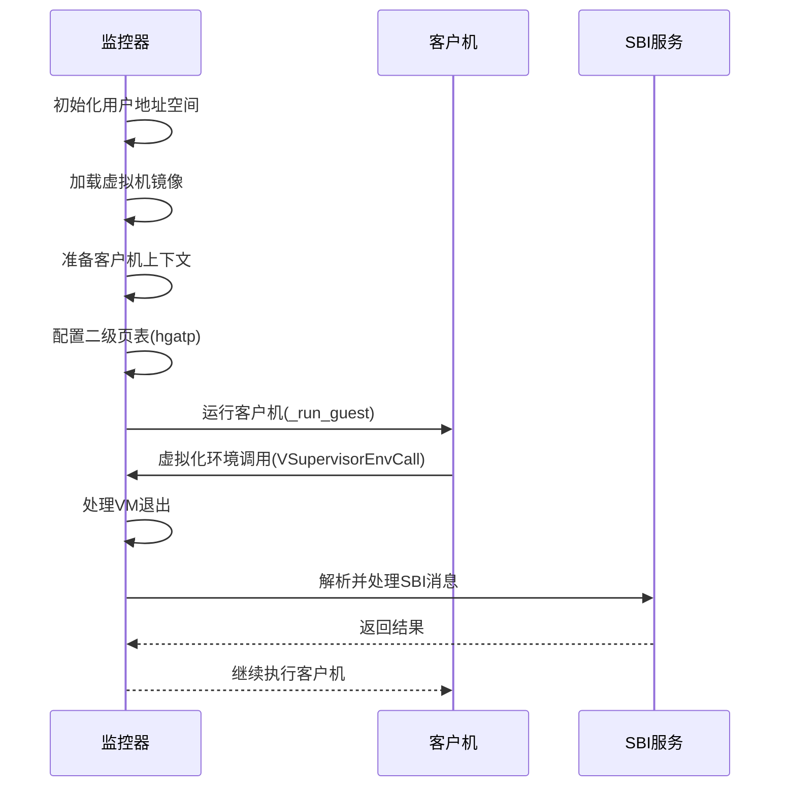
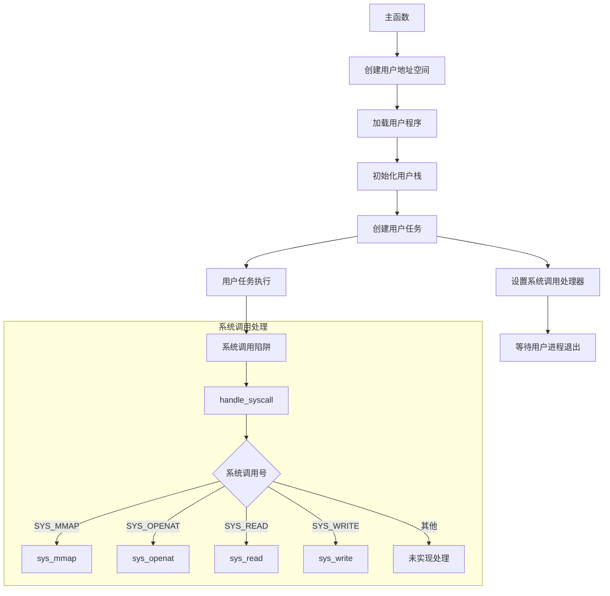

# 练习项目指导

<cite>
**本文档中引用的文件**  
- [main.rs](file://arceos/exercises/alt_alloc/src/main.rs)
- [Cargo.toml](file://arceos/exercises/alt_alloc/Cargo.toml)
- [main.rs](file://arceos/exercises/print_with_color/src/main.rs)
- [Cargo.toml](file://arceos/exercises/print_with_color/Cargo.toml)
- [main.rs](file://arceos/exercises/ramfs_rename/src/main.rs)
- [ramfs.rs](file://arceos/exercises/ramfs_rename/src/ramfs.rs)
- [Cargo.toml](file://arceos/exercises/ramfs_rename/Cargo.toml)
- [main.rs](file://arceos/exercises/simple_hv/src/main.rs)
- [Cargo.toml](file://arceos/exercises/simple_hv/Cargo.toml)
- [main.rs](file://arceos/exercises/support_hashmap/src/main.rs)
- [Cargo.toml](file://arceos/exercises/support_hashmap/Cargo.toml)
- [main.rs](file://arceos/exercises/sys_map/src/main.rs)
- [syscall.rs](file://arceos/exercises/sys_map/src/syscall.rs)
- [task.rs](file://arceos/exercises/sys_map/src/task.rs)
- [Cargo.toml](file://arceos/exercises/sys_map/Cargo.toml)
- [lib.rs](file://arceos/modules/alt_axalloc/src/lib.rs)
- [lib.rs](file://arceos/modules/axalloc/src/lib.rs)
</cite>

## 目录
1. [简介](#简介)
2. [alt_alloc 练习指导](#alt_alloc-练习指导)
3. [print_with_color 练习指导](#print_with_color-练习指导)
4. [ramfs_rename 练习指导](#ramfs_rename-练习指导)
5. [simple_hv 练习指导](#simple_hv-练习指导)
6. [support_hashmap 练习指导](#support_hashmap-练习指导)
7. [sys_map 练习指导](#sys_map-练习指导)
8. [常见错误与调试建议](#常见错误与调试建议)
9. [结论](#结论)

## 简介
本指导文档旨在为 ArceOS 操作系统练习项目提供详细的背景知识、技术目标和实现指引。通过完成这些练习，开发者将深入掌握操作系统核心机制，包括内存管理、文件系统、任务调度、虚拟化和系统调用等关键技术。每个练习都聚焦于特定的技术领域，从替换默认分配器到实现虚拟化监控器，逐步构建对操作系统底层原理的全面理解。

## alt_alloc 练习指导

该练习旨在理解如何替换操作系统的默认内存分配器。在 ArceOS 中，`alt_alloc` 练习通过使用一个简单的 bump 分配器来替代默认的复杂分配器，帮助开发者理解内存分配器的基本工作原理。

技术要点包括：
- 理解 `bump_allocator` 的工作原理：它通过维护一个指针来跟踪已分配内存的边界，每次分配时只需移动指针即可
- 掌握如何通过 Cargo.toml 中的 features 机制启用替代分配器
- 理解分配器的初始化过程和内存区域管理

实现指引：
1. 分析 `alt_axalloc` 模块中的 `GlobalAllocator` 实现
2. 理解 `EarlyAllocator` 如何在启动早期阶段提供基本的内存分配功能
3. 观察 `alt_alloc` 练习如何通过特征（feature）机制启用替代分配器

**Section sources**
- [main.rs](file://arceos/exercises/alt_alloc/src/main.rs#L1-L27)
- [Cargo.toml](file://arceos/exercises/alt_alloc/Cargo.toml#L1-L10)
- [lib.rs](file://arceos/modules/alt_axalloc/src/lib.rs#L1-L122)

## print_with_color 练习指导

该练习涉及控制台输出与 ANSI 转义码的实现，旨在理解如何在终端中实现彩色输出。

技术要点包括：
- 理解 ANSI 转义序列的基本格式：`\x1b[属性;前景色;背景色m`
- 掌握不同颜色代码的含义（30-37为前景色，40-47为背景色）
- 理解终端对转义序列的解析机制

实现指引：
1. 分析 `axstd` 库中的 `println!` 宏如何处理格式化输出
2. 理解底层显示驱动如何将 ANSI 转义序列转换为实际的显示效果
3. 探索如何扩展 `axdisplay` 模块以支持更多终端控制功能

**Section sources**
- [main.rs](file://arceos/exercises/print_with_color/src/main.rs#L1-L11)
- [Cargo.toml](file://arceos/exercises/print_with_color/Cargo.toml#L1-L8)

## ramfs_rename 练习指导

该练习要求理解 RAMFS 文件系统接口，特别是文件重命名操作的实现。

技术要点包括：
- 理解 RAMFS（内存文件系统）的基本概念和特点
- 掌握 VFS（虚拟文件系统）抽象层的工作原理
- 理解文件重命名操作的语义和限制（仅支持同目录重命名，不支持跨目录移动）

实现指引：
1. 分析 `ramfs.rs` 文件中 `MyFileSystemIfImpl` 的实现
2. 理解 `crate_interface` 宏如何实现接口注册机制
3. 观察 `axfs_ramfs` 模块如何实现基于内存的文件系统操作

**Diagram sources**
- [ramfs.rs](file://arceos/exercises/ramfs_rename/src/ramfs.rs#L1-L16)
- [main.rs](file://arceos/exercises/ramfs_rename/src/main.rs#L1-L55)

**Section sources**
- [main.rs](file://arceos/exercises/ramfs_rename/src/main.rs#L1-L55)
- [ramfs.rs](file://arceos/exercises/ramfs_rename/src/ramfs.rs#L1-L16)
- [Cargo.toml](file://arceos/exercises/ramfs_rename/Cargo.toml#L1-L17)

## simple_hv 练习指导

该练习涉及虚拟化与系统调用机制，旨在实现一个简单的 RISC-V 虚拟化监控器（Hypervisor）。

技术要点包括：
- 理解 RISC-V H 扩展中的虚拟化机制
- 掌握 HS-mode（Hypervisor Supervisor Mode）和 VS-mode（Virtual Supervisor Mode）的切换
- 理解 `hgatp` 寄存器在二级地址转换中的作用
- 分析虚拟机退出（VM Exit）的处理流程

实现指引：
1. 理解 `prepare_guest_context` 函数如何设置虚拟机的初始上下文
2. 分析 `prepare_vm_pgtable` 函数如何配置二级页表
3. 研究 `vmexit_handler` 如何处理不同类型的虚拟机退出原因
4. 掌握 SBI（Supervisor Binary Interface）调用在虚拟化环境中的传递机制

**Diagram sources**
- [main.rs](file://arceos/exercises/simple_hv/src/main.rs#L1-L147)

**Section sources**
- [main.rs](file://arceos/exercises/simple_hv/src/main.rs#L1-L147)
- [Cargo.toml](file://arceos/exercises/simple_hv/Cargo.toml#L1-L19)

## support_hashmap 练习指导

该练习聚焦于数据结构集成，特别是标准库中 HashMap 的使用和内存分配器的集成。

技术要点包括：
- 理解 Rust 标准库中 `HashMap` 的实现原理
- 掌握哈希表的性能特征（插入、查找、删除的平均时间复杂度为 O(1)）
- 理解内存分配器在动态数据结构中的作用
- 分析哈希冲突的解决策略（开放寻址或链地址法）

实现指引：
1. 分析 `test_hashmap` 函数中的性能测试方法
2. 理解 `format!` 宏在键生成中的使用
3. 观察 `HashMap` 的迭代器接口和模式匹配的使用
4. 探索如何通过特征（feature）机制启用标准库的数据结构

**Section sources**
- [main.rs](file://arceos/exercises/support_hashmap/src/main.rs#L1-L31)
- [Cargo.toml](file://arceos/exercises/support_hashmap/Cargo.toml#L1-L8)

## sys_map 练习指导

该练习涉及系统调用机制，特别是内存映射（mmap）系统调用的实现。

技术要点包括：
- 理解系统调用的注册和分发机制
- 掌握内存映射（mmap）的参数含义和使用场景
- 理解虚拟内存和物理内存的映射关系
- 分析用户态和内核态的上下文切换

关键代码路径指引：
- `syscall.rs`：系统调用处理函数的实现，特别是 `handle_syscall` 函数
- `task.rs`：用户任务的创建和管理，特别是 `spawn_user_task` 函数
- `loader.rs`：用户程序的加载过程

**Diagram sources**
- [main.rs](file://arceos/exercises/sys_map/src/main.rs#L1-L83)
- [syscall.rs](file://arceos/exercises/sys_map/src/syscall.rs#L1-L177)
- [task.rs](file://arceos/exercises/sys_map/src/task.rs#L1-L72)

**Section sources**
- [main.rs](file://arceos/exercises/sys_map/src/main.rs#L1-L83)
- [syscall.rs](file://arceos/exercises/sys_map/src/syscall.rs#L1-L177)
- [task.rs](file://arceos/exercises/sys_map/src/task.rs#L1-L72)
- [Cargo.toml](file://arceos/exercises/sys_map/Cargo.toml#L1-L20)

## 常见错误与调试建议

### 内存对齐问题
- **问题描述**：在处理页表和内存映射时，未正确对齐地址可能导致硬件异常
- **解决方案**：确保所有页表操作和内存分配都遵循 PAGE_SIZE（4KB）对齐
- **调试方法**：使用 `align_pow2` 参数确保分配的内存区域正确对齐

### 系统调用号冲突
- **问题描述**：自定义系统调用号与现有系统调用冲突
- **解决方案**：检查 `syscall.rs` 中的常量定义，确保使用唯一的系统调用号
- **调试方法**：在 `handle_syscall` 函数中添加日志输出，跟踪系统调用号的分发

### 虚拟化相关错误
- **问题描述**：在 simple_hv 练习中，虚拟机无法正常启动或频繁退出
- **解决方案**：检查 `hstatus` 寄存器的配置，确保正确设置了 SPV 和 SPVP 位
- **调试方法**：使用 QEMU + GDB 调试，设置断点在 `_run_guest` 和 `vmexit_handler` 函数

### 调试建议
1. **使用 QEMU + GDB 调试**：
   - 启动 QEMU 时添加 `-s -S` 参数以启用 GDB 服务器
   - 使用 `gdb-multiarch` 连接并设置断点
   - 通过 `layout asm` 命令查看汇编代码

2. **日志调试**：
   - 使用 `ax_println!` 宏在关键路径添加日志输出
   - 通过 `axlog` 模块配置不同的日志级别

3. **内存检查**：
   - 使用 `used_bytes()` 和 `available_bytes()` 函数监控内存分配器状态
   - 检查页表映射是否正确建立

**Section sources**
- [lib.rs](file://arceos/modules/axalloc/src/lib.rs#L1-L234)
- [lib.rs](file://arceos/modules/alt_axalloc/src/lib.rs#L1-L122)

## 结论
通过完成这些练习项目，开发者将全面掌握操作系统的核心机制。从内存管理到文件系统，从任务调度到虚拟化，每个练习都针对特定的技术领域提供了深入的实践机会。建议按照从简单到复杂的顺序完成练习，逐步构建对操作系统底层原理的完整理解。这些练习不仅是技术挑战，更是理解现代操作系统设计思想的重要途径。