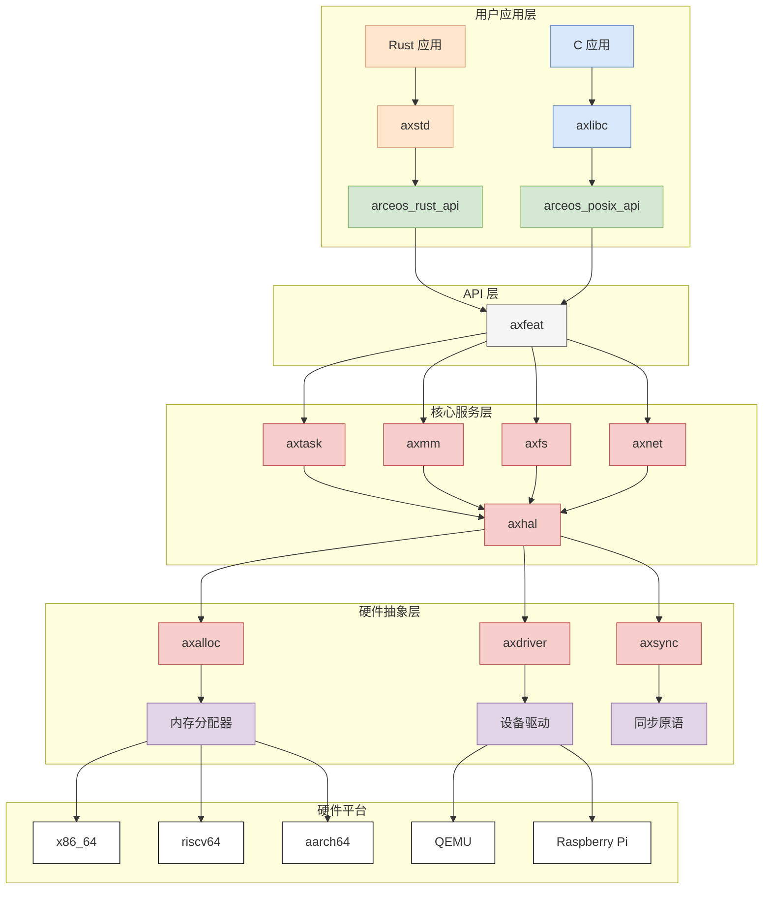

# 系统架构

<cite>
**本文档中引用的文件**   
- [Cargo.toml](file://arceos/Cargo.toml)
- [Makefile](file://arceos/Makefile)
- [README.md](file://arceos/README.md)
- [ArceOS.svg](file://arceos/doc/figures/ArceOS.svg)
- [axhal/Cargo.toml](file://arceos/modules/axhal/Cargo.toml)
- [axtask/Cargo.toml](file://arceos/modules/axtask/Cargo.toml)
- [axmm/Cargo.toml](file://arceos/modules/axmm/Cargo.toml)
- [axfs/Cargo.toml](file://arceos/modules/axfs/Cargo.toml)
- [axnet/Cargo.toml](file://arceos/modules/axnet/Cargo.toml)
- [arceos_api/Cargo.toml](file://arceos/api/arceos_api/Cargo.toml)
- [arceos_posix_api/Cargo.toml](file://arceos/api/arceos_posix_api/Cargo.toml)
- [x86_64-qemu-q35.toml](file://arceos/platforms/x86_64-qemu-q35.toml)
- [aarch64-qemu-virt.toml](file://arceos/platforms/aarch64-qemu-virt.toml)
</cite>

## 目录
1. [引言](#引言)
2. [分层架构设计](#分层架构设计)
3. [模块化设计原则](#模块化设计原则)
4. [数据流与控制流](#数据流与控制流)
5. [构建系统](#构建系统)
6. [架构图](#架构图)

## 引言

oscamp 是一个基于 ArceOS 的实验性模块化操作系统（或单体内核），采用 Rust 语言编写。该系统采用分层架构设计，通过模块化和特性（features）机制实现高度可配置性。系统支持多种硬件架构（x86_64, riscv64, aarch64）和平台（QEMU, Raspberry Pi），并提供 POSIX 兼容的 API 接口，使应用程序能够通过系统调用与操作系统服务进行交互。

**本文档中引用的文件**   
- [README.md](file://arceos/README.md)

## 分层架构设计

oscamp 系统采用清晰的分层架构设计，主要包括三个层次：硬件抽象层、核心服务层和用户接口层。

### 硬件抽象层 (axhal)

硬件抽象层 (axhal) 是系统的基础，为上层模块提供统一的平台特定操作接口。该层负责处理不同架构（x86_64, riscv64, aarch64）和平台（QEMU, Raspberry Pi）的硬件差异，包括中断处理、内存管理、定时器、CPU 控制等。axhal 模块通过条件编译和特性开关支持多种硬件特性，如 SMP（对称多处理）、浮点 SIMD 指令、分页内存管理等。

**本文档中引用的文件**   
- [axhal/Cargo.toml](file://arceos/modules/axhal/Cargo.toml)
- [x86_64-qemu-q35.toml](file://arceos/platforms/x86_64-qemu-q35.toml)
- [aarch64-qemu-virt.toml](file://arceos/platforms/aarch64-qemu-virt.toml)

### 核心服务层

核心服务层由多个独立的模块组成，包括任务管理 (axtask)、内存管理 (axmm)、文件系统 (axfs) 和网络 (axnet)。

#### 任务管理 (axtask)

axtask 模块负责系统的任务调度和管理。它支持多种调度策略，包括 FIFO、RR（轮转）和 CFS（完全公平调度）。该模块通过特性开关启用多任务、中断处理、抢占式调度等功能，并依赖于 axhal 提供的底层支持。

**本文档中引用的文件**   
- [axtask/Cargo.toml](file://arceos/modules/axtask/Cargo.toml)

#### 内存管理 (axmm)

axmm 模块负责虚拟内存管理，提供地址空间分配、页面映射和内存保护等功能。它依赖于 axhal 的分页特性，并与 axalloc（内存分配器）协同工作，为系统提供高效的内存管理服务。

**本文档中引用的文件**   
- [axmm/Cargo.toml](file://arceos/modules/axmm/Cargo.toml)

#### 文件系统 (axfs)

axfs 模块实现系统的文件系统功能，支持多种文件系统类型，包括 devfs、ramfs、fatfs、procfs 和 sysfs。该模块通过特性开关启用不同的文件系统，并与 axdriver（设备驱动）模块集成，支持块设备和 RAM 磁盘。

**本文档中引用的文件**   
- [axfs/Cargo.toml](file://arceos/modules/axfs/Cargo.toml)

#### 网络 (axnet)

axnet 模块提供网络功能，基于 smoltcp 库实现 TCP/IP 协议栈。它支持以太网、IPv4、ICMP、UDP 和 TCP 等协议，并通过 axdriver 模块与网络设备进行交互。

**本文档中引用的文件**   
- [axnet/Cargo.toml](file://arceos/modules/axnet/Cargo.toml)

### 用户接口层

用户接口层由 axstd 和 axlibc 组成，为应用程序提供标准库接口。

#### axstd

axstd 是为 ArceOS 设计的 Rust 标准库，提供类似 Rust 标准库的 API，但针对无标准环境（no_std）进行了优化。它依赖于 arceos_api 提供的系统服务。

**本文档中引用的文件**   
- [arceos_api/Cargo.toml](file://arceos/api/arceos_api/Cargo.toml)

#### axlibc

axlibc 是为 ArceOS 设计的 C 标准库，提供 POSIX 兼容的 API 接口。它基于 arceos_posix_api 实现，使 C 应用程序能够使用标准的系统调用。

**本文档中引用的文件**   
- [arceos_posix_api/Cargo.toml](file://arceos/api/arceos_posix_api/Cargo.toml)

## 模块化设计原则

oscamp 系统采用模块化设计，所有核心功能都作为独立的 Cargo 包（crate）实现，并通过 Cargo 工作区进行管理。这种设计具有以下优势：

1. **解耦**：每个模块都有明确的职责边界，通过定义良好的 API 接口进行通信，降低了模块间的耦合度。
2. **可配置性**：通过 Cargo 的特性（features）机制，可以根据需要启用或禁用特定功能，实现高度可定制的系统构建。
3. **可重用性**：模块可以独立开发、测试和维护，并可在不同的项目中重用。

模块间的依赖关系通过 Cargo.toml 文件中的 dependencies 和 features 字段进行声明。例如，axmm 模块依赖于 axhal 的 paging 特性，而 axtask 模块则依赖于 multitask 特性。

**本文档中引用的文件**   
- [Cargo.toml](file://arceos/Cargo.toml)

## 数据流与控制流

在 oscamp 系统中，应用程序通过系统调用接口与操作系统服务进行交互。当应用程序需要执行特权操作（如文件读写、网络通信、创建进程等）时，会触发系统调用，控制权从用户态转移到内核态。

1. **系统调用入口**：应用程序调用 axstd 或 axlibc 提供的 API，这些 API 最终会生成特定的系统调用指令（如 x86_64 的 syscall 指令）。
2. **中断处理**：CPU 检测到系统调用指令后，触发陷阱（trap），跳转到 axhal 定义的陷阱处理程序。
3. **服务分发**：陷阱处理程序根据系统调用号，将请求分发到相应的内核服务模块（如 axfs 处理文件操作，axnet 处理网络操作）。
4. **服务执行**：内核模块执行相应的操作，并将结果返回给陷阱处理程序。
5. **返回用户态**：陷阱处理程序将结果传递给应用程序，并恢复用户态执行。

这种设计确保了系统的安全性和稳定性，同时提供了高效的系统服务。

## 构建系统

oscamp 系统使用 Makefile 作为构建系统，协调不同架构和平台的编译与链接过程。构建系统的主要特点包括：

1. **多架构支持**：通过 ARCH 变量指定目标架构（x86_64, riscv64, aarch64），构建系统会自动选择相应的工具链和链接脚本。
2. **多平台支持**：通过 PLATFORM 变量指定目标平台（如 x86_64-qemu-q35, aarch64-qemu-virt），构建系统会加载相应的平台配置文件（.toml）。
3. **特性控制**：通过 FEATURES 变量启用或禁用特定的系统功能，如网络（NET）、块设备（BLK）、图形显示（GRAPHIC）等。
4. **交叉编译**：使用 musl 工具链进行交叉编译，确保生成的二进制文件可以在目标平台上运行。

构建过程包括编译 Rust 代码、链接内核映像、生成启动镜像等步骤，最终输出可在 QEMU 或真实硬件上运行的可执行文件。

**本文档中引用的文件**   
- [Makefile](file://arceos/Makefile)

## 架构图

**图示来源**
- [ArceOS.svg](file://arceos/doc/figures/ArceOS.svg)