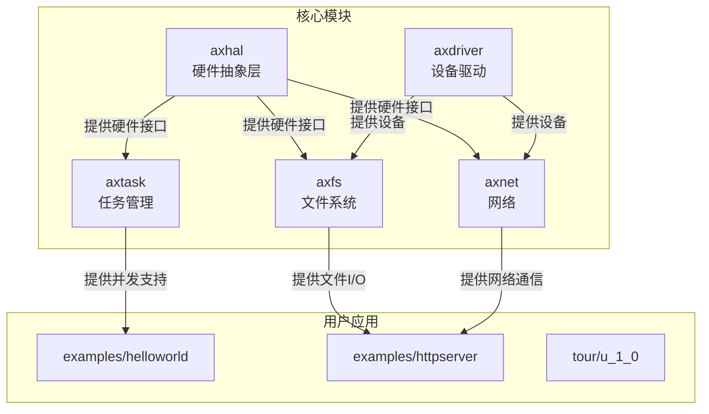
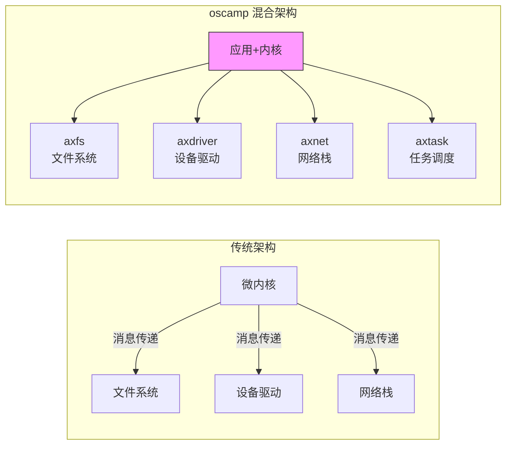

# 项目概述

<cite>
**本文档引用的文件**
- [README.md](file://README.md)
- [arceos/README.md](file://arceos/README.md)
- [arceos/Cargo.toml](file://arceos/Cargo.toml)
- [arceos/tour-README.md](file://arceos/tour-README.md)
- [arceos/examples/helloworld/src/main.rs](file://arceos/examples/helloworld/src/main.rs)
- [arceos/examples/httpserver/src/main.rs](file://arceos/examples/httpserver/src/main.rs)
- [arceos/tour/u_1_0/src/main.rs](file://arceos/tour/u_1_0/src/main.rs)
- [arceos/modules/axhal/src/lib.rs](file://arceos/modules/axhal/src/lib.rs)
- [arceos/modules/axtask/src/lib.rs](file://arceos/modules/axtask/src/lib.rs)
- [arceos/modules/axfs/src/lib.rs](file://arceos/modules/axfs/src/lib.rs)
- [arceos/modules/axnet/src/lib.rs](file://arceos/modules/axnet/src/lib.rs)
- [arceos/modules/axdriver/src/lib.rs](file://arceos/modules/axdriver/src/lib.rs)
- [arceos/platforms/x86_64-qemu-q35.toml](file://arceos/platforms/x86_64-qemu-q35.toml)
- [arceos/platforms/aarch64-qemu-virt.toml](file://arceos/platforms/aarch64-qemu-virt.toml)
- [challenges/README.md](file://challenges/README.md)
</cite>

## 目录
1. [引言](#引言)
2. [项目背景与定位](#项目背景与定位)
3. [核心目标与愿景](#核心目标与愿景)
4. [适用人群](#适用人群)
5. [整体架构理念](#整体架构理念)
6. [模块化设计](#模块化设计)
7. [混合架构](#混合架构)
8. [学习路径指引](#学习路径指引)
9. [扩展潜力](#扩展潜力)
10. [结论](#结论)

## 引言
oscamp 是一个基于 ArceOS 的操作系统实验与教学平台，旨在为操作系统开发教学和 Rust 系统编程实践提供一个综合性、模块化的学习环境。该项目不仅继承了 ArceOS 的先进设计理念，还通过精心设计的教程和示例，为不同层次的学习者和开发者提供了清晰的学习路径和实践机会。

## 项目背景与定位
oscamp 项目根植于 ArceOS，这是一个受 Unikraft 启发的、用 Rust 编写的实验性模块化操作系统（或称单体内核）。ArceOS 的设计哲学强调模块化和可组合性，允许开发者根据具体需求选择和组合不同的功能模块，从而构建出高度定制化的操作系统。oscamp 在此基础上，进一步强化了其作为教学和实验平台的定位，通过提供一系列循序渐进的教程（tour）和练习（exercises），帮助学习者从零开始，逐步深入理解操作系统的核心概念和实现细节。

**Section sources**
- [README.md](file://README.md#L1-L6)
- [arceos/README.md](file://arceos/README.md#L1-L201)

## 核心目标与愿景
oscamp 的核心目标是降低操作系统开发的学习门槛，使学习者能够在一个结构清晰、文档完善的环境中，通过动手实践来掌握复杂的系统知识。其愿景是成为 Rust 系统编程和现代操作系统教学的标杆平台。具体目标包括：
- **教学导向**：提供从基础到高级的完整学习路径，覆盖内存管理、任务调度、文件系统、网络协议栈等核心主题。
- **实践驱动**：通过大量的示例应用（如 `helloworld`、`httpserver`）和动手实验，让理论知识与实际代码紧密结合。
- **技术前沿**：推广 Rust 语言在系统编程领域的应用，利用其内存安全和并发安全的特性，构建更可靠、更安全的操作系统。

**Section sources**
- [arceos/README.md](file://arceos/README.md#L7-L11)
- [challenges/README.md](file://challenges/README.md#L1)

## 适用人群
oscamp 服务于两类主要用户：
- **初学者**：对于刚接触操作系统或 Rust 语言的开发者，oscamp 提供了 `tour/` 目录下的系列教程。这些教程从最简单的 "Hello, World!" 开始，逐步引导学习者构建更复杂的功能，如内存分配、任务调度和系统调用，是理想的入门路径。
- **有经验的开发者**：对于希望深入研究特定领域或进行系统优化的开发者，oscamp 提供了 `exercises/` 目录下的挑战性任务。例如，`lab1` 要求开发者针对特定应用场景优化内存分配器组件，这需要对系统底层有深刻的理解。

**Section sources**
- [arceos/tour-README.md](file://arceos/tour-README.md#L1-L112)
- [challenges/README.md](file://challenges/README.md#L1)

## 整体架构理念
oscamp 的整体架构建立在 ArceOS 的模块化设计之上，其核心理念是“按需组合”。整个系统被分解为一系列独立的、可复用的模块（位于 `modules/` 目录下），每个模块负责一个特定的功能领域，如硬件抽象（`axhal`）、任务管理（`axtask`）、文件系统（`axfs`）和网络（`axnet`）。这种设计使得开发者可以像搭积木一样，根据应用需求选择并集成所需的模块，从而构建出轻量级、高效率的专用操作系统。

**Diagram sources**
- [arceos/modules/axhal/src/lib.rs](file://arceos/modules/axhal/src/lib.rs#L1-L86)
- [arceos/modules/axtask/src/lib.rs](file://arceos/modules/axtask/src/lib.rs#L1-L62)
- [arceos/modules/axfs/src/lib.rs](file://arceos/modules/axfs/src/lib.rs#L1-L47)
- [arceos/modules/axnet/src/lib.rs](file://arceos/modules/axnet/src/lib.rs#L1-L49)
- [arceos/modules/axdriver/src/lib.rs](file://arceos/modules/axdriver/src/lib.rs#L1-L185)

## 模块化设计
oscamp 的模块化设计体现在其清晰的代码组织和依赖管理上。通过 `Cargo.toml` 文件中的 `workspace.members` 配置，所有模块都被统一管理。每个模块都通过 Cargo 特性（features）来控制其功能的启用和禁用，这使得系统具有极高的灵活性。例如，`axtask` 模块可以通过 `sched_fifo`、`sched_rr` 或 `sched_cfs` 特性来选择不同的调度算法，而 `axfs` 模块则可以通过 `fatfs`、`ramfs` 等特性来选择不同的文件系统。

**Section sources**
- [arceos/Cargo.toml](file://arceos/Cargo.toml#L1-L104)
- [arceos/modules/axtask/src/lib.rs](file://arceos/modules/axtask/src/lib.rs#L7-L26)

## 混合架构
oscamp 采用了一种微内核与单体内核相结合的混合架构。其核心思想是将操作系统的关键服务（如设备驱动、文件系统）以库的形式静态链接到应用程序中，形成一个单一的、自包含的地址空间（单体内核模式），这保证了高性能。同时，其模块化的设计理念又借鉴了微内核的思想，即关注点分离和模块独立性。这种混合架构既避免了传统微内核因进程间通信带来的性能开销，又保留了微内核在设计上的清晰性和可维护性。

**Diagram sources**
- [arceos/modules/axfs/src/lib.rs](file://arceos/modules/axfs/src/lib.rs#L1-L47)
- [arceos/modules/axdriver/src/lib.rs](file://arceos/modules/axdriver/src/lib.rs#L1-L185)
- [arceos/modules/axnet/src/lib.rs](file://arceos/modules/axnet/src/lib.rs#L1-L49)

## 学习路径指引
对于初学者，推荐的学习路径如下：
1.  **环境搭建**：首先按照 `arceos/tour-README.md` 中的指南，安装必要的构建工具（如 `cargo-binutils` 和 musl 工具链）和运行环境（QEMU）。
2.  **运行基础示例**：从 `tour/u_1_0` 开始，这是一个最简单的 "Hello, World!" 程序。通过 `make run A=tour/u_1_0` 命令运行它，理解最基本的构建和运行流程。
3.  **深入教程系列**：依次完成 `tour/` 目录下的其他教程，如 `u_2_0`（内存分配）、`u_3_0`（任务创建）等，逐步掌握核心概念。
4.  **探索示例应用**：尝试运行和修改 `examples/` 目录下的应用，如 `helloworld` 和 `httpserver`，了解更复杂的系统功能是如何实现的。

**Section sources**
- [arceos/tour-README.md](file://arceos/tour-README.md#L1-L112)
- [arceos/examples/helloworld/src/main.rs](file://arceos/examples/helloworld/src/main.rs#L1-L11)
- [arceos/examples/httpserver/src/main.rs](file://arceos/examples/httpserver/src/main.rs#L1-L97)

## 扩展潜力
对于有经验的开发者，oscamp 展现了巨大的扩展潜力：
- **模块复用**：开发者可以直接在自己的项目中复用 ArceOS 的模块，如 `axalloc`（内存分配器）或 `axhal`（硬件抽象层），快速构建新的系统。
- **功能扩展**：可以通过实现新的 Cargo 特性或编写新的模块来扩展系统功能，例如添加对新硬件平台或新文件系统的支持。
- **性能优化**：`exercises/` 目录下的挑战任务为系统优化提供了明确的方向，开发者可以在此基础上进行更深层次的性能调优和算法改进。

**Section sources**
- [arceos/Cargo.toml](file://arceos/Cargo.toml#L190-L196)
- [challenges/README.md](file://challenges/README.md#L1)

## 结论
oscamp 作为一个基于 ArceOS 的操作系统实验与教学平台，成功地将先进的模块化设计、混合架构理念与实用的教学资源相结合。它不仅为初学者提供了一条清晰、渐进的学习路径，也为有经验的开发者提供了一个功能强大、易于扩展的开发平台。通过 oscamp，学习者和开发者可以深入理解现代操作系统的核心原理，并在实践中掌握 Rust 系统编程的精髓。